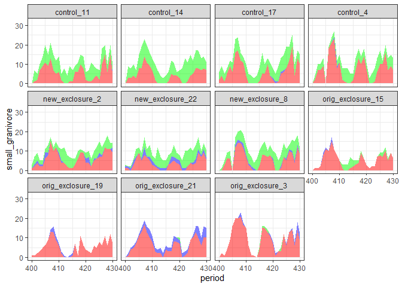
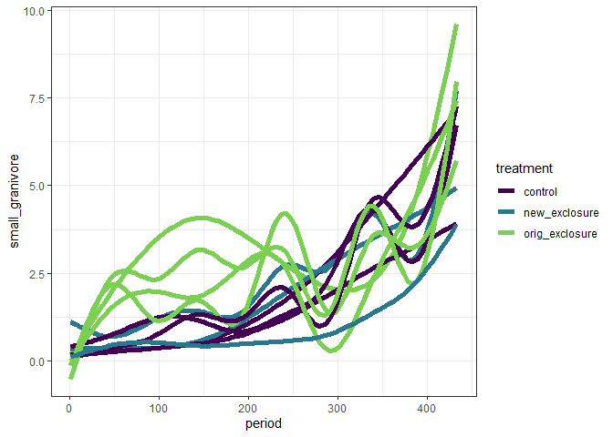
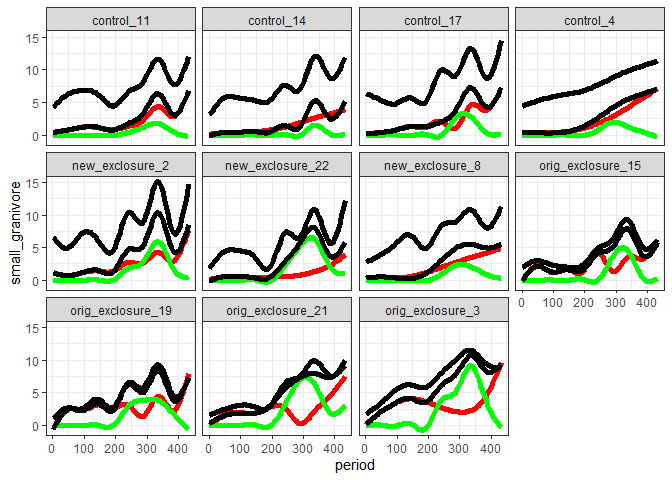

to 2015
================

``` r
rats <- read.csv(here::here("lore", "2020_redux", "2020_data_complete.csv")) %>%
  mutate(censusdate = as.Date(censusdate))
```

``` r
rat_categories <- rats %>%
  mutate(type2 = ifelse(type == "small_granivore", ifelse(species == "PB", "baileys", "small_granivore"), type)) %>%
  select(period, censusdate, plot, type2, treatment) %>%
  group_by_all() %>%
  summarize(nind = dplyr::n()) %>%
  ungroup()
```

    ## `summarise()` regrouping output by 'period', 'censusdate', 'plot', 'type2' (override with `.groups` argument)

``` r
rat_cat_zeros <- expand.grid(
  period = unique(rat_categories$period),
  type2 = unique(rat_categories$type2),
  plot = unique(rat_categories$plot)
) %>%
  left_join(distinct(select(rats, period, censusdate))) %>%
  left_join(distinct(select(rats, plot, treatment))) %>%
  left_join(rat_categories) %>%
  mutate(nind = ifelse(is.na(nind), 0, nind))
```

    ## Joining, by = "period"

    ## Joining, by = "plot"

    ## Joining, by = c("period", "type2", "plot", "censusdate", "treatment")

``` r
rat_stack <- rat_cat_zeros %>%
  tidyr::pivot_wider(names_from = type2, values_from = nind) %>%
  mutate(trt_plot = paste(treatment, plot, sep = "_")) 
```

``` r
ggplot(rat_stack, aes(x = period, y = small_granivore, group = plot)) +
  geom_ribbon(aes(ymin = 0, ymax = small_granivore), fill = "red", alpha = .5) +
  geom_ribbon(aes(ymin = small_granivore, ymax = small_granivore + baileys), fill = "blue", alpha = .5) +
  geom_ribbon(aes(ymin = small_granivore + baileys, ymax = small_granivore + baileys + dipo), fill = "green", alpha = .5) +
  theme_bw() +
#  scale_x_date(date_breaks = "9 month", date_labels =  "%b %Y") +
#  theme(axis.text.x=element_text(angle=60, hjust=1)) +
  xlim(400, 430) +
  facet_wrap(vars(trt_plot))
```

<!-- -->

Stacks are harder to interpret than I thought they’d be.

``` r
ggplot(rat_stack, aes(period, small_granivore, group = plot, color = treatment)) +
  geom_smooth(method = "gam", se = F, size = 2) +
  theme_bw() +
  scale_color_viridis_d(end = .8) 
```

    ## `geom_smooth()` using formula 'y ~ s(x, bs = "cs")'

<!-- -->

``` r
ggplot(rat_stack, aes(period, small_granivore), group = trt_plot) +
  geom_smooth(method = "gam", se = F, size = 2, color = "red") +
  geom_smooth(aes(period, baileys), method = "gam", se = F, size = 2, color = "green") +
  geom_smooth(aes(period, baileys + small_granivore), method = "gam", se = F, size = 2, color = "black") +
  geom_smooth(aes(period, baileys + small_granivore + dipo + other), method = "gam", se = F, size = 2, color = "black") +
  theme_bw() +
  facet_wrap(vars(trt_plot))
```

    ## `geom_smooth()` using formula 'y ~ s(x, bs = "cs")'
    ## `geom_smooth()` using formula 'y ~ s(x, bs = "cs")'
    ## `geom_smooth()` using formula 'y ~ s(x, bs = "cs")'
    ## `geom_smooth()` using formula 'y ~ s(x, bs = "cs")'

<!-- -->
