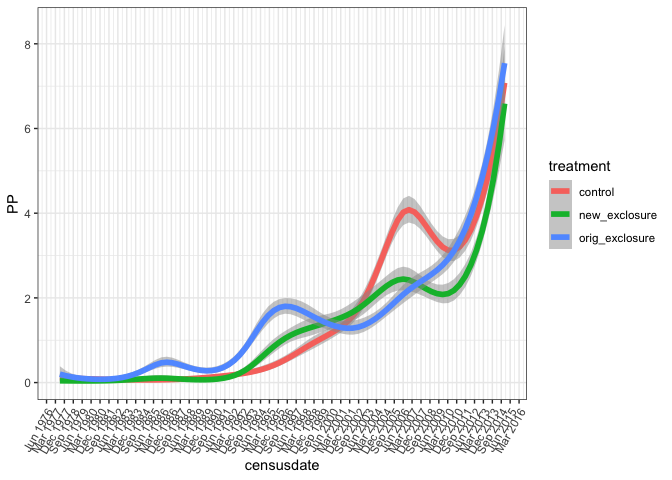
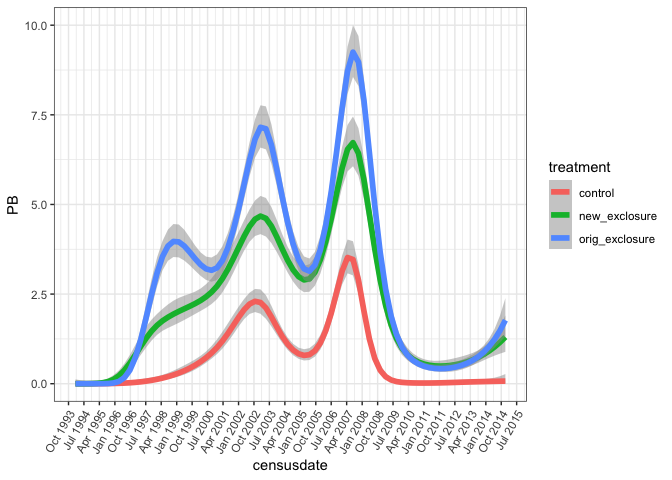
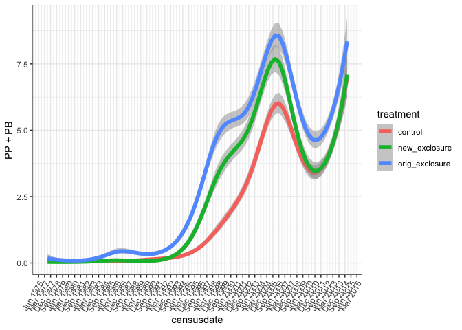
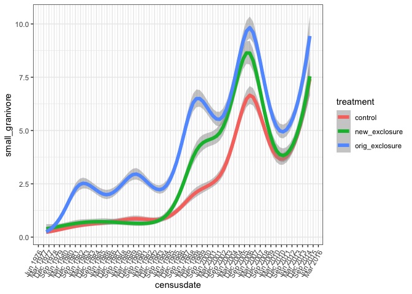
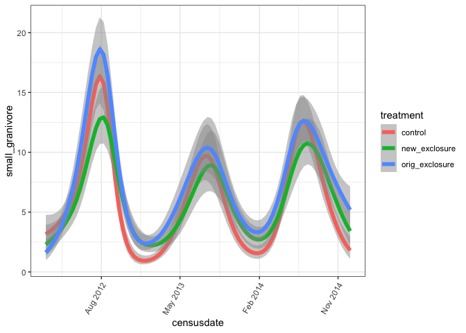
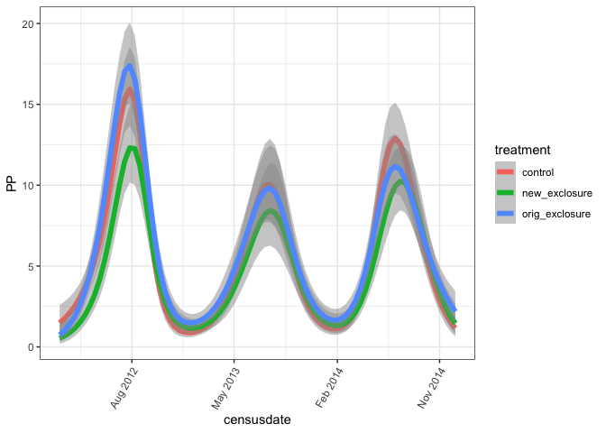
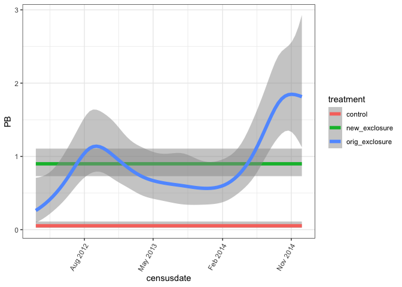
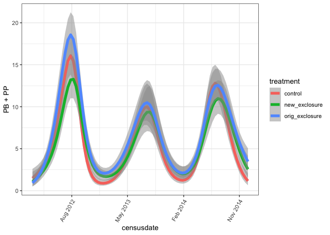

to 2015
================

``` r
rats <- read.csv(here::here("lore", "2020_redux", "2020_data_complete.csv"))
```

``` r
rats_wide <- rats %>%
  #filter(treatment %in% c("control", "orig_exclosure")) %>%
  mutate(species = ifelse(is.na(species), "NA", species)) %>%
  mutate(species2 = ifelse(type == "dipo", "DA", species)) %>% # "dipo ALL"
  select(censusdate, period, plot, treatment, species2) %>%
  group_by(censusdate, period, plot, treatment, species2) %>%
  summarize(nind = dplyr::n()) %>%
  ungroup() %>%
  tidyr::pivot_wider(names_from = species2, values_from = nind, values_fill = 0) %>%
  mutate(censusdate = as.Date(censusdate))
```

    ## `summarise()` regrouping output by 'censusdate', 'period', 'plot', 'treatment' (override with `.groups` argument)

``` r
ggplot(rats_wide, aes(censusdate, PP, color = treatment)) +
  geom_smooth(method = "gam", se = T, size = 2, alpha= .5, method.args = list(family = "poisson"))  +
  theme_bw() +
  scale_x_date(date_breaks = "9 month", date_labels =  "%b %Y") +
  theme(axis.text.x=element_text(angle=60, hjust=1))
```

    ## `geom_smooth()` using formula 'y ~ s(x, bs = "cs")'

<!-- -->

``` r
ggplot(filter(rats_wide, censusdate > '1994-01-01'), aes(censusdate, PB, color = treatment)) +
  geom_smooth(method = "gam", se = T, size = 2, alpha= .5, method.args = list(family = "poisson"))  +
  theme_bw() +
  scale_x_date(date_breaks = "9 month", date_labels =  "%b %Y") +
  theme(axis.text.x=element_text(angle=60, hjust=1)) 
```

    ## `geom_smooth()` using formula 'y ~ s(x, bs = "cs")'

<!-- -->

``` r
ggplot(rats_wide, aes(censusdate, PP + PB, color = treatment)) +
  geom_smooth(method = "gam", se = T, size = 2, alpha= .5, method.args = list(family = "poisson"))  +
  theme_bw() +
  scale_x_date(date_breaks = "9 month", date_labels =  "%b %Y") +
  theme(axis.text.x=element_text(angle=60, hjust=1))
```

    ## `geom_smooth()` using formula 'y ~ s(x, bs = "cs")'

<!-- -->

``` r
rats_type_wide <- rats %>%
#  filter(treatment != "new_exclosure") %>%
  group_by(period, censusdate, plot, treatment, type) %>%
  summarize(nind = dplyr::n()) %>%
  ungroup() %>%
  tidyr::pivot_wider(names_from = type, values_from = nind, values_fill = 0) %>%
  mutate(censusdate = as.Date(censusdate))
```

    ## `summarise()` regrouping output by 'period', 'censusdate', 'plot', 'treatment' (override with `.groups` argument)

``` r
ggplot(rats_type_wide, aes(censusdate, small_granivore, color = treatment)) +
  geom_smooth(method = "gam", se = T, size = 2, alpha= .5, method.args = list(family = "poisson"))  +
  theme_bw() +
  scale_x_date(date_breaks = "9 month", date_labels =  "%b %Y") +
  theme(axis.text.x=element_text(angle=60, hjust=1))
```

    ## `geom_smooth()` using formula 'y ~ s(x, bs = "cs")'

<!-- -->

This is a little perplexing in that the controls look NOT THE SAME as
the original exclosures, but when you do various flavors of GAM x smooth
differencing, you find convergence by the late 2010s. Probably ggplot
fits *separate* gams for each group, but if you pool them in one model
you get a different picture.

Intuition from these plots looks something like…

  - PP prefers controls
  - PP looks a tiny bit lower on new\_exclosures than on controls
  - However PB is higher on new\_exclosures (approaching manip
    levels\!\!)
  - Net, new\_exclosures (here) match controls for smgran abund
  - PB hates controls, but appears to hate new\_exclosures (WHICH ARE
    ALSO CONTROLS RN) a lot less.

<!-- end list -->

``` r
ggplot(filter(rats_type_wide, censusdate > '2012-01-01'), aes(censusdate, small_granivore, color = treatment)) +
  geom_smooth(method = "gam", se = T, size = 2, alpha= .5, method.args = list(family = "poisson"))  +
  theme_bw() +
  scale_x_date(date_breaks = "9 month", date_labels =  "%b %Y") +
  theme(axis.text.x=element_text(angle=60, hjust=1))
```

    ## `geom_smooth()` using formula 'y ~ s(x, bs = "cs")'

<!-- -->

``` r
ggplot(filter(rats_wide, censusdate > '2012-01-01'), aes(censusdate, PP, color = treatment)) +
  geom_smooth(method = "gam", se = T, size = 2, alpha= .5, method.args = list(family = "poisson"))  +
  theme_bw() +
  scale_x_date(date_breaks = "9 month", date_labels =  "%b %Y") +
  theme(axis.text.x=element_text(angle=60, hjust=1))
```

    ## `geom_smooth()` using formula 'y ~ s(x, bs = "cs")'

<!-- -->

``` r
ggplot(filter(rats_wide, censusdate > '2012-01-01'), aes(censusdate, PB, color = treatment)) +
  geom_smooth(method = "gam", se = T, size = 2, alpha= .5, method.args = list(family = "poisson"))  +
  theme_bw() +
  scale_x_date(date_breaks = "9 month", date_labels =  "%b %Y") +
  theme(axis.text.x=element_text(angle=60, hjust=1))
```

    ## `geom_smooth()` using formula 'y ~ s(x, bs = "cs")'

<!-- -->

``` r
ggplot(filter(rats_wide, censusdate > '2012-01-01'), aes(censusdate, PB +PP, color = treatment)) +
  geom_smooth(method = "gam", se = T, size = 2, alpha= .5, method.args = list(family = "poisson"))  +
  theme_bw() +
  scale_x_date(date_breaks = "9 month", date_labels =  "%b %Y") +
  theme(axis.text.x=element_text(angle=60, hjust=1))
```

    ## `geom_smooth()` using formula 'y ~ s(x, bs = "cs")'

<!-- -->
