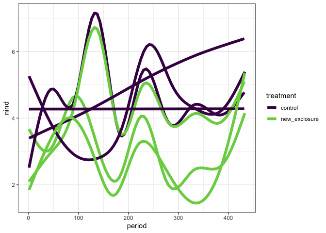
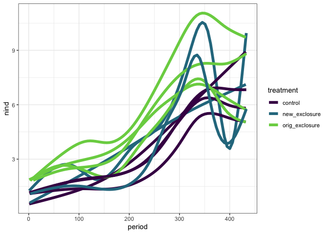
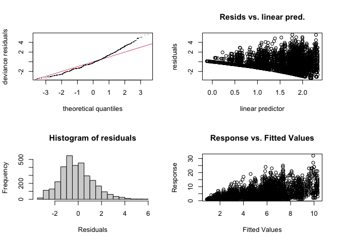
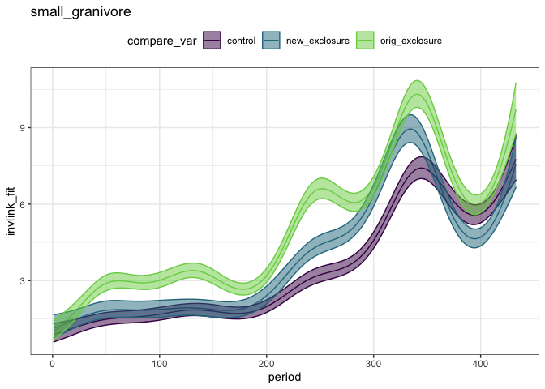
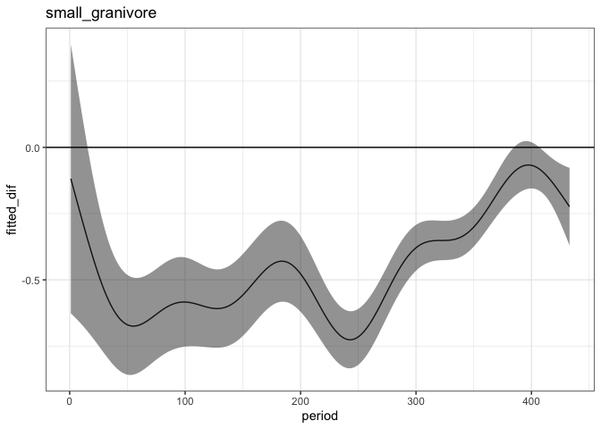
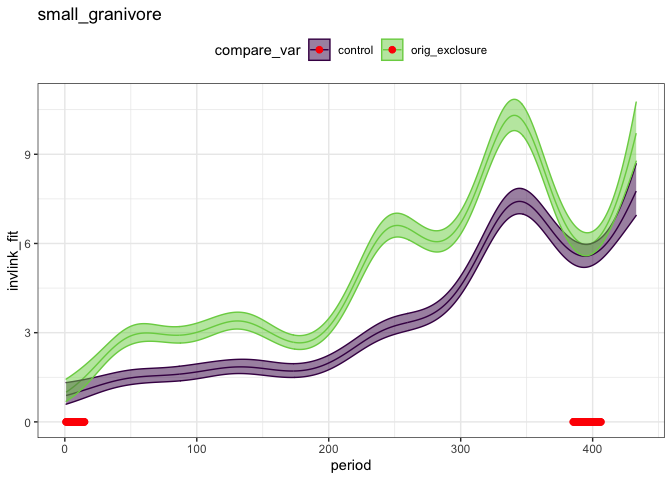
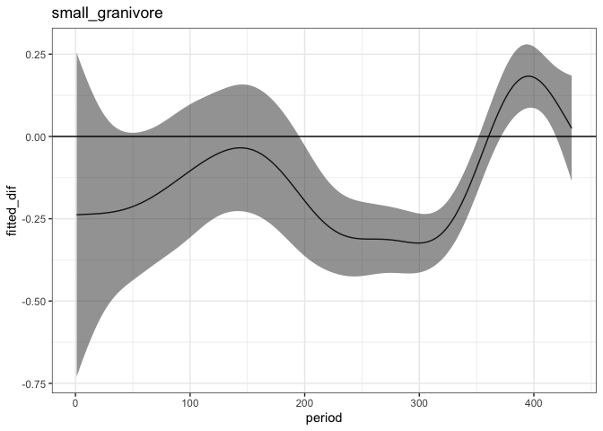
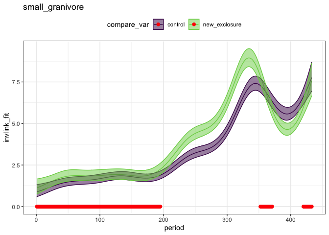
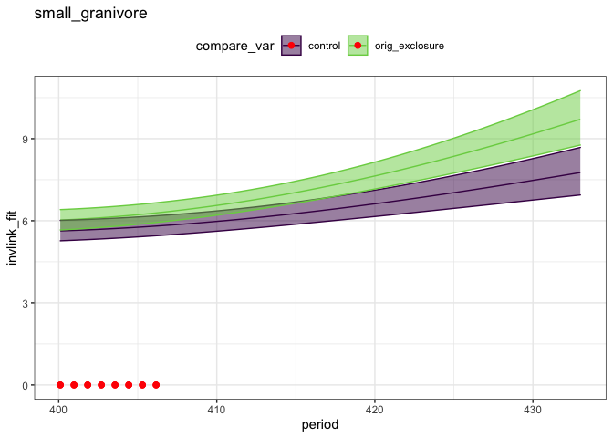

to 2015
================

``` r
rats <- read.csv(here::here("lore", "2020_redux", "2020_data_complete.csv"))
```

``` r
rats_types_totals <- rats %>%
  mutate(plot = factor(plot),
         treatment = factor(treatment)) %>%
  #mutate(plot = as.ordered(plot),
 #        treatment = as.ordered(treatment)) %>%
  select(period, treatment, type, plot, energy) %>%
  group_by(period, treatment, type, plot) %>%
  summarize(nind = dplyr::n(),
            totale = sum(energy))  %>%
  ungroup() 
```

    ## `summarise()` regrouping output by 'period', 'treatment', 'type' (override with `.groups` argument)

``` r
ggplot(filter(rats_types_totals, type == "dipo", type != "other", treatment != "orig_exclosure"), aes(period, nind, color = treatment, group = plot)) +
 geom_smooth(method = "gam", se = F, size = 2) +  theme_bw() +
  scale_color_viridis_d(end = .8) 
```

    ## `geom_smooth()` using formula 'y ~ s(x, bs = "cs")'

<!-- -->

``` r
ggplot(filter(rats_types_totals, type == "small_granivore", type != "other"), aes(period, nind, group = plot, color = treatment)) +
  geom_smooth(method = "gam", se = F, size = 2) +
  theme_bw() +
  scale_color_viridis_d(end = .8) 
```

    ## `geom_smooth()` using formula 'y ~ s(x, bs = "cs")'

<!-- -->

``` r
sg <- filter(rats_types_totals, type == "small_granivore") %>%
  mutate(oplot = ordered(plot, levels = c(4,2,3,8,11,14,15,17,18,21,22)),
         treatment = as.ordered(treatment)) %>%
  as.data.frame()


library(mgcv)
```

    ## Loading required package: nlme

    ## 
    ## Attaching package: 'nlme'

    ## The following object is masked from 'package:dplyr':
    ## 
    ##     collapse

    ## This is mgcv 1.8-33. For overview type 'help("mgcv-package")'.

``` r
source(here::here("lore", "1994_longterm", "gams_fxns_generalized.R"))

#sg.mod <- gam(nind ~  treatment + s(period, k = 70) + s(period, by = treatment, k = 70), family = "poisson", data  = sg)

sg.mod <- gam(nind ~  treatment + s(period, k = 10) + s(period, by = treatment, k = 10), family = "poisson", data  = sg)

summary(sg.mod)
```

    ## 
    ## Family: poisson 
    ## Link function: log 
    ## 
    ## Formula:
    ## nind ~ treatment + s(period, k = 10) + s(period, by = treatment, 
    ##     k = 10)
    ## 
    ## Parametric coefficients:
    ##             Estimate Std. Error z value Pr(>|z|)    
    ## (Intercept)  1.38885    0.01034 134.358  < 2e-16 ***
    ## treatment.L  0.30914    0.01622  19.062  < 2e-16 ***
    ## treatment.Q  0.06304    0.01939   3.252  0.00115 ** 
    ## ---
    ## Signif. codes:  0 '***' 0.001 '**' 0.01 '*' 0.05 '.' 0.1 ' ' 1
    ## 
    ## Approximate significance of smooth terms:
    ##                                     edf Ref.df  Chi.sq p-value    
    ## s(period)                         8.155  8.653 1035.32  <2e-16 ***
    ## s(period):treatmentnew_exclosure  6.509  7.516   68.42  <2e-16 ***
    ## s(period):treatmentorig_exclosure 8.118  8.668  111.31  <2e-16 ***
    ## ---
    ## Signif. codes:  0 '***' 0.001 '**' 0.01 '*' 0.05 '.' 0.1 ' ' 1
    ## 
    ## R-sq.(adj) =  0.317   Deviance explained = 38.4%
    ## UBRE = 0.98934  Scale est. = 1         n = 3249

``` r
gam.check(sg.mod)
```

<!-- -->

    ## 
    ## Method: UBRE   Optimizer: outer newton
    ## full convergence after 7 iterations.
    ## Gradient range [-1.216925e-08,5.060915e-07]
    ## (score 0.9893399 & scale 1).
    ## Hessian positive definite, eigenvalue range [0.0003525317,0.0006801192].
    ## Model rank =  30 / 30 
    ## 
    ## Basis dimension (k) checking results. Low p-value (k-index<1) may
    ## indicate that k is too low, especially if edf is close to k'.
    ## 
    ##                                     k'  edf k-index p-value    
    ## s(period)                         9.00 8.15     0.5  <2e-16 ***
    ## s(period):treatmentnew_exclosure  9.00 6.51     0.5  <2e-16 ***
    ## s(period):treatmentorig_exclosure 9.00 8.12     0.5  <2e-16 ***
    ## ---
    ## Signif. codes:  0 '***' 0.001 '**' 0.01 '*' 0.05 '.' 0.1 ' ' 1

``` r
sg.pdat <- make_pdat(sg, include_plot = F)

sg.pred <- get_predicted_vals(sg.mod, sg.pdat)
```

Here we have a GAM - fit without plot, because when I included plot I
got super-wrong estimates (like infinity rats for orig\_exclosure????)

This GAM is trash according to gam.check.

``` r
plot_fitted_pred(sg.pred)# + facet_wrap(vars(compare_var), scales = "free_y")
```

<!-- -->

At this stage, the new\_exclosure plots are still controls.
Interestingly, they diverge from the always-control plots.

Also note the overall increase in the number of small granivores across
the site, on exclosure and control plots.

And that the differences (in the number of individuals of smgran
species) actually seem less pronounced now than at the beginning of the
study.

``` r
ctrl_v_orig <- get_exclosure_diff(sg.mod, sg.pdat, comparison_level = 3)

plot_exclosure_diff(ctrl_v_orig)
```

<!-- -->

``` r
sg.origdiff <- add_exclosure_diff(sg.pred, ctrl_v_orig)
```

    ## Joining, by = "period"

``` r
plot_fitted_pred(filter(sg.origdiff, treatment != "new_exclosure"))
```

<!-- -->

So I’d caution against over-interpreting this, because there are issues
with the GAM (gam.check suggests k is too low, but fitting higher k
takes a long time and sometimes gets into weird spaces where the fitted
values are not remotely realistic). However, it’s suggestive that the
difference in the **number of small granivores** on control v. exclosure
plots has declined over time.

Assuming this result held - would there be uestions then, whether the
strength of the competitive effect of dipo on small granivores has
weakened? This is one way of measuring that effect, but I’m not sure.
There’s the finding (from Erica’s paper) that the reintroduction of
krats made the small granivores “flee” - although on digging, I don’t
(right away) find evidence of that? E’s paper is about how the treatment
plots compare to controls once they are switched back to controls.
Ellen’s paper is actually that PP increases its preference for
CONTROLS over EXCLOSURES after PB shows up.

``` r
ctrl_v_new <- get_exclosure_diff(sg.mod, sg.pdat)

plot_exclosure_diff(ctrl_v_new)
```

<!-- -->

``` r
sg.newdiff <- add_exclosure_diff(sg.pred, ctrl_v_new)
```

    ## Joining, by = "period"

``` r
plot_fitted_pred(filter(sg.newdiff, treatment != "orig_exclosure"))
```

<!-- -->

``` r
plot_fitted_pred(filter(sg.origdiff, treatment != "new_exclosure", period > 400))
```

<!-- -->
