Energy plots
================

variables…

  - Dipo energy on a control plot (amount of energy left available given
    Dipo removal)
  - Smgran energy on a control plot (baseline smgran energy if no
    compensation happens)
  - Additional smgran energy on a treatment plot (amount of energy
    attributable to compensation)
  - Smgran\_gain / dipo\_control (approximates amount of POTENTIAL
    compensation ACHIEVED, but can be negative or \> 1) —\> this is what
    we want to estimate.

<!-- end list -->

    ## Loading in data version 2.49.0

    ## Joining, by = "plot"

    ## `summarise()` has grouped output by 'period', 'censusdate', 'era'. You can override using the `.groups` argument.

    ## Joining, by = "row"

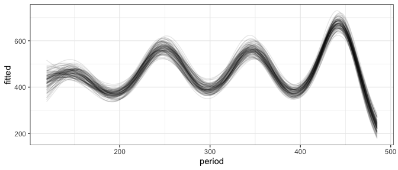<!-- -->

    ## Joining, by = "row"

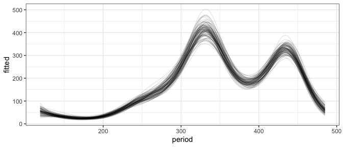<!-- -->

    ## Joining, by = "row"

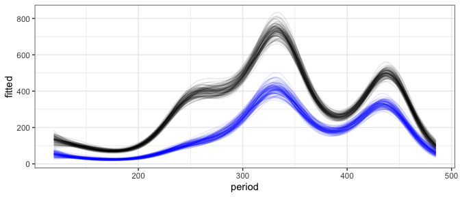<!-- -->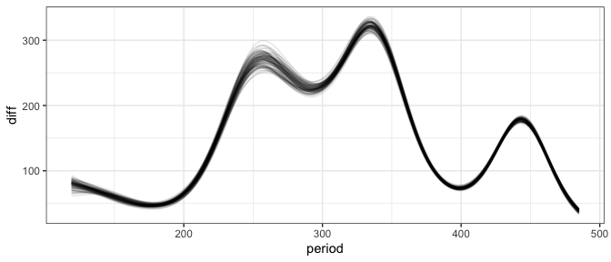<!-- -->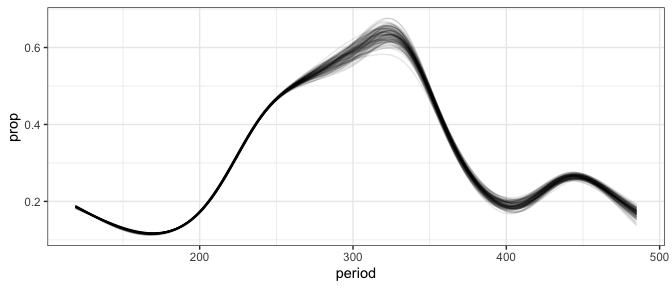<!-- -->

    ## Joining, by = "period"

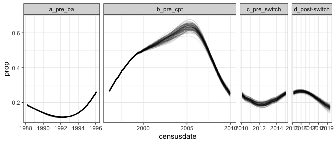<!-- -->

    ## Joining, by = "row"

<!-- -->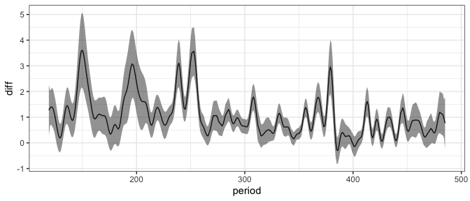<!-- -->

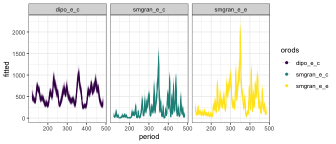<!-- -->

    ## Joining, by = "period"

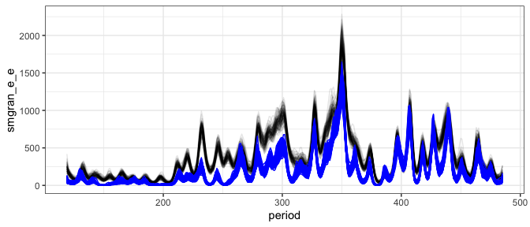<!-- -->

    ## mapping: x = ~period, y = 0, colour = ~diff_over_zero 
    ## geom_point: na.rm = FALSE
    ## stat_identity: na.rm = FALSE
    ## position_identity

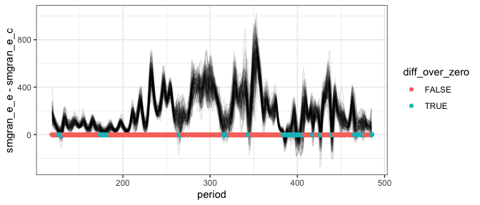<!-- -->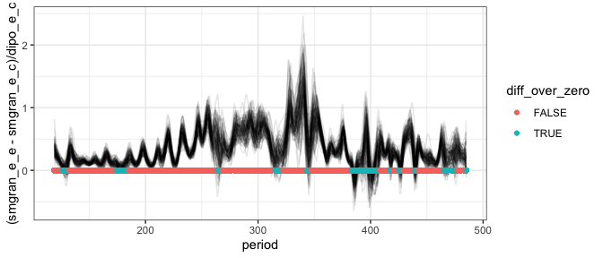<!-- -->

    ## Joining, by = "row"

    ## `summarise()` has grouped output by 'row', 'period', 'orods'. You can override using the `.groups` argument.

    ## Joining, by = "period"
    ## Joining, by = "period"

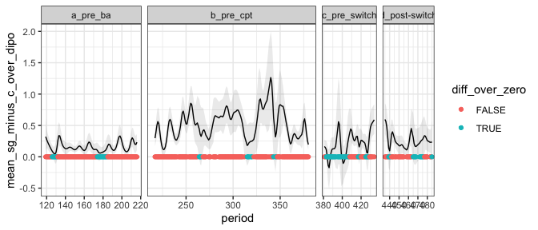<!-- -->

    ## # A tibble: 4 x 3
    ##   era           mean_mean_sg_minus_c_over_dipo sd_mean_sg_minus_c_over_dipo
    ## * <chr>                                  <dbl>                        <dbl>
    ## 1 a_pre_ba                               0.160                       0.0718
    ## 2 b_pre_cpt                              0.534                       0.227 
    ## 3 c_pre_switch                           0.217                       0.186 
    ## 4 d_post-switch                          0.264                       0.114

    ##  contrast                       estimate     SE  df z.ratio p.value
    ##  a_pre_ba - b_pre_cpt            -0.3741 0.0229 Inf -16.313 <.0001 
    ##  a_pre_ba - c_pre_switch         -0.0569 0.0304 Inf  -1.870 0.2411 
    ##  a_pre_ba - (d_post-switch)      -0.1036 0.0326 Inf  -3.180 0.0080 
    ##  b_pre_cpt - c_pre_switch         0.3172 0.0287 Inf  11.034 <.0001 
    ##  b_pre_cpt - (d_post-switch)      0.2705 0.0310 Inf   8.726 <.0001 
    ##  c_pre_switch - (d_post-switch)  -0.0467 0.0369 Inf  -1.265 0.5852 
    ## 
    ## P value adjustment: tukey method for comparing a family of 4 estimates

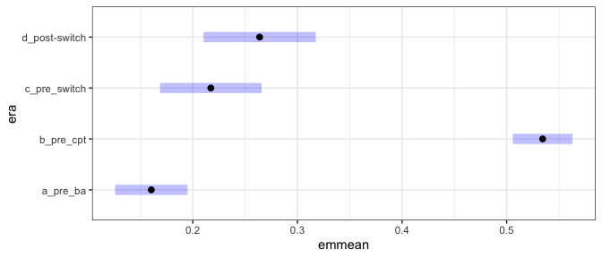<!-- -->
