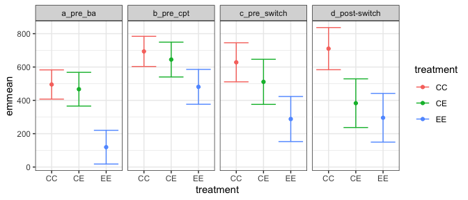
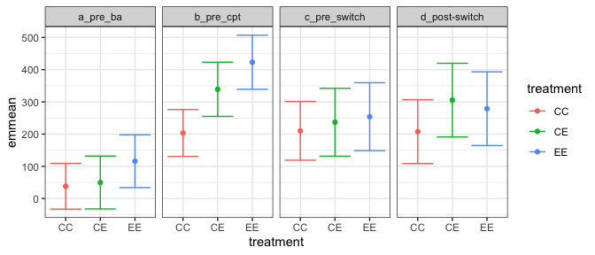
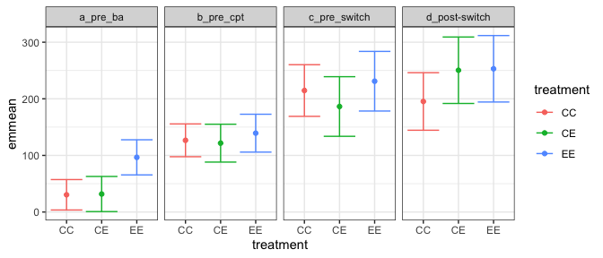

Linear models
================

<!-- ```{r} -->

<!-- use_christensen_plots <- F -->

<!-- plot_totals <- get_rodent_data(use_christensen_plots = use_christensen_plots, return_plot = T) %>% -->

<!--    mutate(tinygran_e = smgran_e - pb_e) %>% -->

<!--   mutate(treatment = ordered(plot_type), -->

<!--          plot = ordered(plot)) %>% -->

<!--   mutate(censusdate = as.Date(censusdate)) %>% -->

<!--   mutate(numericdate = as.numeric(censusdate) / 1000) -->

<!-- ``` -->

<!-- Generalized least squares and linear mixed models, with and without autocorrelation. -->

<!-- # Total energy -->

<!-- ```{r} -->

<!-- #te_lme <- lme(smgran_e ~ treatment * era, random = ~1|plot, data = plot_totals, correlation = corCAR1()) -->

<!-- te_lme_no_ac <- lme(total_e ~ treatment * era, random = ~1|plot, data = plot_totals) -->

<!-- #te_gls <- gls(total_e ~ treatment * era, correlation = corCAR1(), data = plot_totals) -->

<!-- te_gls_noac <- gls(total_e ~ treatment * era, data = plot_totals) -->

<!-- te_lme_timeac <- lme(total_e ~ treatment * era, random = ~1|plot, data = plot_totals, correlation = corCAR1(form = ~ numericdate | plot)) -->

<!-- te_gls_timeac <- gls(total_e ~ treatment * era, correlation = corCAR1(form = ~ numericdate | plot), data = plot_totals) -->

<!-- #AIC(te_lme) # random plot effect and corAR1() -->

<!-- AIC(te_lme_no_ac) # random plot effect -->

<!-- #AIC(te_gls) # no plot effect and corAR1() -->

<!-- AIC(te_gls_noac) # no plot effect -->

<!-- AIC(te_lme_timeac) # random plot effect and corAR1(period) -->

<!-- AIC(te_gls_timeac) # no plot effect and cor(AR1(period)) -->

<!-- summary(pairs(lsmeans(te_lme_timeac, specs = ~treatment | era))) -->

<!-- #summary(pairs(lsmeans(te_gls_timeac, specs = ~treatment | era))) -->

<!-- ``` -->

<!-- # Small granivores -->

<!-- ```{r} -->

<!-- #sge_lme <- lme(smgran_e ~ treatment * era, random = ~1|plot, data = plot_totals, correlation = corCAR1()) -->

<!-- sge_lme_no_ac <- lme(smgran_e ~ treatment * era, random = ~1|plot, data = plot_totals) -->

<!-- #sge_gls <- gls(smgran_e ~ treatment * era, correlation = corCAR1(), data = plot_totals) -->

<!-- sge_gls_noac <- gls(smgran_e ~ treatment * era, data = plot_totals) -->

<!-- sge_lme_timeac <- lme(smgran_e ~ treatment * era, random = ~1|plot, data = plot_totals, correlation = corCAR1(form = ~ numericdate | plot)) -->

<!-- sge_gls_timeac <- gls(smgran_e ~ treatment * era, correlation = corCAR1(form = ~ numericdate | plot), data = plot_totals) -->

<!-- #AIC(sge_lme) # random plot effect and corAR1() -->

<!-- AIC(sge_lme_no_ac) # random plot effect -->

<!-- #AIC(sge_gls) # no plot effect and corAR1() -->

<!-- AIC(sge_gls_noac) # no plot effect -->

<!-- AIC(sge_lme_timeac) # random plot effect and corAR1(period) -->

<!-- AIC(sge_gls_timeac) # no plot effect and cor(AR1(period)) -->

<!-- summary(pairs(lsmeans(sge_lme_timeac, specs = ~treatment | era))) -->

<!-- #summary(pairs(lsmeans(sge_gls_timeac, specs = ~treatment | era))) -->

<!-- ``` -->

<!-- # Tiny granivores -->

<!-- ```{r} -->

<!-- #tge_lme <- lme(tinygran_e ~ treatment * era, random = ~1|plot, data = plot_totals, correlation = corCAR1()) -->

<!-- tge_lme_no_ac <- lme(tinygran_e ~ treatment * era, random = ~1|plot, data = plot_totals) -->

<!-- #tge_gls <- gls(tinygran_e ~ treatment * era, correlation = corCAR1(), data = plot_totals) -->

<!-- tge_gls_noac <- gls(tinygran_e ~ treatment * era, data = plot_totals) -->

<!-- tge_lme_timeac <- lme(tinygran_e ~ treatment * era, random = ~1|plot, data = plot_totals, correlation = corCAR1(form = ~ numericdate | plot)) -->

<!-- tge_gls_timeac <- gls(tinygran_e ~ treatment * era, correlation = corCAR1(form = ~ numericdate | plot), data = plot_totals) -->

<!-- #AIC(tge_lme) # random plot effect and corAR1() -->

<!-- AIC(tge_lme_no_ac) # random plot effect -->

<!-- #AIC(tge_gls) # no plot effect and corAR1() -->

<!-- AIC(tge_gls_noac) # no plot effect -->

<!-- AIC(tge_lme_timeac) # random plot effect and corAR1(period) -->

<!-- AIC(tge_gls_timeac) # no plot effect and cor(AR1(period)) -->

<!-- summary(pairs(lsmeans(tge_lme_timeac, specs = ~treatment | era))) -->

<!-- #summary(pairs(lsmeans(tge_gls_timeac, specs = ~treatment | era))) -->

<!-- save.image("lmes.RData") -->

<!-- ``` -->

``` r
load(here::here("scaffold", "Reports", "lmes.RData"))
```

``` r
te_AICs <- lapply(list(te_gls_noac, te_gls_timeac, te_lme_no_ac, te_lme_timeac), FUN = AIC)
te_AICs
```

    ## [[1]]
    ## [1] 60225.18
    ## 
    ## [[2]]
    ## [1] 57601.41
    ## 
    ## [[3]]
    ## [1] 60110.94
    ## 
    ## [[4]]
    ## [1] 57591.91

``` r
anova(te_gls_timeac, te_lme_timeac)
```

    ##               Model df      AIC      BIC    logLik   Test  L.Ratio p-value
    ## te_gls_timeac     1 14 57601.41 57690.30 -28786.70                        
    ## te_lme_timeac     2 15 57591.91 57687.15 -28780.95 1 vs 2 11.50149   7e-04

``` r
library(emmeans)

te_emmeans <- emmeans(te_lme_timeac, specs = ~ treatment | era)

pairs(te_emmeans, adjust = "bonf")
```

    ## era = a_pre_ba:
    ##  contrast estimate   SE df t.ratio p.value
    ##  CC - CE      28.2 56.6  7 0.499   1.0000 
    ##  CC - EE     375.9 56.6  7 6.642   0.0009 
    ##  CE - EE     347.7 60.5  7 5.747   0.0021 
    ## 
    ## era = b_pre_cpt:
    ##  contrast estimate   SE df t.ratio p.value
    ##  CC - CE      48.9 58.5  7 0.836   1.0000 
    ##  CC - EE     212.5 58.5  7 3.634   0.0251 
    ##  CE - EE     163.6 62.5  7 2.618   0.1036 
    ## 
    ## era = c_pre_switch:
    ##  contrast estimate   SE df t.ratio p.value
    ##  CC - CE     117.2 75.7  7 1.548   0.4967 
    ##  CC - EE     340.3 75.7  7 4.495   0.0084 
    ##  CE - EE     223.1 80.9  7 2.757   0.0847 
    ## 
    ## era = d_post-switch:
    ##  contrast estimate   SE df t.ratio p.value
    ##  CC - CE     327.2 81.7  7 4.006   0.0155 
    ##  CC - EE     414.7 81.7  7 5.076   0.0043 
    ##  CE - EE      87.4 87.3  7 1.001   1.0000 
    ## 
    ## Degrees-of-freedom method: containment 
    ## P value adjustment: bonferroni method for 3 tests

``` r
te_gls_emmeans <- emmeans(te_gls_timeac, specs = ~ treatment | era)

pairs(te_gls_emmeans, adjust = "bonf")
```

    ## era = a_pre_ba:
    ##  contrast estimate   SE   df t.ratio p.value
    ##  CC - CE      28.4 37.8 1738 0.752   1.0000 
    ##  CC - EE     376.0 37.8 1677 9.942   <.0001 
    ##  CE - EE     347.5 40.4 1716 8.597   <.0001 
    ## 
    ## era = b_pre_cpt:
    ##  contrast estimate   SE   df t.ratio p.value
    ##  CC - CE      49.0 40.7 1769 1.205   0.6856 
    ##  CC - EE     212.7 40.7 1698 5.230   <.0001 
    ##  CE - EE     163.7 43.5 1744 3.765   0.0005 
    ## 
    ## era = c_pre_switch:
    ##  contrast estimate   SE   df t.ratio p.value
    ##  CC - CE     117.9 63.8 1808 1.848   0.1942 
    ##  CC - EE     339.4 63.8 1727 5.320   <.0001 
    ##  CE - EE     221.5 68.2 1781 3.248   0.0036 
    ## 
    ## era = d_post-switch:
    ##  contrast estimate   SE   df t.ratio p.value
    ##  CC - CE     325.1 71.2 1804 4.566   <.0001 
    ##  CC - EE     414.6 71.2 1724 5.824   <.0001 
    ##  CE - EE      89.5 76.1 1773 1.176   0.7189 
    ## 
    ## Degrees-of-freedom method: satterthwaite 
    ## P value adjustment: bonferroni method for 3 tests

``` r
te_pred <- predict(te_emmeans, interval = "confidence") 

ggplot(te_pred, aes(treatment, emmean, color = treatment)) +
  geom_point() +
  geom_errorbar(aes(ymin = lower.CL, ymax = upper.CL)) +
  facet_grid(cols = vars(era))
```

<!-- -->

``` r
sg_AICs <- lapply(list(sge_gls_noac, sge_gls_timeac, sge_lme_no_ac, sge_lme_timeac), FUN = AIC)
sg_AICs
```

    ## [[1]]
    ## [1] 56991.33
    ## 
    ## [[2]]
    ## [1] 53385.3
    ## 
    ## [[3]]
    ## [1] 56809.76
    ## 
    ## [[4]]
    ## [1] 53375.53

``` r
anova(sge_gls_timeac, sge_lme_timeac)
```

    ##                Model df      AIC      BIC    logLik   Test  L.Ratio p-value
    ## sge_gls_timeac     1 14 53385.30 53474.20 -26678.65                        
    ## sge_lme_timeac     2 15 53375.53 53470.78 -26672.77 1 vs 2 11.76796   6e-04

``` r
sg_emmeans <- emmeans(sge_lme_timeac, specs = ~ treatment | era)

pairs(sg_emmeans, adjust = "bonf")
```

    ## era = a_pre_ba:
    ##  contrast estimate   SE df t.ratio p.value
    ##  CC - CE     -11.6 45.9  7 -0.254  1.0000 
    ##  CC - EE     -77.8 45.9  7 -1.697  0.4008 
    ##  CE - EE     -66.2 49.1  7 -1.350  0.6575 
    ## 
    ## era = b_pre_cpt:
    ##  contrast estimate   SE df t.ratio p.value
    ##  CC - CE    -135.6 47.0  7 -2.883  0.0707 
    ##  CC - EE    -219.7 47.0  7 -4.670  0.0069 
    ##  CE - EE     -84.1 50.3  7 -1.672  0.4154 
    ## 
    ## era = c_pre_switch:
    ##  contrast estimate   SE df t.ratio p.value
    ##  CC - CE     -26.6 59.0  7 -0.452  1.0000 
    ##  CC - EE     -43.9 59.0  7 -0.745  1.0000 
    ##  CE - EE     -17.3 63.0  7 -0.275  1.0000 
    ## 
    ## era = d_post-switch:
    ##  contrast estimate   SE df t.ratio p.value
    ##  CC - CE     -97.8 64.0  7 -1.529  0.5106 
    ##  CC - EE     -71.3 64.0  7 -1.114  0.9068 
    ##  CE - EE      26.6 68.4  7  0.388  1.0000 
    ## 
    ## Degrees-of-freedom method: containment 
    ## P value adjustment: bonferroni method for 3 tests

``` r
sg_gls_emmeans <- emmeans(sge_gls_timeac, specs = ~ treatment | era)

pairs(sg_gls_emmeans, adjust = "bonf")
```

    ## era = a_pre_ba:
    ##  contrast estimate   SE   df t.ratio p.value
    ##  CC - CE     -12.2 30.4 1174 -0.402  1.0000 
    ##  CC - EE     -78.5 30.4 1149 -2.580  0.0300 
    ##  CE - EE     -66.3 32.5 1165 -2.037  0.1255 
    ## 
    ## era = b_pre_cpt:
    ##  contrast estimate   SE   df t.ratio p.value
    ##  CC - CE    -134.6 32.2 1190 -4.180  0.0001 
    ##  CC - EE    -218.3 32.2 1159 -6.781  <.0001 
    ##  CE - EE     -83.7 34.4 1178 -2.433  0.0454 
    ## 
    ## era = c_pre_switch:
    ##  contrast estimate   SE   df t.ratio p.value
    ##  CC - CE     -27.7 48.7 1214 -0.568  1.0000 
    ##  CC - EE     -44.7 48.7 1176 -0.918  1.0000 
    ##  CE - EE     -17.0 52.0 1201 -0.327  1.0000 
    ## 
    ## era = d_post-switch:
    ##  contrast estimate   SE   df t.ratio p.value
    ##  CC - CE     -97.8 55.2 1208 -1.773  0.2295 
    ##  CC - EE     -71.8 55.2 1172 -1.302  0.5795 
    ##  CE - EE      26.0 59.0 1194  0.440  1.0000 
    ## 
    ## Degrees-of-freedom method: satterthwaite 
    ## P value adjustment: bonferroni method for 3 tests

``` r
sg_pred <- predict(sg_emmeans, interval = "confidence") 

ggplot(sg_pred, aes(treatment, emmean, color = treatment)) +
  geom_point() +
  geom_errorbar(aes(ymin = lower.CL, ymax = upper.CL)) +
  facet_grid(cols = vars(era))
```

<!-- -->

``` r
tg_AICs <- lapply(list(tge_gls_noac, tge_gls_timeac, tge_lme_no_ac, tge_lme_timeac), FUN = AIC)
tg_AICs
```

    ## [[1]]
    ## [1] 53807.4
    ## 
    ## [[2]]
    ## [1] 51354.52
    ## 
    ## [[3]]
    ## [1] 53711.79
    ## 
    ## [[4]]
    ## [1] 51356.52

``` r
anova(tge_gls_timeac, tge_lme_timeac)
```

    ##                Model df      AIC      BIC    logLik   Test      L.Ratio p-value
    ## tge_gls_timeac     1 14 51354.52 51443.42 -25663.26                            
    ## tge_lme_timeac     2 15 51356.52 51451.77 -25663.26 1 vs 2 0.0006155385  0.9802

``` r
tg_emmeans <- emmeans(tge_lme_timeac, specs = ~ treatment | era)

pairs(tg_emmeans, adjust = "bonf")
```

    ## era = a_pre_ba:
    ##  contrast estimate   SE df t.ratio p.value
    ##  CC - CE     -1.34 17.4  7 -0.077  1.0000 
    ##  CC - EE    -66.14 17.4  7 -3.810  0.0199 
    ##  CE - EE    -64.80 18.6  7 -3.491  0.0303 
    ## 
    ## era = b_pre_cpt:
    ##  contrast estimate   SE df t.ratio p.value
    ##  CC - CE      5.00 18.7  7  0.267  1.0000 
    ##  CC - EE    -12.64 18.7  7 -0.675  1.0000 
    ##  CE - EE    -17.64 20.0  7 -0.882  1.0000 
    ## 
    ## era = c_pre_switch:
    ##  contrast estimate   SE df t.ratio p.value
    ##  CC - CE     28.25 29.5  7  0.959  1.0000 
    ##  CC - EE    -16.43 29.5  7 -0.557  1.0000 
    ##  CE - EE    -44.67 31.5  7 -1.418  0.5973 
    ## 
    ## era = d_post-switch:
    ##  contrast estimate   SE df t.ratio p.value
    ##  CC - CE    -55.16 32.8  7 -1.679  0.4109 
    ##  CC - EE    -57.74 32.8  7 -1.758  0.3664 
    ##  CE - EE     -2.58 35.1  7 -0.074  1.0000 
    ## 
    ## Degrees-of-freedom method: containment 
    ## P value adjustment: bonferroni method for 3 tests

``` r
tg_gls_emmeans <- emmeans(tge_gls_timeac, specs = ~ treatment | era)

pairs(tg_gls_emmeans, adjust = "bonf")
```

    ## era = a_pre_ba:
    ##  contrast estimate   SE   df t.ratio p.value
    ##  CC - CE     -1.34 17.4 1832 -0.077  1.0000 
    ##  CC - EE    -66.14 17.4 1764 -3.810  0.0004 
    ##  CE - EE    -64.80 18.6 1808 -3.491  0.0015 
    ## 
    ## era = b_pre_cpt:
    ##  contrast estimate   SE   df t.ratio p.value
    ##  CC - CE      5.00 18.7 1867  0.267  1.0000 
    ##  CC - EE    -12.64 18.7 1788 -0.675  1.0000 
    ##  CE - EE    -17.64 20.0 1839 -0.882  1.0000 
    ## 
    ## era = c_pre_switch:
    ##  contrast estimate   SE   df t.ratio p.value
    ##  CC - CE     28.25 29.5 1909  0.959  1.0000 
    ##  CC - EE    -16.43 29.5 1819 -0.557  1.0000 
    ##  CE - EE    -44.67 31.5 1878 -1.418  0.4690 
    ## 
    ## era = d_post-switch:
    ##  contrast estimate   SE   df t.ratio p.value
    ##  CC - CE    -55.16 32.8 1905 -1.679  0.2797 
    ##  CC - EE    -57.74 32.8 1816 -1.758  0.2367 
    ##  CE - EE     -2.58 35.1 1871 -0.074  1.0000 
    ## 
    ## Degrees-of-freedom method: satterthwaite 
    ## P value adjustment: bonferroni method for 3 tests

``` r
tg_pred <- predict(tg_emmeans, interval = "confidence") 

ggplot(tg_pred, aes(treatment, emmean, color = treatment)) +
  geom_point() +
  geom_errorbar(aes(ymin = lower.CL, ymax = upper.CL)) +
  facet_grid(cols = vars(era))
```

<!-- -->
