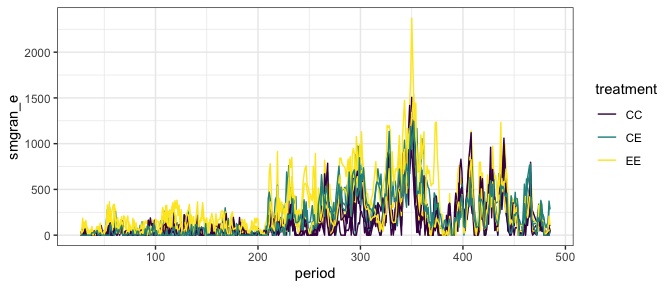
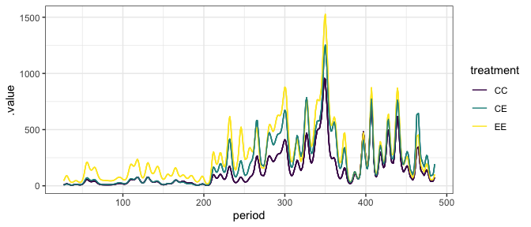
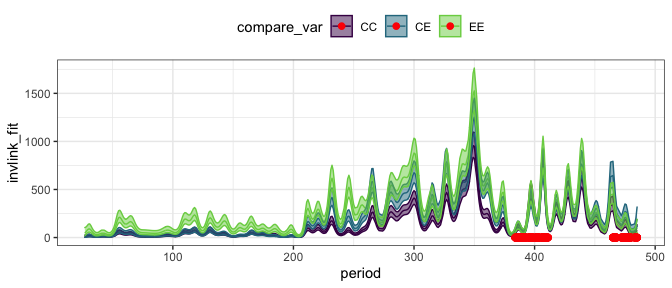
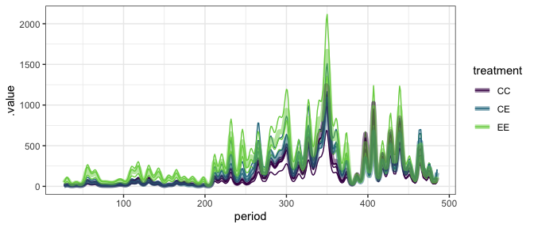
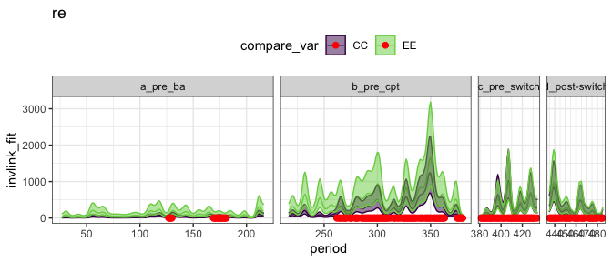
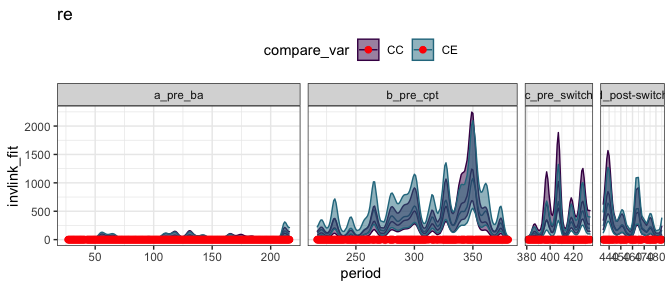

Energy plots
================

    ## Loading required package: nlme

    ## 
    ## Attaching package: 'nlme'

    ## The following object is masked from 'package:dplyr':
    ## 
    ##     collapse

    ## This is mgcv 1.8-33. For overview type 'help("mgcv-package")'.

    ## Loading in data version 2.49.0

    ## `summarise()` regrouping output by 'period', 'censusdate', 'era' (override with `.groups` argument)

    ## `summarise()` regrouping output by 'censusyear', 'plot', 'plot_type' (override with `.groups` argument)

<!-- --><!-- -->

    ## Joining, by = "period"

    ## Warning: Unknown or uninitialised column: `type`.

<!-- -->

    ## Joining, by = "period"
    ## Joining, by = "period"

<!-- --><!-- -->

    ## Scale for 'fill' is already present. Adding another scale for 'fill', which
    ## will replace the existing scale.

    ## Scale for 'colour' is already present. Adding another scale for 'colour',
    ## which will replace the existing scale.

<!-- -->

    ## Loading required package: emmeans

    ## The 'lsmeans' package is now basically a front end for 'emmeans'.
    ## Users are encouraged to switch the rest of the way.
    ## See help('transition') for more information, including how to
    ## convert old 'lsmeans' objects and scripts to work with 'emmeans'.

    ## era = a_pre_ba:
    ##  contrast estimate   SE df t.ratio p.value
    ##  CC - CE     -12.5 31.7  7 -0.393  0.9194 
    ##  CC - EE     -79.0 31.7  7 -2.492  0.0931 
    ##  CE - EE     -66.6 33.9  7 -1.964  0.1915 
    ## 
    ## era = b_pre_cpt:
    ##  contrast estimate   SE df t.ratio p.value
    ##  CC - CE    -134.9 33.1  7 -4.075  0.0115 
    ##  CC - EE    -219.8 33.1  7 -6.643  0.0007 
    ##  CE - EE     -85.0 35.4  7 -2.402  0.1054 
    ## 
    ## era = c_pre_switch:
    ##  contrast estimate   SE df t.ratio p.value
    ##  CC - CE     -33.0 50.7  7 -0.650  0.7982 
    ##  CC - EE     -53.0 50.7  7 -1.045  0.5747 
    ##  CE - EE     -20.0 54.2  7 -0.369  0.9284 
    ## 
    ## era = d_post-switch:
    ##  contrast estimate   SE df t.ratio p.value
    ##  CC - CE     -99.1 55.8  7 -1.775  0.2456 
    ##  CC - EE     -75.0 55.8  7 -1.344  0.4177 
    ##  CE - EE      24.1 59.7  7  0.403  0.9152 
    ## 
    ## Degrees-of-freedom method: containment 
    ## P value adjustment: tukey method for comparing a family of 3 estimates

    ## era = a_pre_ba:
    ##  contrast estimate   SE   df t.ratio p.value
    ##  CC - CE     -12.5 31.7 1087 -0.393  0.9184 
    ##  CC - EE     -79.0 31.7 1065 -2.492  0.0343 
    ##  CE - EE     -66.6 33.9 1079 -1.964  0.1218 
    ## 
    ## era = b_pre_cpt:
    ##  contrast estimate   SE   df t.ratio p.value
    ##  CC - CE    -134.9 33.1 1103 -4.075  0.0001 
    ##  CC - EE    -219.8 33.1 1076 -6.643  <.0001 
    ##  CE - EE     -85.0 35.4 1093 -2.402  0.0435 
    ## 
    ## era = c_pre_switch:
    ##  contrast estimate   SE   df t.ratio p.value
    ##  CC - CE     -33.0 50.7 1122 -0.650  0.7923 
    ##  CC - EE     -53.0 50.7 1089 -1.045  0.5488 
    ##  CE - EE     -20.0 54.2 1109 -0.369  0.9277 
    ## 
    ## era = d_post-switch:
    ##  contrast estimate   SE   df t.ratio p.value
    ##  CC - CE     -99.1 55.8 1124 -1.775  0.1785 
    ##  CC - EE     -75.0 55.8 1090 -1.344  0.3713 
    ##  CE - EE      24.1 59.7 1112  0.403  0.9142 
    ## 
    ## Degrees-of-freedom method: satterthwaite 
    ## P value adjustment: tukey method for comparing a family of 3 estimates
