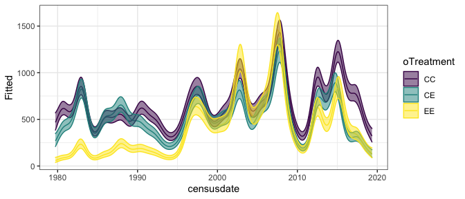
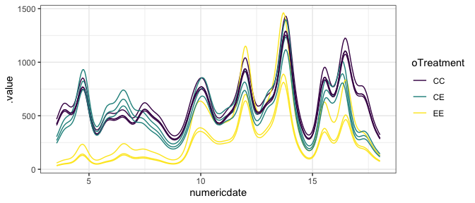
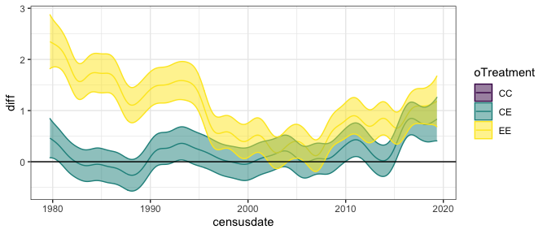
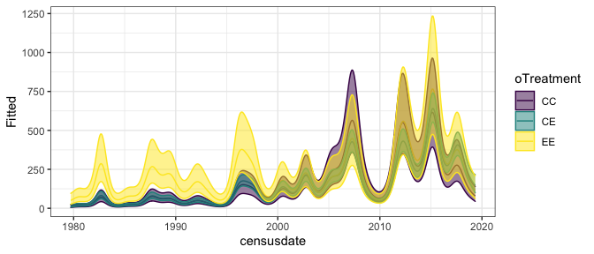
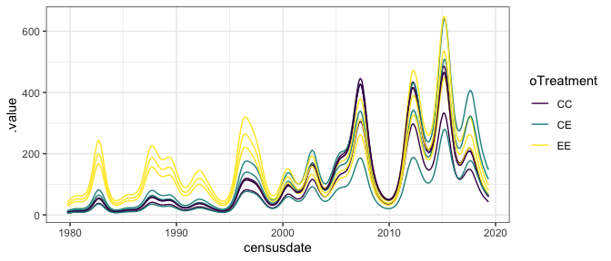
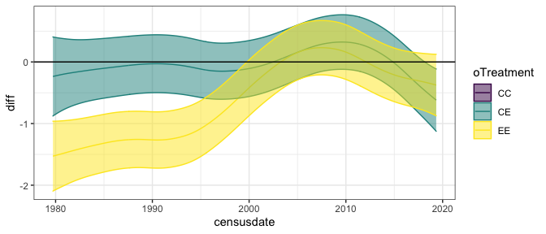

GAM
================

    ## Joining, by = "oPlot"

<!-- --><!-- -->

    ## Joining, by = c("censusdate", "compare_trt")

    ## Warning: Removed 500 row(s) containing missing values (geom_path).

    ## Warning in max(ids, na.rm = TRUE): no non-missing arguments to max; returning -
    ## Inf

<!-- -->

# smgran

    ## Joining, by = "oPlot"

<!-- --><!-- -->

    ## Joining, by = c("censusdate", "compare_trt")

    ## Warning: Removed 500 row(s) containing missing values (geom_path).

    ## Warning in max(ids, na.rm = TRUE): no non-missing arguments to max; returning -
    ## Inf

<!-- -->

# tinygran

<!-- --><!-- -->

    ## Joining, by = c("censusdate", "compare_trt")

    ## Warning: Removed 500 row(s) containing missing values (geom_path).

    ## Warning in max(ids, na.rm = TRUE): no non-missing arguments to max; returning -
    ## Inf

<!-- -->
