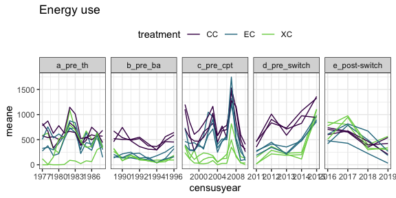
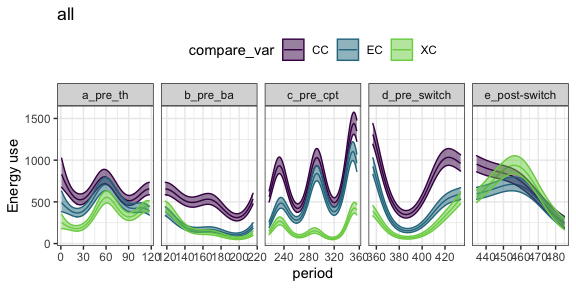
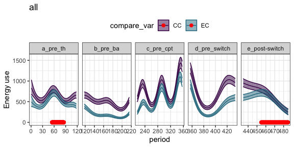
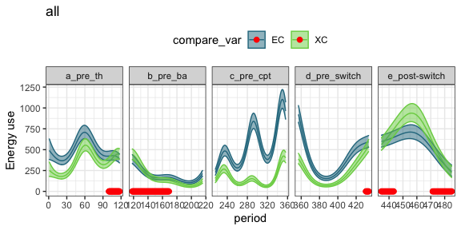
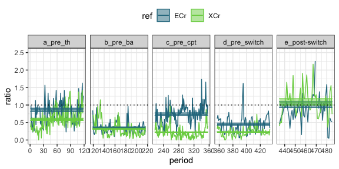
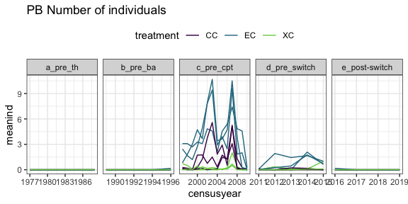
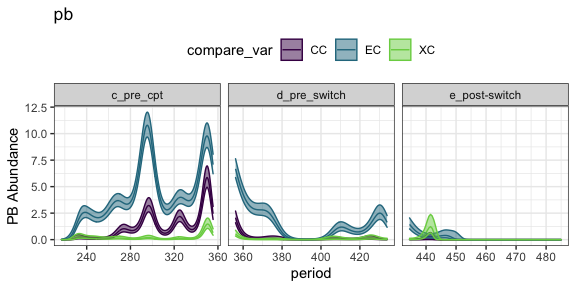
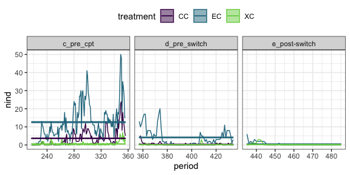
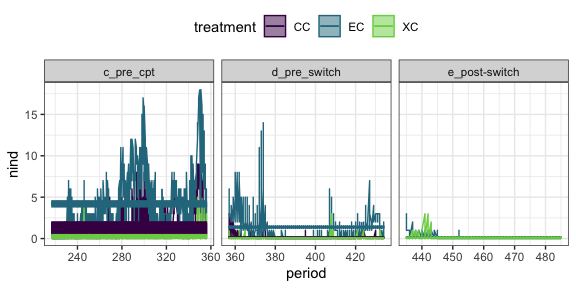

Scaffolding analysis with plot switch data
================

# Data

This document uses the data from the plots studied in Christensen et al
2019 ProcB. We will use some of the same control plots for the actual
analysis, but both sets of treatment plots will be different. (Ch uses
exclosures that get turned into controls and removals that get turned
into controls. We will look at long term exclosures and controls that
get turned into exclosures).

This gives us space to do some analytical development without wondering
if we’re seeing the actual effects. We have the same basic structures we
will have in the actual data:

  - Three treatment types - controls and two flavors of manipulation
  - Changes to the manipulations occurring in 2015
  - Probably similar sitewide dynamics in terms of fluctuations in
    sitewide abundance, major environmental events, etc.
  - Probably similar idiosyncracies in the data, e.g. variability
    between plots; autocorrelation; etc.

Here is the raw data (plotted as annual means per plot for
visualization):

<!-- --> \#\#
GAM

We will be working a lot with a GAM.

We fit a GAM to `energy ~ treatment + s(period) + s(period, by =
treatment)` with a Tweedie link. We include all treatments and all time
in this GAM, because we’ll use it repeatedly. Treatment is ordered.

Here is the fitted values from that GAM:

<!-- -->

<!-- -->

<!-- -->

## Comparing ratios

<!-- -->

### Contrasts - in dev

From GLM with gamma link. RMD is exploring best practice for the
modeling framework.

#### Era by treatment

| contrast                          | ref |    estimate |        SE |  df |    z.ratio |   p.value |
| :-------------------------------- | :-- | ----------: | --------: | --: | ---------: | --------: |
| b\_pre\_ba - c\_pre\_cpt          | ECr |   1.4935336 | 0.1822253 | Inf |   8.196083 | 0.0000000 |
| c\_pre\_cpt - d\_pre\_switch      | ECr | \-0.8649396 | 0.1625224 | Inf | \-5.321972 | 0.0000010 |
| c\_pre\_cpt - (e\_post-switch)    | ECr |   0.3620915 | 0.1059743 | Inf |   3.416785 | 0.0057203 |
| d\_pre\_switch - (e\_post-switch) | ECr |   1.2270311 | 0.1690106 | Inf |   7.260083 | 0.0000000 |

| contrast                          | ref |    estimate |        SE |  df |    z.ratio |   p.value |
| :-------------------------------- | :-- | ----------: | --------: | --: | ---------: | --------: |
| b\_pre\_ba - c\_pre\_cpt          | ECr | \-0.3870419 | 0.0422270 | Inf | \-9.165755 | 0.0000000 |
| c\_pre\_cpt - d\_pre\_switch      | ECr |   0.2876196 | 0.0474194 | Inf |   6.065446 | 0.0000000 |
| c\_pre\_cpt - (e\_post-switch)    | ECr | \-0.2692377 | 0.0907616 | Inf | \-2.966426 | 0.0251001 |
| d\_pre\_switch - (e\_post-switch) | ECr | \-0.5568573 | 0.0882672 | Inf | \-6.308767 | 0.0000000 |

| era            | ref | invlinkfit | invlinklower | invlinkupper |
| :------------- | :-- | ---------: | -----------: | -----------: |
| a\_pre\_th     | ECr |  0.8605405 |    0.9098271 |    0.8163193 |
| b\_pre\_ba     | ECr |  0.3510848 |    0.3732732 |    0.3313864 |
| c\_pre\_cpt    | ECr |  0.7381268 |    0.7767574 |    0.7031565 |
| d\_pre\_switch | ECr |  0.4505072 |    0.4826668 |    0.4223654 |
| e\_post-switch | ECr |  1.0073644 |    1.0978249 |    0.9306769 |

#### Treatment by era

| contrast  | era            |    estimate |        SE |  df |      z.ratio |   p.value |
| :-------- | :------------- | ----------: | --------: | --: | -----------: | --------: |
| ECr - XCr | a\_pre\_th     | \-0.5362982 | 0.1114774 | Inf |  \-4.8108260 | 0.0000015 |
| ECr - XCr | b\_pre\_ba     | \-0.3145994 | 0.2530114 | Inf |  \-1.2434200 | 0.2137131 |
| ECr - XCr | c\_pre\_cpt    | \-3.2705403 | 0.2396969 | Inf | \-13.6444850 | 0.0000000 |
| ECr - XCr | d\_pre\_switch | \-2.2962565 | 0.3352786 | Inf |  \-6.8488012 | 0.0000000 |
| ECr - XCr | e\_post-switch |   0.0694294 | 0.1117069 | Inf |    0.6215324 | 0.5342494 |

| contrast  | era            |    estimate |        SE |  df |     z.ratio |   p.value |
| :-------- | :------------- | ----------: | --------: | --: | ----------: | --------: |
| ECr - XCr | a\_pre\_th     |   0.2717367 | 0.0564844 | Inf |   4.8108260 | 0.0000015 |
| ECr - XCr | b\_pre\_ba     |   0.0349207 | 0.0280844 | Inf |   1.2434200 | 0.2137131 |
| ECr - XCr | c\_pre\_cpt    |   0.5219256 | 0.0382518 | Inf |  13.6444828 | 0.0000000 |
| ECr - XCr | d\_pre\_switch |   0.2290711 | 0.0334469 | Inf |   6.8488012 | 0.0000000 |
| ECr - XCr | e\_post-switch | \-0.0757541 | 0.1218828 | Inf | \-0.6215324 | 0.5342494 |

| era            | ref | invlinkfit | invlinklower | invlinkupper |
| :------------- | :-- | ---------: | -----------: | -----------: |
| a\_pre\_th     | ECr |  0.8605405 |    0.9098271 |    0.8163193 |
| a\_pre\_th     | XCr |  0.5888038 |    0.6225270 |    0.5585466 |
| b\_pre\_ba     | ECr |  0.3510848 |    0.3732732 |    0.3313864 |
| b\_pre\_ba     | XCr |  0.3161642 |    0.3361455 |    0.2984250 |
| c\_pre\_cpt    | ECr |  0.7381268 |    0.7767574 |    0.7031565 |
| c\_pre\_cpt    | XCr |  0.2162012 |    0.2275163 |    0.2059582 |
| d\_pre\_switch | ECr |  0.4505072 |    0.4826668 |    0.4223654 |
| d\_pre\_switch | XCr |  0.2214360 |    0.2372433 |    0.2076036 |
| e\_post-switch | ECr |  1.0073644 |    1.0978249 |    0.9306769 |
| e\_post-switch | XCr |  1.0831185 |    1.1803817 |    1.0006641 |

## PB

## PB abundance

<!-- -->

<!-- -->

<!-- -->

| contrast                          | treatment |    estimate |          SE |  df |     z.ratio |   p.value |
| :-------------------------------- | :-------- | ----------: | ----------: | --: | ----------: | --------: |
| c\_pre\_cpt - d\_pre\_switch      | CC        |   2.3575542 |   0.1974593 | Inf |  11.9394455 | 0.0000000 |
| c\_pre\_cpt - (e\_post-switch)    | CC        |  17.5992673 | 294.5296689 | Inf |   0.0597538 | 0.9980334 |
| d\_pre\_switch - (e\_post-switch) | CC        |  15.2417131 | 294.5297284 | Inf |   0.0517493 | 0.9985246 |
| c\_pre\_cpt - d\_pre\_switch      | EC        |   1.1090951 |   0.0604453 | Inf |  18.3487385 | 0.0000000 |
| c\_pre\_cpt - (e\_post-switch)    | EC        |   3.2460796 |   0.2014130 | Inf |  16.1165309 | 0.0000000 |
| d\_pre\_switch - (e\_post-switch) | EC        |   2.1369845 |   0.2075727 | Inf |  10.2951142 | 0.0000000 |
| c\_pre\_cpt - d\_pre\_switch      | XC        |   1.5551326 |   0.3343123 | Inf |   4.6517362 | 0.0000098 |
| c\_pre\_cpt - (e\_post-switch)    | XC        |   0.9479278 |   0.3083797 | Inf |   3.0738982 | 0.0059874 |
| d\_pre\_switch - (e\_post-switch) | XC        | \-0.6072048 |   0.4281744 | Inf | \-1.4181248 | 0.3314852 |

| contrast                          | treatment |    estimate |        SE |  df |    z.ratio |   p.value |
| :-------------------------------- | :-------- | ----------: | --------: | --: | ---------: | --------: |
| c\_pre\_cpt - d\_pre\_switch      | CC        |   3.3109890 | 0.1748151 | Inf |  18.939949 | 0.0000000 |
| c\_pre\_cpt - (e\_post-switch)    | CC        |   3.6571428 | 0.1616244 | Inf |  22.627416 | 0.0000000 |
| d\_pre\_switch - (e\_post-switch) | CC        |   0.3461538 | 0.0666173 | Inf |   5.196151 | 0.0000006 |
| c\_pre\_cpt - d\_pre\_switch      | EC        |   8.4390110 | 0.3784223 | Inf |  22.300513 | 0.0000000 |
| c\_pre\_cpt - (e\_post-switch)    | EC        |  12.1026611 | 0.3155324 | Inf |  38.356323 | 0.0000000 |
| d\_pre\_switch - (e\_post-switch) | EC        |   3.6636501 | 0.2507312 | Inf |  14.611865 | 0.0000000 |
| c\_pre\_cpt - d\_pre\_switch      | XC        |   0.4789377 | 0.0773330 | Inf |   6.193188 | 0.0000000 |
| c\_pre\_cpt - (e\_post-switch)    | XC        |   0.3718487 | 0.0946063 | Inf |   3.930488 | 0.0002500 |
| d\_pre\_switch - (e\_post-switch) | XC        | \-0.1070890 | 0.0791029 | Inf | \-1.353794 | 0.3654490 |

| era            | treatment | invlinkfit | invlinklower |  invlinkupper |
| :------------- | :-------- | ---------: | -----------: | ------------: |
| c\_pre\_cpt    | XC        |  0.6071429 |    0.5447347 |  6.767009e-01 |
| c\_pre\_cpt    | EC        | 12.5928571 |   12.2964854 |  1.289637e+01 |
| c\_pre\_cpt    | CC        |  3.6571429 |    3.4990378 |  3.822392e+00 |
| d\_pre\_switch | XC        |  0.1282051 |    0.0934479 |  1.758901e-01 |
| d\_pre\_switch | EC        |  4.1538462 |    3.9293701 |  4.391146e+00 |
| d\_pre\_switch | CC        |  0.3461538 |    0.2855546 |  4.196132e-01 |
| e\_post-switch | XC        |  0.2352941 |    0.1762954 |  3.140372e-01 |
| e\_post-switch | EC        |  0.4901961 |    0.4013386 |  5.987268e-01 |
| e\_post-switch | CC        |  0.0000001 |    0.0000000 | 6.799637e+120 |

#### pb with plot

<!-- -->

| contrast                          | treatment |    estimate |          SE |  df |     z.ratio |   p.value |
| :-------------------------------- | :-------- | ----------: | ----------: | --: | ----------: | --------: |
| c\_pre\_cpt - d\_pre\_switch      | CC        |   2.3575542 |   0.1974593 | Inf |  11.9394455 | 0.0000000 |
| c\_pre\_cpt - (e\_post-switch)    | CC        |  17.4491348 | 273.2298797 | Inf |   0.0638625 | 0.9977540 |
| d\_pre\_switch - (e\_post-switch) | CC        |  15.0915806 | 273.2299439 | Inf |   0.0552340 | 0.9983194 |
| c\_pre\_cpt - d\_pre\_switch      | EC        |   1.1090951 |   0.0604453 | Inf |  18.3487385 | 0.0000000 |
| c\_pre\_cpt - (e\_post-switch)    | EC        |   3.2460796 |   0.2014130 | Inf |  16.1165309 | 0.0000000 |
| d\_pre\_switch - (e\_post-switch) | EC        |   2.1369845 |   0.2075727 | Inf |  10.2951142 | 0.0000000 |
| c\_pre\_cpt - d\_pre\_switch      | XC        |   1.5551326 |   0.3343123 | Inf |   4.6517362 | 0.0000098 |
| c\_pre\_cpt - (e\_post-switch)    | XC        |   0.9479278 |   0.3083797 | Inf |   3.0738982 | 0.0059874 |
| d\_pre\_switch - (e\_post-switch) | XC        | \-0.6072048 |   0.4281744 | Inf | \-1.4181248 | 0.3314852 |

| contrast                          | treatment |    estimate |        SE |  df |    z.ratio |   p.value |
| :-------------------------------- | :-------- | ----------: | --------: | --: | ---------: | --------: |
| c\_pre\_cpt - d\_pre\_switch      | CC        |   0.9774409 | 0.0563814 | Inf |  17.336228 | 0.0000000 |
| c\_pre\_cpt - (e\_post-switch)    | CC        |   1.0796294 | 0.0539030 | Inf |  20.029106 | 0.0000000 |
| d\_pre\_switch - (e\_post-switch) | CC        |   0.1021884 | 0.0198089 | Inf |   5.158706 | 0.0000007 |
| c\_pre\_cpt - d\_pre\_switch      | EC        |   2.8105129 | 0.1260555 | Inf |  22.295844 | 0.0000000 |
| c\_pre\_cpt - (e\_post-switch)    | EC        |   4.0306483 | 0.1051494 | Inf |  38.332580 | 0.0000000 |
| d\_pre\_switch - (e\_post-switch) | EC        |   1.2201354 | 0.0835106 | Inf |  14.610551 | 0.0000000 |
| c\_pre\_cpt - d\_pre\_switch      | XC        |   0.1158274 | 0.0211350 | Inf |   5.480359 | 0.0000001 |
| c\_pre\_cpt - (e\_post-switch)    | XC        |   0.0899288 | 0.0241227 | Inf |   3.727981 | 0.0005657 |
| d\_pre\_switch - (e\_post-switch) | XC        | \-0.0258987 | 0.0192566 | Inf | \-1.344920 | 0.3702694 |

| era            | treatment |   fitmean |
| :------------- | :-------- | --------: |
| c\_pre\_cpt    | CC        | 1.2190476 |
| c\_pre\_cpt    | EC        | 4.1976190 |
| c\_pre\_cpt    | XC        | 0.2023810 |
| d\_pre\_switch | CC        | 0.1153846 |
| d\_pre\_switch | EC        | 1.3846154 |
| d\_pre\_switch | XC        | 0.0427350 |
| e\_post-switch | CC        | 0.0000000 |
| e\_post-switch | EC        | 0.1633987 |
| e\_post-switch | XC        | 0.0784314 |

| era            | treatment | plot | invlinkfit | invlinklower |  invlinkupper |
| :------------- | :-------- | :--- | ---------: | -----------: | ------------: |
| c\_pre\_cpt    | XC        | 7    |  0.4312417 |    0.3806429 |  4.885665e-01 |
| d\_pre\_switch | XC        | 7    |  0.0910616 |    0.0659790 |  1.256795e-01 |
| e\_post-switch | XC        | 7    |  0.1671248 |    0.1244043 |  2.245155e-01 |
| c\_pre\_cpt    | EC        | 6    |  3.9710430 |    3.8155638 |  4.132858e+00 |
| d\_pre\_switch | EC        | 6    |  1.3098776 |    1.2284950 |  1.396651e+00 |
| e\_post-switch | EC        | 6    |  0.1545789 |    0.1262357 |  1.892858e-01 |
| c\_pre\_cpt    | XC        | 5    |  0.0680908 |    0.0508056 |  9.125670e-02 |
| d\_pre\_switch | XC        | 5    |  0.0143781 |    0.0094744 |  2.182000e-02 |
| e\_post-switch | XC        | 5    |  0.0263881 |    0.0177481 |  3.923430e-02 |
| c\_pre\_cpt    | CC        | 11   |  1.2009541 |    1.1132723 |  1.295542e+00 |
| d\_pre\_switch | CC        | 11   |  0.1136720 |    0.0928745 |  1.391268e-01 |
| e\_post-switch | CC        | 11   |  0.0000000 |    0.0000000 | 1.457787e+111 |
| c\_pre\_cpt    | CC        | 14   |  0.5495892 |    0.4915780 |  6.144463e-01 |
| d\_pre\_switch | CC        | 14   |  0.0520194 |    0.0418298 |  6.469120e-02 |
| e\_post-switch | CC        | 14   |  0.0000000 |    0.0000000 | 6.671309e+110 |
| c\_pre\_cpt    | EC        | 13   |  4.2214692 |    4.0607754 |  4.388522e+00 |
| d\_pre\_switch | EC        | 13   |  1.3924825 |    1.3068797 |  1.483693e+00 |
| e\_post-switch | EC        | 13   |  0.1643271 |    0.1342260 |  2.011785e-01 |
| c\_pre\_cpt    | CC        | 17   |  1.9065995 |    1.7947251 |  2.025448e+00 |
| d\_pre\_switch | CC        | 17   |  0.1804624 |    0.1482198 |  2.197188e-01 |
| e\_post-switch | CC        | 17   |  0.0000001 |    0.0000000 | 2.314330e+111 |
| c\_pre\_cpt    | EC        | 18   |  4.4003450 |    4.2360049 |  4.571061e+00 |
| d\_pre\_switch | EC        | 18   |  1.4514860 |    1.3628747 |  1.545859e+00 |
| e\_post-switch | EC        | 18   |  0.1712901 |    0.1399334 |  2.096733e-01 |
| c\_pre\_cpt    | XC        | 24   |  0.1078104 |    0.0852634 |  1.363197e-01 |
| d\_pre\_switch | XC        | 24   |  0.0227654 |    0.0155913 |  3.324060e-02 |
| e\_post-switch | XC        | 24   |  0.0417812 |    0.0292714 |  5.963740e-02 |

