Energy plots
================

    ## Loading required package: nlme

    ## 
    ## Attaching package: 'nlme'

    ## The following object is masked from 'package:dplyr':
    ## 
    ##     collapse

    ## This is mgcv 1.8-33. For overview type 'help("mgcv-package")'.

    ## Loading in data version 2.49.0

    ## `summarise()` regrouping output by 'period', 'censusdate', 'era' (override with `.groups` argument)

    ## `summarise()` regrouping output by 'censusyear', 'plot', 'plot_type' (override with `.groups` argument)

    ## Loading in data version 2.49.0

    ## `summarise()` regrouping output by 'period', 'censusdate', 'era' (override with `.groups` argument)

    ## `summarise()` regrouping output by 'censusyear', 'plot_type', 'era' (override with `.groups` argument)

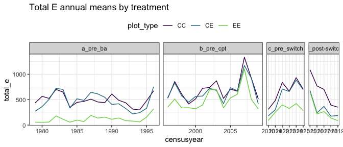<!-- -->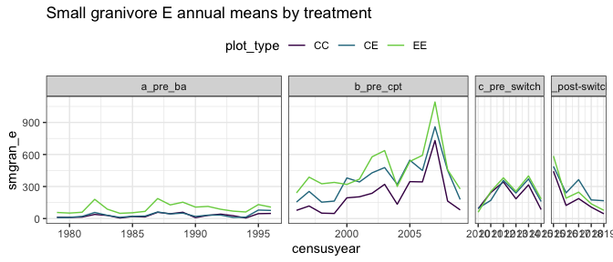<!-- -->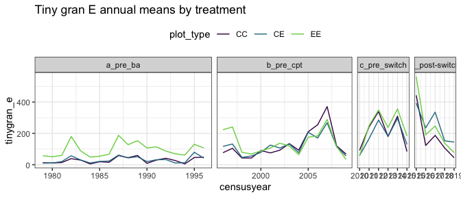<!-- -->

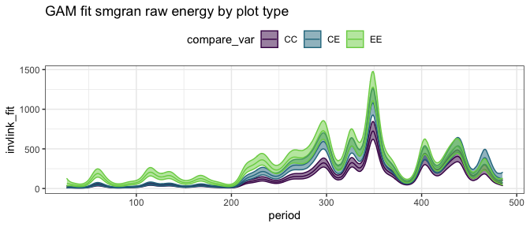<!-- -->

    ## Joining, by = "period"

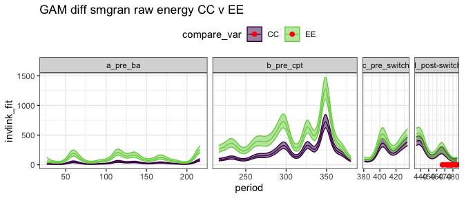<!-- -->

    ## Joining, by = "period"

    ## Scale for 'colour' is already present. Adding another scale for 'colour',
    ## which will replace the existing scale.

    ## Scale for 'fill' is already present. Adding another scale for 'fill', which
    ## will replace the existing scale.

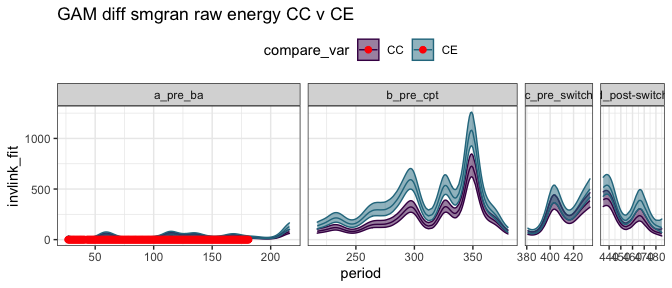<!-- -->

    ## Joining, by = "period"

    ## Scale for 'colour' is already present. Adding another scale for 'colour',
    ## which will replace the existing scale.

    ## Scale for 'fill' is already present. Adding another scale for 'fill', which
    ## will replace the existing scale.

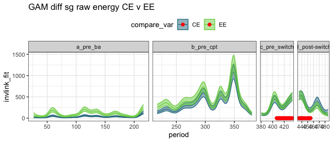<!-- -->

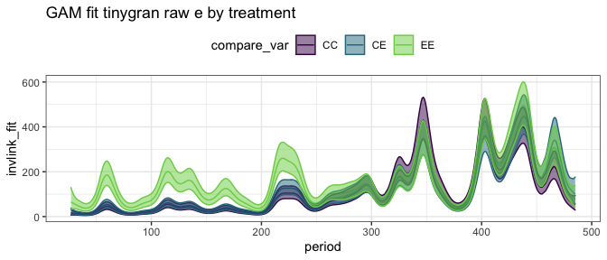<!-- -->

    ## Joining, by = "period"

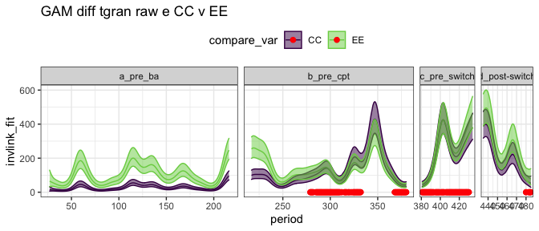<!-- -->

    ## Joining, by = "period"

    ## Scale for 'colour' is already present. Adding another scale for 'colour',
    ## which will replace the existing scale.

    ## Scale for 'fill' is already present. Adding another scale for 'fill', which
    ## will replace the existing scale.

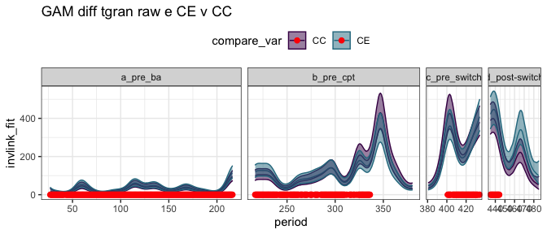<!-- -->

    ## Joining, by = "period"

    ## Scale for 'colour' is already present. Adding another scale for 'colour',
    ## which will replace the existing scale.

    ## Scale for 'fill' is already present. Adding another scale for 'fill', which
    ## will replace the existing scale.

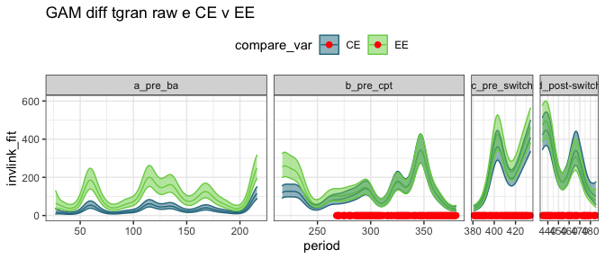<!-- -->

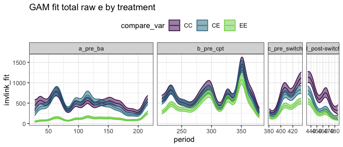<!-- -->

    ## Joining, by = "period"

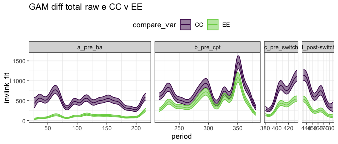<!-- -->

    ## Joining, by = "period"

    ## Scale for 'colour' is already present. Adding another scale for 'colour',
    ## which will replace the existing scale.

    ## Scale for 'fill' is already present. Adding another scale for 'fill', which
    ## will replace the existing scale.

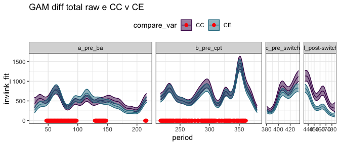<!-- -->

    ## Joining, by = "period"

    ## Scale for 'colour' is already present. Adding another scale for 'colour',
    ## which will replace the existing scale.

    ## Scale for 'fill' is already present. Adding another scale for 'fill', which
    ## will replace the existing scale.

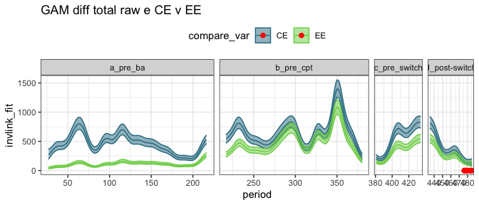<!-- -->

## Ratios

    ## Joining, by = "period"

    ## `summarise()` regrouping output by 'censusyear', 'era' (override with `.groups` argument)

    ## Joining, by = "period"

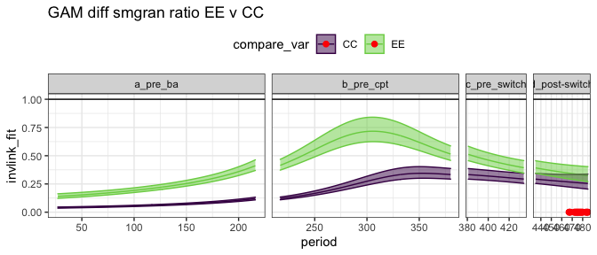<!-- -->

    ## Joining, by = "period"

    ## Scale for 'fill' is already present. Adding another scale for 'fill', which
    ## will replace the existing scale.

    ## Scale for 'colour' is already present. Adding another scale for 'colour',
    ## which will replace the existing scale.

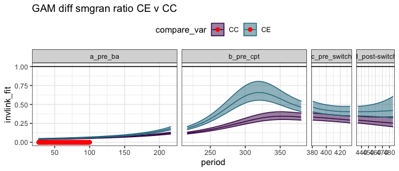<!-- -->

    ## Joining, by = "period"

    ## Scale for 'fill' is already present. Adding another scale for 'fill', which
    ## will replace the existing scale.

    ## Scale for 'colour' is already present. Adding another scale for 'colour',
    ## which will replace the existing scale.

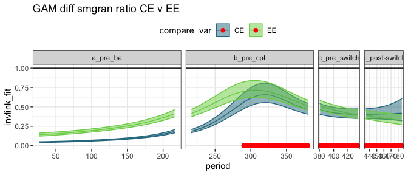<!-- -->

    ## Joining, by = "period"

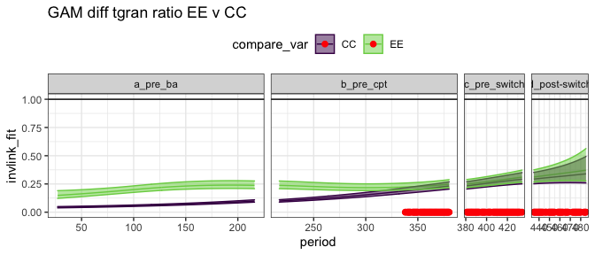<!-- -->

    ## Joining, by = "period"

    ## Scale for 'fill' is already present. Adding another scale for 'fill', which
    ## will replace the existing scale.

    ## Scale for 'colour' is already present. Adding another scale for 'colour',
    ## which will replace the existing scale.

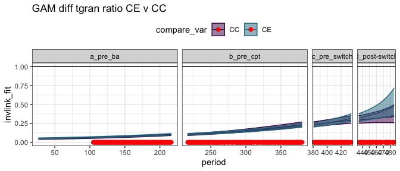<!-- -->

    ## Joining, by = "period"

    ## Scale for 'fill' is already present. Adding another scale for 'fill', which
    ## will replace the existing scale.

    ## Scale for 'colour' is already present. Adding another scale for 'colour',
    ## which will replace the existing scale.

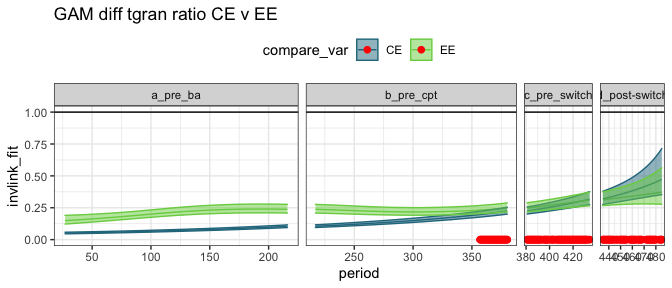<!-- -->

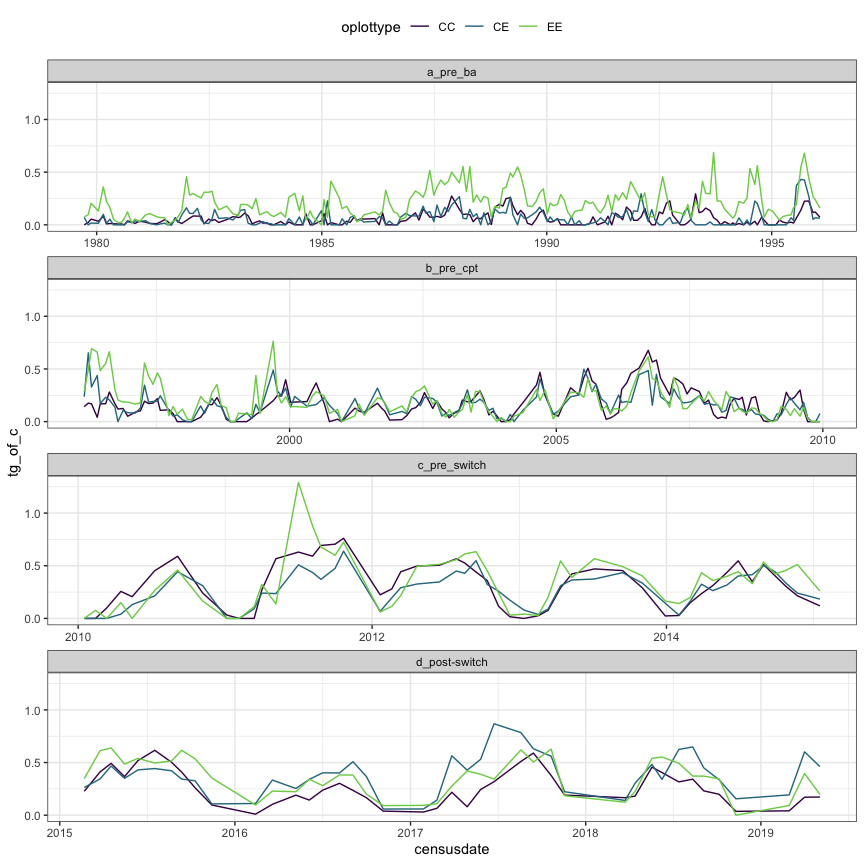<!-- -->

### a short fiction

Just to show that, if there was a **stronger** gain from tinygran, it
would show up.

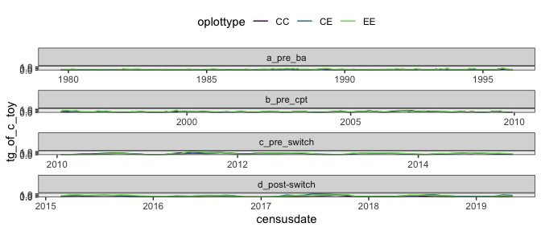<!-- -->

    ## Joining, by = "period"

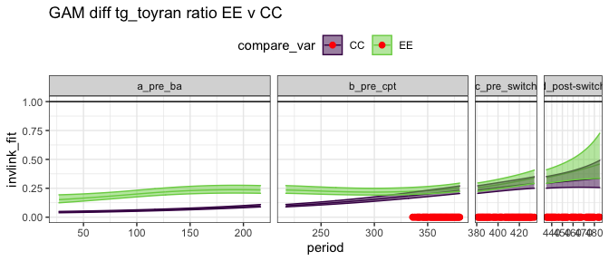<!-- -->

    ## Joining, by = "period"

    ## Scale for 'fill' is already present. Adding another scale for 'fill', which
    ## will replace the existing scale.

    ## Scale for 'colour' is already present. Adding another scale for 'colour',
    ## which will replace the existing scale.

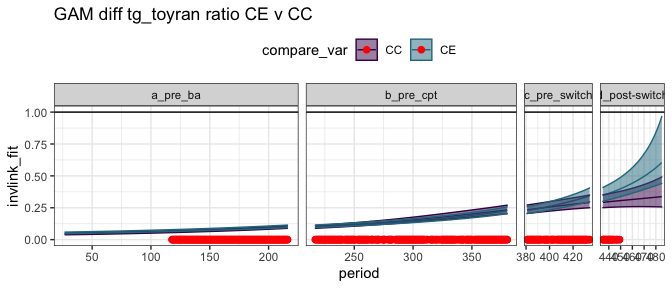<!-- -->

    ## Joining, by = "period"

    ## Scale for 'fill' is already present. Adding another scale for 'fill', which
    ## will replace the existing scale.

    ## Scale for 'colour' is already present. Adding another scale for 'colour',
    ## which will replace the existing scale.

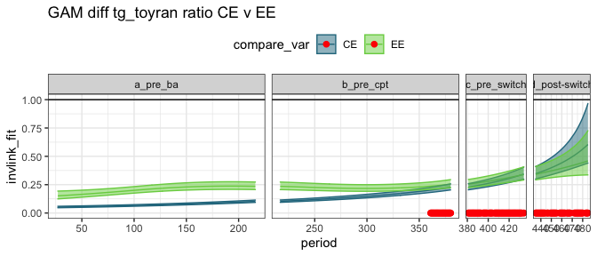<!-- -->

    ## Joining, by = "period"

    ## Scale for 'colour' is already present. Adding another scale for 'colour',
    ## which will replace the existing scale.

    ## Scale for 'fill' is already present. Adding another scale for 'fill', which
    ## will replace the existing scale.

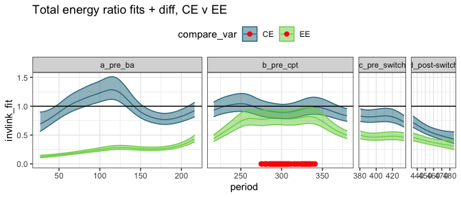<!-- -->

    ## Scale for 'colour' is already present. Adding another scale for 'colour',
    ## which will replace the existing scale.
    ## Scale for 'fill' is already present. Adding another scale for 'fill', which
    ## will replace the existing scale.

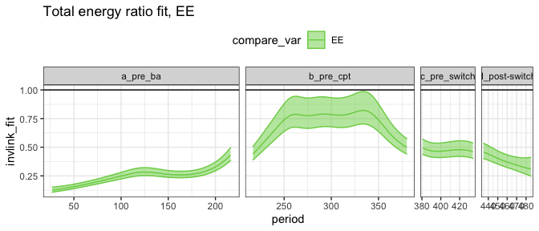<!-- -->

## By era

##### Era means:

    ## # A tibble: 12 x 5
    ##    era           oplottype total_e_mean smgran_e_mean tinygran_e_mean
    ##    <chr>         <fct>            <dbl>         <dbl>           <dbl>
    ##  1 a_pre_ba      CC                484.          28.4            28.4
    ##  2 a_pre_ba      CE                455.          32.5            32.3
    ##  3 a_pre_ba      EE                110.          98.8            98.8
    ##  4 b_pre_cpt     CC                718.         216.            128. 
    ##  5 b_pre_cpt     CE                672.         368.            120. 
    ##  6 b_pre_cpt     EE                511.         465.            139. 
    ##  7 c_pre_switch  CC                670.         243.            240. 
    ##  8 c_pre_switch  CE                573.         256.            206. 
    ##  9 c_pre_switch  EE                310.         281.            260. 
    ## 10 d_post-switch CC                718.         207.            207. 
    ## 11 d_post-switch CE                360.         311.            273. 
    ## 12 d_post-switch EE                308.         281.            275.

### gls on actual vals

##### Total energy raw GLS

    ## Loading required package: emmeans

    ## The 'lsmeans' package is now basically a front end for 'emmeans'.
    ## Users are encouraged to switch the rest of the way.
    ## See help('transition') for more information, including how to
    ## convert old 'lsmeans' objects and scripts to work with 'emmeans'.

    ## era = a_pre_ba:
    ##  contrast estimate    SE  df t.ratio p.value
    ##  CC - CE      39.3  77.7 203 0.505   0.8690 
    ##  CC - EE     375.0  77.7 203 4.825   <.0001 
    ##  CE - EE     335.8  77.7 203 4.320   0.0001 
    ## 
    ## era = b_pre_cpt:
    ##  contrast estimate    SE  df t.ratio p.value
    ##  CC - CE      60.2  79.9 205 0.754   0.7317 
    ##  CC - EE     220.6  79.9 205 2.762   0.0172 
    ##  CE - EE     160.4  79.9 205 2.008   0.1128 
    ## 
    ## era = c_pre_switch:
    ##  contrast estimate    SE  df t.ratio p.value
    ##  CC - CE     130.7 117.5 208 1.112   0.5080 
    ##  CC - EE     311.4 117.5 208 2.650   0.0235 
    ##  CE - EE     180.8 117.5 208 1.538   0.2754 
    ## 
    ## era = d_post-switch:
    ##  contrast estimate    SE  df t.ratio p.value
    ##  CC - CE     251.4 132.4 207 1.899   0.1414 
    ##  CC - EE     407.6 132.4 207 3.080   0.0066 
    ##  CE - EE     156.2 132.4 207 1.180   0.4662 
    ## 
    ## Degrees-of-freedom method: satterthwaite 
    ## P value adjustment: tukey method for comparing a family of 3 estimates

##### Small gran raw GLS

    ## era = a_pre_ba:
    ##  contrast estimate    SE  df t.ratio p.value
    ##  CC - CE     -20.4  64.3 158 -0.317  0.9462 
    ##  CC - EE     -87.5  64.3 158 -1.360  0.3642 
    ##  CE - EE     -67.1  64.3 158 -1.044  0.5504 
    ## 
    ## era = b_pre_cpt:
    ##  contrast estimate    SE  df t.ratio p.value
    ##  CC - CE    -121.7  65.0 159 -1.873  0.1498 
    ##  CC - EE    -201.2  65.0 159 -3.097  0.0065 
    ##  CE - EE     -79.5  65.0 159 -1.223  0.4411 
    ## 
    ## era = c_pre_switch:
    ##  contrast estimate    SE  df t.ratio p.value
    ##  CC - CE     -43.9  91.9 161 -0.478  0.8818 
    ##  CC - EE     -60.4  91.9 161 -0.657  0.7887 
    ##  CE - EE     -16.4  91.9 161 -0.179  0.9825 
    ## 
    ## era = d_post-switch:
    ##  contrast estimate    SE  df t.ratio p.value
    ##  CC - CE    -101.4 105.7 160 -0.960  0.6033 
    ##  CC - EE     -86.8 105.7 161 -0.821  0.6905 
    ##  CE - EE      14.7 105.7 160  0.139  0.9894 
    ## 
    ## Degrees-of-freedom method: satterthwaite 
    ## P value adjustment: tukey method for comparing a family of 3 estimates

##### Tiny gran raw GLS

    ## era = a_pre_ba:
    ##  contrast estimate   SE  df t.ratio p.value
    ##  CC - CE      1.12 34.5 292  0.033  0.9994 
    ##  CC - EE    -63.00 34.5 292 -1.828  0.1623 
    ##  CE - EE    -64.13 34.5 291 -1.860  0.1522 
    ## 
    ## era = b_pre_cpt:
    ##  contrast estimate   SE  df t.ratio p.value
    ##  CC - CE      2.25 36.0 294  0.062  0.9979 
    ##  CC - EE    -15.97 36.0 294 -0.444  0.8971 
    ##  CE - EE    -18.21 36.0 294 -0.506  0.8683 
    ## 
    ## era = c_pre_switch:
    ##  contrast estimate   SE  df t.ratio p.value
    ##  CC - CE     16.88 55.1 298  0.306  0.9497 
    ##  CC - EE    -20.72 55.1 299 -0.376  0.9251 
    ##  CE - EE    -37.60 55.1 299 -0.682  0.7742 
    ## 
    ## era = d_post-switch:
    ##  contrast estimate   SE  df t.ratio p.value
    ##  CC - CE    -46.12 60.7 298 -0.760  0.7279 
    ##  CC - EE    -55.46 60.7 299 -0.914  0.6320 
    ##  CE - EE     -9.34 60.7 299 -0.154  0.9870 
    ## 
    ## Degrees-of-freedom method: satterthwaite 
    ## P value adjustment: tukey method for comparing a family of 3 estimates

### gls on ratios

##### Era ratios:

    ## # A tibble: 12 x 5
    ##    era           oplottype te_mean sg_mean tg_mean
    ##    <chr>         <fct>       <dbl>   <dbl>   <dbl>
    ##  1 a_pre_ba      CC          1.     0.0581  0.0581
    ##  2 a_pre_ba      CE          0.974  0.0651  0.0648
    ##  3 a_pre_ba      EE          0.238  0.212   0.212 
    ##  4 b_pre_cpt     CC          1.     0.269   0.164 
    ##  5 b_pre_cpt     CE          0.962  0.512   0.165 
    ##  6 b_pre_cpt     EE          0.726  0.658   0.194 
    ##  7 c_pre_switch  CC          1.     0.319   0.315 
    ##  8 c_pre_switch  CE          0.853  0.354   0.267 
    ##  9 c_pre_switch  EE          0.432  0.370   0.342 
    ## 10 d_post-switch CC          1.     0.260   0.260 
    ## 11 d_post-switch CE          0.489  0.439   0.385 
    ## 12 d_post-switch EE          0.393  0.363   0.357

<!-- -->

##### Total energy ratios GLS

This fit includes CC plots, for which ratio always = 1.

    ## era = a_pre_ba:
    ##  contrast estimate     SE  df t.ratio p.value
    ##  CC - CE    0.0274 0.0434 819  0.630  0.8039 
    ##  CC - EE    0.7606 0.0434 819 17.507  <.0001 
    ##  CE - EE    0.7333 0.0434 817 16.877  <.0001 
    ## 
    ## era = b_pre_cpt:
    ##  contrast estimate     SE  df t.ratio p.value
    ##  CC - CE    0.0482 0.0471 837  1.024  0.5622 
    ##  CC - EE    0.2852 0.0471 835  6.060  <.0001 
    ##  CE - EE    0.2370 0.0471 838  5.036  <.0001 
    ## 
    ## era = c_pre_switch:
    ##  contrast estimate     SE  df t.ratio p.value
    ##  CC - CE    0.1475 0.0791 840  1.865  0.1495 
    ##  CC - EE    0.5685 0.0791 843  7.188  <.0001 
    ##  CE - EE    0.4209 0.0791 842  5.323  <.0001 
    ## 
    ## era = d_post-switch:
    ##  contrast estimate     SE  df t.ratio p.value
    ##  CC - CE    0.5129 0.0839 853  6.115  <.0001 
    ##  CC - EE    0.6287 0.0839 859  7.497  <.0001 
    ##  CE - EE    0.1159 0.0839 856  1.381  0.3511 
    ## 
    ## Degrees-of-freedom method: satterthwaite 
    ## P value adjustment: tukey method for comparing a family of 3 estimates

This fit has CC plots removed.

    ## era = a_pre_ba:
    ##  contrast estimate     SE  df t.ratio p.value
    ##  CE - EE     0.733 0.0532 528 13.780  <.0001 
    ## 
    ## era = b_pre_cpt:
    ##  contrast estimate     SE  df t.ratio p.value
    ##  CE - EE     0.237 0.0576 538  4.112  <.0001 
    ## 
    ## era = c_pre_switch:
    ##  contrast estimate     SE  df t.ratio p.value
    ##  CE - EE     0.421 0.0969 542  4.346  <.0001 
    ## 
    ## era = d_post-switch:
    ##  contrast estimate     SE  df t.ratio p.value
    ##  CE - EE     0.116 0.1027 551  1.128  0.2598 
    ## 
    ## Degrees-of-freedom method: satterthwaite

    ## fplottype = CE:
    ##  contrast                       estimate     SE  df t.ratio p.value
    ##  a_pre_ba - b_pre_cpt             0.0208 0.0551 222  0.378  0.9815 
    ##  a_pre_ba - c_pre_switch          0.1202 0.0781 236  1.538  0.4165 
    ##  a_pre_ba - (d_post-switch)       0.4855 0.0818 228  5.935  <.0001 
    ##  b_pre_cpt - c_pre_switch         0.0993 0.0788 237  1.261  0.5885 
    ##  b_pre_cpt - (d_post-switch)      0.4647 0.0832 226  5.582  <.0001 
    ##  c_pre_switch - (d_post-switch)   0.3653 0.0974 241  3.750  0.0013 
    ## 
    ## fplottype = EE:
    ##  contrast                       estimate     SE  df t.ratio p.value
    ##  a_pre_ba - b_pre_cpt            -0.4754 0.0551 223 -8.633  <.0001 
    ##  a_pre_ba - c_pre_switch         -0.1922 0.0781 236 -2.460  0.0691 
    ##  a_pre_ba - (d_post-switch)      -0.1319 0.0818 227 -1.613  0.3735 
    ##  b_pre_cpt - c_pre_switch         0.2832 0.0788 237  3.596  0.0022 
    ##  b_pre_cpt - (d_post-switch)      0.3435 0.0832 225  4.126  0.0003 
    ##  c_pre_switch - (d_post-switch)   0.0603 0.0974 240  0.618  0.9261 
    ## 
    ## Degrees-of-freedom method: satterthwaite 
    ## P value adjustment: tukey method for comparing a family of 4 estimates

##### Smgran ratio GLS

    ## era = a_pre_ba:
    ##  contrast estimate     SE  df t.ratio p.value
    ##  CC - CE  -0.01337 0.0439 502 -0.305  0.9501 
    ##  CC - EE  -0.15802 0.0439 501 -3.603  0.0010 
    ##  CE - EE  -0.14466 0.0439 501 -3.298  0.0030 
    ## 
    ## era = b_pre_cpt:
    ##  contrast estimate     SE  df t.ratio p.value
    ##  CC - CE  -0.23441 0.0468 509 -5.010  <.0001 
    ##  CC - EE  -0.37163 0.0468 509 -7.942  <.0001 
    ##  CE - EE  -0.13723 0.0468 510 -2.933  0.0098 
    ## 
    ## era = c_pre_switch:
    ##  contrast estimate     SE  df t.ratio p.value
    ##  CC - CE  -0.05064 0.0761 515 -0.665  0.7839 
    ##  CC - EE  -0.05198 0.0761 516 -0.683  0.7737 
    ##  CE - EE  -0.00134 0.0761 516 -0.018  0.9998 
    ## 
    ## era = d_post-switch:
    ##  contrast estimate     SE  df t.ratio p.value
    ##  CC - CE  -0.16803 0.0814 518 -2.065  0.0982 
    ##  CC - EE  -0.08678 0.0814 521 -1.067  0.5353 
    ##  CE - EE   0.08125 0.0814 520  0.999  0.5780 
    ## 
    ## Degrees-of-freedom method: satterthwaite 
    ## P value adjustment: tukey method for comparing a family of 3 estimates

##### Tiny gran ratio GLS

    ## era = a_pre_ba:
    ##  contrast estimate     SE  df t.ratio p.value
    ##  CC - CE  -0.00367 0.0340 477 -0.108  0.9936 
    ##  CC - EE  -0.14637 0.0340 477 -4.307  0.0001 
    ##  CE - EE  -0.14270 0.0340 477 -4.200  0.0001 
    ## 
    ## era = b_pre_cpt:
    ##  contrast estimate     SE  df t.ratio p.value
    ##  CC - CE  -0.00416 0.0362 484 -0.115  0.9927 
    ##  CC - EE  -0.03211 0.0362 484 -0.887  0.6486 
    ##  CE - EE  -0.02795 0.0362 485 -0.772  0.7202 
    ## 
    ## era = c_pre_switch:
    ##  contrast estimate     SE  df t.ratio p.value
    ##  CC - CE   0.03573 0.0587 490  0.609  0.8153 
    ##  CC - EE  -0.03706 0.0587 491 -0.632  0.8028 
    ##  CE - EE  -0.07279 0.0587 491 -1.241  0.4298 
    ## 
    ## era = d_post-switch:
    ##  contrast estimate     SE  df t.ratio p.value
    ##  CC - CE  -0.10469 0.0628 493 -1.667  0.2189 
    ##  CC - EE  -0.07613 0.0628 496 -1.213  0.4463 
    ##  CE - EE   0.02856 0.0628 494  0.455  0.8923 
    ## 
    ## Degrees-of-freedom method: satterthwaite 
    ## P value adjustment: tukey method for comparing a family of 3 estimates

### glm on ratios

##### Total energy GLM

With controls:

    ## era = a_pre_ba:
    ##  contrast estimate     SE   df t.ratio p.value
    ##  CC - CE    0.0265 0.0396 1260  0.668  0.7822 
    ##  CC - EE    0.7622 0.0292 1260 26.123  <.0001 
    ##  CE - EE    0.7358 0.0284 1260 25.863  <.0001 
    ## 
    ## era = b_pre_cpt:
    ##  contrast estimate     SE   df t.ratio p.value
    ##  CC - CE    0.0384 0.0451 1260  0.851  0.6712 
    ##  CC - EE    0.2744 0.0402 1260  6.829  <.0001 
    ##  CE - EE    0.2360 0.0392 1260  6.024  <.0001 
    ## 
    ## era = c_pre_switch:
    ##  contrast estimate     SE   df t.ratio p.value
    ##  CC - CE    0.1471 0.0725 1260  2.027  0.1061 
    ##  CC - EE    0.5682 0.0601 1260  9.451  <.0001 
    ##  CE - EE    0.4211 0.0528 1260  7.981  <.0001 
    ## 
    ## era = d_post-switch:
    ##  contrast estimate     SE   df t.ratio p.value
    ##  CC - CE    0.5113 0.0678 1260  7.537  <.0001 
    ##  CC - EE    0.6069 0.0655 1260  9.267  <.0001 
    ##  CE - EE    0.0956 0.0382 1260  2.501  0.0334 
    ## 
    ## P value adjustment: tukey method for comparing a family of 3 estimates

Without controls:

    ## era = a_pre_ba:
    ##  contrast estimate     SE  df t.ratio p.value
    ##  CE - EE    0.7358 0.0348 840 21.117  <.0001 
    ## 
    ## era = b_pre_cpt:
    ##  contrast estimate     SE  df t.ratio p.value
    ##  CE - EE    0.2360 0.0480 840  4.918  <.0001 
    ## 
    ## era = c_pre_switch:
    ##  contrast estimate     SE  df t.ratio p.value
    ##  CE - EE    0.4211 0.0646 840  6.516  <.0001 
    ## 
    ## era = d_post-switch:
    ##  contrast estimate     SE  df t.ratio p.value
    ##  CE - EE    0.0956 0.0468 840  2.042  0.0414

##### Small granivore ratio GLM

    ## era = a_pre_ba:
    ##  contrast estimate      SE   df t.ratio p.value
    ##  CC - CE  -0.00697 0.00501 1260  -1.392 0.3454 
    ##  CC - EE  -0.15414 0.01264 1260 -12.196 <.0001 
    ##  CE - EE  -0.14717 0.01275 1260 -11.543 <.0001 
    ## 
    ## era = b_pre_cpt:
    ##  contrast estimate      SE   df t.ratio p.value
    ##  CC - CE  -0.24302 0.03806 1260  -6.385 <.0001 
    ##  CC - EE  -0.38926 0.04679 1260  -8.318 <.0001 
    ##  CE - EE  -0.14623 0.05488 1260  -2.665 0.0213 
    ## 
    ## era = c_pre_switch:
    ##  contrast estimate      SE   df t.ratio p.value
    ##  CC - CE  -0.03459 0.05324 1260  -0.650 0.7926 
    ##  CC - EE  -0.05060 0.05458 1260  -0.927 0.6233 
    ##  CE - EE  -0.01601 0.05718 1260  -0.280 0.9577 
    ## 
    ## era = d_post-switch:
    ##  contrast estimate      SE   df t.ratio p.value
    ##  CC - CE  -0.17822 0.06290 1260  -2.833 0.0130 
    ##  CC - EE  -0.10247 0.05508 1260  -1.861 0.1507 
    ##  CE - EE   0.07575 0.07020 1260   1.079 0.5273 
    ## 
    ## P value adjustment: tukey method for comparing a family of 3 estimates

##### Tiny granivore ratio GLM

    ## era = a_pre_ba:
    ##  contrast estimate      SE   df t.ratio p.value
    ##  CC - CE  -0.00671 0.00546 1260  -1.228 0.4366 
    ##  CC - EE  -0.15414 0.01381 1260 -11.162 <.0001 
    ##  CE - EE  -0.14743 0.01393 1260 -10.586 <.0001 
    ## 
    ## era = b_pre_cpt:
    ##  contrast estimate      SE   df t.ratio p.value
    ##  CC - CE  -0.00074 0.01676 1260  -0.044 0.9989 
    ##  CC - EE  -0.02937 0.01827 1260  -1.607 0.2429 
    ##  CE - EE  -0.02863 0.01831 1260  -1.564 0.2618 
    ## 
    ## era = c_pre_switch:
    ##  contrast estimate      SE   df t.ratio p.value
    ##  CC - CE   0.04785 0.05033 1260   0.951 0.6082 
    ##  CC - EE  -0.02769 0.05672 1260  -0.488 0.8770 
    ##  CE - EE  -0.07553 0.05295 1260  -1.427 0.3275 
    ## 
    ## era = d_post-switch:
    ##  contrast estimate      SE   df t.ratio p.value
    ##  CC - CE  -0.12507 0.06268 1260  -1.995 0.1137 
    ##  CC - EE  -0.09678 0.05956 1260  -1.625 0.2354 
    ##  CE - EE   0.02829 0.07081 1260   0.399 0.9158 
    ## 
    ## P value adjustment: tukey method for comparing a family of 3 estimates
