Energy plots
================

    ## Loading required package: nlme

    ## 
    ## Attaching package: 'nlme'

    ## The following object is masked from 'package:dplyr':
    ## 
    ##     collapse

    ## This is mgcv 1.8-33. For overview type 'help("mgcv-package")'.

    ## Loading in data version 2.49.0

    ## `summarise()` regrouping output by 'period', 'censusdate', 'era' (override with `.groups` argument)

    ## Loading in data version 2.49.0

    ## `summarise()` regrouping output by 'period', 'censusdate', 'era' (override with `.groups` argument)

    ## `summarise()` regrouping output by 'censusyear', 'plot', 'plot_type' (override with `.groups` argument)

    ## `summarise()` regrouping output by 'censusyear', 'plot_type', 'era' (override with `.groups` argument)

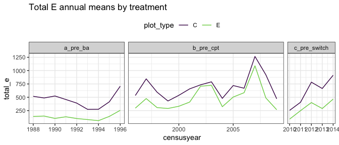<!-- -->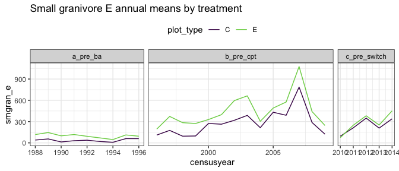<!-- -->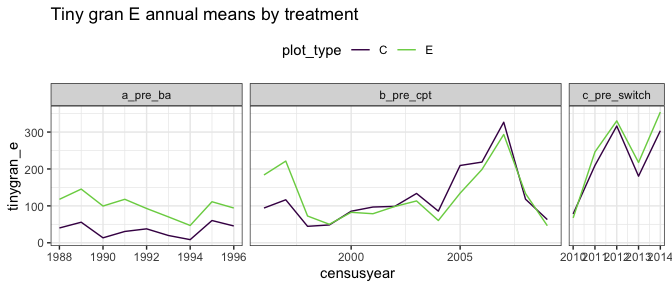<!-- -->

    ## Joining, by = "period"

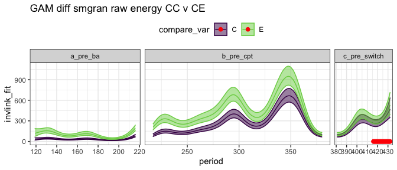<!-- -->

    ## Joining, by = "period"

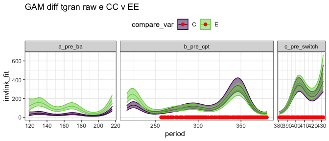<!-- -->

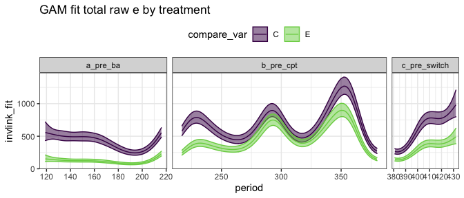<!-- -->

    ## Joining, by = "period"

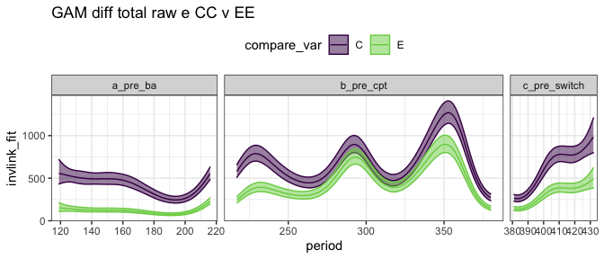<!-- -->

## Ratios

    ## Joining, by = "period"

    ## `summarise()` regrouping output by 'censusyear', 'era' (override with `.groups` argument)

    ## Joining, by = "period"

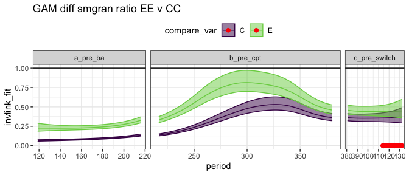<!-- -->

    ## Joining, by = "period"

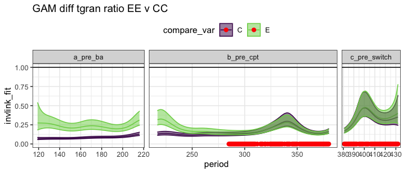<!-- -->

    ## Scale for 'colour' is already present. Adding another scale for 'colour',
    ## which will replace the existing scale.

    ## Scale for 'fill' is already present. Adding another scale for 'fill', which
    ## will replace the existing scale.

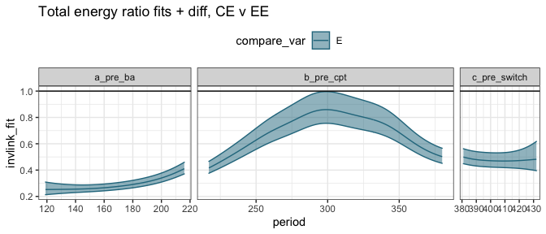<!-- -->

## By era

##### Era means:

    ## # A tibble: 6 x 5
    ##   era          oplottype total_e_mean smgran_e_mean tinygran_e_mean
    ##   <chr>        <fct>            <dbl>         <dbl>           <dbl>
    ## 1 a_pre_ba     C                 421.          33.6            33.4
    ## 2 a_pre_ba     E                 115.         100.            100. 
    ## 3 b_pre_cpt    C                 698.         281.            124. 
    ## 4 b_pre_cpt    E                 492.         450.            129. 
    ## 5 c_pre_switch C                 627.         252.            228. 
    ## 6 c_pre_switch E                 313.         296.            255.

### gls on actual vals

##### Total energy raw GLS

    ## Loading required package: emmeans

    ## The 'lsmeans' package is now basically a front end for 'emmeans'.
    ## Users are encouraged to switch the rest of the way.
    ## See help('transition') for more information, including how to
    ## convert old 'lsmeans' objects and scripts to work with 'emmeans'.

    ## era = a_pre_ba:
    ##  contrast estimate    SE   df t.ratio p.value
    ##  C - E         310 111.1 72.2 2.792   0.0067 
    ## 
    ## era = b_pre_cpt:
    ##  contrast estimate    SE   df t.ratio p.value
    ##  C - E         216  88.8 72.3 2.431   0.0175 
    ## 
    ## era = c_pre_switch:
    ##  contrast estimate    SE   df t.ratio p.value
    ##  C - E         259 135.3 72.7 1.914   0.0596 
    ## 
    ## Degrees-of-freedom method: satterthwaite

##### Small gran raw GLS

    ## era = a_pre_ba:
    ##  contrast estimate    SE   df t.ratio p.value
    ##  C - E       -89.4  99.9 60.6 -0.895  0.3745 
    ## 
    ## era = b_pre_cpt:
    ##  contrast estimate    SE   df t.ratio p.value
    ##  C - E      -140.9  81.0 60.6 -1.739  0.0872 
    ## 
    ## era = c_pre_switch:
    ##  contrast estimate    SE   df t.ratio p.value
    ##  C - E       -93.1 118.8 61.0 -0.783  0.4367 
    ## 
    ## Degrees-of-freedom method: satterthwaite

##### Tiny gran raw GLS

    ## era = a_pre_ba:
    ##  contrast estimate   SE  df t.ratio p.value
    ##  C - E       -58.8 45.2 123 -1.300  0.1961 
    ## 
    ## era = b_pre_cpt:
    ##  contrast estimate   SE  df t.ratio p.value
    ##  C - E       -10.0 35.5 124 -0.283  0.7775 
    ## 
    ## era = c_pre_switch:
    ##  contrast estimate   SE  df t.ratio p.value
    ##  C - E       -30.8 57.7 124 -0.535  0.5937 
    ## 
    ## Degrees-of-freedom method: satterthwaite

### gls on ratios

##### Era ratios:

    ## # A tibble: 6 x 5
    ##   era          oplottype te_mean sg_mean tg_mean
    ##   <chr>        <fct>       <dbl>   <dbl>   <dbl>
    ## 1 a_pre_ba     C           1.     0.0743  0.0740
    ## 2 a_pre_ba     E           0.276  0.238   0.237 
    ## 3 b_pre_cpt    C           1.     0.378   0.166 
    ## 4 b_pre_cpt    E           0.695  0.635   0.178 
    ## 5 c_pre_switch C           1.     0.369   0.328 
    ## 6 c_pre_switch E           0.460  0.426   0.372

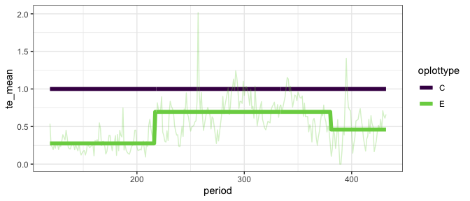<!-- -->

##### Total energy ratios GLS

This fit includes CC plots, for which ratio always = 1.

    ## era = a_pre_ba:
    ##  contrast estimate     SE  df t.ratio p.value
    ##  C - E       0.705 0.0468 250 15.057  <.0001 
    ## 
    ## era = b_pre_cpt:
    ##  contrast estimate     SE  df t.ratio p.value
    ##  C - E       0.319 0.0366 253  8.704  <.0001 
    ## 
    ## era = c_pre_switch:
    ##  contrast estimate     SE  df t.ratio p.value
    ##  C - E       0.521 0.0626 253  8.328  <.0001 
    ## 
    ## Degrees-of-freedom method: satterthwaite

##### Smgran ratio GLS

    ## era = a_pre_ba:
    ##  contrast estimate     SE  df t.ratio p.value
    ##  C - E     -0.1703 0.0727 154 -2.342  0.0204 
    ## 
    ## era = b_pre_cpt:
    ##  contrast estimate     SE  df t.ratio p.value
    ##  C - E     -0.2421 0.0569 154 -4.257  <.0001 
    ## 
    ## era = c_pre_switch:
    ##  contrast estimate     SE  df t.ratio p.value
    ##  C - E     -0.0822 0.0944 155 -0.871  0.3854 
    ## 
    ## Degrees-of-freedom method: satterthwaite

##### Tiny gran ratio GLS

    ## era = a_pre_ba:
    ##  contrast estimate     SE  df t.ratio p.value
    ##  C - E     -0.1499 0.0512 169 -2.929  0.0039 
    ## 
    ## era = b_pre_cpt:
    ##  contrast estimate     SE  df t.ratio p.value
    ##  C - E     -0.0168 0.0400 170 -0.420  0.6751 
    ## 
    ## era = c_pre_switch:
    ##  contrast estimate     SE  df t.ratio p.value
    ##  C - E     -0.0572 0.0670 170 -0.853  0.3947 
    ## 
    ## Degrees-of-freedom method: satterthwaite

### glm on ratios

##### Total energy GLM

With controls:

    ## era = a_pre_ba:
    ##  contrast estimate     SE  df t.ratio p.value
    ##  C - E       0.724 0.0309 576 23.447  <.0001 
    ## 
    ## era = b_pre_cpt:
    ##  contrast estimate     SE  df t.ratio p.value
    ##  C - E       0.305 0.0299 576 10.187  <.0001 
    ## 
    ## era = c_pre_switch:
    ##  contrast estimate     SE  df t.ratio p.value
    ##  C - E       0.540 0.0463 576 11.649  <.0001

##### Small granivore ratio GLM

    ## era = a_pre_ba:
    ##  contrast estimate     SE  df t.ratio p.value
    ##  C - E     -0.1633 0.0147 576 -11.076 <.0001 
    ## 
    ## era = b_pre_cpt:
    ##  contrast estimate     SE  df t.ratio p.value
    ##  C - E     -0.2573 0.0361 576  -7.126 <.0001 
    ## 
    ## era = c_pre_switch:
    ##  contrast estimate     SE  df t.ratio p.value
    ##  C - E     -0.0568 0.0472 576  -1.201 0.2301

##### Tiny granivore ratio GLM

    ## era = a_pre_ba:
    ##  contrast estimate     SE  df t.ratio p.value
    ##  C - E     -0.1633 0.0181 576 -9.014  <.0001 
    ## 
    ## era = b_pre_cpt:
    ##  contrast estimate     SE  df t.ratio p.value
    ##  C - E     -0.0113 0.0146 576 -0.773  0.4399 
    ## 
    ## era = c_pre_switch:
    ##  contrast estimate     SE  df t.ratio p.value
    ##  C - E     -0.0440 0.0511 576 -0.861  0.3895
