Energy plots
================

    ## Loading required package: nlme

    ## 
    ## Attaching package: 'nlme'

    ## The following object is masked from 'package:dplyr':
    ## 
    ##     collapse

    ## This is mgcv 1.8-33. For overview type 'help("mgcv-package")'.

    ## Loading in data version 2.49.0

    ## `summarise()` regrouping output by 'period', 'censusdate', 'era' (override with `.groups` argument)

    ## `summarise()` regrouping output by 'censusyear', 'plot', 'plot_type' (override with `.groups` argument)

    ## Loading in data version 2.49.0

    ## `summarise()` regrouping output by 'period', 'censusdate', 'era' (override with `.groups` argument)

    ## Joining, by = "period"

    ## Warning: Removed 88 row(s) containing missing values (geom_path).

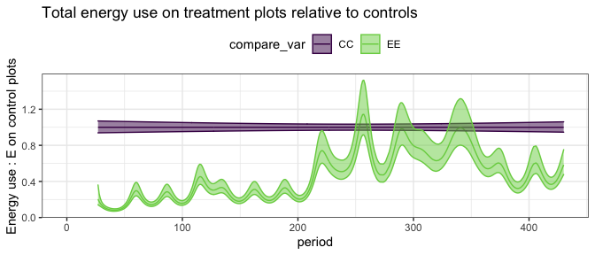<!-- -->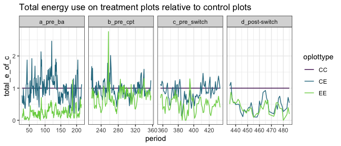<!-- -->

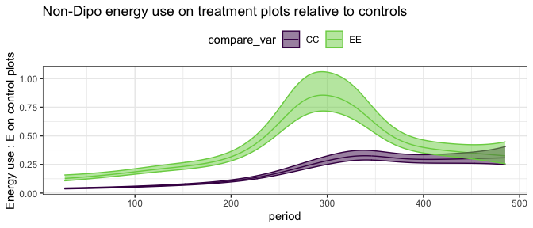<!-- -->

    ## Warning: Removed 132 row(s) containing missing values (geom_path).

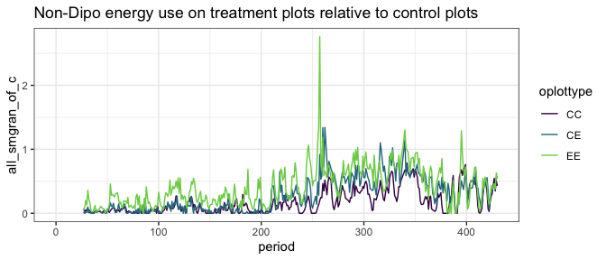<!-- -->

<!-- -->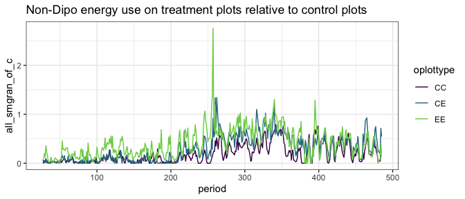<!-- -->

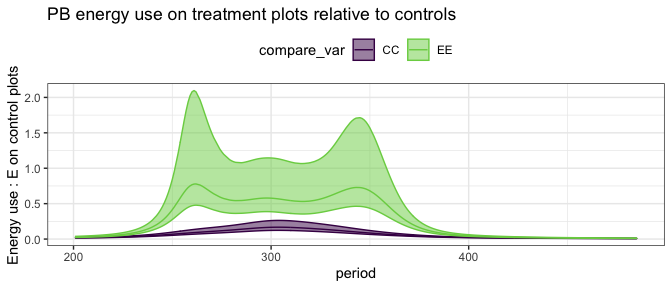<!-- -->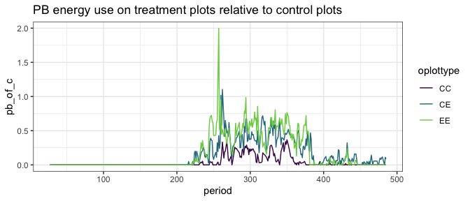<!-- -->

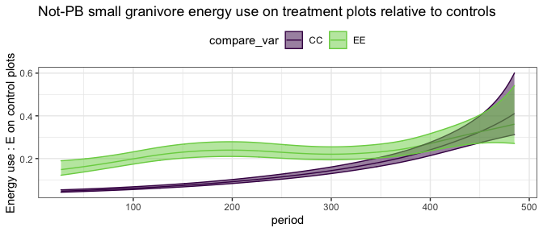<!-- -->

    ## Warning: Removed 132 row(s) containing missing values (geom_path).

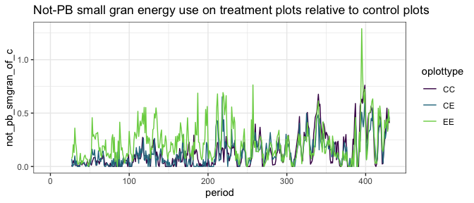<!-- -->

    ## Joining, by = c("period", "oplottype")
    ## Joining, by = c("period", "oplottype")

    ## Warning: Removed 173 row(s) containing missing values (geom_path).

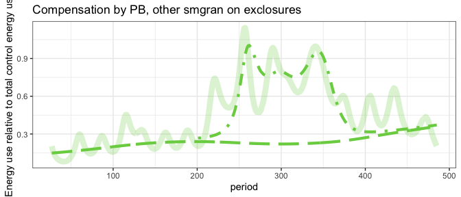<!-- -->

    ## Warning: Removed 173 row(s) containing missing values (geom_path).

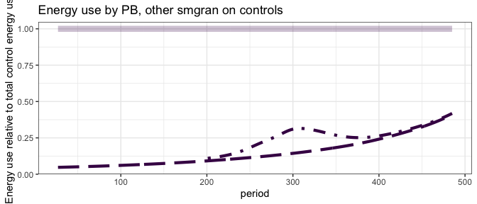<!-- -->
