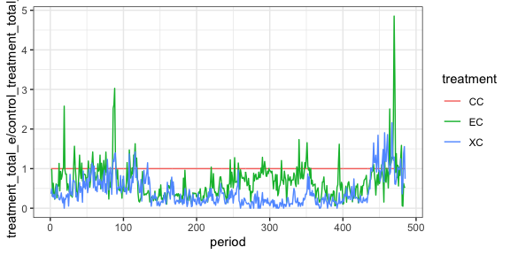
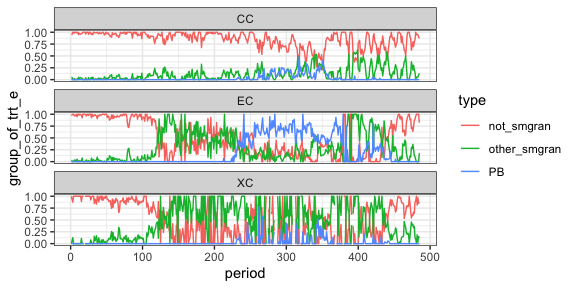
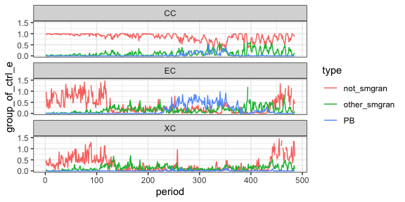
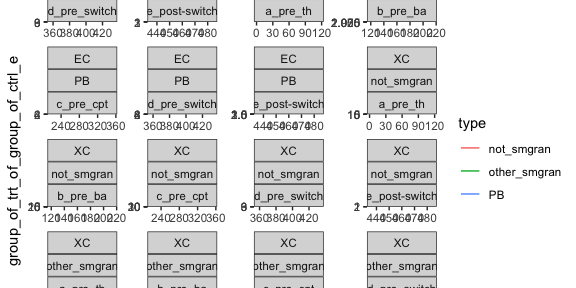
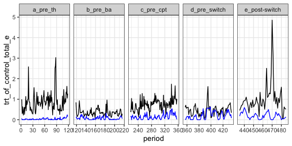

groups contributing to compensation
================

# Data

    ## `summarise()` regrouping output by 'period', 'censusdate', 'treatment' (override with `.groups` argument)

    ## Joining, by = "period"

    ## Joining, by = c("period", "treatment", "type", "censusdate")

    ## `summarise()` regrouping output by 'period', 'censusdate', 'era' (override with `.groups` argument)

    ## Joining, by = c("period", "treatment", "censusdate", "era")

    ## Joining, by = c("period", "censusdate", "era")

    ## Joining, by = c("period", "type", "censusdate", "era")

<!-- --><!-- --><!-- -->

    ## Warning: Removed 254 row(s) containing missing values (geom_path).

<!-- -->

    ## Joining, by = c("period", "treatment", "type", "censusdate", "era")

    ## Joining, by = c("period", "censusdate", "era")

<!-- -->
