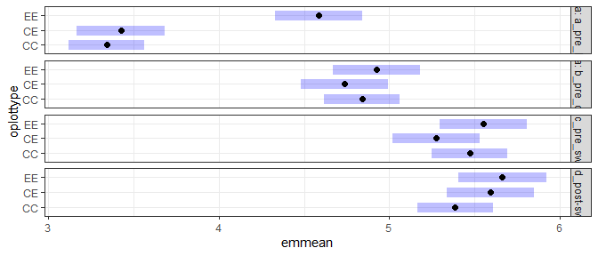
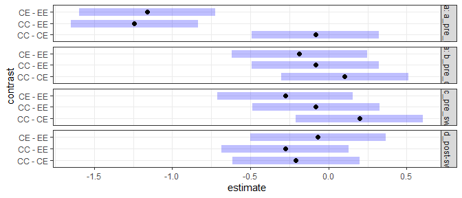
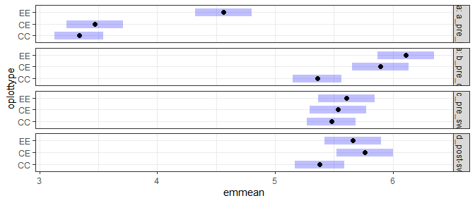
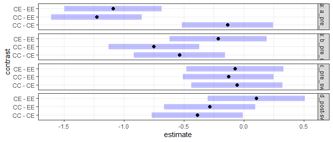
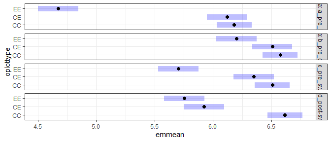
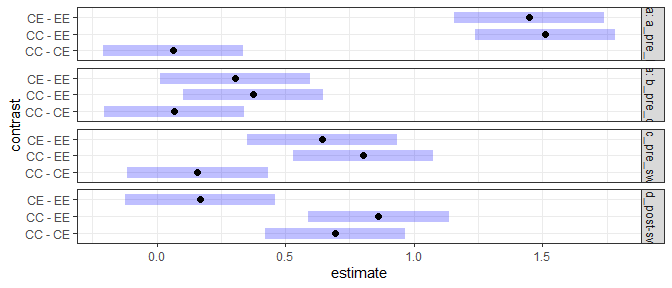

Energy plots
================

``` r
use_christensen_plots <- F

library(mgcv)
```

    ## Warning: package 'mgcv' was built under R version 4.0.3

    ## Loading required package: nlme

    ## 
    ## Attaching package: 'nlme'

    ## The following object is masked from 'package:dplyr':
    ## 
    ##     collapse

    ## This is mgcv 1.8-33. For overview type 'help("mgcv-package")'.

``` r
source(here::here("lore", "1994_longterm", "gams_fxns_generalized.R"))

plot_totals <- get_rodent_data(use_christensen_plots = use_christensen_plots, return_plot = T) %>%
   mutate(tinygran_e = smgran_e - pb_e) %>%
  mutate(oplottype = ordered(plot_type))
```

    ## Loading in data version 2.18.0

    ## `summarise()` regrouping output by 'period', 'censusdate', 'era' (override with `.groups` argument)

``` r
plot_annuals <- plot_totals %>%
  mutate(censusdate = as.Date(censusdate)) %>%
  mutate(censusyear = as.integer(format.Date(censusdate, "%Y"))) %>%
  group_by(censusyear, plot, plot_type, era) %>%
  summarize(annual_total_e = mean(total_e),
            annual_smgran_e = mean(smgran_e),
            annual_tinygran_e = mean(tinygran_e),
            nsamples = length(unique(period)),
            nrows = dplyr::n()) %>%
  ungroup()
```

    ## `summarise()` regrouping output by 'censusyear', 'plot', 'plot_type' (override with `.groups` argument)

``` r
treatment_means <- get_rodent_data(use_christensen_plots, F, F) %>%
  mutate(tinygran_e = smgran_e - pb_e) %>%
  mutate(oplottype = as.factor(plot_type))
```

    ## Loading in data version 2.18.0
    ## `summarise()` regrouping output by 'period', 'censusdate', 'era' (override with `.groups` argument)

``` r
# treatment_ratios <- get_total_energy_ratios(treatment_means)
```

``` r
library(lme4)
```

    ## Warning: package 'lme4' was built under R version 4.0.3

    ## Loading required package: Matrix

    ## 
    ## Attaching package: 'lme4'

    ## The following object is masked from 'package:nlme':
    ## 
    ##     lmList

``` r
library(emmeans)
```

    ## Warning: package 'emmeans' was built under R version 4.0.3

``` r
plot_totals <- plot_totals %>%
  mutate(tg_int = ceiling(tinygran_e),
         sg_int = ceiling(smgran_e),
         total_e_int = ceiling(total_e))

tg_glmer <- glmer(tg_int ~ oplottype * era + (1 |plot), data = plot_totals, family= poisson)

summary(tg_glmer)
```

    ## Generalized linear mixed model fit by maximum likelihood (Laplace
    ##   Approximation) [glmerMod]
    ##  Family: poisson  ( log )
    ## Formula: tg_int ~ oplottype * era + (1 | plot)
    ##    Data: plot_totals
    ## 
    ##       AIC       BIC    logLik  deviance  df.resid 
    ##  540214.0  540296.5 -270094.0  540188.0      4197 
    ## 
    ## Scaled residuals: 
    ##     Min      1Q  Median      3Q     Max 
    ## -19.354  -6.721  -4.188   4.915  75.232 
    ## 
    ## Random effects:
    ##  Groups Name        Variance Std.Dev.
    ##  plot   (Intercept) 0.05167  0.2273  
    ## Number of obs: 4210, groups:  plot, 10
    ## 
    ## Fixed effects:
    ##                               Estimate Std. Error  z value Pr(>|z|)    
    ## (Intercept)                   3.784388   0.072582   52.140  < 2e-16 ***
    ## oplottype.L                   0.878868   0.122840    7.155 8.39e-13 ***
    ## oplottype.Q                   0.439425   0.128233    3.427 0.000611 ***
    ## erab_pre_cpt                  1.049446   0.004318  243.064  < 2e-16 ***
    ## erac_pre_switch               1.648160   0.004679  352.235  < 2e-16 ***
    ## erad_post-switch              1.763008   0.004821  365.685  < 2e-16 ***
    ## oplottype.L:erab_pre_cpt     -0.819738   0.006864 -119.420  < 2e-16 ***
    ## oplottype.Q:erab_pre_cpt     -0.321185   0.008045  -39.922  < 2e-16 ***
    ## oplottype.L:erac_pre_switch  -0.821812   0.007429 -110.615  < 2e-16 ***
    ## oplottype.Q:erac_pre_switch  -0.245780   0.008727  -28.162  < 2e-16 ***
    ## oplottype.L:erad_post-switch -0.683175   0.007873  -86.778  < 2e-16 ***
    ## oplottype.Q:erad_post-switch -0.496549   0.008802  -56.413  < 2e-16 ***
    ## ---
    ## Signif. codes:  0 '***' 0.001 '**' 0.01 '*' 0.05 '.' 0.1 ' ' 1
    ## 
    ## Correlation of Fixed Effects:
    ##                (Intr) oplt.L oplt.Q erb_p_ erc_p_ erd_p- oplttyp.L:rb__
    ## oplottype.L     0.113                                                  
    ## oplottype.Q    -0.063  0.078                                           
    ## erab_pr_cpt    -0.042  0.013  0.011                                    
    ## erc_pr_swtc    -0.039  0.012  0.010  0.651                             
    ## erd_pst-swt    -0.038  0.011  0.010  0.632  0.583                      
    ## oplttyp.L:rb__  0.013 -0.038  0.009 -0.202 -0.209 -0.203               
    ## oplttyp.Q:rb__  0.010  0.008 -0.045 -0.207 -0.161 -0.157 -0.133        
    ## oplttyp.L:rc__  0.012 -0.035  0.008 -0.209 -0.161 -0.187  0.628        
    ## oplttyp.Q:rc__  0.010  0.008 -0.042 -0.161 -0.210 -0.144 -0.137        
    ## opltty.L:_-     0.012 -0.033  0.008 -0.197 -0.182 -0.175  0.592        
    ## opltty.Q:_-     0.009  0.008 -0.041 -0.160 -0.147 -0.149 -0.136        
    ##                oplttyp.Q:rb__ oplttyp.L:rc__ oplttyp.Q:rc__ o.L:_-
    ## oplottype.L                                                       
    ## oplottype.Q                                                       
    ## erab_pr_cpt                                                       
    ## erc_pr_swtc                                                       
    ## erd_pst-swt                                                       
    ## oplttyp.L:rb__                                                    
    ## oplttyp.Q:rb__                                                    
    ## oplttyp.L:rc__ -0.137                                             
    ## oplttyp.Q:rc__  0.668         -0.106                              
    ## opltty.L:_-    -0.130          0.547         -0.120               
    ## opltty.Q:_-     0.662         -0.126          0.610         -0.117

``` r
plot(emmeans(tg_glmer, ~ oplottype | era))
```

<!-- -->

``` r
plot(pairs(emmeans(tg_glmer, ~ oplottype | era)))
```

<!-- -->

``` r
(emmeans(tg_glmer, ~ oplottype | era))
```

    ## era = a_pre_ba:
    ##  oplottype emmean    SE  df asymp.LCL asymp.UCL
    ##  CC          3.34 0.114 Inf      3.12      3.57
    ##  CE          3.43 0.131 Inf      3.17      3.68
    ##  EE          4.59 0.131 Inf      4.33      4.84
    ## 
    ## era = b_pre_cpt:
    ##  oplottype emmean    SE  df asymp.LCL asymp.UCL
    ##  CC          4.84 0.114 Inf      4.62      5.06
    ##  CE          4.74 0.131 Inf      4.48      4.99
    ##  EE          4.92 0.131 Inf      4.67      5.18
    ## 
    ## era = c_pre_switch:
    ##  oplottype emmean    SE  df asymp.LCL asymp.UCL
    ##  CC          5.47 0.114 Inf      5.25      5.69
    ##  CE          5.27 0.131 Inf      5.02      5.53
    ##  EE          5.55 0.131 Inf      5.29      5.81
    ## 
    ## era = d_post-switch:
    ##  oplottype emmean    SE  df asymp.LCL asymp.UCL
    ##  CC          5.39 0.114 Inf      5.16      5.61
    ##  CE          5.59 0.131 Inf      5.34      5.85
    ##  EE          5.66 0.131 Inf      5.41      5.92
    ## 
    ## Results are given on the log (not the response) scale. 
    ## Confidence level used: 0.95

``` r
(pairs(emmeans(tg_glmer, ~ oplottype | era)))
```

    ## era = a_pre_ba:
    ##  contrast estimate    SE  df z.ratio p.value
    ##  CC - CE   -0.0833 0.173 Inf -0.480  0.8807 
    ##  CC - EE   -1.2429 0.174 Inf -7.155  <.0001 
    ##  CE - EE   -1.1596 0.185 Inf -6.257  <.0001 
    ## 
    ## era = b_pre_cpt:
    ##  contrast estimate    SE  df z.ratio p.value
    ##  CC - CE    0.1030 0.173 Inf  0.595  0.8230 
    ##  CC - EE   -0.0836 0.174 Inf -0.482  0.8800 
    ##  CE - EE   -0.1866 0.185 Inf -1.008  0.5721 
    ## 
    ## era = c_pre_switch:
    ##  contrast estimate    SE  df z.ratio p.value
    ##  CC - CE    0.1968 0.173 Inf  1.136  0.4920 
    ##  CC - EE   -0.0807 0.174 Inf -0.465  0.8878 
    ##  CE - EE   -0.2775 0.185 Inf -1.498  0.2920 
    ## 
    ## era = d_post-switch:
    ##  contrast estimate    SE  df z.ratio p.value
    ##  CC - CE   -0.2083 0.173 Inf -1.202  0.4519 
    ##  CC - EE   -0.2768 0.174 Inf -1.593  0.2485 
    ##  CE - EE   -0.0684 0.185 Inf -0.369  0.9276 
    ## 
    ## Results are given on the log (not the response) scale. 
    ## P value adjustment: tukey method for comparing a family of 3 estimates

``` r
(emmeans(tg_glmer, ~ oplottype | era))
```

    ## era = a_pre_ba:
    ##  oplottype emmean    SE  df asymp.LCL asymp.UCL
    ##  CC          3.34 0.114 Inf      3.12      3.57
    ##  CE          3.43 0.131 Inf      3.17      3.68
    ##  EE          4.59 0.131 Inf      4.33      4.84
    ## 
    ## era = b_pre_cpt:
    ##  oplottype emmean    SE  df asymp.LCL asymp.UCL
    ##  CC          4.84 0.114 Inf      4.62      5.06
    ##  CE          4.74 0.131 Inf      4.48      4.99
    ##  EE          4.92 0.131 Inf      4.67      5.18
    ## 
    ## era = c_pre_switch:
    ##  oplottype emmean    SE  df asymp.LCL asymp.UCL
    ##  CC          5.47 0.114 Inf      5.25      5.69
    ##  CE          5.27 0.131 Inf      5.02      5.53
    ##  EE          5.55 0.131 Inf      5.29      5.81
    ## 
    ## era = d_post-switch:
    ##  oplottype emmean    SE  df asymp.LCL asymp.UCL
    ##  CC          5.39 0.114 Inf      5.16      5.61
    ##  CE          5.59 0.131 Inf      5.34      5.85
    ##  EE          5.66 0.131 Inf      5.41      5.92
    ## 
    ## Results are given on the log (not the response) scale. 
    ## Confidence level used: 0.95

``` r
regrid(emmeans(tg_glmer, ~ oplottype | era))
```

    ## era = a_pre_ba:
    ##  oplottype  rate    SE  df asymp.LCL asymp.UCL
    ##  CC         28.3  3.22 Inf      22.0      34.6
    ##  CE         30.7  4.03 Inf      22.8      38.6
    ##  EE         98.0 12.86 Inf      72.8     123.2
    ## 
    ## era = b_pre_cpt:
    ##  oplottype  rate    SE  df asymp.LCL asymp.UCL
    ##  CC        126.5 14.37 Inf      98.3     154.7
    ##  CE        114.1 14.95 Inf      84.8     143.4
    ##  EE        137.5 18.04 Inf     102.2     172.9
    ## 
    ## era = c_pre_switch:
    ##  oplottype  rate    SE  df asymp.LCL asymp.UCL
    ##  CC        237.8 27.02 Inf     184.8     290.7
    ##  CE        195.3 25.59 Inf     145.1     245.4
    ##  EE        257.7 33.81 Inf     191.5     324.0
    ## 
    ## era = d_post-switch:
    ##  oplottype  rate    SE  df asymp.LCL asymp.UCL
    ##  CC        218.3 24.81 Inf     169.6     266.9
    ##  CE        268.8 35.23 Inf     199.8     337.9
    ##  EE        287.9 37.77 Inf     213.8     361.9
    ## 
    ## Confidence level used: 0.95

``` r
sg_glmer <- glmer(sg_int ~ oplottype * era + (1 |plot), data = plot_totals, family= poisson)

summary(sg_glmer)
```

    ## Generalized linear mixed model fit by maximum likelihood (Laplace
    ##   Approximation) [glmerMod]
    ##  Family: poisson  ( log )
    ## Formula: sg_int ~ oplottype * era + (1 | plot)
    ##    Data: plot_totals
    ## 
    ##       AIC       BIC    logLik  deviance  df.resid 
    ##  646468.7  646551.2 -323221.3  646442.7      4197 
    ## 
    ## Scaled residuals: 
    ##     Min      1Q  Median      3Q     Max 
    ## -25.115  -7.038  -4.344   5.365  85.800 
    ## 
    ## Random effects:
    ##  Groups Name        Variance Std.Dev.
    ##  plot   (Intercept) 0.04501  0.2121  
    ## Number of obs: 4210, groups:  plot, 10
    ## 
    ## Fixed effects:
    ##                               Estimate Std. Error  z value Pr(>|z|)    
    ## (Intercept)                   3.789512   0.067760   55.925  < 2e-16 ***
    ## oplottype.L                   0.868850   0.114515    7.587 3.27e-14 ***
    ## oplottype.Q                   0.389619   0.119766    3.253  0.00114 ** 
    ## erab_pre_cpt                  1.997688   0.003907  511.374  < 2e-16 ***
    ## erac_pre_switch               1.749357   0.004573  382.512  < 2e-16 ***
    ## erad_post-switch              1.811527   0.004767  380.028  < 2e-16 ***
    ## oplottype.L:erab_pre_cpt     -0.338692   0.006206  -54.576  < 2e-16 ***
    ## oplottype.Q:erab_pre_cpt     -0.521392   0.007284  -71.584  < 2e-16 ***
    ## oplottype.L:erac_pre_switch  -0.777269   0.007356 -105.665  < 2e-16 ***
    ## oplottype.Q:erac_pre_switch  -0.382910   0.008449  -45.321  < 2e-16 ***
    ## oplottype.L:erad_post-switch -0.668235   0.007853  -85.097  < 2e-16 ***
    ## oplottype.Q:erad_post-switch -0.589519   0.008641  -68.222  < 2e-16 ***
    ## ---
    ## Signif. codes:  0 '***' 0.001 '**' 0.01 '*' 0.05 '.' 0.1 ' ' 1
    ## 
    ## Correlation of Fixed Effects:
    ##                (Intr) oplt.L oplt.Q erb_p_ erc_p_ erd_p- oplttyp.L:rb__
    ## oplottype.L     0.113                                                  
    ## oplottype.Q    -0.063  0.077                                           
    ## erab_pr_cpt    -0.049  0.015  0.013                                    
    ## erc_pr_swtc    -0.042  0.013  0.011  0.734                             
    ## erd_pst-swt    -0.041  0.012  0.010  0.704  0.602                      
    ## oplttyp.L:rb__  0.016 -0.045  0.011 -0.306 -0.236 -0.227               
    ## oplttyp.Q:rb__  0.012  0.010 -0.053 -0.209 -0.180 -0.173 -0.201        
    ## oplttyp.L:rc__  0.013 -0.038  0.009 -0.234 -0.177 -0.191  0.701        
    ## oplttyp.Q:rc__  0.010  0.009 -0.046 -0.182 -0.182 -0.149 -0.157        
    ## opltty.L:_-     0.013 -0.035  0.009 -0.219 -0.187 -0.181  0.657        
    ## opltty.Q:_-     0.010  0.008 -0.045 -0.178 -0.152 -0.129 -0.153        
    ##                oplttyp.Q:rb__ oplttyp.L:rc__ oplttyp.Q:rc__ o.L:_-
    ## oplottype.L                                                       
    ## oplottype.Q                                                       
    ## erab_pr_cpt                                                       
    ## erc_pr_swtc                                                       
    ## erd_pst-swt                                                       
    ## oplttyp.L:rb__                                                    
    ## oplttyp.Q:rb__                                                    
    ## oplttyp.L:rc__ -0.153                                             
    ## oplttyp.Q:rc__  0.759         -0.118                              
    ## opltty.L:_-    -0.144          0.554         -0.124               
    ## opltty.Q:_-     0.742         -0.129          0.640         -0.123

``` r
plot(emmeans(sg_glmer, ~ oplottype | era))
```

<!-- -->

``` r
plot(pairs(emmeans(sg_glmer, ~ oplottype | era)))
```

<!-- -->

``` r
(emmeans(sg_glmer, ~ oplottype | era))
```

    ## era = a_pre_ba:
    ##  oplottype emmean    SE  df asymp.LCL asymp.UCL
    ##  CC          3.33 0.106 Inf      3.13      3.54
    ##  CE          3.47 0.122 Inf      3.23      3.71
    ##  EE          4.56 0.122 Inf      4.32      4.80
    ## 
    ## era = b_pre_cpt:
    ##  oplottype emmean    SE  df asymp.LCL asymp.UCL
    ##  CC          5.36 0.106 Inf      5.15      5.57
    ##  CE          5.89 0.122 Inf      5.66      6.13
    ##  EE          6.11 0.122 Inf      5.87      6.35
    ## 
    ## era = c_pre_switch:
    ##  oplottype emmean    SE  df asymp.LCL asymp.UCL
    ##  CC          5.48 0.106 Inf      5.27      5.68
    ##  CE          5.53 0.122 Inf      5.29      5.77
    ##  EE          5.61 0.122 Inf      5.37      5.85
    ## 
    ## era = d_post-switch:
    ##  oplottype emmean    SE  df asymp.LCL asymp.UCL
    ##  CC          5.38 0.106 Inf      5.17      5.59
    ##  CE          5.76 0.122 Inf      5.52      6.00
    ##  EE          5.66 0.122 Inf      5.42      5.90
    ## 
    ## Results are given on the log (not the response) scale. 
    ## Confidence level used: 0.95

``` r
(pairs(emmeans(sg_glmer, ~ oplottype | era)))
```

    ## era = a_pre_ba:
    ##  contrast estimate    SE  df z.ratio p.value
    ##  CC - CE   -0.1372 0.162 Inf -0.847  0.6739 
    ##  CC - EE   -1.2287 0.162 Inf -7.587  <.0001 
    ##  CE - EE   -1.0916 0.173 Inf -6.313  <.0001 
    ## 
    ## era = b_pre_cpt:
    ##  contrast estimate    SE  df z.ratio p.value
    ##  CC - CE   -0.5363 0.162 Inf -3.315  0.0026 
    ##  CC - EE   -0.7498 0.162 Inf -4.634  <.0001 
    ##  CE - EE   -0.2135 0.173 Inf -1.236  0.4319 
    ## 
    ## era = c_pre_switch:
    ##  contrast estimate    SE  df z.ratio p.value
    ##  CC - CE   -0.0565 0.162 Inf -0.349  0.9350 
    ##  CC - EE   -0.1295 0.162 Inf -0.800  0.7030 
    ##  CE - EE   -0.0730 0.173 Inf -0.422  0.9064 
    ## 
    ## era = d_post-switch:
    ##  contrast estimate    SE  df z.ratio p.value
    ##  CC - CE   -0.3867 0.162 Inf -2.389  0.0446 
    ##  CC - EE   -0.2837 0.162 Inf -1.752  0.1860 
    ##  CE - EE    0.1030 0.173 Inf  0.596  0.8224 
    ## 
    ## Results are given on the log (not the response) scale. 
    ## P value adjustment: tukey method for comparing a family of 3 estimates

``` r
(emmeans(sg_glmer, ~ oplottype | era))
```

    ## era = a_pre_ba:
    ##  oplottype emmean    SE  df asymp.LCL asymp.UCL
    ##  CC          3.33 0.106 Inf      3.13      3.54
    ##  CE          3.47 0.122 Inf      3.23      3.71
    ##  EE          4.56 0.122 Inf      4.32      4.80
    ## 
    ## era = b_pre_cpt:
    ##  oplottype emmean    SE  df asymp.LCL asymp.UCL
    ##  CC          5.36 0.106 Inf      5.15      5.57
    ##  CE          5.89 0.122 Inf      5.66      6.13
    ##  EE          6.11 0.122 Inf      5.87      6.35
    ## 
    ## era = c_pre_switch:
    ##  oplottype emmean    SE  df asymp.LCL asymp.UCL
    ##  CC          5.48 0.106 Inf      5.27      5.68
    ##  CE          5.53 0.122 Inf      5.29      5.77
    ##  EE          5.61 0.122 Inf      5.37      5.85
    ## 
    ## era = d_post-switch:
    ##  oplottype emmean    SE  df asymp.LCL asymp.UCL
    ##  CC          5.38 0.106 Inf      5.17      5.59
    ##  CE          5.76 0.122 Inf      5.52      6.00
    ##  EE          5.66 0.122 Inf      5.42      5.90
    ## 
    ## Results are given on the log (not the response) scale. 
    ## Confidence level used: 0.95

``` r
regrid(emmeans(sg_glmer, ~ oplottype | era))
```

    ## era = a_pre_ba:
    ##  oplottype  rate    SE  df asymp.LCL asymp.UCL
    ##  CC         28.1  2.98 Inf      22.2      33.9
    ##  CE         32.2  3.94 Inf      24.5      39.9
    ##  EE         95.9 11.73 Inf      72.9     118.9
    ## 
    ## era = b_pre_cpt:
    ##  oplottype  rate    SE  df asymp.LCL asymp.UCL
    ##  CC        212.4 22.52 Inf     168.3     256.5
    ##  CE        363.1 44.39 Inf     276.1     450.1
    ##  EE        449.6 54.98 Inf     341.8     557.3
    ## 
    ## era = c_pre_switch:
    ##  oplottype  rate    SE  df asymp.LCL asymp.UCL
    ##  CC        239.1 25.36 Inf     189.4     288.8
    ##  CE        253.0 30.95 Inf     192.3     313.7
    ##  EE        272.2 33.30 Inf     206.9     337.4
    ## 
    ## era = d_post-switch:
    ##  oplottype  rate    SE  df asymp.LCL asymp.UCL
    ##  CC        216.5 22.97 Inf     171.5     261.5
    ##  CE        318.7 38.98 Inf     242.3     395.1
    ##  EE        287.5 35.19 Inf     218.5     356.5
    ## 
    ## Confidence level used: 0.95

``` r
te_glmer <- glmer(total_e_int ~ oplottype * era + (1 |plot), data = plot_totals, family= poisson)
```

    ## Warning in checkConv(attr(opt, "derivs"), opt$par, ctrl = control$checkConv, : Model is nearly unidentifiable: very large eigenvalue
    ##  - Rescale variables?

``` r
summary(te_glmer)
```

    ## Generalized linear mixed model fit by maximum likelihood (Laplace
    ##   Approximation) [glmerMod]
    ##  Family: poisson  ( log )
    ## Formula: total_e_int ~ oplottype * era + (1 | plot)
    ##    Data: plot_totals
    ## 
    ##       AIC       BIC    logLik  deviance  df.resid 
    ##  724394.5  724477.0 -362184.3  724368.5      4197 
    ## 
    ## Scaled residuals: 
    ##     Min      1Q  Median      3Q     Max 
    ## -27.882  -9.268  -2.307   7.391  73.908 
    ## 
    ## Random effects:
    ##  Groups Name        Variance Std.Dev.
    ##  plot   (Intercept) 0.02317  0.1522  
    ## Number of obs: 4210, groups:  plot, 10
    ## 
    ## Fixed effects:
    ##                               Estimate Std. Error z value Pr(>|z|)    
    ## (Intercept)                   5.657281   0.048618 116.361  < 2e-16 ***
    ## oplottype.L                  -1.067172   0.082334 -12.961  < 2e-16 ***
    ## oplottype.Q                  -0.564826   0.086140  -6.557 5.49e-11 ***
    ## erab_pre_cpt                  0.770833   0.001913 403.028  < 2e-16 ***
    ## erac_pre_switch               0.529241   0.002647 199.933  < 2e-16 ***
    ## erad_post-switch              0.439185   0.003012 145.799  < 2e-16 ***
    ## oplottype.L:erab_pre_cpt      0.802835   0.003579 224.347  < 2e-16 ***
    ## oplottype.Q:erab_pre_cpt      0.468459   0.003024 154.932  < 2e-16 ***
    ## oplottype.L:erac_pre_switch   0.499447   0.004877 102.401  < 2e-16 ***
    ## oplottype.Q:erac_pre_switch   0.366781   0.004272  85.847  < 2e-16 ***
    ## oplottype.L:erad_post-switch  0.457122   0.005214  87.680  < 2e-16 ***
    ## oplottype.Q:erad_post-switch  0.779574   0.005221 149.308  < 2e-16 ***
    ## ---
    ## Signif. codes:  0 '***' 0.001 '**' 0.01 '*' 0.05 '.' 0.1 ' ' 1
    ## 
    ## Correlation of Fixed Effects:
    ##                (Intr) oplt.L oplt.Q erb_p_ erc_p_ erd_p- oplttyp.L:rb__
    ## oplottype.L     0.115                                                  
    ## oplottype.Q    -0.062  0.080                                           
    ## erab_pr_cpt    -0.027 -0.020 -0.009                                    
    ## erc_pr_swtc    -0.019 -0.014 -0.007  0.495                             
    ## erd_pst-swt    -0.017 -0.013 -0.006  0.435  0.314                      
    ## oplttyp.L:rb__ -0.018 -0.032 -0.012  0.527  0.328  0.289               
    ## oplttyp.Q:rb__ -0.010 -0.015 -0.022  0.259  0.186  0.163  0.409        
    ## oplttyp.L:rc__ -0.013 -0.023 -0.009  0.334  0.497  0.212  0.535        
    ## oplttyp.Q:rc__ -0.007 -0.011 -0.015  0.182  0.200  0.116  0.249        
    ## opltty.L:_-    -0.012 -0.022 -0.009  0.312  0.225  0.470  0.500        
    ## opltty.Q:_-    -0.006 -0.009 -0.013  0.149  0.108 -0.002  0.204        
    ##                oplttyp.Q:rb__ oplttyp.L:rc__ oplttyp.Q:rc__ o.L:_-
    ## oplottype.L                                                       
    ## oplottype.Q                                                       
    ## erab_pr_cpt                                                       
    ## erc_pr_swtc                                                       
    ## erd_pst-swt                                                       
    ## oplttyp.L:rb__                                                    
    ## oplttyp.Q:rb__                                                    
    ## oplttyp.L:rc__  0.258                                             
    ## oplttyp.Q:rc__  0.440          0.377                              
    ## opltty.L:_-     0.242          0.367          0.171               
    ## opltty.Q:_-     0.360          0.150          0.255          0.332
    ## optimizer (Nelder_Mead) convergence code: 0 (OK)
    ## Model is nearly unidentifiable: very large eigenvalue
    ##  - Rescale variables?

``` r
plot(emmeans(te_glmer, ~ oplottype | era))
```

<!-- -->

``` r
plot(pairs(emmeans(te_glmer, ~ oplottype | era)))
```

<!-- -->

``` r
(emmeans(te_glmer, ~ oplottype | era))
```

    ## era = a_pre_ba:
    ##  oplottype emmean     SE  df asymp.LCL asymp.UCL
    ##  CC          6.18 0.0762 Inf      6.03      6.33
    ##  CE          6.12 0.0880 Inf      5.95      6.29
    ##  EE          4.67 0.0881 Inf      4.50      4.84
    ## 
    ## era = b_pre_cpt:
    ##  oplottype emmean     SE  df asymp.LCL asymp.UCL
    ##  CC          6.58 0.0762 Inf      6.43      6.72
    ##  CE          6.51 0.0880 Inf      6.33      6.68
    ##  EE          6.20 0.0880 Inf      6.03      6.37
    ## 
    ## era = c_pre_switch:
    ##  oplottype emmean     SE  df asymp.LCL asymp.UCL
    ##  CC          6.51 0.0762 Inf      6.36      6.66
    ##  CE          6.35 0.0880 Inf      6.18      6.52
    ##  EE          5.70 0.0881 Inf      5.53      5.88
    ## 
    ## era = d_post-switch:
    ##  oplottype emmean     SE  df asymp.LCL asymp.UCL
    ##  CC          6.62 0.0762 Inf      6.47      6.76
    ##  CE          5.92 0.0881 Inf      5.75      6.09
    ##  EE          5.75 0.0881 Inf      5.58      5.93
    ## 
    ## Results are given on the log (not the response) scale. 
    ## Confidence level used: 0.95

``` r
(pairs(emmeans(te_glmer, ~ oplottype | era)))
```

    ## era = a_pre_ba:
    ##  contrast estimate    SE  df z.ratio p.value
    ##  CC - CE    0.0628 0.116 Inf  0.540  0.8516 
    ##  CC - EE    1.5092 0.116 Inf 12.961  <.0001 
    ##  CE - EE    1.4464 0.124 Inf 11.618  <.0001 
    ## 
    ## era = b_pre_cpt:
    ##  contrast estimate    SE  df z.ratio p.value
    ##  CC - CE    0.0689 0.116 Inf  0.592  0.8244 
    ##  CC - EE    0.3738 0.116 Inf  3.212  0.0038 
    ##  CE - EE    0.3049 0.124 Inf  2.450  0.0380 
    ## 
    ## era = c_pre_switch:
    ##  contrast estimate    SE  df z.ratio p.value
    ##  CC - CE    0.1589 0.116 Inf  1.365  0.3595 
    ##  CC - EE    0.8029 0.116 Inf  6.893  <.0001 
    ##  CE - EE    0.6440 0.125 Inf  5.171  <.0001 
    ## 
    ## era = d_post-switch:
    ##  contrast estimate    SE  df z.ratio p.value
    ##  CC - CE    0.6944 0.116 Inf  5.962  <.0001 
    ##  CC - EE    0.8627 0.117 Inf  7.405  <.0001 
    ##  CE - EE    0.1684 0.125 Inf  1.351  0.3670 
    ## 
    ## Results are given on the log (not the response) scale. 
    ## P value adjustment: tukey method for comparing a family of 3 estimates

``` r
(emmeans(te_glmer, ~ oplottype | era))
```

    ## era = a_pre_ba:
    ##  oplottype emmean     SE  df asymp.LCL asymp.UCL
    ##  CC          6.18 0.0762 Inf      6.03      6.33
    ##  CE          6.12 0.0880 Inf      5.95      6.29
    ##  EE          4.67 0.0881 Inf      4.50      4.84
    ## 
    ## era = b_pre_cpt:
    ##  oplottype emmean     SE  df asymp.LCL asymp.UCL
    ##  CC          6.58 0.0762 Inf      6.43      6.72
    ##  CE          6.51 0.0880 Inf      6.33      6.68
    ##  EE          6.20 0.0880 Inf      6.03      6.37
    ## 
    ## era = c_pre_switch:
    ##  oplottype emmean     SE  df asymp.LCL asymp.UCL
    ##  CC          6.51 0.0762 Inf      6.36      6.66
    ##  CE          6.35 0.0880 Inf      6.18      6.52
    ##  EE          5.70 0.0881 Inf      5.53      5.88
    ## 
    ## era = d_post-switch:
    ##  oplottype emmean     SE  df asymp.LCL asymp.UCL
    ##  CC          6.62 0.0762 Inf      6.47      6.76
    ##  CE          5.92 0.0881 Inf      5.75      6.09
    ##  EE          5.75 0.0881 Inf      5.58      5.93
    ## 
    ## Results are given on the log (not the response) scale. 
    ## Confidence level used: 0.95

``` r
regrid(emmeans(te_glmer, ~ oplottype | era))
```

    ## era = a_pre_ba:
    ##  oplottype rate    SE  df asymp.LCL asymp.UCL
    ##  CC         484 36.83 Inf     411.4       556
    ##  CE         454 39.95 Inf     375.9       532
    ##  EE         107  9.42 Inf      88.5       125
    ## 
    ## era = b_pre_cpt:
    ##  oplottype rate    SE  df asymp.LCL asymp.UCL
    ##  CC         717 54.63 Inf     610.4       825
    ##  CE         670 58.90 Inf     554.2       785
    ##  EE         494 43.44 Inf     408.5       579
    ## 
    ## era = c_pre_switch:
    ##  oplottype rate    SE  df asymp.LCL asymp.UCL
    ##  CC         670 51.03 Inf     569.9       770
    ##  CE         571 50.29 Inf     472.9       670
    ##  EE         300 26.44 Inf     248.3       352
    ## 
    ## era = d_post-switch:
    ##  oplottype rate    SE  df asymp.LCL asymp.UCL
    ##  CC         747 56.88 Inf     635.1       858
    ##  CE         373 32.83 Inf     308.5       437
    ##  EE         315 27.76 Inf     260.6       369
    ## 
    ## Confidence level used: 0.95
