Energy plots
================

    ## Warning: package 'mgcv' was built under R version 4.0.3

    ## Loading required package: nlme

    ## 
    ## Attaching package: 'nlme'

    ## The following object is masked from 'package:dplyr':
    ## 
    ##     collapse

    ## This is mgcv 1.8-33. For overview type 'help("mgcv-package")'.

    ## Loading in data version 2.18.0

    ## `summarise()` regrouping output by 'period', 'censusdate', 'era' (override with `.groups` argument)

    ## `summarise()` regrouping output by 'censusyear', 'plot', 'plot_type' (override with `.groups` argument)

    ## Loading in data version 2.18.0

    ## `summarise()` regrouping output by 'period', 'censusdate', 'era' (override with `.groups` argument)

    ## `summarise()` regrouping output by 'censusyear', 'plot_type', 'era' (override with `.groups` argument)

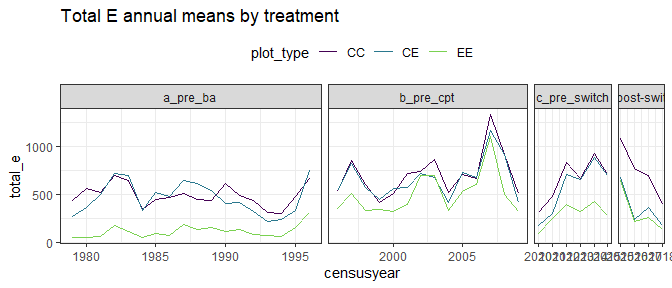<!-- -->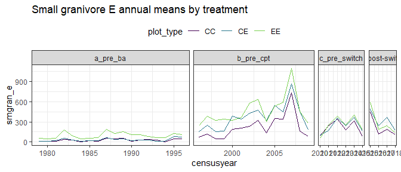<!-- -->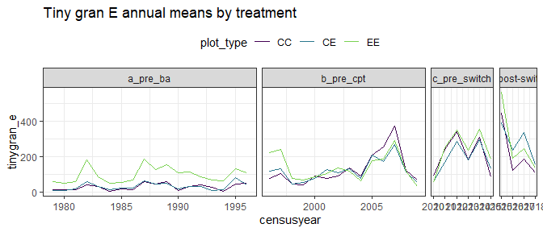<!-- -->

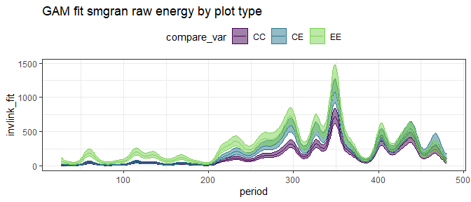<!-- -->

    ## Joining, by = "period"

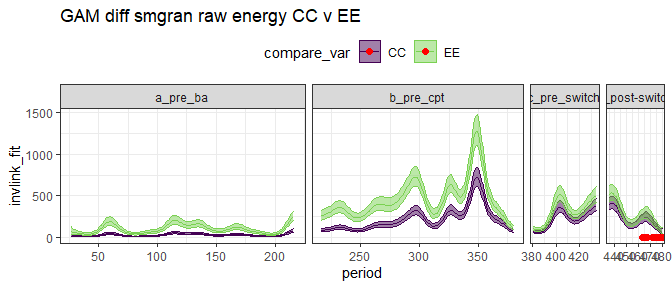<!-- -->

    ## Joining, by = "period"

    ## Scale for 'colour' is already present. Adding another scale for 'colour',
    ## which will replace the existing scale.

    ## Scale for 'fill' is already present. Adding another scale for 'fill', which
    ## will replace the existing scale.

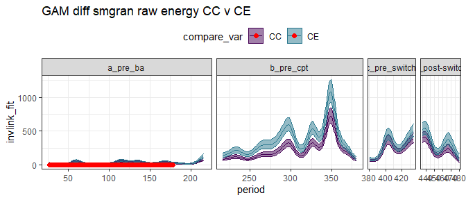<!-- -->

    ## Joining, by = "period"

    ## Scale for 'colour' is already present. Adding another scale for 'colour',
    ## which will replace the existing scale.

    ## Scale for 'fill' is already present. Adding another scale for 'fill', which
    ## will replace the existing scale.

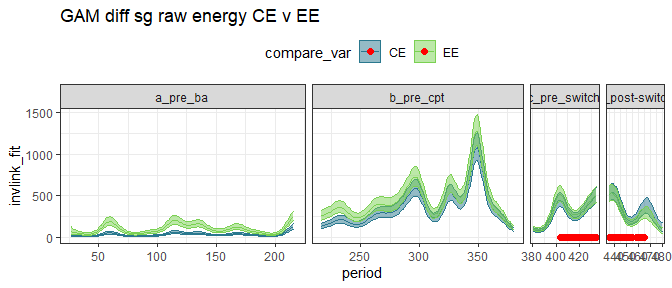<!-- -->

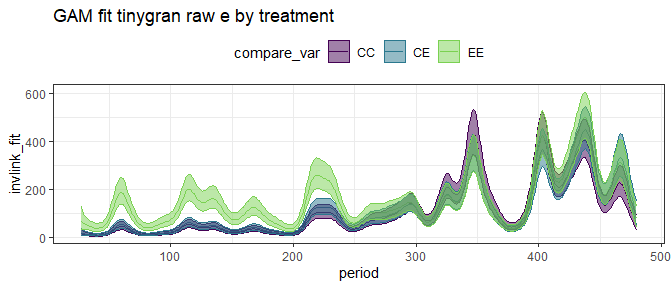<!-- -->

    ## Joining, by = "period"

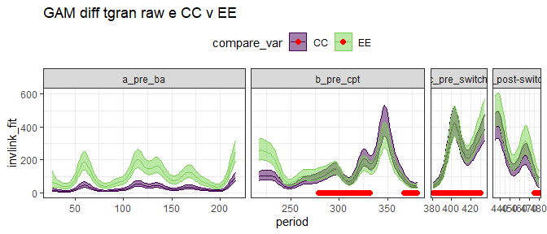<!-- -->

    ## Joining, by = "period"

    ## Scale for 'colour' is already present. Adding another scale for 'colour',
    ## which will replace the existing scale.

    ## Scale for 'fill' is already present. Adding another scale for 'fill', which
    ## will replace the existing scale.

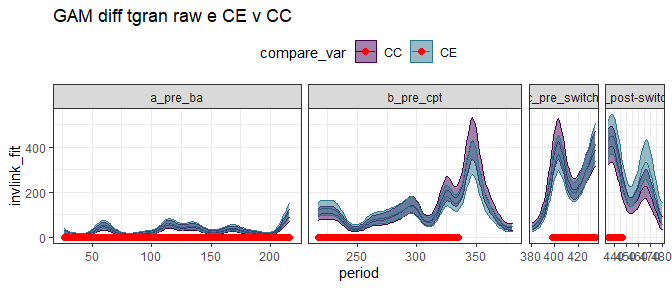<!-- -->

    ## Joining, by = "period"

    ## Scale for 'colour' is already present. Adding another scale for 'colour',
    ## which will replace the existing scale.

    ## Scale for 'fill' is already present. Adding another scale for 'fill', which
    ## will replace the existing scale.

<!-- -->

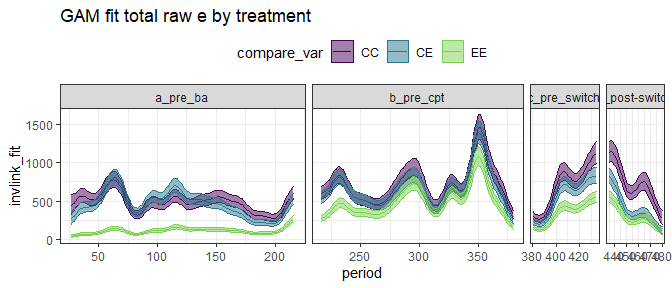<!-- -->

    ## Joining, by = "period"

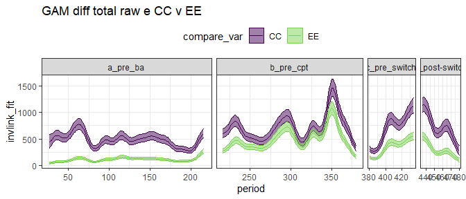<!-- -->

    ## Joining, by = "period"

    ## Scale for 'colour' is already present. Adding another scale for 'colour',
    ## which will replace the existing scale.

    ## Scale for 'fill' is already present. Adding another scale for 'fill', which
    ## will replace the existing scale.

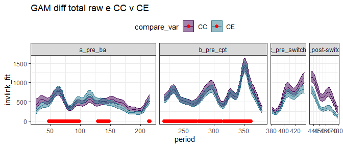<!-- -->

    ## Joining, by = "period"

    ## Scale for 'colour' is already present. Adding another scale for 'colour',
    ## which will replace the existing scale.

    ## Scale for 'fill' is already present. Adding another scale for 'fill', which
    ## will replace the existing scale.

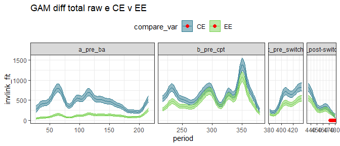<!-- -->

## Ratios

    ## Joining, by = "period"

    ## `summarise()` regrouping output by 'censusyear', 'era' (override with `.groups` argument)

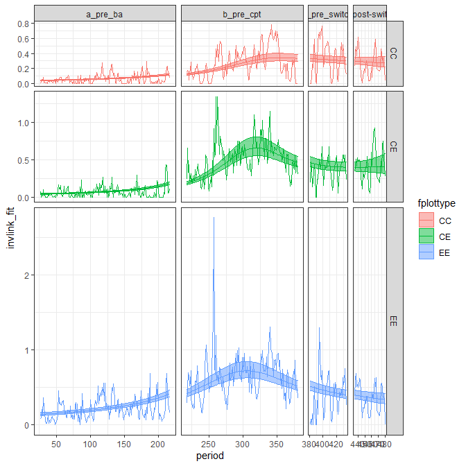<!-- -->

    ## Joining, by = "period"

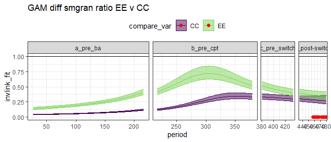<!-- -->

    ## Joining, by = "period"

    ## Scale for 'fill' is already present. Adding another scale for 'fill', which
    ## will replace the existing scale.

    ## Scale for 'colour' is already present. Adding another scale for 'colour',
    ## which will replace the existing scale.

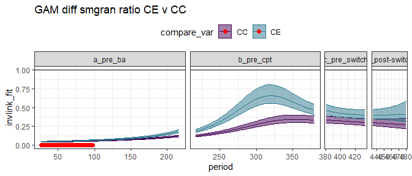<!-- -->

    ## Joining, by = "period"

    ## Scale for 'fill' is already present. Adding another scale for 'fill', which
    ## will replace the existing scale.

    ## Scale for 'colour' is already present. Adding another scale for 'colour',
    ## which will replace the existing scale.

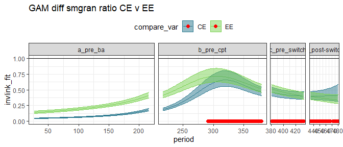<!-- -->

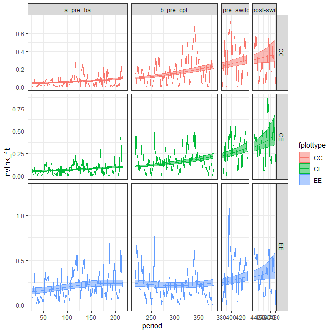<!-- -->

    ## Joining, by = "period"

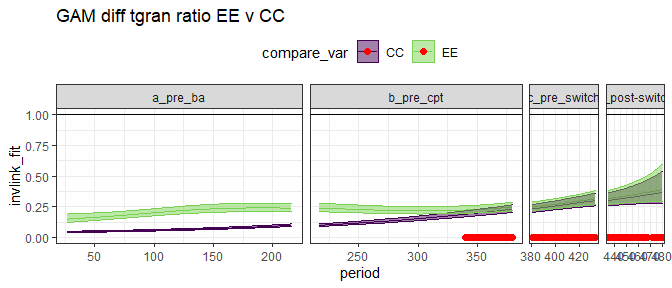<!-- -->

    ## Joining, by = "period"

    ## Scale for 'fill' is already present. Adding another scale for 'fill', which
    ## will replace the existing scale.

    ## Scale for 'colour' is already present. Adding another scale for 'colour',
    ## which will replace the existing scale.

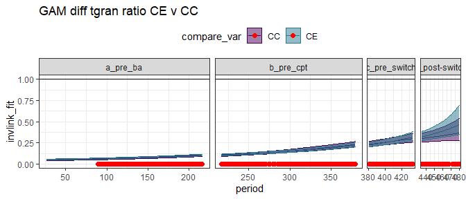<!-- -->

    ## Joining, by = "period"

    ## Scale for 'fill' is already present. Adding another scale for 'fill', which
    ## will replace the existing scale.

    ## Scale for 'colour' is already present. Adding another scale for 'colour',
    ## which will replace the existing scale.

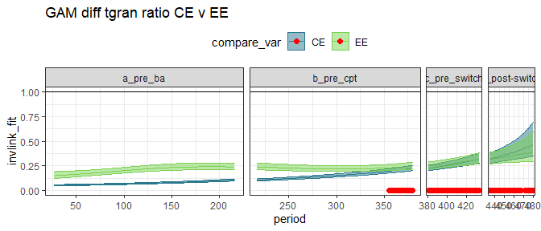<!-- -->

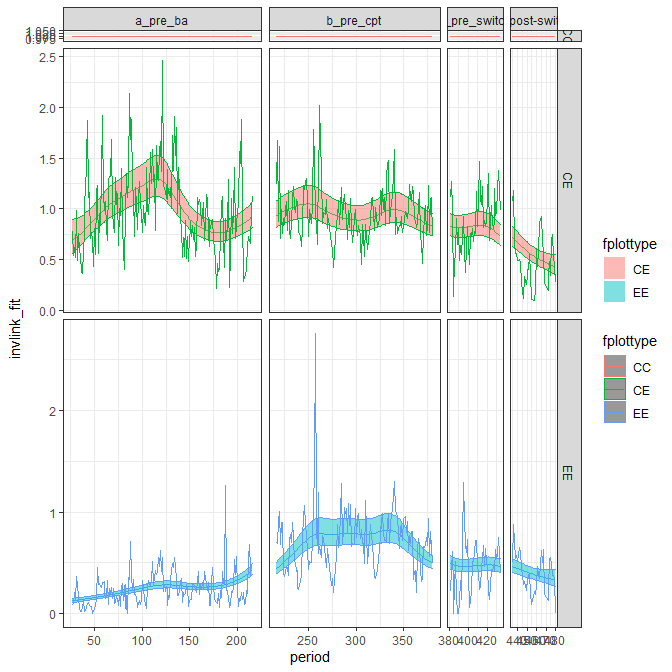<!-- -->

    ## Joining, by = "period"

    ## Scale for 'colour' is already present. Adding another scale for 'colour',
    ## which will replace the existing scale.

    ## Scale for 'fill' is already present. Adding another scale for 'fill', which
    ## will replace the existing scale.

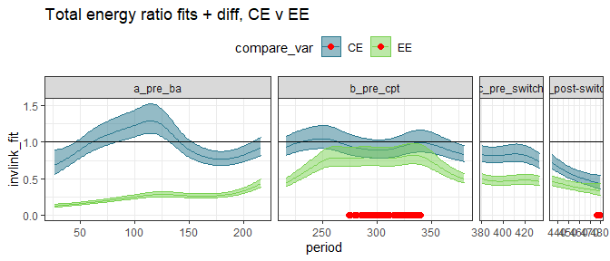<!-- -->

    ## Scale for 'colour' is already present. Adding another scale for 'colour',
    ## which will replace the existing scale.
    ## Scale for 'fill' is already present. Adding another scale for 'fill', which
    ## will replace the existing scale.

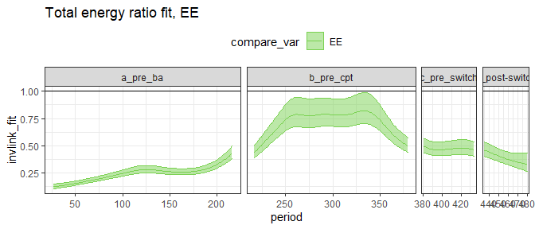<!-- -->

## By era

##### Era means:

    ## # A tibble: 12 x 5
    ##    era           oplottype total_e_mean smgran_e_mean tinygran_e_mean
    ##    <chr>         <fct>            <dbl>         <dbl>           <dbl>
    ##  1 a_pre_ba      CC                484.          28.4            28.4
    ##  2 a_pre_ba      CE                455.          32.5            32.3
    ##  3 a_pre_ba      EE                110.          98.8            98.8
    ##  4 b_pre_cpt     CC                718.         216.            128. 
    ##  5 b_pre_cpt     CE                672.         368.            120. 
    ##  6 b_pre_cpt     EE                511.         465.            139. 
    ##  7 c_pre_switch  CC                670.         243.            240. 
    ##  8 c_pre_switch  CE                573.         256.            206. 
    ##  9 c_pre_switch  EE                310.         281.            260. 
    ## 10 d_post-switch CC                747.         220.            220. 
    ## 11 d_post-switch CE                374.         323.            283. 
    ## 12 d_post-switch EE                326.         297.            291.

### gls on actual vals

##### Total energy raw GLS

    ## Warning: package 'lsmeans' was built under R version 4.0.3

    ## Loading required package: emmeans

    ## Warning: package 'emmeans' was built under R version 4.0.3

    ## The 'lsmeans' package is now basically a front end for 'emmeans'.
    ## Users are encouraged to switch the rest of the way.
    ## See help('transition') for more information, including how to
    ## convert old 'lsmeans' objects and scripts to work with 'emmeans'.

    ## era = a_pre_ba:
    ##  contrast estimate    SE  df t.ratio p.value
    ##  CC - CE      39.0  77.3 204 0.505   0.8689 
    ##  CC - EE     375.0  77.3 204 4.854   <.0001 
    ##  CE - EE     336.0  77.3 204 4.349   0.0001 
    ## 
    ## era = b_pre_cpt:
    ##  contrast estimate    SE  df t.ratio p.value
    ##  CC - CE      60.2  79.5 206 0.757   0.7297 
    ##  CC - EE     220.6  79.5 206 2.776   0.0165 
    ##  CE - EE     160.4  79.5 206 2.019   0.1101 
    ## 
    ## era = c_pre_switch:
    ##  contrast estimate    SE  df t.ratio p.value
    ##  CC - CE     131.9 117.5 209 1.123   0.5010 
    ##  CC - EE     313.3 117.5 209 2.666   0.0224 
    ##  CE - EE     181.3 117.5 209 1.543   0.2729 
    ## 
    ## era = d_post-switch:
    ##  contrast estimate    SE  df t.ratio p.value
    ##  CC - CE     258.0 136.3 208 1.892   0.1435 
    ##  CC - EE     413.0 136.3 209 3.029   0.0078 
    ##  CE - EE     155.0 136.3 208 1.137   0.4926 
    ## 
    ## Degrees-of-freedom method: satterthwaite 
    ## P value adjustment: tukey method for comparing a family of 3 estimates

##### Small gran raw GLS

    ## era = a_pre_ba:
    ##  contrast estimate    SE  df t.ratio p.value
    ##  CC - CE    -20.21  64.2 157 -0.315  0.9469 
    ##  CC - EE    -87.41  64.2 157 -1.361  0.3639 
    ##  CE - EE    -67.20  64.2 157 -1.046  0.5489 
    ## 
    ## era = b_pre_cpt:
    ##  contrast estimate    SE  df t.ratio p.value
    ##  CC - CE   -121.49  64.9 158 -1.871  0.1505 
    ##  CC - EE   -201.54  64.9 158 -3.104  0.0064 
    ##  CE - EE    -80.05  64.9 158 -1.233  0.4357 
    ## 
    ## era = c_pre_switch:
    ##  contrast estimate    SE  df t.ratio p.value
    ##  CC - CE    -41.82  92.3 160 -0.453  0.8930 
    ##  CC - EE    -61.15  92.3 160 -0.663  0.7853 
    ##  CE - EE    -19.33  92.3 160 -0.210  0.9761 
    ## 
    ## era = d_post-switch:
    ##  contrast estimate    SE  df t.ratio p.value
    ##  CC - CE    -95.12 108.8 160 -0.874  0.6575 
    ##  CC - EE    -89.29 108.8 160 -0.820  0.6910 
    ##  CE - EE      5.83 108.8 160  0.054  0.9984 
    ## 
    ## Degrees-of-freedom method: satterthwaite 
    ## P value adjustment: tukey method for comparing a family of 3 estimates

##### Tiny gran raw GLS

    ## era = a_pre_ba:
    ##  contrast estimate   SE  df t.ratio p.value
    ##  CC - CE     0.998 34.1 292  0.029  0.9995 
    ##  CC - EE   -63.185 34.1 292 -1.854  0.1541 
    ##  CE - EE   -64.183 34.1 292 -1.883  0.1453 
    ## 
    ## era = b_pre_cpt:
    ##  contrast estimate   SE  df t.ratio p.value
    ##  CC - CE     2.548 35.6 295  0.072  0.9972 
    ##  CC - EE   -15.798 35.6 295 -0.444  0.8972 
    ##  CE - EE   -18.346 35.6 295 -0.515  0.8639 
    ## 
    ## era = c_pre_switch:
    ##  contrast estimate   SE  df t.ratio p.value
    ##  CC - CE    18.608 54.8 299  0.340  0.9384 
    ##  CC - EE   -20.993 54.8 300 -0.383  0.9223 
    ##  CE - EE   -39.600 54.8 299 -0.723  0.7502 
    ## 
    ## era = d_post-switch:
    ##  contrast estimate   SE  df t.ratio p.value
    ##  CC - CE   -39.317 62.5 299 -0.629  0.8040 
    ##  CC - EE   -57.188 62.5 300 -0.916  0.6309 
    ##  CE - EE   -17.871 62.5 299 -0.286  0.9559 
    ## 
    ## Degrees-of-freedom method: satterthwaite 
    ## P value adjustment: tukey method for comparing a family of 3 estimates

### gls on ratios

##### Era ratios:

    ## # A tibble: 12 x 5
    ##    era           oplottype te_mean sg_mean tg_mean
    ##    <chr>         <fct>       <dbl>   <dbl>   <dbl>
    ##  1 a_pre_ba      CC          1.     0.0581  0.0581
    ##  2 a_pre_ba      CE          0.974  0.0651  0.0648
    ##  3 a_pre_ba      EE          0.238  0.212   0.212 
    ##  4 b_pre_cpt     CC          1.     0.269   0.164 
    ##  5 b_pre_cpt     CE          0.962  0.512   0.165 
    ##  6 b_pre_cpt     EE          0.726  0.658   0.194 
    ##  7 c_pre_switch  CC          1.     0.319   0.315 
    ##  8 c_pre_switch  CE          0.853  0.354   0.267 
    ##  9 c_pre_switch  EE          0.432  0.370   0.342 
    ## 10 d_post-switch CC          1.     0.271   0.271 
    ## 11 d_post-switch CE          0.484  0.435   0.383 
    ## 12 d_post-switch EE          0.404  0.373   0.367

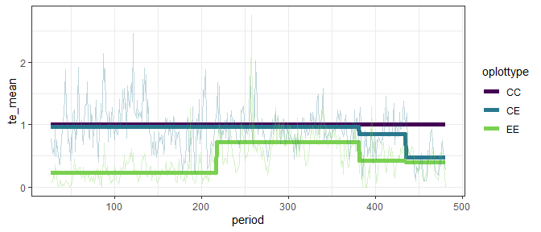<!-- -->

##### Total energy ratios GLS

This fit includes CC plots, for which ratio always = 1.

    ## era = a_pre_ba:
    ##  contrast estimate     SE  df t.ratio p.value
    ##  CC - CE    0.0274 0.0437 808  0.627  0.8053 
    ##  CC - EE    0.7606 0.0437 808 17.425  <.0001 
    ##  CE - EE    0.7333 0.0437 806 16.798  <.0001 
    ## 
    ## era = b_pre_cpt:
    ##  contrast estimate     SE  df t.ratio p.value
    ##  CC - CE    0.0482 0.0473 826  1.020  0.5644 
    ##  CC - EE    0.2853 0.0473 824  6.033  <.0001 
    ##  CE - EE    0.2370 0.0473 826  5.013  <.0001 
    ## 
    ## era = c_pre_switch:
    ##  contrast estimate     SE  df t.ratio p.value
    ##  CC - CE    0.1478 0.0794 829  1.860  0.1511 
    ##  CC - EE    0.5680 0.0794 833  7.150  <.0001 
    ##  CE - EE    0.4203 0.0794 831  5.290  <.0001 
    ## 
    ## era = d_post-switch:
    ##  contrast estimate     SE  df t.ratio p.value
    ##  CC - CE    0.5183 0.0881 839  5.884  <.0001 
    ##  CC - EE    0.6180 0.0881 844  7.015  <.0001 
    ##  CE - EE    0.0996 0.0881 843  1.131  0.4952 
    ## 
    ## Degrees-of-freedom method: satterthwaite 
    ## P value adjustment: tukey method for comparing a family of 3 estimates

This fit has CC plots removed.

    ## era = a_pre_ba:
    ##  contrast estimate     SE  df t.ratio p.value
    ##  CE - EE    0.7333 0.0535 521 13.715  <.0001 
    ## 
    ## era = b_pre_cpt:
    ##  contrast estimate     SE  df t.ratio p.value
    ##  CE - EE    0.2370 0.0579 530  4.093  <.0001 
    ## 
    ## era = c_pre_switch:
    ##  contrast estimate     SE  df t.ratio p.value
    ##  CE - EE    0.4203 0.0973 534  4.320  <.0001 
    ## 
    ## era = d_post-switch:
    ##  contrast estimate     SE  df t.ratio p.value
    ##  CE - EE    0.0996 0.1079 542  0.923  0.3562 
    ## 
    ## Degrees-of-freedom method: satterthwaite

    ## fplottype = CE:
    ##  contrast                       estimate     SE  df t.ratio p.value
    ##  a_pre_ba - b_pre_cpt             0.0209 0.0553 219  0.377  0.9817 
    ##  a_pre_ba - c_pre_switch          0.1204 0.0785 230  1.534  0.4190 
    ##  a_pre_ba - (d_post-switch)       0.4910 0.0851 226  5.767  <.0001 
    ##  b_pre_cpt - c_pre_switch         0.0995 0.0791 231  1.258  0.5905 
    ##  b_pre_cpt - (d_post-switch)      0.4701 0.0865 224  5.433  <.0001 
    ##  c_pre_switch - (d_post-switch)   0.3706 0.1001 237  3.701  0.0015 
    ## 
    ## fplottype = EE:
    ##  contrast                       estimate     SE  df t.ratio p.value
    ##  a_pre_ba - b_pre_cpt            -0.4754 0.0553 219 -8.593  <.0001 
    ##  a_pre_ba - c_pre_switch         -0.1926 0.0785 230 -2.454  0.0701 
    ##  a_pre_ba - (d_post-switch)      -0.1427 0.0851 225 -1.676  0.3390 
    ##  b_pre_cpt - c_pre_switch         0.2828 0.0791 231  3.574  0.0024 
    ##  b_pre_cpt - (d_post-switch)      0.3327 0.0865 223  3.845  0.0009 
    ##  c_pre_switch - (d_post-switch)   0.0499 0.1001 236  0.499  0.9593 
    ## 
    ## Degrees-of-freedom method: satterthwaite 
    ## P value adjustment: tukey method for comparing a family of 4 estimates

##### Smgran ratio GLS

    ## era = a_pre_ba:
    ##  contrast estimate     SE  df t.ratio p.value
    ##  CC - CE  -0.01349 0.0441 490 -0.306  0.9497 
    ##  CC - EE  -0.15812 0.0441 490 -3.586  0.0011 
    ##  CE - EE  -0.14463 0.0441 489 -3.280  0.0032 
    ## 
    ## era = b_pre_cpt:
    ##  contrast estimate     SE  df t.ratio p.value
    ##  CC - CE  -0.23416 0.0470 498 -4.980  <.0001 
    ##  CC - EE  -0.37151 0.0470 497 -7.902  <.0001 
    ##  CE - EE  -0.13735 0.0470 498 -2.921  0.0102 
    ## 
    ## era = c_pre_switch:
    ##  contrast estimate     SE  df t.ratio p.value
    ##  CC - CE  -0.04930 0.0765 503 -0.645  0.7955 
    ##  CC - EE  -0.05188 0.0765 505 -0.678  0.7762 
    ##  CE - EE  -0.00258 0.0765 504 -0.034  0.9994 
    ## 
    ## era = d_post-switch:
    ##  contrast estimate     SE  df t.ratio p.value
    ##  CC - CE  -0.15094 0.0853 506 -1.770  0.1807 
    ##  CC - EE  -0.08605 0.0853 508 -1.009  0.5714 
    ##  CE - EE   0.06489 0.0853 507  0.761  0.7271 
    ## 
    ## Degrees-of-freedom method: satterthwaite 
    ## P value adjustment: tukey method for comparing a family of 3 estimates

##### Tiny gran ratio GLS

    ## era = a_pre_ba:
    ##  contrast estimate     SE  df t.ratio p.value
    ##  CC - CE  -0.00358 0.0341 463 -0.105  0.9940 
    ##  CC - EE  -0.14620 0.0341 463 -4.281  0.0001 
    ##  CE - EE  -0.14261 0.0341 463 -4.177  0.0001 
    ## 
    ## era = b_pre_cpt:
    ##  contrast estimate     SE  df t.ratio p.value
    ##  CC - CE  -0.00424 0.0364 470 -0.117  0.9925 
    ##  CC - EE  -0.03228 0.0364 470 -0.888  0.6481 
    ##  CE - EE  -0.02804 0.0364 470 -0.772  0.7207 
    ## 
    ## era = c_pre_switch:
    ##  contrast estimate     SE  df t.ratio p.value
    ##  CC - CE   0.03737 0.0589 475  0.635  0.8010 
    ##  CC - EE  -0.03703 0.0589 477 -0.629  0.8043 
    ##  CE - EE  -0.07441 0.0589 476 -1.264  0.4165 
    ## 
    ## era = d_post-switch:
    ##  contrast estimate     SE  df t.ratio p.value
    ##  CC - CE  -0.08580 0.0657 478 -1.305  0.3930 
    ##  CC - EE  -0.07425 0.0657 480 -1.129  0.4964 
    ##  CE - EE   0.01155 0.0657 479  0.176  0.9831 
    ## 
    ## Degrees-of-freedom method: satterthwaite 
    ## P value adjustment: tukey method for comparing a family of 3 estimates

### glm on ratios

##### Total energy GLM

With controls:

    ## era = a_pre_ba:
    ##  contrast estimate     SE   df t.ratio p.value
    ##  CC - CE    0.0265 0.0396 1251  0.667  0.7824 
    ##  CC - EE    0.7622 0.0292 1251 26.106  <.0001 
    ##  CE - EE    0.7358 0.0285 1251 25.846  <.0001 
    ## 
    ## era = b_pre_cpt:
    ##  contrast estimate     SE   df t.ratio p.value
    ##  CC - CE    0.0384 0.0451 1251  0.851  0.6716 
    ##  CC - EE    0.2744 0.0402 1251  6.824  <.0001 
    ##  CE - EE    0.2360 0.0392 1251  6.020  <.0001 
    ## 
    ## era = c_pre_switch:
    ##  contrast estimate     SE   df t.ratio p.value
    ##  CC - CE    0.1471 0.0726 1251  2.026  0.1064 
    ##  CC - EE    0.5682 0.0602 1251  9.445  <.0001 
    ##  CE - EE    0.4211 0.0528 1251  7.976  <.0001 
    ## 
    ## era = d_post-switch:
    ##  contrast estimate     SE   df t.ratio p.value
    ##  CC - CE    0.5158 0.0704 1251  7.328  <.0001 
    ##  CC - EE    0.5962 0.0683 1251  8.727  <.0001 
    ##  CE - EE    0.0804 0.0399 1251  2.014  0.1092 
    ## 
    ## P value adjustment: tukey method for comparing a family of 3 estimates

Without controls:

    ## era = a_pre_ba:
    ##  contrast estimate     SE  df t.ratio p.value
    ##  CE - EE    0.7358 0.0349 834 21.103  <.0001 
    ## 
    ## era = b_pre_cpt:
    ##  contrast estimate     SE  df t.ratio p.value
    ##  CE - EE    0.2360 0.0480 834  4.915  <.0001 
    ## 
    ## era = c_pre_switch:
    ##  contrast estimate     SE  df t.ratio p.value
    ##  CE - EE    0.4211 0.0647 834  6.512  <.0001 
    ## 
    ## era = d_post-switch:
    ##  contrast estimate     SE  df t.ratio p.value
    ##  CE - EE    0.0804 0.0489 834  1.645  0.1004

##### Small granivore ratio GLM

    ## era = a_pre_ba:
    ##  contrast estimate      SE   df t.ratio p.value
    ##  CC - CE  -0.00697 0.00501 1251  -1.391 0.3461 
    ##  CC - EE  -0.15414 0.01265 1251 -12.184 <.0001 
    ##  CE - EE  -0.14717 0.01276 1251 -11.531 <.0001 
    ## 
    ## era = b_pre_cpt:
    ##  contrast estimate      SE   df t.ratio p.value
    ##  CC - CE  -0.24302 0.03810 1251  -6.379 <.0001 
    ##  CC - EE  -0.38926 0.04684 1251  -8.310 <.0001 
    ##  CE - EE  -0.14623 0.05493 1251  -2.662 0.0214 
    ## 
    ## era = c_pre_switch:
    ##  contrast estimate      SE   df t.ratio p.value
    ##  CC - CE  -0.03459 0.05329 1251  -0.649 0.7929 
    ##  CC - EE  -0.05060 0.05463 1251  -0.926 0.6238 
    ##  CE - EE  -0.01601 0.05723 1251  -0.280 0.9578 
    ## 
    ## era = d_post-switch:
    ##  contrast estimate      SE   df t.ratio p.value
    ##  CC - CE  -0.16423 0.06570 1251  -2.500 0.0336 
    ##  CC - EE  -0.10267 0.05915 1251  -1.736 0.1923 
    ##  CE - EE   0.06157 0.07352 1251   0.837 0.6798 
    ## 
    ## P value adjustment: tukey method for comparing a family of 3 estimates

##### Tiny granivore ratio GLM

    ## era = a_pre_ba:
    ##  contrast estimate      SE   df t.ratio p.value
    ##  CC - CE  -0.00671 0.00547 1251  -1.227 0.4377 
    ##  CC - EE  -0.15414 0.01383 1251 -11.145 <.0001 
    ##  CE - EE  -0.14743 0.01395 1251 -10.570 <.0001 
    ## 
    ## era = b_pre_cpt:
    ##  contrast estimate      SE   df t.ratio p.value
    ##  CC - CE  -0.00074 0.01678 1251  -0.044 0.9989 
    ##  CC - EE  -0.02937 0.01830 1251  -1.605 0.2439 
    ##  CE - EE  -0.02863 0.01833 1251  -1.562 0.2628 
    ## 
    ## era = c_pre_switch:
    ##  contrast estimate      SE   df t.ratio p.value
    ##  CC - CE   0.04785 0.05040 1251   0.949 0.6091 
    ##  CC - EE  -0.02769 0.05681 1251  -0.487 0.8773 
    ##  CE - EE  -0.07553 0.05303 1251  -1.424 0.3286 
    ## 
    ## era = d_post-switch:
    ##  contrast estimate      SE   df t.ratio p.value
    ##  CC - CE  -0.11203 0.06573 1251  -1.704 0.2039 
    ##  CC - EE  -0.09653 0.06397 1251  -1.509 0.2870 
    ##  CE - EE   0.01550 0.07437 1251   0.208 0.9764 
    ## 
    ## P value adjustment: tukey method for comparing a family of 3 estimates
