Energy plots
================

    ## Loading required package: nlme

    ## 
    ## Attaching package: 'nlme'

    ## The following object is masked from 'package:dplyr':
    ## 
    ##     collapse

    ## This is mgcv 1.8-33. For overview type 'help("mgcv-package")'.

    ## Loading in data version 2.49.0

    ## `summarise()` regrouping output by 'period', 'censusdate', 'era' (override with `.groups` argument)

    ## `summarise()` regrouping output by 'censusyear', 'plot', 'plot_type' (override with `.groups` argument)

    ## Loading in data version 2.49.0

    ## `summarise()` regrouping output by 'period', 'censusdate', 'era' (override with `.groups` argument)

    ## `summarise()` regrouping output by 'censusyear', 'plot_type', 'era' (override with `.groups` argument)

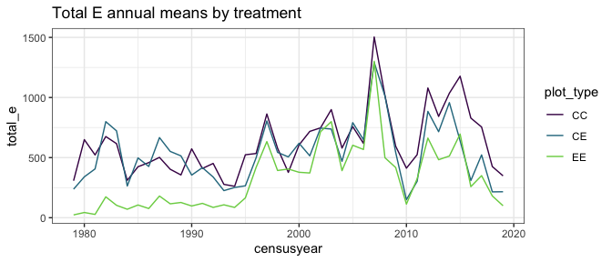<!-- -->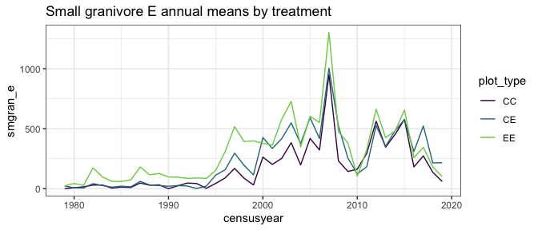<!-- -->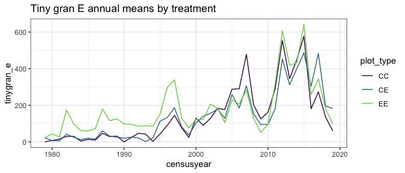<!-- -->

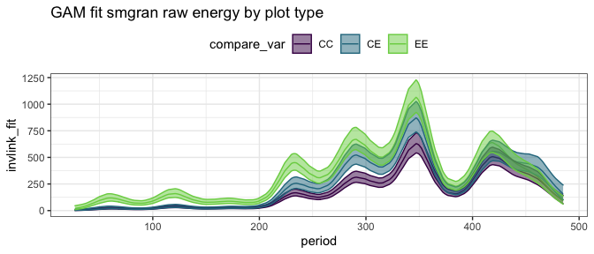<!-- -->

    ## Joining, by = "period"

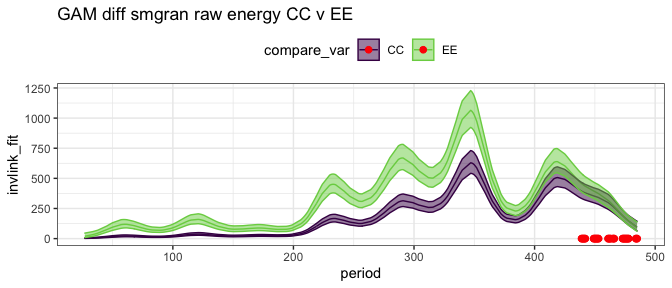<!-- -->

    ## Joining, by = "period"

    ## Scale for 'colour' is already present. Adding another scale for 'colour',
    ## which will replace the existing scale.

    ## Scale for 'fill' is already present. Adding another scale for 'fill', which
    ## will replace the existing scale.

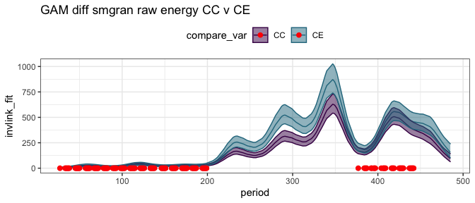<!-- -->

    ## Joining, by = "period"

    ## Scale for 'colour' is already present. Adding another scale for 'colour',
    ## which will replace the existing scale.

    ## Scale for 'fill' is already present. Adding another scale for 'fill', which
    ## will replace the existing scale.

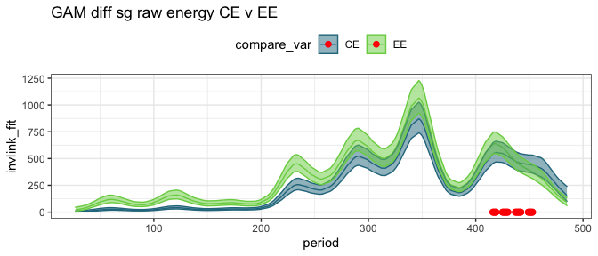<!-- -->

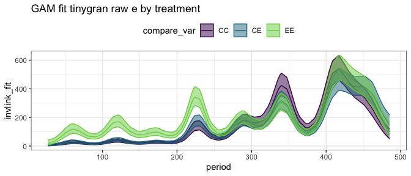<!-- -->

    ## Joining, by = "period"

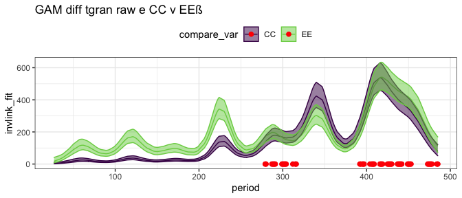<!-- -->

    ## Joining, by = "period"

    ## Scale for 'colour' is already present. Adding another scale for 'colour',
    ## which will replace the existing scale.

    ## Scale for 'fill' is already present. Adding another scale for 'fill', which
    ## will replace the existing scale.

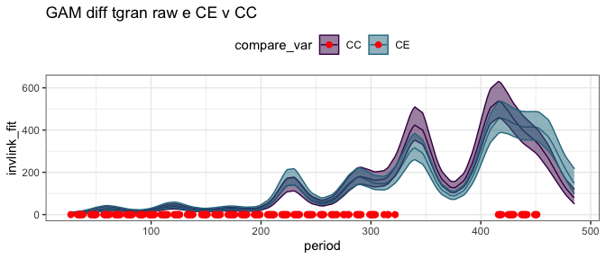<!-- -->

    ## Joining, by = "period"

    ## Scale for 'colour' is already present. Adding another scale for 'colour',
    ## which will replace the existing scale.

    ## Scale for 'fill' is already present. Adding another scale for 'fill', which
    ## will replace the existing scale.

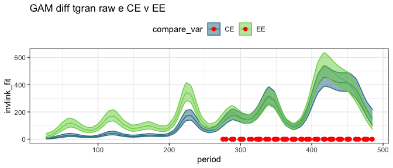<!-- -->

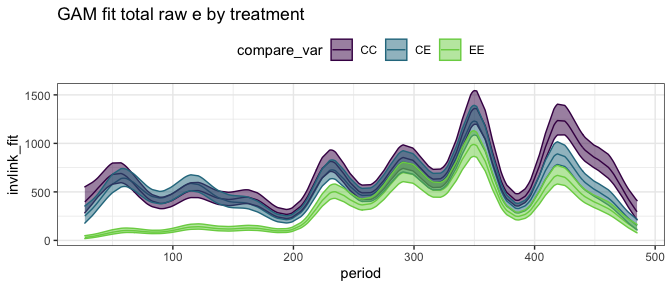<!-- -->

    ## Joining, by = "period"

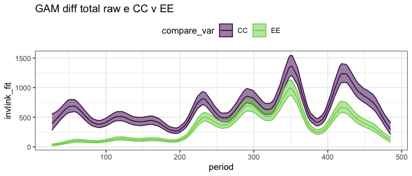<!-- -->

    ## Joining, by = "period"

    ## Scale for 'colour' is already present. Adding another scale for 'colour',
    ## which will replace the existing scale.

    ## Scale for 'fill' is already present. Adding another scale for 'fill', which
    ## will replace the existing scale.

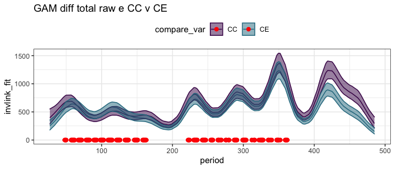<!-- -->

    ## Joining, by = "period"

    ## Scale for 'colour' is already present. Adding another scale for 'colour',
    ## which will replace the existing scale.

    ## Scale for 'fill' is already present. Adding another scale for 'fill', which
    ## will replace the existing scale.

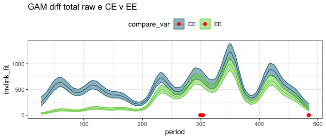<!-- -->

## Ratios

    ## Joining, by = "period"

    ## `summarise()` regrouping output by 'censusyear', 'era' (override with `.groups` argument)

    ## Joining, by = "period"

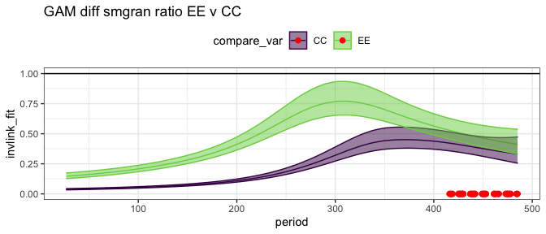<!-- -->

    ## Joining, by = "period"

    ## Scale for 'fill' is already present. Adding another scale for 'fill', which
    ## will replace the existing scale.

    ## Scale for 'colour' is already present. Adding another scale for 'colour',
    ## which will replace the existing scale.

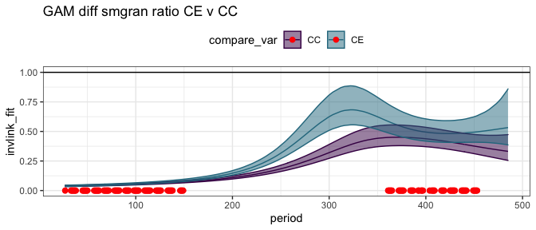<!-- -->

    ## Joining, by = "period"

    ## Scale for 'fill' is already present. Adding another scale for 'fill', which
    ## will replace the existing scale.

    ## Scale for 'colour' is already present. Adding another scale for 'colour',
    ## which will replace the existing scale.

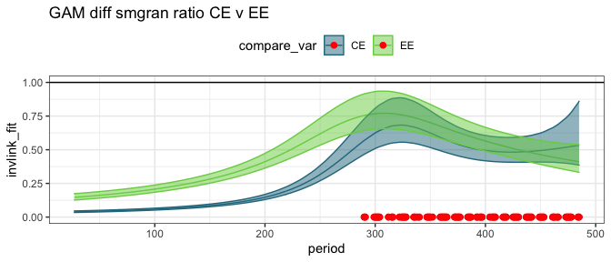<!-- -->

    ## Joining, by = "period"

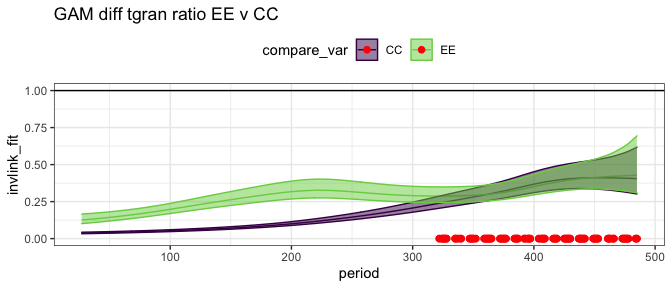<!-- -->

    ## Joining, by = "period"

    ## Scale for 'fill' is already present. Adding another scale for 'fill', which
    ## will replace the existing scale.

    ## Scale for 'colour' is already present. Adding another scale for 'colour',
    ## which will replace the existing scale.

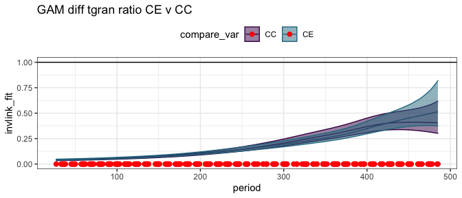<!-- -->

    ## Joining, by = "period"

    ## Scale for 'fill' is already present. Adding another scale for 'fill', which
    ## will replace the existing scale.

    ## Scale for 'colour' is already present. Adding another scale for 'colour',
    ## which will replace the existing scale.

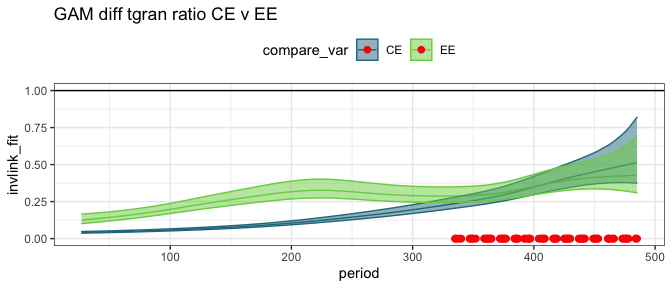<!-- -->

    ## Joining, by = "period"

    ## Scale for 'colour' is already present. Adding another scale for 'colour',
    ## which will replace the existing scale.

    ## Scale for 'fill' is already present. Adding another scale for 'fill', which
    ## will replace the existing scale.

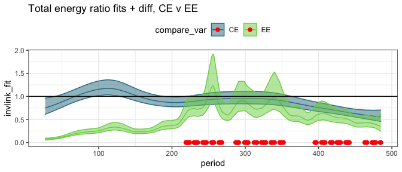<!-- -->

## By era

##### Era means:

    ## # A tibble: 12 x 5
    ##    era           oplottype total_e_mean smgran_e_mean tinygran_e_mean
    ##    <chr>         <fct>            <dbl>         <dbl>           <dbl>
    ##  1 a_pre_ba      CC                463.          24.2            24.2
    ##  2 a_pre_ba      CE                437.          29.3            29.3
    ##  3 a_pre_ba      EE                106.          98.7            98.7
    ##  4 b_pre_cpt     CC                744.         284.            175. 
    ##  5 b_pre_cpt     CE                694.         409.            162. 
    ##  6 b_pre_cpt     EE                593.         548.            201. 
    ##  7 c_pre_switch  CC                809.         311.            300. 
    ##  8 c_pre_switch  CE                689.         366.            239. 
    ##  9 c_pre_switch  EE                443.         420.            284. 
    ## 10 d_post-switch CC                760.         278.            278. 
    ## 11 d_post-switch CE                405.         389.            350. 
    ## 12 d_post-switch EE                354.         343.            339.

### gls on actual vals

##### Total energy raw GLS

    ## Loading required package: emmeans

    ## The 'lsmeans' package is now basically a front end for 'emmeans'.
    ## Users are encouraged to switch the rest of the way.
    ## See help('transition') for more information, including how to
    ## convert old 'lsmeans' objects and scripts to work with 'emmeans'.

    ## era = a_pre_ba:
    ##  contrast estimate    SE  df t.ratio p.value
    ##  CC - CE      14.3  88.4 179 0.162   0.9856 
    ##  CC - EE     348.9  88.4 179 3.945   0.0003 
    ##  CE - EE     334.6  88.4 179 3.783   0.0006 
    ## 
    ## era = b_pre_cpt:
    ##  contrast estimate    SE  df t.ratio p.value
    ##  CC - CE      53.0 103.2 181 0.513   0.8649 
    ##  CC - EE     164.0 103.2 181 1.589   0.2531 
    ##  CE - EE     111.0 103.2 181 1.075   0.5306 
    ## 
    ## era = c_pre_switch:
    ##  contrast estimate    SE  df t.ratio p.value
    ##  CC - CE      90.6 135.4 180 0.669   0.7818 
    ##  CC - EE     333.2 135.4 181 2.461   0.0391 
    ##  CE - EE     242.6 135.4 181 1.792   0.1752 
    ## 
    ## era = d_post-switch:
    ##  contrast estimate    SE  df t.ratio p.value
    ##  CC - CE     343.5 160.6 181 2.139   0.0850 
    ##  CC - EE     384.0 160.6 182 2.391   0.0467 
    ##  CE - EE      40.5 160.6 182 0.252   0.9656 
    ## 
    ## Degrees-of-freedom method: satterthwaite 
    ## P value adjustment: tukey method for comparing a family of 3 estimates

##### Small gran raw GLS

    ## era = a_pre_ba:
    ##  contrast estimate    SE  df t.ratio p.value
    ##  CC - CE     -8.99  70.0 153 -0.129  0.9909 
    ##  CC - EE    -73.46  70.0 153 -1.050  0.5465 
    ##  CE - EE    -64.47  70.0 153 -0.922  0.6275 
    ## 
    ## era = b_pre_cpt:
    ##  contrast estimate    SE  df t.ratio p.value
    ##  CC - CE   -121.82  81.3 155 -1.498  0.2947 
    ##  CC - EE   -248.57  81.3 155 -3.057  0.0074 
    ##  CE - EE   -126.75  81.3 155 -1.559  0.2668 
    ## 
    ## era = c_pre_switch:
    ##  contrast estimate    SE  df t.ratio p.value
    ##  CC - CE    -76.48 106.2 154 -0.720  0.7519 
    ##  CC - EE   -109.98 106.2 154 -1.036  0.5555 
    ##  CE - EE    -33.51 106.2 154 -0.316  0.9466 
    ## 
    ## era = d_post-switch:
    ##  contrast estimate    SE  df t.ratio p.value
    ##  CC - CE   -110.60 125.6 155 -0.880  0.6536 
    ##  CC - EE    -85.65 125.6 156 -0.682  0.7745 
    ##  CE - EE     24.95 125.6 155  0.199  0.9785 
    ## 
    ## Degrees-of-freedom method: satterthwaite 
    ## P value adjustment: tukey method for comparing a family of 3 estimates

##### Tiny gran raw GLS

    ## era = a_pre_ba:
    ##  contrast estimate   SE  df t.ratio p.value
    ##  CC - CE    -5.958 41.8 199 -0.143  0.9888 
    ##  CC - EE   -70.655 41.8 199 -1.692  0.2108 
    ##  CE - EE   -64.697 41.8 199 -1.549  0.2703 
    ## 
    ## era = b_pre_cpt:
    ##  contrast estimate   SE  df t.ratio p.value
    ##  CC - CE     8.150 49.0 202  0.166  0.9848 
    ##  CC - EE   -24.184 49.0 202 -0.494  0.8743 
    ##  CE - EE   -32.334 49.0 202 -0.660  0.7867 
    ## 
    ## era = c_pre_switch:
    ##  contrast estimate   SE  df t.ratio p.value
    ##  CC - CE    41.652 64.5 200  0.646  0.7949 
    ##  CC - EE    -2.257 64.5 201 -0.035  0.9993 
    ##  CE - EE   -43.909 64.5 201 -0.681  0.7749 
    ## 
    ## era = d_post-switch:
    ##  contrast estimate   SE  df t.ratio p.value
    ##  CC - CE   -73.389 76.8 202 -0.956  0.6058 
    ##  CC - EE   -72.585 76.8 204 -0.945  0.6124 
    ##  CE - EE     0.804 76.8 202  0.010  0.9999 
    ## 
    ## Degrees-of-freedom method: satterthwaite 
    ## P value adjustment: tukey method for comparing a family of 3 estimates

### gls on ratios

##### Era ratios:

    ## # A tibble: 12 x 5
    ##    era           oplottype te_mean sg_mean tg_mean
    ##    <chr>         <fct>       <dbl>   <dbl>   <dbl>
    ##  1 a_pre_ba      CC          1.     0.0543  0.0543
    ##  2 a_pre_ba      CE          0.972  0.0607  0.0607
    ##  3 a_pre_ba      EE          0.248  0.229   0.229 
    ##  4 b_pre_cpt     CC          1.     0.343   0.227 
    ##  5 b_pre_cpt     CE          0.968  0.544   0.223 
    ##  6 b_pre_cpt     EE          0.826  0.762   0.290 
    ##  7 c_pre_switch  CC          1.     0.376   0.364 
    ##  8 c_pre_switch  CE          0.813  0.433   0.282 
    ##  9 c_pre_switch  EE          0.554  0.525   0.348 
    ## 10 d_post-switch CC          1.     0.335   0.335 
    ## 11 d_post-switch CE          0.546  0.532   0.480 
    ## 12 d_post-switch EE          0.444  0.433   0.430

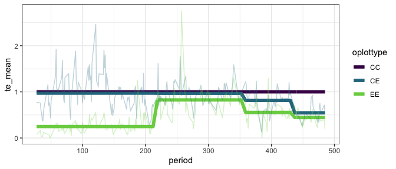<!-- -->

##### Total energy ratios GLS

This fit includes CC plots, for which ratio always = 1.

    ## era = a_pre_ba:
    ##  contrast  estimate     SE  df t.ratio p.value
    ##  CC - CE  -9.32e-05 0.0572 415 -0.002  1.0000 
    ##  CC - EE   7.45e-01 0.0572 412 13.032  <.0001 
    ##  CE - EE   7.45e-01 0.0572 414 13.033  <.0001 
    ## 
    ## era = b_pre_cpt:
    ##  contrast  estimate     SE  df t.ratio p.value
    ##  CC - CE   4.05e-02 0.0685 429  0.591  0.8252 
    ##  CC - EE   1.88e-01 0.0685 431  2.748  0.0171 
    ##  CE - EE   1.48e-01 0.0685 430  2.158  0.0798 
    ## 
    ## era = c_pre_switch:
    ##  contrast  estimate     SE  df t.ratio p.value
    ##  CC - CE   1.92e-01 0.0904 417  2.121  0.0868 
    ##  CC - EE   4.39e-01 0.0904 423  4.862  <.0001 
    ##  CE - EE   2.48e-01 0.0904 422  2.741  0.0175 
    ## 
    ## era = d_post-switch:
    ##  contrast  estimate     SE  df t.ratio p.value
    ##  CC - CE   4.55e-01 0.1102 425  4.130  0.0001 
    ##  CC - EE   5.66e-01 0.1102 430  5.136  <.0001 
    ##  CE - EE   1.11e-01 0.1102 426  1.006  0.5737 
    ## 
    ## Degrees-of-freedom method: satterthwaite 
    ## P value adjustment: tukey method for comparing a family of 3 estimates

This fit has CC plots removed.

    ## era = a_pre_ba:
    ##  contrast estimate     SE  df t.ratio p.value
    ##  CE - EE     0.745 0.0700 265 10.642  <.0001 
    ## 
    ## era = b_pre_cpt:
    ##  contrast estimate     SE  df t.ratio p.value
    ##  CE - EE     0.148 0.0839 272  1.762  0.0792 
    ## 
    ## era = c_pre_switch:
    ##  contrast estimate     SE  df t.ratio p.value
    ##  CE - EE     0.248 0.1107 271  2.238  0.0260 
    ## 
    ## era = d_post-switch:
    ##  contrast estimate     SE  df t.ratio p.value
    ##  CE - EE     0.111 0.1350 272  0.821  0.4123 
    ## 
    ## Degrees-of-freedom method: satterthwaite

##### Smgran ratio GLS

    ## era = a_pre_ba:
    ##  contrast estimate     SE  df t.ratio p.value
    ##  CC - CE   -0.0100 0.0536 284 -0.187  0.9809 
    ##  CC - EE   -0.1749 0.0536 282 -3.261  0.0036 
    ##  CE - EE   -0.1649 0.0536 283 -3.074  0.0065 
    ## 
    ## era = b_pre_cpt:
    ##  contrast estimate     SE  df t.ratio p.value
    ##  CC - CE   -0.2162 0.0636 290 -3.400  0.0022 
    ##  CC - EE   -0.4154 0.0636 291 -6.534  <.0001 
    ##  CE - EE   -0.1993 0.0636 290 -3.134  0.0054 
    ## 
    ## era = c_pre_switch:
    ##  contrast estimate     SE  df t.ratio p.value
    ##  CC - CE   -0.0613 0.0841 284 -0.729  0.7466 
    ##  CC - EE   -0.1561 0.0841 287 -1.857  0.1534 
    ##  CE - EE   -0.0949 0.0841 287 -1.128  0.4977 
    ## 
    ## era = d_post-switch:
    ##  contrast estimate     SE  df t.ratio p.value
    ##  CC - CE   -0.2161 0.1014 289 -2.132  0.0853 
    ##  CC - EE   -0.1111 0.1014 293 -1.096  0.5174 
    ##  CE - EE    0.1050 0.1014 290  1.036  0.5549 
    ## 
    ## Degrees-of-freedom method: satterthwaite 
    ## P value adjustment: tukey method for comparing a family of 3 estimates

##### Tiny gran ratio GLS

    ## era = a_pre_ba:
    ##  contrast  estimate     SE  df t.ratio p.value
    ##  CC - CE  -9.05e-03 0.0389 311 -0.233  0.9706 
    ##  CC - EE  -1.74e-01 0.0389 309 -4.462  <.0001 
    ##  CE - EE  -1.65e-01 0.0389 310 -4.230  0.0001 
    ## 
    ## era = b_pre_cpt:
    ##  contrast  estimate     SE  df t.ratio p.value
    ##  CC - CE   1.36e-05 0.0462 319  0.000  1.0000 
    ##  CC - EE  -5.21e-02 0.0462 320 -1.128  0.4978 
    ##  CE - EE  -5.22e-02 0.0462 319 -1.128  0.4976 
    ## 
    ## era = c_pre_switch:
    ##  contrast  estimate     SE  df t.ratio p.value
    ##  CC - CE   7.67e-02 0.0612 312  1.253  0.4229 
    ##  CC - EE   1.81e-03 0.0612 315  0.030  0.9995 
    ##  CE - EE  -7.48e-02 0.0612 315 -1.224  0.4401 
    ## 
    ## era = d_post-switch:
    ##  contrast  estimate     SE  df t.ratio p.value
    ##  CC - CE  -1.59e-01 0.0739 317 -2.149  0.0818 
    ##  CC - EE  -1.06e-01 0.0739 321 -1.431  0.3261 
    ##  CE - EE   5.31e-02 0.0739 318  0.718  0.7532 
    ## 
    ## Degrees-of-freedom method: satterthwaite 
    ## P value adjustment: tukey method for comparing a family of 3 estimates

### glm on ratios

##### Total energy GLM

With controls:

    ## era = a_pre_ba:
    ##  contrast estimate     SE  df t.ratio p.value
    ##  CC - CE    0.0283 0.0535 648  0.529  0.8570 
    ##  CC - EE    0.7518 0.0395 648 19.016  <.0001 
    ##  CE - EE    0.7235 0.0385 648 18.801  <.0001 
    ## 
    ## era = b_pre_cpt:
    ##  contrast estimate     SE  df t.ratio p.value
    ##  CC - CE    0.0323 0.0686 648  0.472  0.8847 
    ##  CC - EE    0.1744 0.0639 648  2.729  0.0179 
    ##  CE - EE    0.1421 0.0627 648  2.266  0.0614 
    ## 
    ## era = c_pre_switch:
    ##  contrast estimate     SE  df t.ratio p.value
    ##  CC - CE    0.1867 0.0809 648  2.307  0.0555 
    ##  CC - EE    0.4455 0.0718 648  6.208  <.0001 
    ##  CE - EE    0.2588 0.0618 648  4.190  0.0001 
    ## 
    ## era = d_post-switch:
    ##  contrast estimate     SE  df t.ratio p.value
    ##  CC - CE    0.4541 0.0888 648  5.114  <.0001 
    ##  CC - EE    0.5564 0.0853 648  6.526  <.0001 
    ##  CE - EE    0.1023 0.0548 648  1.866  0.1495 
    ## 
    ## P value adjustment: tukey method for comparing a family of 3 estimates

Without controls:

    ## era = a_pre_ba:
    ##  contrast estimate     SE  df t.ratio p.value
    ##  CE - EE     0.723 0.0471 432 15.351  <.0001 
    ## 
    ## era = b_pre_cpt:
    ##  contrast estimate     SE  df t.ratio p.value
    ##  CE - EE     0.142 0.0768 432  1.850  0.0649 
    ## 
    ## era = c_pre_switch:
    ##  contrast estimate     SE  df t.ratio p.value
    ##  CE - EE     0.259 0.0757 432  3.421  0.0007 
    ## 
    ## era = d_post-switch:
    ##  contrast estimate     SE  df t.ratio p.value
    ##  CE - EE     0.102 0.0671 432  1.523  0.1284

##### Small granivore ratio GLM

    ## era = a_pre_ba:
    ##  contrast estimate     SE  df t.ratio p.value
    ##  CC - CE  -0.00639 0.0065 648 -0.983  0.5876 
    ##  CC - EE  -0.17468 0.0188 648 -9.296  <.0001 
    ##  CE - EE  -0.16828 0.0189 648 -8.897  <.0001 
    ## 
    ## era = b_pre_cpt:
    ##  contrast estimate     SE  df t.ratio p.value
    ##  CC - CE  -0.20064 0.0659 648 -3.043  0.0069 
    ##  CC - EE  -0.41873 0.0857 648 -4.887  <.0001 
    ##  CE - EE  -0.21809 0.0960 648 -2.272  0.0605 
    ## 
    ## era = c_pre_switch:
    ##  contrast estimate     SE  df t.ratio p.value
    ##  CC - CE  -0.05702 0.0749 648 -0.761  0.7272 
    ##  CC - EE  -0.14887 0.0844 648 -1.764  0.1825 
    ##  CE - EE  -0.09184 0.0889 648 -1.033  0.5563 
    ## 
    ## era = d_post-switch:
    ##  contrast estimate     SE  df t.ratio p.value
    ##  CC - CE  -0.19763 0.1020 648 -1.937  0.1291 
    ##  CC - EE  -0.09814 0.0888 648 -1.105  0.5110 
    ##  CE - EE   0.09949 0.1113 648  0.894  0.6444 
    ## 
    ## P value adjustment: tukey method for comparing a family of 3 estimates

##### Tiny granivore ratio GLM

    ## era = a_pre_ba:
    ##  contrast estimate      SE  df t.ratio p.value
    ##  CC - CE  -0.00639 0.00678 648 -0.944  0.6128 
    ##  CC - EE  -0.17468 0.01958 648 -8.921  <.0001 
    ##  CE - EE  -0.16828 0.01971 648 -8.537  <.0001 
    ## 
    ## era = b_pre_cpt:
    ##  contrast estimate      SE  df t.ratio p.value
    ##  CC - CE   0.00420 0.03403 648  0.124  0.9916 
    ##  CC - EE  -0.06293 0.03939 648 -1.598  0.2473 
    ##  CE - EE  -0.06714 0.03911 648 -1.717  0.1997 
    ## 
    ## era = c_pre_switch:
    ##  contrast estimate      SE  df t.ratio p.value
    ##  CC - CE   0.08245 0.06266 648  1.316  0.3868 
    ##  CC - EE   0.01625 0.06854 648  0.237  0.9695 
    ##  CE - EE  -0.06619 0.06092 648 -1.087  0.5228 
    ## 
    ## era = d_post-switch:
    ##  contrast estimate      SE  df t.ratio p.value
    ##  CC - CE  -0.14492 0.09888 648 -1.466  0.3082 
    ##  CC - EE  -0.09529 0.09213 648 -1.034  0.5554 
    ##  CE - EE   0.04962 0.10890 648  0.456  0.8919 
    ## 
    ## P value adjustment: tukey method for comparing a family of 3 estimates
