Energy plots
================

    ## Loading required package: nlme

    ## 
    ## Attaching package: 'nlme'

    ## The following object is masked from 'package:dplyr':
    ## 
    ##     collapse

    ## This is mgcv 1.8-33. For overview type 'help("mgcv-package")'.

    ## Loading in data version 2.49.0

    ## `summarise()` regrouping output by 'treatment', 'plot', 'species', 'wateryear' (override with `.groups` argument)

    ## `summarise()` regrouping output by 'treatment', 'plot', 'species' (override with `.groups` argument)

    ## Joining, by = c("plot", "wateryear")

    ## Joining, by = c("treatment", "plot", "wateryear")

    ## `summarise()` regrouping output by 'wateryear', 'era' (override with `.groups` argument)

    ## Loading in data version 2.49.0

    ## `summarise()` regrouping output by 'treatment', 'plot', 'species', 'wateryear' (override with `.groups` argument)

    ## `summarise()` regrouping output by 'treatment', 'plot', 'species' (override with `.groups` argument)

    ## Joining, by = c("plot", "wateryear")

    ## Joining, by = c("treatment", "plot", "wateryear")

    ## `summarise()` regrouping output by 'wateryear', 'era' (override with `.groups` argument)

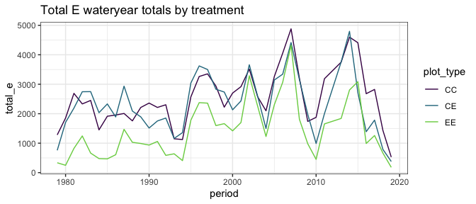<!-- -->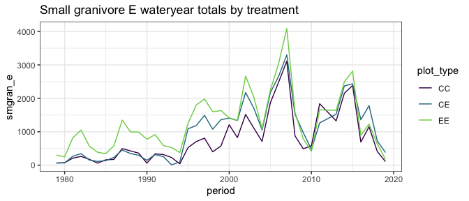<!-- -->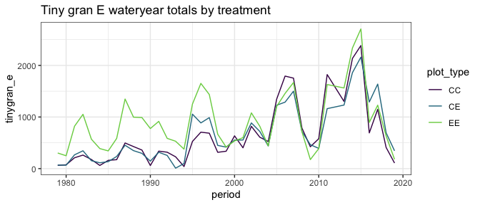<!-- -->

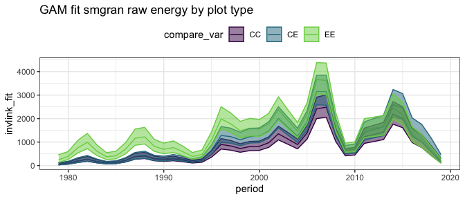<!-- -->

    ## Joining, by = "period"

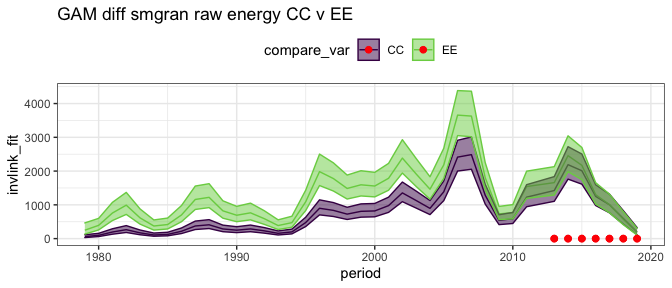<!-- -->

    ## Joining, by = "period"

    ## Scale for 'colour' is already present. Adding another scale for 'colour',
    ## which will replace the existing scale.

    ## Scale for 'fill' is already present. Adding another scale for 'fill', which
    ## will replace the existing scale.

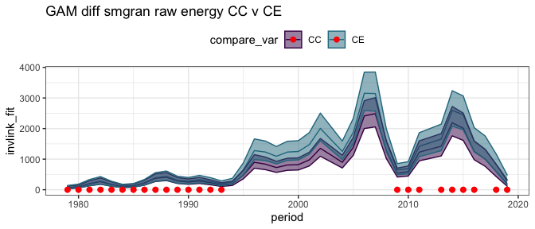<!-- -->

    ## Joining, by = "period"

    ## Scale for 'colour' is already present. Adding another scale for 'colour',
    ## which will replace the existing scale.

    ## Scale for 'fill' is already present. Adding another scale for 'fill', which
    ## will replace the existing scale.

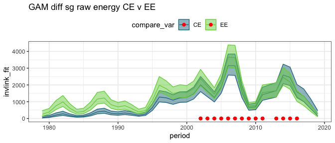<!-- -->

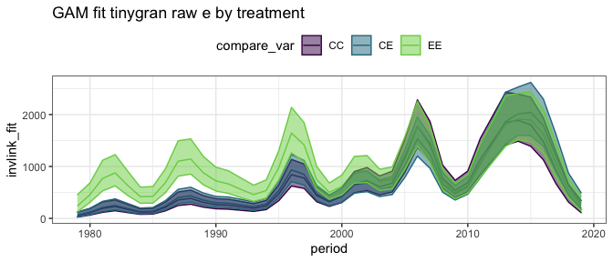<!-- -->

    ## Joining, by = "period"

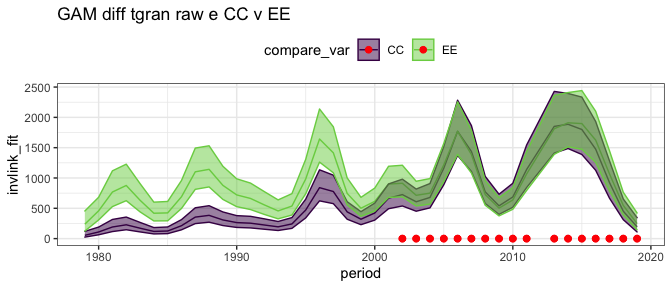<!-- -->

    ## Joining, by = "period"

    ## Scale for 'colour' is already present. Adding another scale for 'colour',
    ## which will replace the existing scale.

    ## Scale for 'fill' is already present. Adding another scale for 'fill', which
    ## will replace the existing scale.

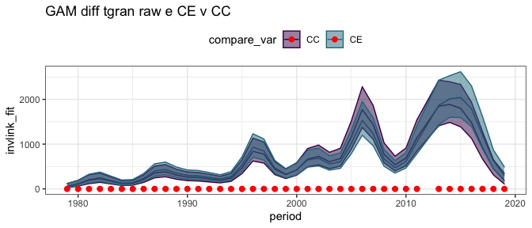<!-- -->

    ## Joining, by = "period"

    ## Scale for 'colour' is already present. Adding another scale for 'colour',
    ## which will replace the existing scale.

    ## Scale for 'fill' is already present. Adding another scale for 'fill', which
    ## will replace the existing scale.

<!-- -->

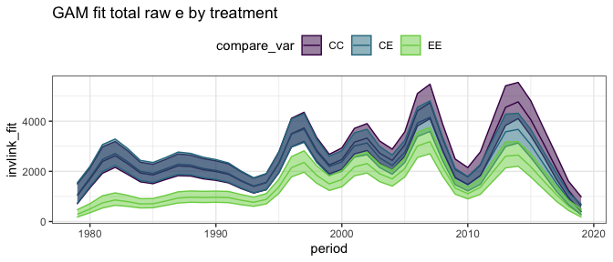<!-- -->

    ## Joining, by = "period"

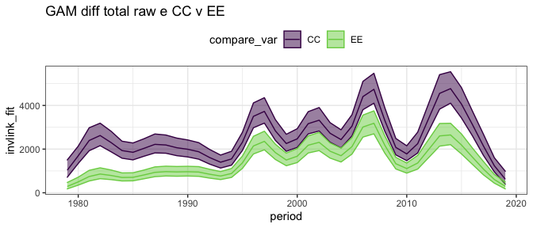<!-- -->

    ## Joining, by = "period"

    ## Scale for 'colour' is already present. Adding another scale for 'colour',
    ## which will replace the existing scale.

    ## Scale for 'fill' is already present. Adding another scale for 'fill', which
    ## will replace the existing scale.

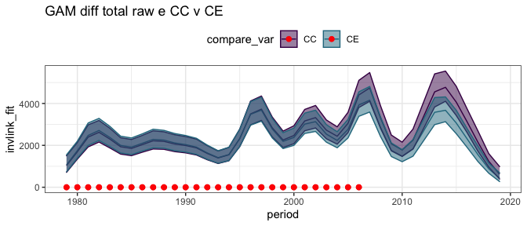<!-- -->

    ## Joining, by = "period"

    ## Scale for 'colour' is already present. Adding another scale for 'colour',
    ## which will replace the existing scale.

    ## Scale for 'fill' is already present. Adding another scale for 'fill', which
    ## will replace the existing scale.

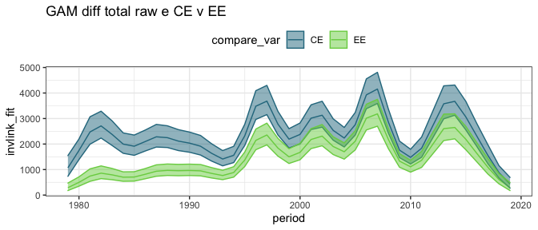<!-- -->

## Ratios

    ## Joining, by = "period"

    ## Joining, by = "period"

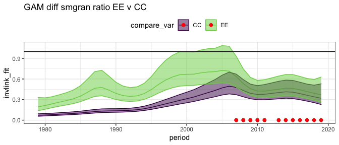<!-- -->

    ## Joining, by = "period"

    ## Scale for 'fill' is already present. Adding another scale for 'fill', which
    ## will replace the existing scale.

    ## Scale for 'colour' is already present. Adding another scale for 'colour',
    ## which will replace the existing scale.

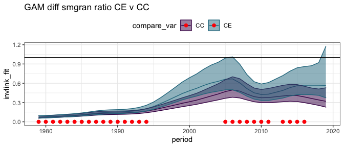<!-- -->

    ## Joining, by = "period"

    ## Scale for 'fill' is already present. Adding another scale for 'fill', which
    ## will replace the existing scale.

    ## Scale for 'colour' is already present. Adding another scale for 'colour',
    ## which will replace the existing scale.

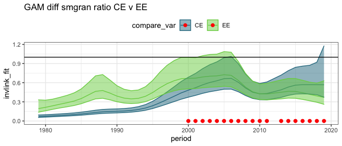<!-- -->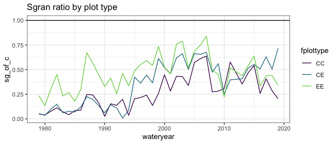<!-- -->

    ## Joining, by = "period"

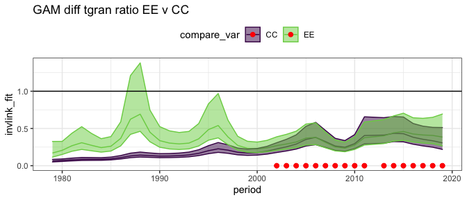<!-- -->

    ## Joining, by = "period"

    ## Scale for 'fill' is already present. Adding another scale for 'fill', which
    ## will replace the existing scale.

    ## Scale for 'colour' is already present. Adding another scale for 'colour',
    ## which will replace the existing scale.

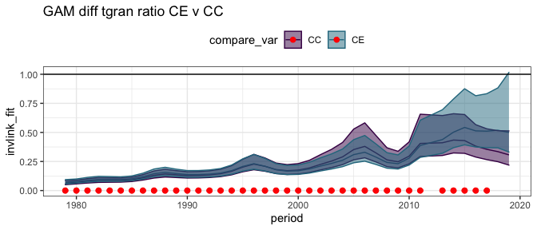<!-- -->

    ## Joining, by = "period"

    ## Scale for 'fill' is already present. Adding another scale for 'fill', which
    ## will replace the existing scale.

    ## Scale for 'colour' is already present. Adding another scale for 'colour',
    ## which will replace the existing scale.

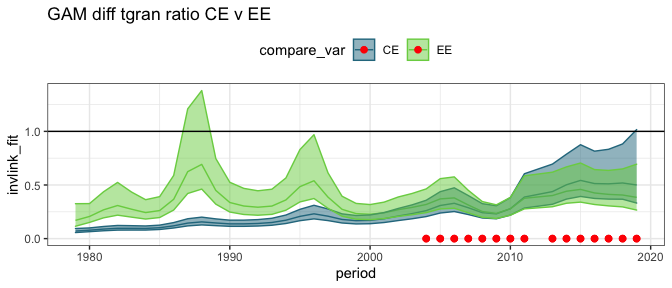<!-- -->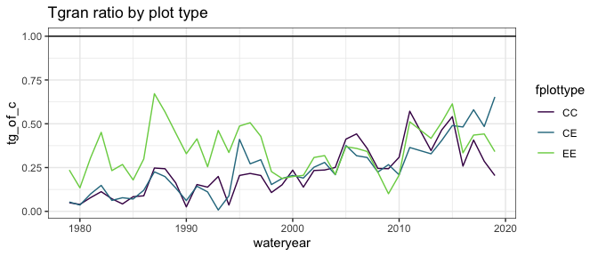<!-- -->

    ## Joining, by = "period"

    ## Scale for 'colour' is already present. Adding another scale for 'colour',
    ## which will replace the existing scale.

    ## Scale for 'fill' is already present. Adding another scale for 'fill', which
    ## will replace the existing scale.

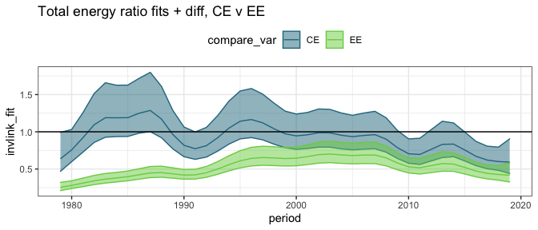<!-- -->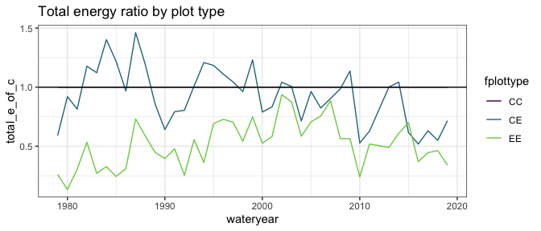<!-- -->

## By era

##### Era means:

    ## # A tibble: 12 x 5
    ##    era           oplottype total_e_mean smgran_e_mean tinygran_e_mean
    ##    <chr>         <fct>            <dbl>         <dbl>           <dbl>
    ##  1 a_pre_ba      CC               1978.          234.            234.
    ##  2 a_pre_ba      CE               2000.          259.            257.
    ##  3 a_pre_ba      EE                810.          711.            711.
    ##  4 b_pre_cpt     CC               3052.         1191.            796.
    ##  5 b_pre_cpt     CE               2932.         1672.            792.
    ##  6 b_pre_cpt     EE               2169.         1949.            919.
    ##  7 c_pre_switch  CC               3353.         1474.           1460.
    ##  8 c_pre_switch  CE               2886.         1408.           1161.
    ##  9 c_pre_switch  EE               1687.         1551.           1479.
    ## 10 d_post-switch CC               2375.          948.            948.
    ## 11 d_post-switch CE               1411.         1335.           1225.
    ## 12 d_post-switch EE               1236.         1150.           1129.

### gls on actual vals

##### Total energy raw GLS

    ## Loading required package: emmeans

    ## The 'lsmeans' package is now basically a front end for 'emmeans'.
    ## Users are encouraged to switch the rest of the way.
    ## See help('transition') for more information, including how to
    ## convert old 'lsmeans' objects and scripts to work with 'emmeans'.

    ## era = a_pre_ba:
    ##  contrast estimate  SE   df t.ratio p.value
    ##  CC - CE     -3.38 529 47.8 -0.006  1.0000 
    ##  CC - EE   1110.39 529 47.9  2.099  0.1008 
    ##  CE - EE   1113.77 529 47.6  2.105  0.0995 
    ## 
    ## era = b_pre_cpt:
    ##  contrast estimate  SE   df t.ratio p.value
    ##  CC - CE    -11.52 560 48.9 -0.021  0.9998 
    ##  CC - EE    938.95 560 48.9  1.678  0.2238 
    ##  CE - EE    950.47 560 48.9  1.699  0.2159 
    ## 
    ## era = c_pre_switch:
    ##  contrast estimate  SE   df t.ratio p.value
    ##  CC - CE    352.87 790 60.1  0.447  0.8961 
    ##  CC - EE   1609.23 790 61.8  2.037  0.1120 
    ##  CE - EE   1256.36 790 60.1  1.590  0.2577 
    ## 
    ## era = d_post-switch:
    ##  contrast estimate  SE   df t.ratio p.value
    ##  CC - CE   1254.35 834 52.4  1.505  0.2971 
    ##  CC - EE   1029.25 834 53.3  1.235  0.4384 
    ##  CE - EE   -225.10 834 53.3 -0.270  0.9606 
    ## 
    ## Degrees-of-freedom method: satterthwaite 
    ## P value adjustment: tukey method for comparing a family of 3 estimates

##### Small gran raw GLS

    ## era = a_pre_ba:
    ##  contrast estimate  SE   df t.ratio p.value
    ##  CC - CE    -69.61 366 64.3 -0.190  0.9802 
    ##  CC - EE   -456.62 366 64.5 -1.249  0.4293 
    ##  CE - EE   -387.02 366 64.1 -1.058  0.5432 
    ## 
    ## era = b_pre_cpt:
    ##  contrast estimate  SE   df t.ratio p.value
    ##  CC - CE   -441.61 392 65.6 -1.127  0.5008 
    ##  CC - EE   -747.27 392 65.6 -1.908  0.1446 
    ##  CE - EE   -305.66 392 65.6 -0.780  0.7164 
    ## 
    ## era = c_pre_switch:
    ##  contrast estimate  SE   df t.ratio p.value
    ##  CC - CE     -7.86 579 79.8 -0.014  0.9999 
    ##  CC - EE   -126.28 579 81.6 -0.218  0.9742 
    ##  CE - EE   -118.42 579 79.8 -0.204  0.9772 
    ## 
    ## era = d_post-switch:
    ##  contrast estimate  SE   df t.ratio p.value
    ##  CC - CE   -245.45 597 70.1 -0.411  0.9111 
    ##  CC - EE   -189.43 597 71.0 -0.317  0.9460 
    ##  CE - EE     56.02 597 71.2  0.094  0.9952 
    ## 
    ## Degrees-of-freedom method: satterthwaite 
    ## P value adjustment: tukey method for comparing a family of 3 estimates

##### Tiny gran raw GLS

    ## era = a_pre_ba:
    ##  contrast estimate  SE   df t.ratio p.value
    ##  CC - CE     -62.1 316 41.4 -0.197  0.9789 
    ##  CC - EE    -389.8 316 41.5 -1.234  0.4401 
    ##  CE - EE    -327.6 316 41.2 -1.038  0.5577 
    ## 
    ## era = b_pre_cpt:
    ##  contrast estimate  SE   df t.ratio p.value
    ##  CC - CE      39.7 334 42.4  0.119  0.9922 
    ##  CC - EE    -183.4 334 42.4 -0.550  0.8471 
    ##  CE - EE    -223.2 334 42.4 -0.669  0.7826 
    ## 
    ## era = c_pre_switch:
    ##  contrast estimate  SE   df t.ratio p.value
    ##  CC - CE     189.0 469 53.2  0.403  0.9145 
    ##  CC - EE     -91.5 469 54.8 -0.195  0.9793 
    ##  CE - EE    -280.5 469 53.2 -0.598  0.8218 
    ## 
    ## era = d_post-switch:
    ##  contrast estimate  SE   df t.ratio p.value
    ##  CC - CE    -137.6 496 45.7 -0.277  0.9585 
    ##  CC - EE    -175.4 496 46.6 -0.354  0.9335 
    ##  CE - EE     -37.8 496 46.6 -0.076  0.9968 
    ## 
    ## Degrees-of-freedom method: satterthwaite 
    ## P value adjustment: tukey method for comparing a family of 3 estimates

### gls on ratios

##### Era ratios:

    ## # A tibble: 12 x 5
    ##    era           oplottype te_mean sg_mean tg_mean
    ##    <chr>         <fct>       <dbl>   <dbl>   <dbl>
    ##  1 a_pre_ba      CC          1.      0.116   0.116
    ##  2 a_pre_ba      CE          1.02    0.121   0.120
    ##  3 a_pre_ba      EE          0.406   0.357   0.357
    ##  4 b_pre_cpt     CC          1.      0.368   0.248
    ##  5 b_pre_cpt     CE          0.968   0.541   0.252
    ##  6 b_pre_cpt     EE          0.693   0.621   0.284
    ##  7 c_pre_switch  CC          1.      0.427   0.423
    ##  8 c_pre_switch  CE          0.800   0.393   0.326
    ##  9 c_pre_switch  EE          0.465   0.430   0.411
    ## 10 d_post-switch CC          1.      0.339   0.339
    ## 11 d_post-switch CE          0.606   0.582   0.538
    ## 12 d_post-switch EE          0.464   0.438   0.433

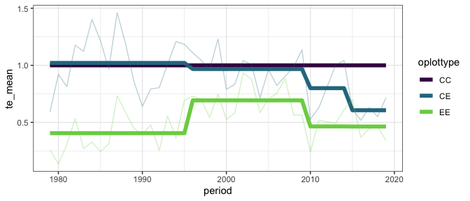<!-- -->

##### Total energy ratios GLS

This fit includes CC plots, for which ratio always = 1.

    ## era = a_pre_ba:
    ##  contrast estimate     SE    df t.ratio p.value
    ##  CC - CE  -0.00900 0.0772  89.2 -0.117  0.9925 
    ##  CC - EE   0.58588 0.0772  89.4  7.585  <.0001 
    ##  CE - EE   0.59488 0.0772  89.2  7.701  <.0001 
    ## 
    ## era = b_pre_cpt:
    ##  contrast estimate     SE    df t.ratio p.value
    ##  CC - CE   0.00801 0.0837  90.5  0.096  0.9950 
    ##  CC - EE   0.31811 0.0837  90.3  3.802  0.0008 
    ##  CE - EE   0.31010 0.0837  90.2  3.706  0.0010 
    ## 
    ## era = c_pre_switch:
    ##  contrast estimate     SE    df t.ratio p.value
    ##  CC - CE   0.23145 0.1305 102.0  1.773  0.1837 
    ##  CC - EE   0.56170 0.1305 102.5  4.304  0.0001 
    ##  CE - EE   0.33024 0.1305 101.9  2.530  0.0343 
    ## 
    ## era = d_post-switch:
    ##  contrast estimate     SE    df t.ratio p.value
    ##  CC - CE   0.42411 0.1306  94.5  3.248  0.0046 
    ##  CC - EE   0.53785 0.1306  94.5  4.118  0.0002 
    ##  CE - EE   0.11374 0.1306  94.9  0.871  0.6599 
    ## 
    ## Degrees-of-freedom method: satterthwaite 
    ## P value adjustment: tukey method for comparing a family of 3 estimates

This fit has CC plots removed.

    ## era = a_pre_ba:
    ##  contrast estimate     SE   df t.ratio p.value
    ##  CE - EE     0.595 0.0946 57.9 6.288   <.0001 
    ## 
    ## era = b_pre_cpt:
    ##  contrast estimate     SE   df t.ratio p.value
    ##  CE - EE     0.310 0.1025 58.6 3.026   0.0037 
    ## 
    ## era = c_pre_switch:
    ##  contrast estimate     SE   df t.ratio p.value
    ##  CE - EE     0.330 0.1599 66.5 2.066   0.0427 
    ## 
    ## era = d_post-switch:
    ##  contrast estimate     SE   df t.ratio p.value
    ##  CE - EE     0.114 0.1599 61.9 0.711   0.4797 
    ## 
    ## Degrees-of-freedom method: satterthwaite

##### Smgran ratio GLS

    ## era = a_pre_ba:
    ##  contrast estimate     SE  df t.ratio p.value
    ##  CC - CE  -0.01122 0.0543 108 -0.207  0.9767 
    ##  CC - EE  -0.23895 0.0543 108 -4.401  0.0001 
    ##  CE - EE  -0.22772 0.0543 108 -4.194  0.0002 
    ## 
    ## era = b_pre_cpt:
    ##  contrast estimate     SE  df t.ratio p.value
    ##  CC - CE  -0.16977 0.0594 108 -2.859  0.0140 
    ##  CC - EE  -0.25402 0.0594 108 -4.278  0.0001 
    ##  CE - EE  -0.08424 0.0594 108 -1.419  0.3348 
    ## 
    ## era = c_pre_switch:
    ##  contrast estimate     SE  df t.ratio p.value
    ##  CC - CE   0.02165 0.0988 106  0.219  0.9739 
    ##  CC - EE  -0.00965 0.0988 106 -0.098  0.9948 
    ##  CE - EE  -0.03129 0.0988 106 -0.317  0.9463 
    ## 
    ## era = d_post-switch:
    ##  contrast estimate     SE  df t.ratio p.value
    ##  CC - CE  -0.23494 0.0953 108 -2.465  0.0402 
    ##  CC - EE  -0.09574 0.0953 108 -1.004  0.5756 
    ##  CE - EE   0.13920 0.0953 108  1.461  0.3140 
    ## 
    ## Degrees-of-freedom method: satterthwaite 
    ## P value adjustment: tukey method for comparing a family of 3 estimates

##### Tiny gran ratio GLS

    ## era = a_pre_ba:
    ##  contrast estimate     SE    df t.ratio p.value
    ##  CC - CE  -0.01186 0.0532  92.1 -0.223  0.9730 
    ##  CC - EE  -0.22858 0.0532  92.3 -4.295  0.0001 
    ##  CE - EE  -0.21672 0.0532  92.2 -4.072  0.0003 
    ## 
    ## era = b_pre_cpt:
    ##  contrast estimate     SE    df t.ratio p.value
    ##  CC - CE   0.00111 0.0577  93.3  0.019  0.9998 
    ##  CC - EE  -0.04465 0.0577  93.2 -0.774  0.7201 
    ##  CE - EE  -0.04576 0.0577  93.0 -0.793  0.7083 
    ## 
    ## era = c_pre_switch:
    ##  contrast estimate     SE    df t.ratio p.value
    ##  CC - CE   0.06214 0.0905 103.6  0.687  0.7718 
    ##  CC - EE  -0.01466 0.0905 104.0 -0.162  0.9856 
    ##  CE - EE  -0.07680 0.0905 103.6 -0.849  0.6736 
    ## 
    ## era = d_post-switch:
    ##  contrast estimate     SE    df t.ratio p.value
    ##  CC - CE  -0.18440 0.0903  97.0 -2.043  0.1076 
    ##  CC - EE  -0.09044 0.0903  96.9 -1.002  0.5775 
    ##  CE - EE   0.09396 0.0903  97.3  1.041  0.5531 
    ## 
    ## Degrees-of-freedom method: satterthwaite 
    ## P value adjustment: tukey method for comparing a family of 3 estimates

### glm on ratios

##### Total energy GLM

With controls:

    ## era = a_pre_ba:
    ##  contrast estimate     SE  df t.ratio p.value
    ##  CC - CE   -0.0211 0.0792 108 -0.267  0.9615 
    ##  CC - EE    0.5943 0.0598 108  9.937  <.0001 
    ##  CE - EE    0.6155 0.0609 108 10.107  <.0001 
    ## 
    ## era = b_pre_cpt:
    ##  contrast estimate     SE  df t.ratio p.value
    ##  CC - CE    0.0323 0.0850 108  0.381  0.9234 
    ##  CC - EE    0.3069 0.0743 108  4.130  0.0002 
    ##  CE - EE    0.2746 0.0727 108  3.777  0.0008 
    ## 
    ## era = c_pre_switch:
    ##  contrast estimate     SE  df t.ratio p.value
    ##  CC - CE    0.2000 0.1463 108  1.367  0.3619 
    ##  CC - EE    0.5351 0.1260 108  4.247  0.0001 
    ##  CE - EE    0.3351 0.1057 108  3.170  0.0056 
    ## 
    ## era = d_post-switch:
    ##  contrast estimate     SE  df t.ratio p.value
    ##  CC - CE    0.3935 0.1195 108  3.292  0.0038 
    ##  CC - EE    0.5361 0.1127 108  4.759  <.0001 
    ##  CE - EE    0.1426 0.0780 108  1.828  0.1654 
    ## 
    ## P value adjustment: tukey method for comparing a family of 3 estimates

Without controls:

    ## era = a_pre_ba:
    ##  contrast estimate     SE df t.ratio p.value
    ##  CE - EE     0.615 0.0746 72 8.252   <.0001 
    ## 
    ## era = b_pre_cpt:
    ##  contrast estimate     SE df t.ratio p.value
    ##  CE - EE     0.275 0.0890 72 3.084   0.0029 
    ## 
    ## era = c_pre_switch:
    ##  contrast estimate     SE df t.ratio p.value
    ##  CE - EE     0.335 0.1295 72 2.588   0.0117 
    ## 
    ## era = d_post-switch:
    ##  contrast estimate     SE df t.ratio p.value
    ##  CE - EE     0.143 0.0956 72 1.493   0.1399

##### Small granivore ratio GLM

    ## era = a_pre_ba:
    ##  contrast estimate     SE  df t.ratio p.value
    ##  CC - CE  -0.00499 0.0194 108 -0.257  0.9642 
    ##  CC - EE  -0.24106 0.0433 108 -5.562  <.0001 
    ##  CE - EE  -0.23608 0.0435 108 -5.424  <.0001 
    ## 
    ## era = b_pre_cpt:
    ##  contrast estimate     SE  df t.ratio p.value
    ##  CC - CE  -0.17268 0.0832 108 -2.075  0.0998 
    ##  CC - EE  -0.25231 0.0918 108 -2.750  0.0190 
    ##  CE - EE  -0.07963 0.1047 108 -0.761  0.7278 
    ## 
    ## era = c_pre_switch:
    ##  contrast estimate     SE  df t.ratio p.value
    ##  CC - CE   0.03400 0.1379 108  0.247  0.9671 
    ##  CC - EE  -0.00337 0.1441 108 -0.023  0.9997 
    ##  CE - EE  -0.03737 0.1385 108 -0.270  0.9607 
    ## 
    ## era = d_post-switch:
    ##  contrast estimate     SE  df t.ratio p.value
    ##  CC - CE  -0.24308 0.1433 108 -1.696  0.2114 
    ##  CC - EE  -0.09875 0.1178 108 -0.838  0.6802 
    ##  CE - EE   0.14432 0.1550 108  0.931  0.6217 
    ## 
    ## P value adjustment: tukey method for comparing a family of 3 estimates

##### Tiny granivore ratio GLM

    ## era = a_pre_ba:
    ##  contrast estimate     SE  df t.ratio p.value
    ##  CC - CE  -0.00422 0.0196 108 -0.215  0.9748 
    ##  CC - EE  -0.24106 0.0440 108 -5.479  <.0001 
    ##  CE - EE  -0.23685 0.0441 108 -5.365  <.0001 
    ## 
    ## era = b_pre_cpt:
    ##  contrast estimate     SE  df t.ratio p.value
    ##  CC - CE  -0.00416 0.0457 108 -0.091  0.9954 
    ##  CC - EE  -0.03623 0.0487 108 -0.744  0.7380 
    ##  CE - EE  -0.03207 0.0491 108 -0.654  0.7908 
    ## 
    ## era = c_pre_switch:
    ##  contrast estimate     SE  df t.ratio p.value
    ##  CC - CE   0.09647 0.1290 108  0.748  0.7355 
    ##  CC - EE   0.01229 0.1423 108  0.086  0.9959 
    ##  CE - EE  -0.08418 0.1266 108 -0.665  0.7844 
    ## 
    ## era = d_post-switch:
    ##  contrast estimate     SE  df t.ratio p.value
    ##  CC - CE  -0.19859 0.1373 108 -1.447  0.3208 
    ##  CC - EE  -0.09391 0.1188 108 -0.791  0.7095 
    ##  CE - EE   0.10468 0.1491 108  0.702  0.7627 
    ## 
    ## P value adjustment: tukey method for comparing a family of 3 estimates
