Energy plots
================

    ## Loading in data version 2.49.0

    ## `summarise()` regrouping output by 'period', 'censusdate', 'era' (override with `.groups` argument)

    ## `summarise()` regrouping output by 'censusyear', 'plot', 'plot_type' (override with `.groups` argument)

    ## Loading in data version 2.49.0

    ## `summarise()` regrouping output by 'period', 'censusdate', 'era' (override with `.groups` argument)

    ## Joining, by = "period"

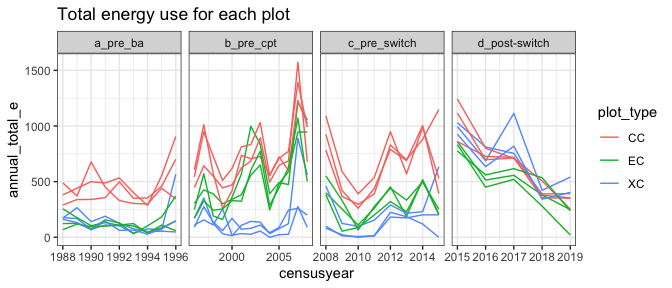<!-- -->

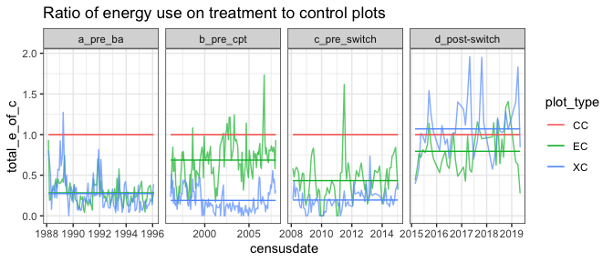<!-- -->

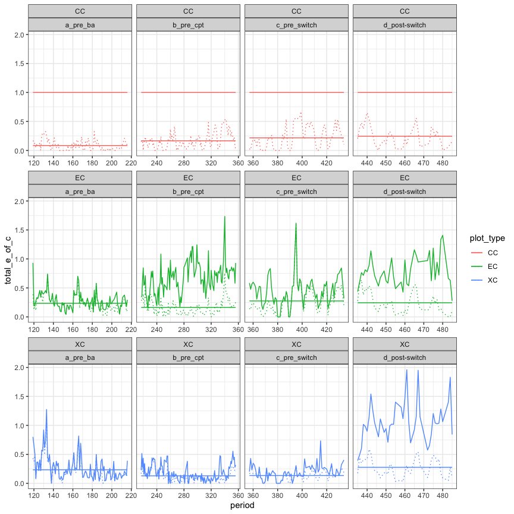<!-- -->

    ## Loading required package: nlme

    ## 
    ## Attaching package: 'nlme'

    ## The following object is masked from 'package:dplyr':
    ## 
    ##     collapse

    ## This is mgcv 1.8-33. For overview type 'help("mgcv-package")'.

Here is the fitted values from that GAM:

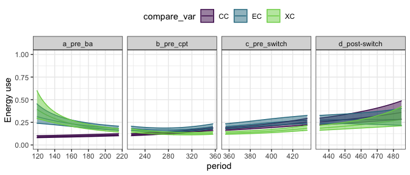<!-- -->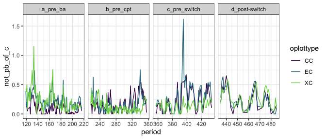<!-- -->

Here is the fitted values from that GAM:

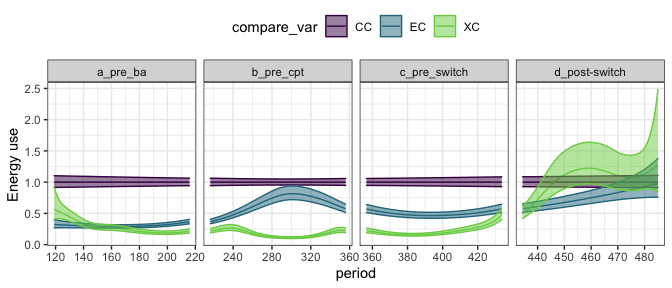<!-- -->

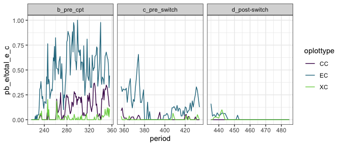<!-- -->

    ## Warning in log(ifelse(y == 0, 1, y/mu)): NaNs produced

    ## Warning: Step size truncated due to divergence

    ## Warning in log(ifelse(y == 0, 1, y/mu)): NaNs produced

    ## Warning: Step size truncated due to divergence

    ## Warning in log(ifelse(y == 0, 1, y/mu)): NaNs produced

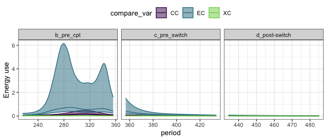<!-- -->

\#not dipdo

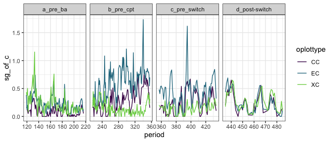<!-- -->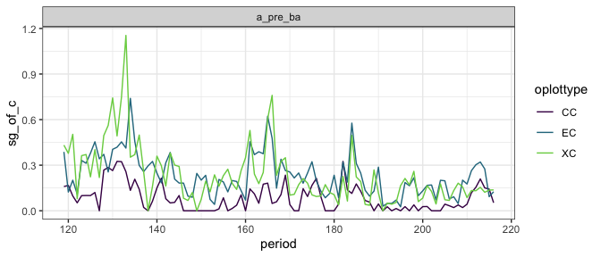<!-- -->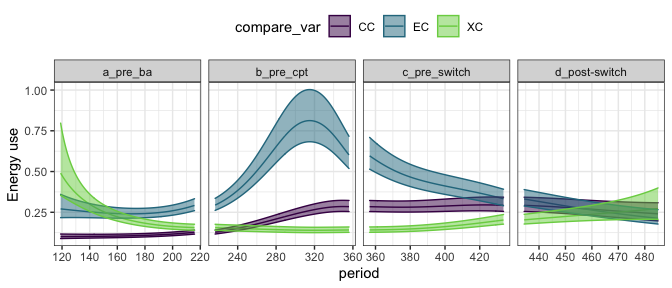<!-- -->

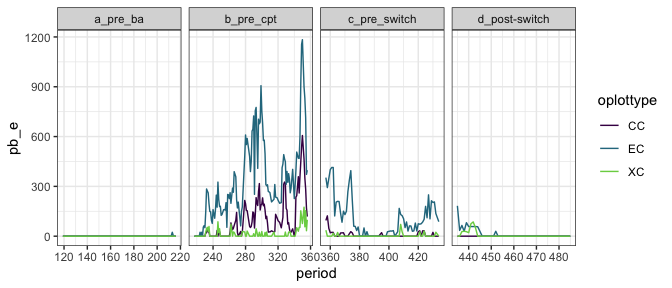<!-- -->
