Energy plots
================

``` r
use_christensen_plots <- F
use_pre_switch <- T
library(mgcv)
```

    ## Loading required package: nlme

    ## 
    ## Attaching package: 'nlme'

    ## The following object is masked from 'package:dplyr':
    ## 
    ##     collapse

    ## This is mgcv 1.8-33. For overview type 'help("mgcv-package")'.

``` r
source(here::here("scaffold", "R", "gams_fxns_generalized.R"))

plot_totals <- get_rodent_data(use_christensen_plots = use_christensen_plots, return_plot = T, use_pre_switch = use_pre_switch) 
```

    ## Loading in data version 2.49.0

    ## Joining, by = "plot"

    ## `summarise()` has grouped output by 'period', 'censusdate', 'era'. You can override using the `.groups` argument.

``` r
plot_annuals <- plot_totals %>%
  mutate(censusdate = as.Date(censusdate)) %>%
  mutate(censusyear = as.integer(format.Date(censusdate, "%Y"))) %>%
  group_by(censusyear, plot, plot_type, era) %>%
  summarize(annual_total_e = mean(total_e),
            annual_smgran_e = mean(smgran_e),
            annual_tinygran_e = mean(tinygran_e),
            nsamples = length(unique(period)),
            nrows = dplyr::n()) %>%
  ungroup()
```

    ## `summarise()` has grouped output by 'censusyear', 'plot', 'plot_type'. You can override using the `.groups` argument.

``` r
treatment_means <- get_rodent_data(use_christensen_plots, F, use_pre_switch = use_pre_switch) 
```

    ## Loading in data version 2.49.0

    ## Joining, by = "plot"

    ## `summarise()` has grouped output by 'period', 'censusdate', 'era'. You can override using the `.groups` argument.

These data are for comparing controls to exclosures with the most
possible plots. We have 4 of each type from 1988-2015.

``` r
ggplot(plot_annuals, aes(censusyear, annual_total_e, color = plot_type, group = plot)) +
  geom_line() +
  facet_grid(cols = vars(era), scales = "free_x", space = "free") +
  theme(legend.position = "top") +
  ggtitle("total e")
```

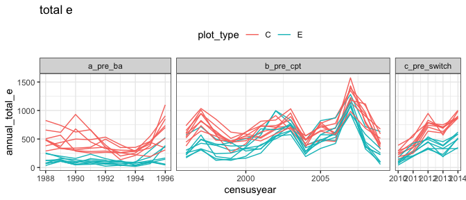<!-- -->

``` r
ggplot(plot_annuals, aes(censusyear, annual_smgran_e, color = plot_type, group = plot)) +
  geom_line()+
  facet_grid(cols = vars(era), scales = "free_x", space = "free") +
  theme(legend.position = "top") +
  ggtitle("smgran e")
```

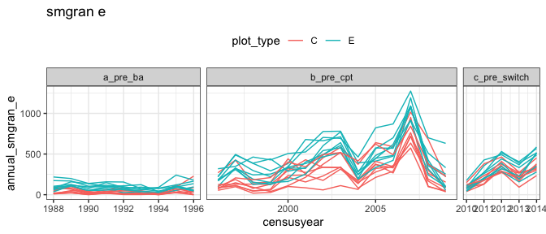<!-- -->

``` r
ggplot(plot_annuals, aes(censusyear, annual_tinygran_e, color = plot_type, group = plot)) +
  geom_line()+
  facet_grid(cols = vars(era), scales = "free_x", space = "free") +
  theme(legend.position = "top") +
  ggtitle("tinygran e")
```

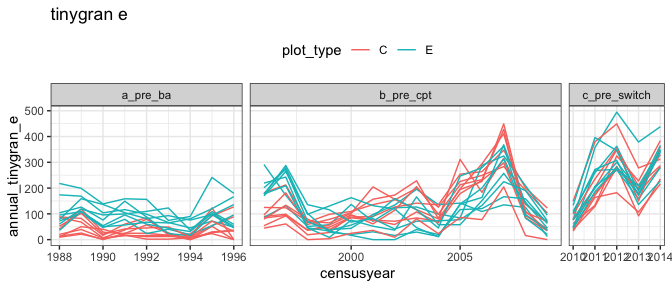<!-- -->

``` r
total_e_gam <- gam(total_e ~ oplottype + s(period, k = 50) + s(period, by = oplottype, k = 50) + s(plot, bs = "re"), data = plot_totals, family = "tw")

total_e_pdat <- make_pdat(plot_totals, comparison_variable = "oplottype")

total_e_diff <-get_exclosure_diff(total_e_gam, total_e_pdat, "oplottype", exclude = "s(plot)", rod_type = "total_e")

total_e_pred <- get_predicted_vals(total_e_gam, total_e_pdat, exclude = "s(plot)") %>%
  add_exclosure_diff(total_e_diff)
```

    ## Joining, by = "period"

``` r
plot_exclosure_diff(total_e_diff) +
  ylab("Control - Exclosure")
```

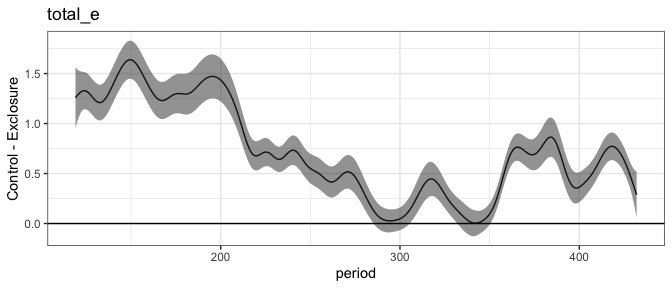<!-- -->

``` r
plot_fitted_pred(total_e_pred, "oplottype")
```

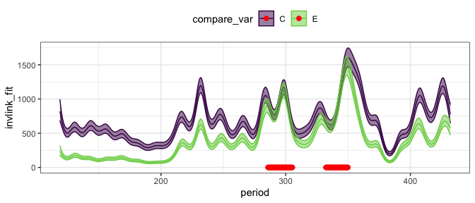<!-- -->

``` r
smgran_e_gam <- gam(smgran_e ~ oplottype + s(period, k = 50) + s(period, by = oplottype, k = 50) + s(plot, bs = "re"), data = plot_totals, family = "tw")

smgran_e_pdat <- make_pdat(plot_totals, comparison_variable = "oplottype")

smgran_e_diff <-get_exclosure_diff(smgran_e_gam, smgran_e_pdat, "oplottype", exclude = "s(plot)", rod_type = "smgran")

smgran_e_pred <- get_predicted_vals(smgran_e_gam, smgran_e_pdat, exclude = "s(plot)") %>%
  add_exclosure_diff(smgran_e_diff)
```

    ## Joining, by = "period"

``` r
plot_exclosure_diff(smgran_e_diff) +
  ylab("Control - Exclosure")
```

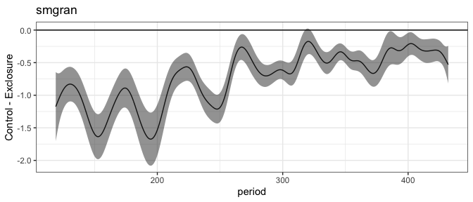<!-- -->

``` r
plot_fitted_pred(smgran_e_pred, "oplottype")
```

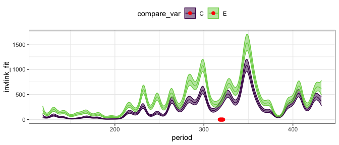<!-- -->

``` r
tinygran_e_gam <- gam(tinygran_e ~ oplottype + s(period, k = 50) + s(period, by = oplottype, k = 50) + s(plot, bs = "re"), data = plot_totals, family = "tw")

tinygran_e_pdat <- make_pdat(plot_totals, comparison_variable = "oplottype")

tinygran_e_diff <-get_exclosure_diff(tinygran_e_gam, tinygran_e_pdat, "oplottype", exclude = "s(plot)", rod_type = "tinygran")

tinygran_e_pred <- get_predicted_vals(tinygran_e_gam, tinygran_e_pdat, exclude = "s(plot)") %>%
  add_exclosure_diff(tinygran_e_diff)
```

    ## Joining, by = "period"

``` r
plot_exclosure_diff(tinygran_e_diff) +
  ylab("Control - Exclosure")
```

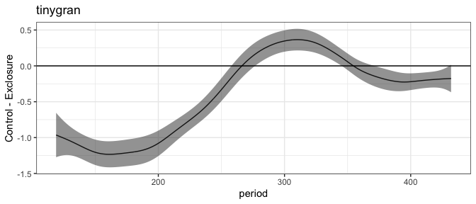<!-- -->

``` r
plot_fitted_pred(tinygran_e_pred, "oplottype") 
```

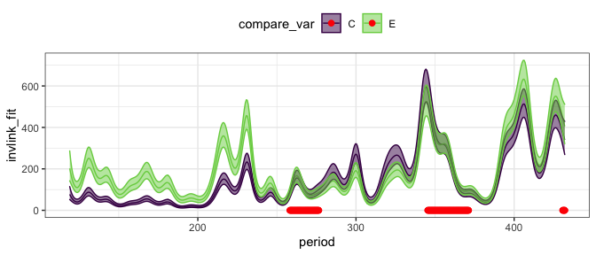<!-- -->

``` r
library(lme4) 
```

    ## Loading required package: Matrix

    ## 
    ## Attaching package: 'lme4'

    ## The following object is masked from 'package:nlme':
    ## 
    ##     lmList

``` r
library(emmeans)

plot_totals <- plot_totals %>%
  mutate(total_e_int = ceiling(total_e),
         smgran_e_int = ceiling(smgran_e),
         tinygran_e_int = ceiling(tinygran_e))
```

``` r
total_e_glm <- glmer(total_e_int ~ oplottype * era + (1 | plot), data = plot_totals, family = poisson)
```

    ## Warning in checkConv(attr(opt, "derivs"), opt$par, ctrl = control$checkConv, : Model is nearly unidentifiable: very large eigenvalue
    ##  - Rescale variables?

``` r
plot(pairs(emmeans(total_e_glm, ~ oplottype | era)))
```

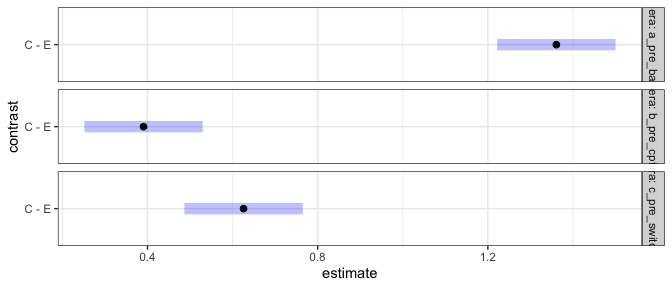<!-- -->

``` r
plot(regrid(emmeans(total_e_glm, ~ oplottype | era)))
```

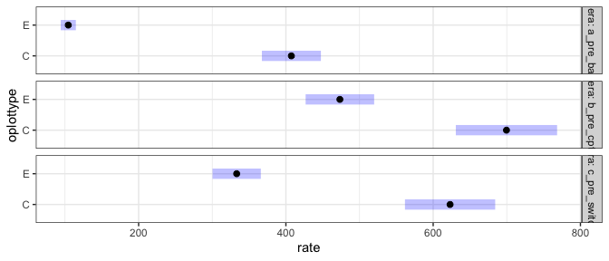<!-- -->

``` r
smgran_e_glm <- glmer(smgran_e_int ~ oplottype * era + (1 | plot), data = plot_totals, family = poisson)

plot(pairs(emmeans(smgran_e_glm, ~ oplottype | era)))
```

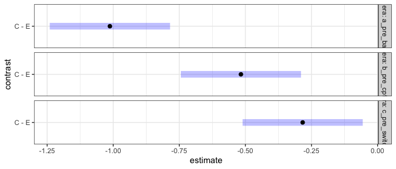<!-- -->

``` r
plot(regrid(emmeans(smgran_e_glm, ~ oplottype | era)))
```

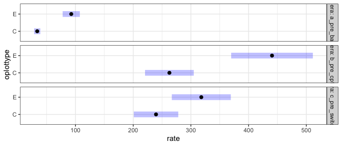<!-- -->

``` r
tinygran_e_glm <- glmer(tinygran_e_int ~ oplottype * era + (1 | plot), data = plot_totals, family = poisson)

plot(pairs(emmeans(tinygran_e_glm, ~ oplottype | era)))
```

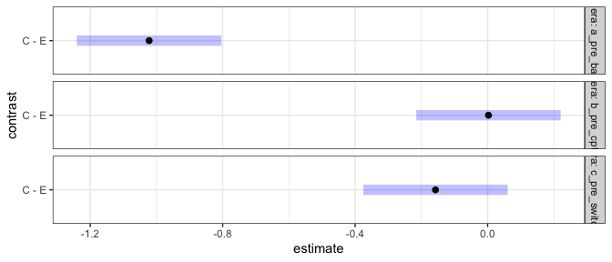<!-- -->

``` r
plot(regrid(emmeans(tinygran_e_glm, ~ oplottype | era)))
```

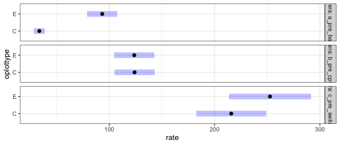<!-- -->
