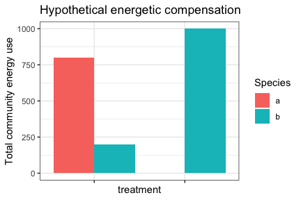
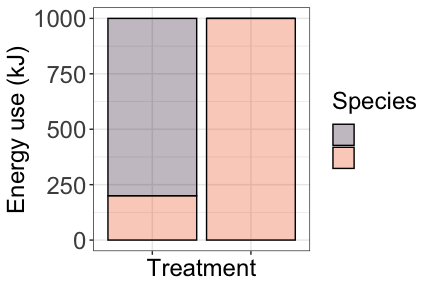
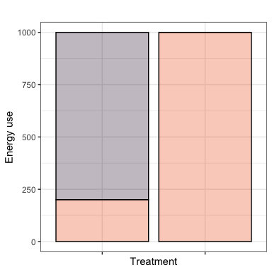
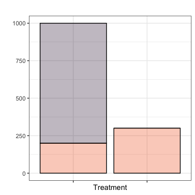
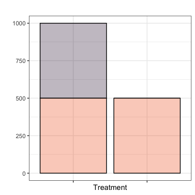

Toy charts for ESA talk
================

``` r
library(ggplot2)
library(dplyr)
```

    ## 
    ## Attaching package: 'dplyr'

    ## The following objects are masked from 'package:stats':
    ## 
    ##     filter, lag

    ## The following objects are masked from 'package:base':
    ## 
    ##     intersect, setdiff, setequal, union

``` r
library(ghibli)
theme_set(theme_bw())
```

``` r
simple_te <- expand.grid(Species = c('a', 'b'), treatment = c('c', 'e')) %>%
  as_tibble() %>%
  mutate(energy = c(800, 200, 0, 1000))


ggplot(simple_te, aes(treatment, energy, fill = Species)) +
  geom_col(position = "dodge") +
  theme(axis.text.x = element_blank()) +
  ylab("Total community energy use") +
  ggtitle("Hypothetical energetic compensation")
```

<!-- -->

``` r
ggplot(simple_te, aes(treatment, energy, fill = Species)) +
  geom_col(alpha = .3, colour = "black") +
  theme(axis.text.x = element_blank()) +
  ylab("Energy use") +
  ggtitle("Hypothetical energetic compensation") +
  scale_fill_viridis_d(option = "turbo", end = .8) +
  xlab("Treatment") +
  theme(legend.text = element_blank())
```

<!-- -->

``` r
ts_te <- expand.grid(Species = c('a', 'b'), treatment = c('Control', 'Exclosure'), time = c("f", "l")) %>%
  as_tibble() %>%
  mutate(emean = c(800, 200, 0, 1000, 800, 200, 0, 300))  

fplot = ggplot(filter(ts_te, time == "f"), aes(treatment, emean, fill = Species)) +  geom_col(alpha = .3, colour = "black") +
  theme(axis.text.x = element_blank()) +
  ylab("Energy use") +
  ggtitle("") +
  scale_fill_viridis_d(option = "turbo", end = .8) +
  xlab("Treatment") +
  theme(legend.text = element_blank(), legend.position = "none")

lplot = ggplot(filter(ts_te, time == "l"), aes(treatment, emean, fill = Species)) +  geom_col(alpha = .3, colour = "black") +
  theme(axis.text.x = element_blank()) +
  ylab("") +
  ggtitle("") +
  scale_fill_viridis_d(option = "turbo", end = .8) +
  xlab("Treatment") +
  theme(legend.text = element_blank(), legend.position = "none")

fplot
```

<!-- -->

``` r
lplot
```

<!-- -->

``` r
ts_te <- expand.grid(Species = c('a', 'b'), treatment = c('Control', 'Exclosure'), time = c("f", "l")) %>%
  as_tibble() %>%
  mutate(emean = c(800, 200, 0, 1000, 500, 500, 0, 500))  

fplot = ggplot(filter(ts_te, time == "f"), aes(treatment, emean, fill = Species)) +  geom_col(alpha = .3, colour = "black") +
  theme(axis.text.x = element_blank()) +
  ylab("Energy use") +
  ggtitle("") +
  scale_fill_viridis_d(option = "turbo", end = .8) +
  xlab("Treatment") +
  theme(legend.text = element_blank(), legend.position = "none")

lplot = ggplot(filter(ts_te, time == "l"), aes(treatment, emean, fill = Species)) +  geom_col(alpha = .3, colour = "black") +
  theme(axis.text.x = element_blank()) +
  ylab("") +
  ggtitle("") +
  scale_fill_viridis_d(option = "turbo", end = .8) +
  xlab("Treatment") +
  theme(legend.text = element_blank(), legend.position = "none")

fplot
```

<!-- -->

``` r
lplot
```

<!-- -->
