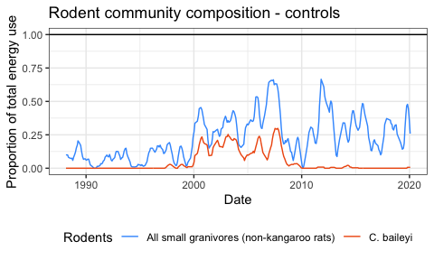
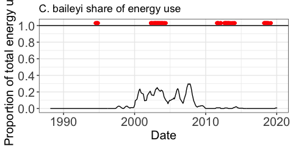
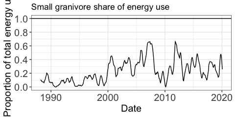
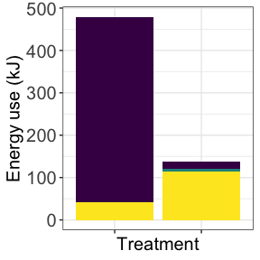
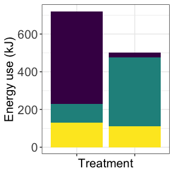
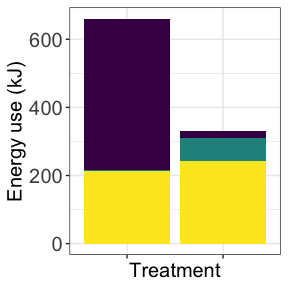
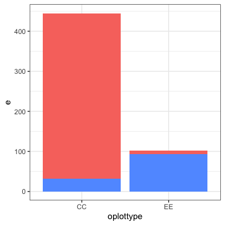
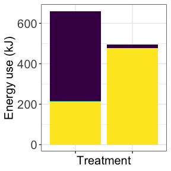
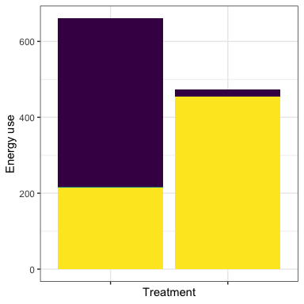
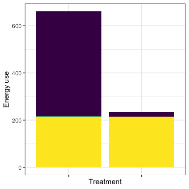

Rodent energy use results
================

  - [Overview of compositonal shift](#overview-of-compositonal-shift)
  - [HYPOTHETICALS](#hypotheticals)

# Overview of compositonal shift

    ## Joining, by = c("month", "year")

<!-- -->

    ## Scale for 'y' is already present. Adding another scale for 'y', which will
    ## replace the existing scale.

<!-- --><!-- -->

Small granivore (gold) and PB (blue) energy use as a proportion of the
total energy use, all on control plots. The remainder is kangaroo rats.

1.  PB is now essentially absent on controls.
2.  Small granivores now account for a greater proportion of total
    energy use on control plots than prior to PB’s establishment, even
    now that PB has declined.

<!-- --><!-- --><!-- -->

<!-- -->

# HYPOTHETICALS

<!-- -->

<!-- -->

<!-- -->
