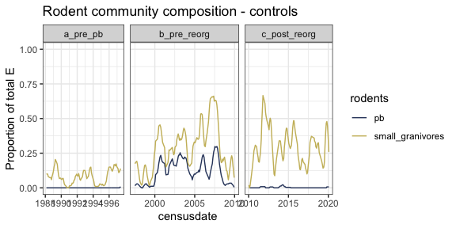
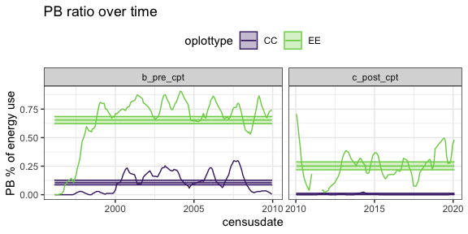
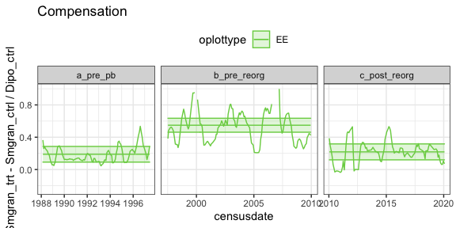
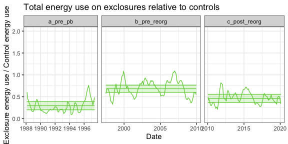
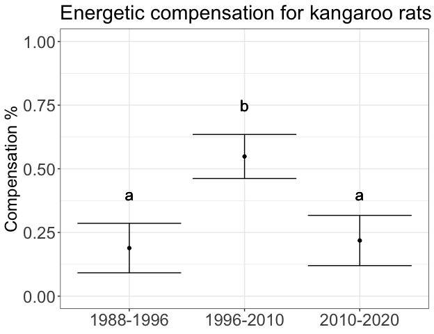
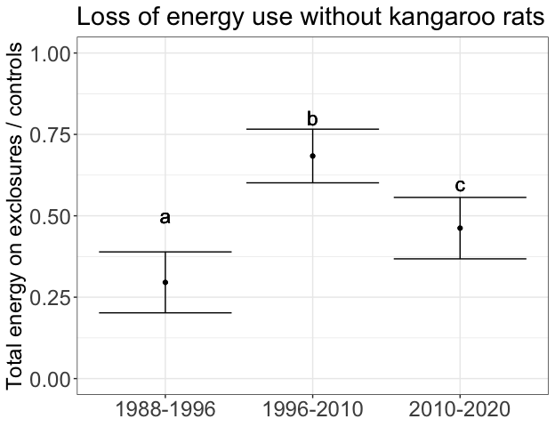

Rodent energy use results
================

  - [Overview of compositonal shift](#overview-of-compositonal-shift)
  - [Energy variables](#energy-variables)
      - [PB over time](#pb-over-time)
      - [Compensation](#compensation)
      - [Treatment:control total E
        ratio](#treatmentcontrol-total-e-ratio)

# Overview of compositonal shift

<!-- -->

Small granivore (gold) and PB (blue) energy use as a proportion of the
total energy use, all on control plots. The remainder is kangaroo rats.

1.  PB is now essentially absent on controls.
2.  Small granivores now account for a greater proportion of total
    energy use on control plots than prior to PB’s establishment, even
    now that PB has declined.

# Energy variables

Lines are 6-month moving averages. Horizontal lines + ribbons are means
and SE or CL from GLM or GLS.

## PB over time

PB energy use as a proportion of treatment-level totals on controls and
exclosures.

    ## Joining, by = c("period", "oplottype")

<!-- -->

Means and SE for each time period, calculated from GLM fit:

| oera         |       est |     lower |     upper | oplottype |
| :----------- | --------: | --------: | --------: | :-------- |
| b\_pre\_cpt  | 0.1046083 | 0.0858916 | 0.1268378 | CC        |
| b\_pre\_cpt  | 0.6541999 | 0.6218458 | 0.6851873 | EE        |
| c\_post\_cpt | 0.0027984 | 0.0006169 | 0.0125967 | CC        |
| c\_post\_cpt | 0.2512829 | 0.2180367 | 0.2877330 | EE        |

Significance of contrasts comparing each time period (within each
treatment), from GLM:

| contrast                   | oplottype | p.value |
| :------------------------- | :-------- | ------: |
| b\_pre\_cpt - c\_post\_cpt | CC        | 1.1e-06 |
| b\_pre\_cpt - c\_post\_cpt | EE        | 0.0e+00 |

## Compensation

Compensatory gains in energy use by small granivores on exclosure plots
relative to controls. Calculated as
\(\frac{SmgranExclosure - SmgranControl}{DipoControl}\).

    ## Joining, by = "era"

<!-- -->

Time period means + CL, from GLS fit with autocorrelation:

| oera         |    emmean |  lower.CL |  upper.CL |
| :----------- | --------: | --------: | --------: |
| a\_pre\_ba   | 0.1665799 | 0.0616221 | 0.2715377 |
| b\_pre\_cpt  | 0.5263685 | 0.4438879 | 0.6088492 |
| c\_post\_cpt | 0.2180135 | 0.1189564 | 0.3170707 |

Significance of time period comparisons, from GLS:

| contrast                   |    estimate |        SE |       df |     t.ratio | p.value |
| :------------------------- | ----------: | --------: | -------: | ----------: | ------: |
| a\_pre\_ba - b\_pre\_cpt   | \-0.3597886 | 0.0661258 | 60.25424 | \-5.4409683 |   0.000 |
| a\_pre\_ba - c\_post\_cpt  | \-0.0514336 | 0.0720904 | 58.16400 | \-0.7134595 |   0.757 |
| b\_pre\_cpt - c\_post\_cpt |   0.3083550 | 0.0639210 | 62.15427 |   4.8239995 |   0.000 |

## Treatment:control total E ratio

Total energy use on exclosures relative to total energy use on controls.

    ## Joining, by = "era"

<!-- -->

Time period means and CL from GLS fit with autocorrelation:

| oera         | oplottype |    emmean |  lower.CL |  upper.CL |
| :----------- | :-------- | --------: | --------: | --------: |
| a\_pre\_ba   | EE        | 0.2511218 | 0.1573675 | 0.3448761 |
| b\_pre\_cpt  | EE        | 0.6731253 | 0.5997847 | 0.7464658 |
| c\_post\_cpt | EE        | 0.4619384 | 0.3738506 | 0.5500263 |

Significance of time period comparisons:

| contrast                   | p.value |
| :------------------------- | ------: |
| a\_pre\_ba - b\_pre\_cpt   |   0.000 |
| a\_pre\_ba - c\_post\_cpt  |   0.005 |
| b\_pre\_cpt - c\_post\_cpt |   0.001 |

<!-- --><!-- -->
