hold this loosely…
================

    ## Loading in data version 2.49.0

    ## Joining, by = "plot"

    ## Joining, by = "period"
    ## Joining, by = "period"

# Raw data

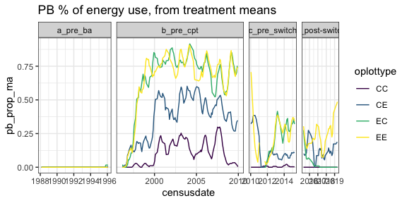<!-- -->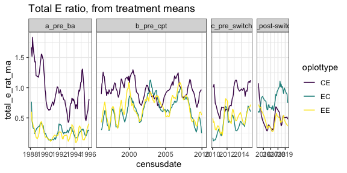<!-- -->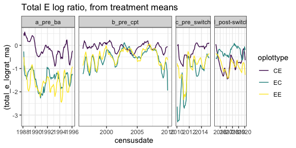<!-- -->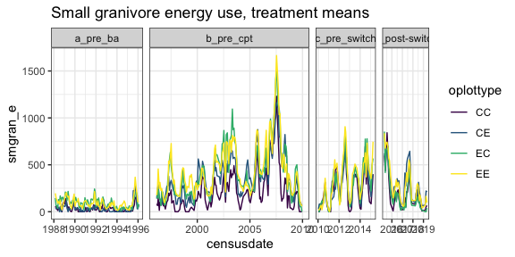<!-- -->

# Era models

    ## Warning: Removed 2 rows containing missing values (geom_point).

    ## Warning: Removed 2 rows containing missing values (geom_segment).

    ## Warning: Removed 2 rows containing missing values (geom_point).

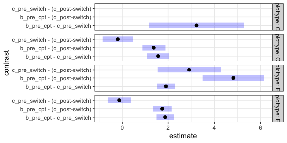<!-- -->

    ## Warning in predict.lm(object, newdata, se.fit, scale = residual.scale, type = if
    ## (type == : prediction from a rank-deficient fit may be misleading

    ## Joining, by = c("period", "oplottype")

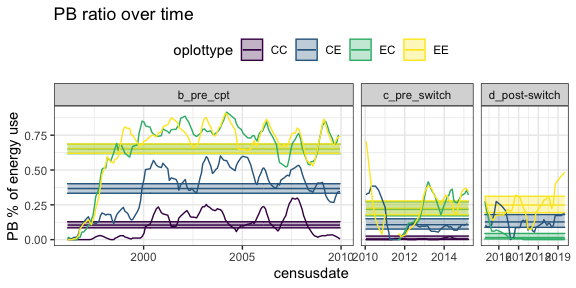<!-- -->

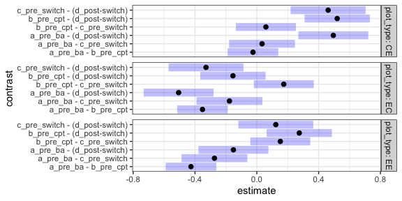<!-- -->

    ## Joining, by = c("era", "plot_type")

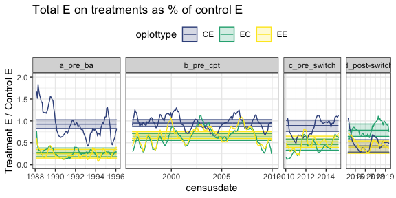<!-- -->

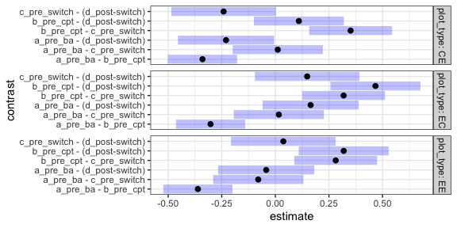<!-- -->

    ## Joining, by = c("era", "plot_type")

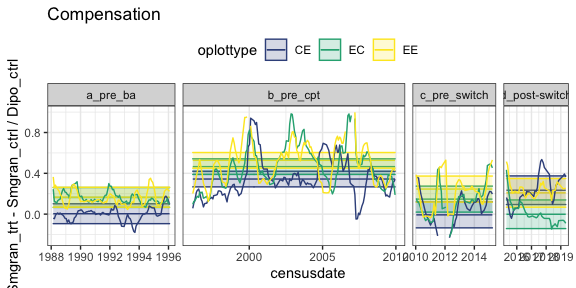<!-- -->

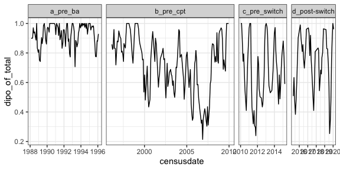<!-- -->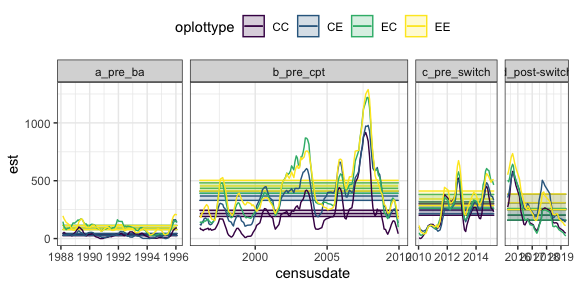<!-- -->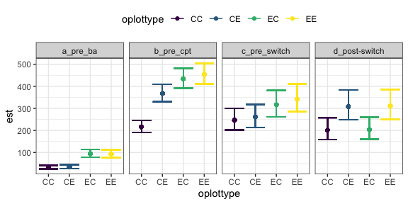<!-- -->
