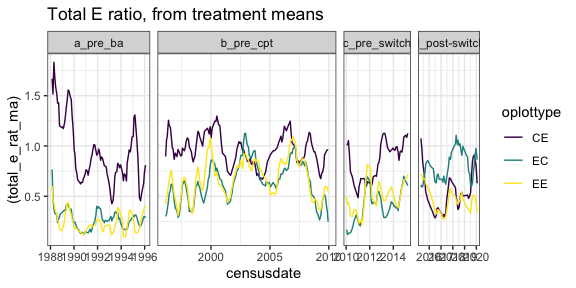
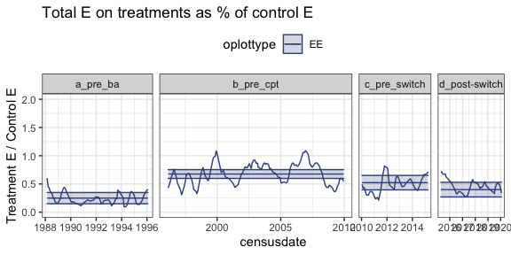
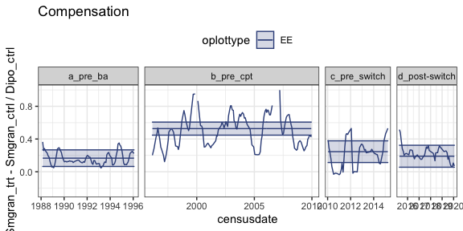
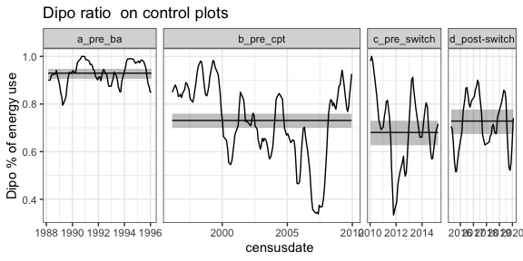
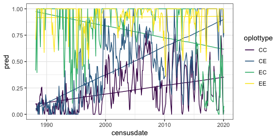
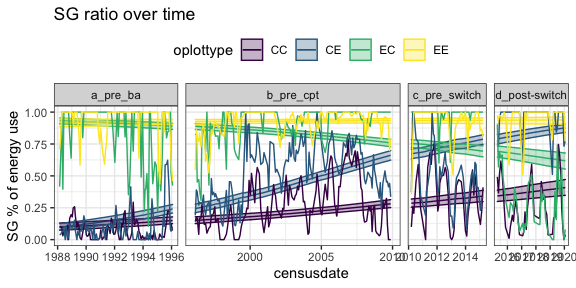

hold this loosely…
================

  - [Raw data](#raw-data)
  - [Era models](#era-models)
      - [PB over time](#pb-over-time)
      - [Treatment:control total E
        ratio](#treatmentcontrol-total-e-ratio)
      - [Compensation](#compensation)
  - [Small granivores etc](#small-granivores-etc)
  - [Whole story](#whole-story)

    ## Loading in data version 2.49.0

    ## Joining, by = "plot"

    ## Joining, by = "period"
    ## Joining, by = "period"

# Raw data

<!-- --><!-- --><!-- --><!-- -->

# Era models

## PB over time

| contrast                          | oplottype |    estimate |        SE |  df |     z.ratio | p.value |
| :-------------------------------- | :-------- | ----------: | --------: | --: | ----------: | ------: |
| b\_pre\_cpt - c\_pre\_switch      | CC        |   3.2292911 | 0.8665240 | Inf |   3.7267186 |   0.001 |
| b\_pre\_cpt - (d\_post-switch)    | CC        |   4.9307609 | 2.0879873 | Inf |   2.3614899 |   0.048 |
| c\_pre\_switch - (d\_post-switch) | CC        |   1.7014698 | 2.2548804 | Inf |   0.7545721 |   0.731 |
| b\_pre\_cpt - c\_pre\_switch      | CE        |   1.5727507 | 0.2014051 | Inf |   7.8088933 |   0.000 |
| b\_pre\_cpt - (d\_post-switch)    | CE        |   1.3435284 | 0.1933264 | Inf |   6.9495357 |   0.000 |
| c\_pre\_switch - (d\_post-switch) | CE        | \-0.2292223 | 0.2596633 | Inf | \-0.8827675 |   0.651 |
| b\_pre\_cpt - c\_pre\_switch      | EC        |   1.9098971 | 0.1641447 | Inf |  11.6354510 |   0.000 |
| b\_pre\_cpt - (d\_post-switch)    | EC        |   4.3915445 | 0.4128737 | Inf |  10.6365312 |   0.000 |
| c\_pre\_switch - (d\_post-switch) | EC        |   2.4816474 | 0.4319327 | Inf |   5.7454496 |   0.000 |
| b\_pre\_cpt - c\_pre\_switch      | EE        |   1.8765631 | 0.1587151 | Inf |  11.8234726 |   0.000 |
| b\_pre\_cpt - (d\_post-switch)    | EE        |   1.5838765 | 0.1535575 | Inf |  10.3145511 |   0.000 |
| c\_pre\_switch - (d\_post-switch) | EE        | \-0.2926866 | 0.1948758 | Inf | \-1.5019132 |   0.290 |

    ## Joining, by = c("period", "oplottype")

<!-- -->

| oera           |       est |     lower |     upper | oplottype |
| :------------- | --------: | --------: | --------: | :-------- |
| b\_pre\_cpt    | 0.1046083 | 0.0850697 | 0.1280067 | CC        |
| b\_pre\_cpt    | 0.3667359 | 0.3337537 | 0.4010157 | CE        |
| b\_pre\_cpt    | 0.6523698 | 0.6182708 | 0.6849749 | EC        |
| b\_pre\_cpt    | 0.6541999 | 0.6202537 | 0.6866447 | EE        |
| c\_pre\_switch | 0.0046035 | 0.0008292 | 0.0251264 | CC        |
| c\_pre\_switch | 0.1072642 | 0.0762236 | 0.1489078 | CE        |
| c\_pre\_switch | 0.2174779 | 0.1716705 | 0.2715020 | EC        |
| c\_pre\_switch | 0.2246082 | 0.1794041 | 0.2773527 | EE        |
| d\_post-switch | 0.0008429 | 0.0000130 | 0.0517560 | CC        |
| d\_post-switch | 0.1312703 | 0.0955045 | 0.1777972 | CE        |
| d\_post-switch | 0.0227079 | 0.0102054 | 0.0497573 | EC        |
| d\_post-switch | 0.2796247 | 0.2286388 | 0.3370127 | EE        |

| contrast | oera           | p.value |
| :------- | :------------- | ------: |
| CC - CE  | b\_pre\_cpt    |   0.000 |
| CC - EC  | b\_pre\_cpt    |   0.000 |
| CC - EE  | b\_pre\_cpt    |   0.000 |
| CE - EC  | b\_pre\_cpt    |   0.000 |
| CE - EE  | b\_pre\_cpt    |   0.000 |
| EC - EE  | b\_pre\_cpt    |   1.000 |
| CC - CE  | c\_pre\_switch |   0.001 |
| CC - EC  | c\_pre\_switch |   0.000 |
| CC - EE  | c\_pre\_switch |   0.000 |
| CE - EC  | c\_pre\_switch |   0.002 |
| CE - EE  | c\_pre\_switch |   0.001 |
| EC - EE  | c\_pre\_switch |   0.997 |
| CC - CE  | d\_post-switch |   0.063 |
| CC - EC  | d\_post-switch |   0.401 |
| CC - EE  | d\_post-switch |   0.018 |
| CE - EC  | d\_post-switch |   0.000 |
| CE - EE  | d\_post-switch |   0.000 |
| EC - EE  | d\_post-switch |   0.000 |

## Treatment:control total E ratio

| contrast                          | plot\_type | p.value |
| :-------------------------------- | :--------- | ------: |
| a\_pre\_ba - b\_pre\_cpt          | CE         |   0.978 |
| a\_pre\_ba - c\_pre\_switch       | CE         |   0.978 |
| a\_pre\_ba - (d\_post-switch)     | CE         |   0.000 |
| b\_pre\_cpt - c\_pre\_switch      | CE         |   0.864 |
| b\_pre\_cpt - (d\_post-switch)    | CE         |   0.000 |
| c\_pre\_switch - (d\_post-switch) | CE         |   0.000 |
| a\_pre\_ba - b\_pre\_cpt          | EC         |   0.000 |
| a\_pre\_ba - c\_pre\_switch       | EC         |   0.138 |
| a\_pre\_ba - (d\_post-switch)     | EC         |   0.000 |
| b\_pre\_cpt - c\_pre\_switch      | EC         |   0.093 |
| b\_pre\_cpt - (d\_post-switch)    | EC         |   0.145 |
| c\_pre\_switch - (d\_post-switch) | EC         |   0.001 |
| a\_pre\_ba - b\_pre\_cpt          | EE         |   0.000 |
| a\_pre\_ba - c\_pre\_switch       | EE         |   0.005 |
| a\_pre\_ba - (d\_post-switch)     | EE         |   0.268 |
| b\_pre\_cpt - c\_pre\_switch      | EE         |   0.178 |
| b\_pre\_cpt - (d\_post-switch)    | EE         |   0.002 |
| c\_pre\_switch - (d\_post-switch) | EE         |   0.521 |

    ## Joining, by = c("era", "plot_type")

<!-- -->

| oera           | oplottype |    emmean |  lower.CL |  upper.CL |
| :------------- | :-------- | --------: | --------: | --------: |
| a\_pre\_ba     | CE        | 0.9248271 | 0.8255554 | 1.0240987 |
| b\_pre\_cpt    | CE        | 0.9502927 | 0.8724255 | 1.0281599 |
| c\_pre\_switch | CE        | 0.8917949 | 0.7637708 | 1.0198190 |
| d\_post-switch | CE        | 0.4648412 | 0.3350937 | 0.5945888 |
| a\_pre\_ba     | EC        | 0.2805681 | 0.1812962 | 0.3798399 |
| b\_pre\_cpt    | EC        | 0.6331445 | 0.5552760 | 0.7110130 |
| c\_pre\_switch | EC        | 0.4580579 | 0.3300299 | 0.5860860 |
| d\_post-switch | EC        | 0.7970703 | 0.6673182 | 0.9268224 |
| a\_pre\_ba     | EE        | 0.2489675 | 0.1496969 | 0.3482380 |
| b\_pre\_cpt    | EE        | 0.6757810 | 0.5979136 | 0.7536484 |
| c\_pre\_switch | EE        | 0.5231140 | 0.3950894 | 0.6511386 |
| d\_post-switch | EE        | 0.3997767 | 0.2700250 | 0.5295285 |

## Compensation

| contrast                          | plot\_type |    estimate |        SE |       df |     t.ratio | p.value |
| :-------------------------------- | :--------- | ----------: | --------: | -------: | ----------: | ------: |
| a\_pre\_ba - b\_pre\_cpt          | CE         | \-0.3396541 | 0.0651710 | 483.3741 | \-5.2117348 |   0.000 |
| a\_pre\_ba - c\_pre\_switch       | CE         |   0.0084800 | 0.0848856 | 484.7159 |   0.0998991 |   1.000 |
| a\_pre\_ba - (d\_post-switch)     | CE         | \-0.3035892 | 0.0855710 | 480.5188 | \-3.5478061 |   0.002 |
| b\_pre\_cpt - c\_pre\_switch      | CE         |   0.3481341 | 0.0779826 | 486.3515 |   4.4642504 |   0.000 |
| b\_pre\_cpt - (d\_post-switch)    | CE         |   0.0360649 | 0.0794102 | 479.0928 |   0.4541599 |   0.969 |
| c\_pre\_switch - (d\_post-switch) | CE         | \-0.3120692 | 0.0942437 | 487.2501 | \-3.3113014 |   0.005 |
| a\_pre\_ba - b\_pre\_cpt          | EC         | \-0.3020296 | 0.0651710 | 481.4912 | \-4.6344150 |   0.000 |
| a\_pre\_ba - c\_pre\_switch       | EC         |   0.0173750 | 0.0848856 | 482.2554 |   0.2046871 |   0.997 |
| a\_pre\_ba - (d\_post-switch)     | EC         |   0.1997566 | 0.0855710 | 477.6179 |   2.3343977 |   0.092 |
| b\_pre\_cpt - c\_pre\_switch      | EC         |   0.3194046 | 0.0779826 | 482.0462 |   4.0958413 |   0.000 |
| b\_pre\_cpt - (d\_post-switch)    | EC         |   0.5017862 | 0.0794102 | 475.2996 |   6.3189160 |   0.000 |
| c\_pre\_switch - (d\_post-switch) | EC         |   0.1823816 | 0.0942437 | 481.1518 |   1.9352140 |   0.215 |
| a\_pre\_ba - b\_pre\_cpt          | EE         | \-0.3610776 | 0.0651710 | 484.2408 | \-5.5404624 |   0.000 |
| a\_pre\_ba - c\_pre\_switch       | EE         | \-0.0792862 | 0.0848856 | 485.2473 | \-0.9340361 |   0.787 |
| a\_pre\_ba - (d\_post-switch)     | EE         | \-0.0235849 | 0.0855710 | 479.0361 | \-0.2756178 |   0.993 |
| b\_pre\_cpt - c\_pre\_switch      | EE         |   0.2817913 | 0.0779826 | 486.3170 |   3.6135133 |   0.002 |
| b\_pre\_cpt - (d\_post-switch)    | EE         |   0.3374927 | 0.0794102 | 476.7786 |   4.2499935 |   0.000 |
| c\_pre\_switch - (d\_post-switch) | EE         |   0.0557014 | 0.0942437 | 485.5242 |   0.5910357 |   0.935 |

    ## Joining, by = c("era", "plot_type")

<!-- -->

| oera           | oplottype |      emmean |    lower.CL |  upper.CL |
| :------------- | :-------- | ----------: | ----------: | --------: |
| a\_pre\_ba     | CE        |   0.0042234 | \-0.0971790 | 0.1056258 |
| b\_pre\_cpt    | CE        |   0.3438775 |   0.2640411 | 0.4237138 |
| c\_pre\_switch | CE        | \-0.0042566 | \-0.1367147 | 0.1282014 |
| d\_post-switch | CE        |   0.3078125 |   0.1736903 | 0.4419347 |
| a\_pre\_ba     | EC        |   0.1634239 |   0.0620213 | 0.2648265 |
| b\_pre\_cpt    | EC        |   0.4654535 |   0.3856162 | 0.5452908 |
| c\_pre\_switch | EC        |   0.1460489 |   0.0135884 | 0.2785095 |
| d\_post-switch | EC        | \-0.0363327 | \-0.1704580 | 0.0977926 |
| a\_pre\_ba     | EE        |   0.1661090 |   0.0647074 | 0.2675106 |
| b\_pre\_cpt    | EE        |   0.5271866 |   0.4473503 | 0.6070230 |
| c\_pre\_switch | EE        |   0.2453953 |   0.1129372 | 0.3778533 |
| d\_post-switch | EE        |   0.1896939 |   0.0555695 | 0.3238183 |

# Small granivores etc

Consider using sg\_c, sg\_ce, sg\_ec / sg\_ee

And sg\_c / total\_c

Using EE as the denominator escapes (almost all) the infinite/NA values.

<!-- -->

| contrast                          |    estimate |        SE |  df |     z.ratio | p.value |
| :-------------------------------- | ----------: | --------: | --: | ----------: | ------: |
| a\_pre\_ba - b\_pre\_cpt          |   1.5792882 | 0.1748810 | Inf |   9.0306458 |   0.000 |
| a\_pre\_ba - c\_pre\_switch       |   1.8220876 | 0.1977242 | Inf |   9.2152976 |   0.000 |
| a\_pre\_ba - (d\_post-switch)     |   1.5923098 | 0.2044278 | Inf |   7.7891059 |   0.000 |
| b\_pre\_cpt - c\_pre\_switch      |   0.2427994 | 0.1407837 | Inf |   1.7246272 |   0.311 |
| b\_pre\_cpt - (d\_post-switch)    |   0.0130216 | 0.1500530 | Inf |   0.0867797 |   1.000 |
| c\_pre\_switch - (d\_post-switch) | \-0.2297778 | 0.1761460 | Inf | \-1.3044737 |   0.560 |

    ## Joining, by = "period"

<!-- -->

| oera           |       est |     lower |     upper |
| :------------- | --------: | --------: | --------: |
| a\_pre\_ba     | 0.9294915 | 0.9057767 | 0.9475830 |
| b\_pre\_cpt    | 0.7309832 | 0.7004049 | 0.7595121 |
| c\_pre\_switch | 0.6806623 | 0.6268617 | 0.7300463 |
| d\_post-switch | 0.7284149 | 0.6741225 | 0.7766587 |

# Whole story

<!-- -->

    ##                            2.5 %        97.5 %
    ## (Intercept)        -1.808366e-01  0.2065857474
    ## plot_typeCE        -5.017029e-01  0.0461950552
    ## plot_typeEC         8.009055e-01  1.3488035158
    ## plot_typeEE         6.257214e-01  1.1736193832
    ## period              9.227028e-05  0.0012814528
    ## plot_typeCE:period  7.301314e-04  0.0024118894
    ## plot_typeEC:period -2.481733e-03 -0.0007999753
    ## plot_typeEE:period -1.493897e-03  0.0001878612

<!-- -->

    ## 
    ## Call:
    ## glm(formula = sg_rat ~ plot_type * period, family = quasibinomial(), 
    ##     data = sg_prop)
    ## 
    ## Deviance Residuals: 
    ##     Min       1Q   Median       3Q      Max  
    ## -1.8681  -0.3253   0.1001   0.4036   1.4819  
    ## 
    ## Coefficients:
    ##                      Estimate Std. Error t value Pr(>|t|)    
    ## (Intercept)        -2.7994746  0.2314535 -12.095  < 2e-16 ***
    ## plot_typeCE        -0.7654595  0.3215244  -2.381 0.017418 *  
    ## plot_typeEC         6.1334236  0.3486768  17.591  < 2e-16 ***
    ## plot_typeEE         5.1625189  0.3948767  13.074  < 2e-16 ***
    ## period              0.0049135  0.0006647   7.392 2.53e-13 ***
    ## plot_typeCE:period  0.0062641  0.0009595   6.528 9.42e-11 ***
    ## plot_typeEC:period -0.0106848  0.0009873 -10.823  < 2e-16 ***
    ## plot_typeEE:period -0.0041776  0.0012216  -3.420 0.000645 ***
    ## ---
    ## Signif. codes:  0 '***' 0.001 '**' 0.01 '*' 0.05 '.' 0.1 ' ' 1
    ## 
    ## (Dispersion parameter for quasibinomial family taken to be 0.2772301)
    ## 
    ##     Null deviance: 986.98  on 1347  degrees of freedom
    ## Residual deviance: 367.18  on 1340  degrees of freedom
    ## AIC: NA
    ## 
    ## Number of Fisher Scoring iterations: 5

    ## Joining, by = c("period", "plot_type")

<!-- -->
