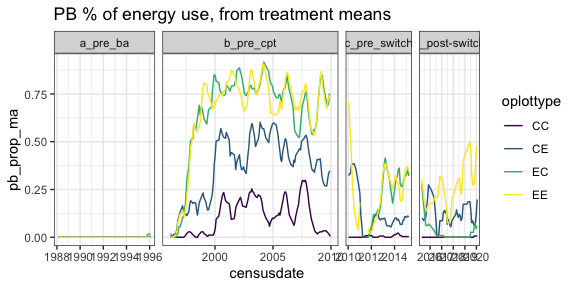
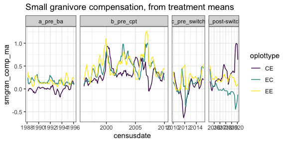
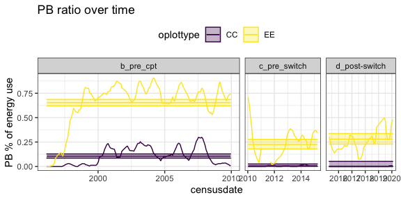
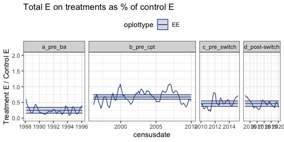
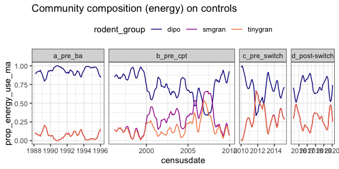

hold this loosely…
================

    ## Loading in data version 2.49.0

    ## Joining, by = "plot"

    ## Joining, by = "period"
    ## Joining, by = "period"

# Raw data

<!-- --><!-- --><!-- --><!-- --><!-- -->

# Era models

## PB over time

    ##                          contrast oplottype   estimate        SE  df    z.ratio
    ## 1        b_pre_cpt - c_pre_switch        CC  3.2292911 0.8665240 Inf  3.7267186
    ## 2     b_pre_cpt - (d_post-switch)        CC  4.9307609 2.0879873 Inf  2.3614899
    ## 3  c_pre_switch - (d_post-switch)        CC  1.7014698 2.2548804 Inf  0.7545721
    ## 4        b_pre_cpt - c_pre_switch        CE  1.5727507 0.2014051 Inf  7.8088933
    ## 5     b_pre_cpt - (d_post-switch)        CE  1.3435284 0.1933264 Inf  6.9495357
    ## 6  c_pre_switch - (d_post-switch)        CE -0.2292223 0.2596633 Inf -0.8827675
    ## 7        b_pre_cpt - c_pre_switch        EC  1.9098971 0.1641447 Inf 11.6354510
    ## 8     b_pre_cpt - (d_post-switch)        EC  4.3915445 0.4128737 Inf 10.6365312
    ## 9  c_pre_switch - (d_post-switch)        EC  2.4816474 0.4319327 Inf  5.7454496
    ## 10       b_pre_cpt - c_pre_switch        EE  1.8765631 0.1587151 Inf 11.8234726
    ## 11    b_pre_cpt - (d_post-switch)        EE  1.5838765 0.1535575 Inf 10.3145511
    ## 12 c_pre_switch - (d_post-switch)        EE -0.2926866 0.1948758 Inf -1.5019132
    ##         p.value
    ## 1  5.685496e-04
    ## 2  4.779110e-02
    ## 3  7.308551e-01
    ## 4  3.486100e-14
    ## 5  1.101785e-11
    ## 6  6.512003e-01
    ## 7  0.000000e+00
    ## 8  2.964295e-14
    ## 9  2.748459e-08
    ## 10 0.000000e+00
    ## 11 2.997602e-14
    ## 12 2.899937e-01

    ## Joining, by = c("period", "oplottype")

<!-- -->

    ##                          contrast plot_type p.value
    ## 1        b_pre_cpt - c_pre_switch        CC   0.568
    ## 2     b_pre_cpt - (d_post-switch)        CC   0.493
    ## 3  c_pre_switch - (d_post-switch)        CC   0.970
    ## 4        b_pre_cpt - c_pre_switch        CE   0.007
    ## 5     b_pre_cpt - (d_post-switch)        CE   0.047
    ## 6  c_pre_switch - (d_post-switch)        CE   0.935
    ## 7        b_pre_cpt - c_pre_switch        EC   0.000
    ## 8     b_pre_cpt - (d_post-switch)        EC   0.000
    ## 9  c_pre_switch - (d_post-switch)        EC   0.317
    ## 10       b_pre_cpt - c_pre_switch        EE   0.000
    ## 11    b_pre_cpt - (d_post-switch)        EE   0.000
    ## 12 c_pre_switch - (d_post-switch)        EE   0.991

    ## Joining, by = c("era", "plot_type")

<!-- -->

## Treatment:control total E ratio

    ##                          contrast plot_type p.value
    ## 1            a_pre_ba - b_pre_cpt        CE   0.978
    ## 2         a_pre_ba - c_pre_switch        CE   0.978
    ## 3      a_pre_ba - (d_post-switch)        CE   0.000
    ## 4        b_pre_cpt - c_pre_switch        CE   0.864
    ## 5     b_pre_cpt - (d_post-switch)        CE   0.000
    ## 6  c_pre_switch - (d_post-switch)        CE   0.000
    ## 7            a_pre_ba - b_pre_cpt        EC   0.000
    ## 8         a_pre_ba - c_pre_switch        EC   0.138
    ## 9      a_pre_ba - (d_post-switch)        EC   0.000
    ## 10       b_pre_cpt - c_pre_switch        EC   0.093
    ## 11    b_pre_cpt - (d_post-switch)        EC   0.145
    ## 12 c_pre_switch - (d_post-switch)        EC   0.001
    ## 13           a_pre_ba - b_pre_cpt        EE   0.000
    ## 14        a_pre_ba - c_pre_switch        EE   0.005
    ## 15     a_pre_ba - (d_post-switch)        EE   0.268
    ## 16       b_pre_cpt - c_pre_switch        EE   0.178
    ## 17    b_pre_cpt - (d_post-switch)        EE   0.002
    ## 18 c_pre_switch - (d_post-switch)        EE   0.521

    ## Joining, by = c("era", "plot_type")

<!-- -->

    ##                   contrast p.value
    ## 1     a_pre_ba - b_pre_cpt   0.000
    ## 2  a_pre_ba - c_pre_switch   0.005
    ## 3 b_pre_cpt - c_pre_switch   0.001

    ## Joining, by = "era"

<!-- -->

    ##                          contrast plot_type    estimate        SE       df
    ## 1            a_pre_ba - b_pre_cpt        CE -0.08476344 0.1460113 301.8581
    ## 2         a_pre_ba - c_pre_switch        CE  0.02152064 0.1894569 302.8200
    ## 3      a_pre_ba - (d_post-switch)        CE  0.74155216 0.1912869 297.2902
    ## 4        b_pre_cpt - c_pre_switch        CE  0.10628408 0.1722948 304.0052
    ## 5     b_pre_cpt - (d_post-switch)        CE  0.82631561 0.1768778 295.3925
    ## 6  c_pre_switch - (d_post-switch)        CE  0.72003153 0.2064000 303.3843
    ## 7            a_pre_ba - b_pre_cpt        EC -0.81619558 0.1460113 300.8071
    ## 8         a_pre_ba - c_pre_switch        EC -0.33019972 0.1894569 301.2530
    ## 9      a_pre_ba - (d_post-switch)        EC -1.10848870 0.1912869 295.6475
    ## 10       b_pre_cpt - c_pre_switch        EC  0.48599585 0.1722948 301.2129
    ## 11    b_pre_cpt - (d_post-switch)        EC -0.29229312 0.1768778 293.2054
    ## 12 c_pre_switch - (d_post-switch)        EC -0.77828897 0.2064000 299.4845
    ## 13           a_pre_ba - b_pre_cpt        EE -1.09318945 0.1460113 302.2799
    ## 14        a_pre_ba - c_pre_switch        EE -0.69505904 0.1894569 302.9205
    ## 15     a_pre_ba - (d_post-switch)        EE -0.53624622 0.1912869 296.0424
    ## 16       b_pre_cpt - c_pre_switch        EE  0.39813042 0.1722948 303.6104
    ## 17    b_pre_cpt - (d_post-switch)        EE  0.55694324 0.1768778 293.5111
    ## 18 c_pre_switch - (d_post-switch)        EE  0.15881282 0.2064000 301.8336
    ##       t.ratio      p.value
    ## 1  -0.5805266 9.378839e-01
    ## 2   0.1135912 9.994748e-01
    ## 3   3.8766483 7.490552e-04
    ## 4   0.6168736 9.266534e-01
    ## 5   4.6716759 2.687589e-05
    ## 6   3.4885245 3.114791e-03
    ## 7  -5.5899480 3.047098e-07
    ## 8  -1.7428756 3.033800e-01
    ## 9  -5.7949002 1.047512e-07
    ## 10  2.8207234 2.614686e-02
    ## 11 -1.6525147 3.509458e-01
    ## 12 -3.7707796 1.119198e-03
    ## 13 -7.4870195 5.614731e-12
    ## 14 -3.6686931 1.632273e-03
    ## 15 -2.8033604 2.749666e-02
    ## 16  2.3107518 9.782009e-02
    ## 17  3.1487464 9.733143e-03
    ## 18  0.7694419 8.681875e-01

    ## Joining, by = c("era", "plot_type")

<!-- -->

    ##                          contrast plot_type    estimate        SE       df
    ## 1            a_pre_ba - b_pre_cpt        CE -0.08571966 0.1187339 305.6884
    ## 2         a_pre_ba - c_pre_switch        CE  0.02242530 0.1541308 303.1255
    ## 3      a_pre_ba - (d_post-switch)        CE  0.74041713 0.1555615 301.4078
    ## 4        b_pre_cpt - c_pre_switch        CE  0.10814496 0.1403268 304.1936
    ## 5     b_pre_cpt - (d_post-switch)        CE  0.82613679 0.1438929 300.0517
    ## 6  c_pre_switch - (d_post-switch)        CE  0.71799183 0.1682575 305.1279
    ## 7            a_pre_ba - b_pre_cpt        EC -0.86149961 0.1191070 305.6332
    ## 8         a_pre_ba - c_pre_switch        EC -0.55629383 0.1578043 310.5229
    ## 9      a_pre_ba - (d_post-switch)        EC -1.12378539 0.1555777 299.7247
    ## 10       b_pre_cpt - c_pre_switch        EC  0.30520578 0.1464501 315.8631
    ## 11    b_pre_cpt - (d_post-switch)        EC -0.26228578 0.1443447 298.7593
    ## 12 c_pre_switch - (d_post-switch)        EC -0.56749157 0.1712017 308.0756
    ## 13           a_pre_ba - b_pre_cpt        EE -1.09694135 0.1187339 306.1461
    ## 14        a_pre_ba - c_pre_switch        EE -0.75032940 0.1542259 304.1913
    ## 15     a_pre_ba - (d_post-switch)        EE -0.54293164 0.1555618 300.1964
    ## 16       b_pre_cpt - c_pre_switch        EE  0.34661194 0.1404270 305.0119
    ## 17    b_pre_cpt - (d_post-switch)        EE  0.55400971 0.1438930 298.2071
    ## 18 c_pre_switch - (d_post-switch)        EE  0.20739776 0.1683348 304.3920
    ##       t.ratio      p.value
    ## 1  -0.7219478 8.883014e-01
    ## 2   0.1454952 9.988999e-01
    ## 3   4.7596419 1.786333e-05
    ## 4   0.7706652 8.676481e-01
    ## 5   5.7413326 1.376247e-07
    ## 6   4.2672210 1.546983e-04
    ## 7  -7.2329910 2.384992e-11
    ## 8  -3.5252140 2.728925e-03
    ## 9  -7.2233053 2.650336e-11
    ## 10  2.0840263 1.605500e-01
    ## 11 -1.8170798 2.672878e-01
    ## 12 -3.3147552 5.638050e-03
    ## 13 -9.2386517 9.856560e-13
    ## 14 -4.8651332 1.091573e-05
    ## 15 -3.4901339 3.101438e-03
    ## 16  2.4682721 6.701490e-02
    ## 17  3.8501503 8.288046e-04
    ## 18  1.2320551 6.069483e-01

    ## Joining, by = c("era", "plot_type")

<!-- --><!-- -->

## Compensation

    ##                          contrast plot_type     estimate         SE       df
    ## 1            a_pre_ba - b_pre_cpt        CE -0.339654077 0.06517102 483.3741
    ## 2         a_pre_ba - c_pre_switch        CE  0.008479998 0.08488563 484.7159
    ## 3      a_pre_ba - (d_post-switch)        CE -0.303589158 0.08557096 480.5188
    ## 4        b_pre_cpt - c_pre_switch        CE  0.348134075 0.07798265 486.3515
    ## 5     b_pre_cpt - (d_post-switch)        CE  0.036064919 0.07941017 479.0928
    ## 6  c_pre_switch - (d_post-switch)        CE -0.312069156 0.09424366 487.2501
    ## 7            a_pre_ba - b_pre_cpt        EC -0.302029560 0.06517102 481.4912
    ## 8         a_pre_ba - c_pre_switch        EC  0.017374995 0.08488563 482.2554
    ## 9      a_pre_ba - (d_post-switch)        EC  0.199756639 0.08557096 477.6179
    ## 10       b_pre_cpt - c_pre_switch        EC  0.319404555 0.07798265 482.0462
    ## 11    b_pre_cpt - (d_post-switch)        EC  0.501786199 0.07941017 475.2996
    ## 12 c_pre_switch - (d_post-switch)        EC  0.182381644 0.09424366 481.1518
    ## 13           a_pre_ba - b_pre_cpt        EE -0.361077592 0.06517102 484.2408
    ## 14        a_pre_ba - c_pre_switch        EE -0.079286248 0.08488563 485.2473
    ## 15     a_pre_ba - (d_post-switch)        EE -0.023584882 0.08557096 479.0361
    ## 16       b_pre_cpt - c_pre_switch        EE  0.281791344 0.07798265 486.3170
    ## 17    b_pre_cpt - (d_post-switch)        EE  0.337492710 0.07941017 476.7786
    ## 18 c_pre_switch - (d_post-switch)        EE  0.055701366 0.09424366 485.5242
    ##        t.ratio      p.value
    ## 1  -5.21173476 1.657168e-06
    ## 2   0.09989909 9.996427e-01
    ## 3  -3.54780612 2.402212e-03
    ## 4   4.46425040 5.895051e-05
    ## 5   0.45415995 9.688041e-01
    ## 6  -3.31130141 5.492518e-03
    ## 7  -4.63441501 2.732118e-05
    ## 8   0.20468711 9.969633e-01
    ## 9   2.33439767 9.176421e-02
    ## 10  4.09584127 2.872899e-04
    ## 11  6.31891598 3.674734e-09
    ## 12  1.93521399 2.146994e-01
    ## 13 -5.54046238 2.967520e-07
    ## 14 -0.93403612 7.865668e-01
    ## 15 -0.27561785 9.926803e-01
    ## 16  3.61351333 1.888221e-03
    ## 17  4.24999349 1.506987e-04
    ## 18  0.59103570 9.347768e-01

    ## Joining, by = c("era", "plot_type")

<!-- -->

## Treat v. control smgran

    ##    contrast           era    estimate         SE   df     t.ratio      p.value
    ## 1   CC - CE      a_pre_ba -0.08133306 0.17513402 1352 -0.46440466 9.667844e-01
    ## 2   CC - EC      a_pre_ba -1.07196556 0.15658416 1352 -6.84593859 6.898604e-11
    ## 3   CC - EE      a_pre_ba -1.05713056 0.15680828 1352 -6.74154827 1.388804e-10
    ## 4   CE - EC      a_pre_ba -0.99063251 0.15444772 1352 -6.41403146 1.172423e-09
    ## 5   CE - EE      a_pre_ba -0.97579750 0.15467492 1352 -6.30869878 2.281622e-09
    ## 6   EC - EE      a_pre_ba  0.01483501 0.13330794 1352  0.11128374 9.995070e-01
    ## 7   CC - CE     b_pre_cpt -0.53186103 0.08245593 1352 -6.45024575 9.304136e-10
    ## 8   CC - EC     b_pre_cpt -0.69826394 0.08093913 1352 -8.62702552 4.463097e-14
    ## 9   CC - EE     b_pre_cpt -0.74416175 0.08053919 1352 -9.23974658 4.962697e-14
    ## 10  CE - EC     b_pre_cpt -0.16640291 0.07479409 1352 -2.22481360 1.170409e-01
    ## 11  CE - EE     b_pre_cpt -0.21230072 0.07436111 1352 -2.85499653 2.265134e-02
    ## 12  EC - EE     b_pre_cpt -0.04589781 0.07267556 1352 -0.63154393 9.218889e-01
    ## 13  CC - CE  c_pre_switch -0.05734673 0.14047182 1352 -0.40824368 9.770234e-01
    ## 14  CC - EC  c_pre_switch -0.25022882 0.13705270 1352 -1.82578543 2.615718e-01
    ## 15  CC - EE  c_pre_switch -0.32950766 0.13572339 1352 -2.42778840 7.240397e-02
    ## 16  CE - EC  c_pre_switch -0.19288209 0.13594850 1352 -1.41878787 4.877434e-01
    ## 17  CE - EE  c_pre_switch -0.27216093 0.13460829 1352 -2.02187352 1.803734e-01
    ## 18  EC - EE  c_pre_switch -0.07927885 0.13103626 1352 -0.60501456 9.304996e-01
    ## 19  CC - CE d_post-switch -0.45921106 0.15052951 1352 -3.05063819 1.244858e-02
    ## 20  CC - EC d_post-switch  0.01195797 0.15968325 1352  0.07488557 9.998494e-01
    ## 21  CC - EE d_post-switch -0.40923591 0.15141880 1352 -2.70267575 3.508098e-02
    ## 22  CE - EC d_post-switch  0.47116903 0.15079909 1352  3.12448196 9.826395e-03
    ## 23  CE - EE d_post-switch  0.04997515 0.14201858 1352  0.35189166 9.850492e-01
    ## 24  EC - EE d_post-switch -0.42119388 0.15168680 1352 -2.77673394 2.844965e-02

<!-- --><!-- -->

## Treat v control tiny gran

    ##    contrast           era     estimate         SE   df     t.ratio      p.value
    ## 1   CC - CE      a_pre_ba -0.071552120 0.17353676 1352 -0.41231679 9.763581e-01
    ## 2   CC - EC      a_pre_ba -1.069405104 0.15473693 1352 -6.91111753 4.435707e-11
    ## 3   CC - EE      a_pre_ba -1.057130559 0.15492231 1352 -6.82361712 8.018308e-11
    ## 4   CE - EC      a_pre_ba -0.997852984 0.15283720 1352 -6.52886177 5.609960e-10
    ## 5   CE - EE      a_pre_ba -0.985578439 0.15302489 1352 -6.44064131 9.893614e-10
    ## 6   EC - EE      a_pre_ba  0.012274545 0.13132071 1352  0.09346999 9.997075e-01
    ## 7   CC - CE     b_pre_cpt  0.059646174 0.10047558 1352  0.59363852 9.340193e-01
    ## 8   CC - EC     b_pre_cpt  0.071951428 0.10064637 1352  0.71489343 8.912107e-01
    ## 9   CC - EE     b_pre_cpt -0.001347792 0.09964148 1352 -0.01352641 9.999991e-01
    ## 10  CE - EC     b_pre_cpt  0.012305253 0.10145432 1352  0.12128860 9.993623e-01
    ## 11  CE - EE     b_pre_cpt -0.060993966 0.10045752 1352 -0.60716178 9.298236e-01
    ## 12  EC - EE     b_pre_cpt -0.073299220 0.10062834 1352 -0.72841528 8.857256e-01
    ## 13  CC - CE  c_pre_switch  0.147907851 0.14210884 1352  1.04080680 7.254485e-01
    ## 14  CC - EC  c_pre_switch -0.036729012 0.13854278 1352 -0.26510953 9.934780e-01
    ## 15  CC - EE  c_pre_switch -0.086345967 0.13762924 1352 -0.62738099 9.232773e-01
    ## 16  CE - EC  c_pre_switch -0.184636862 0.14143457 1352 -1.30545775 5.595706e-01
    ## 17  CE - EE  c_pre_switch -0.234253818 0.14053983 1352 -1.66681444 3.417621e-01
    ## 18  EC - EE  c_pre_switch -0.049616956 0.13693291 1352 -0.36234499 9.837221e-01
    ## 19  CC - CE d_post-switch -0.335443693 0.14991160 1352 -2.23761005 1.137091e-01
    ## 20  CC - EC d_post-switch  0.083061220 0.15835759 1352  0.52451683 9.531810e-01
    ## 21  CC - EE d_post-switch -0.176684487 0.15294542 1352 -1.15521265 6.552464e-01
    ## 22  CE - EC d_post-switch  0.418504912 0.15178367 1352  2.75724594 3.007976e-02
    ## 23  CE - EE d_post-switch  0.158759206 0.14612823 1352  1.08643763 6.979087e-01
    ## 24  EC - EE d_post-switch -0.259745706 0.15478081 1352 -1.67815189 3.356467e-01

<!-- --><!-- -->
