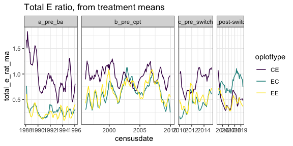
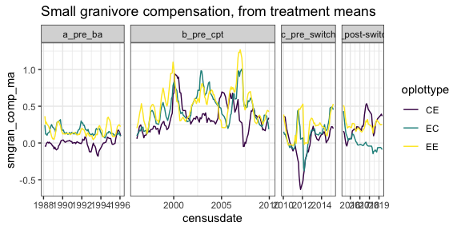
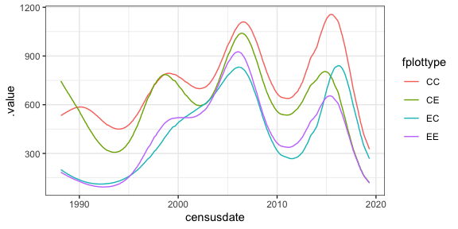
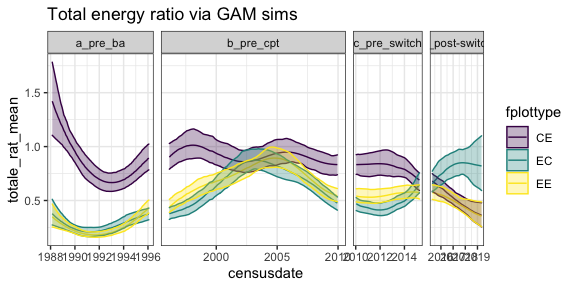
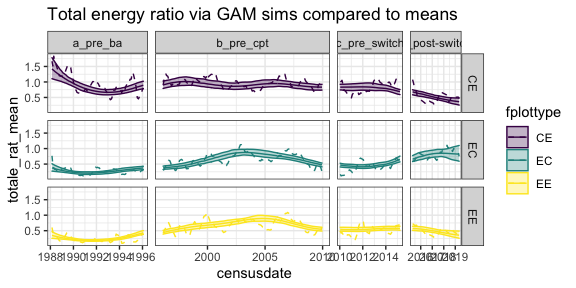
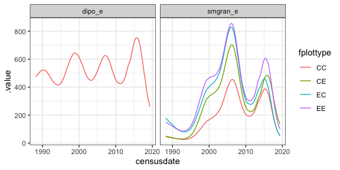
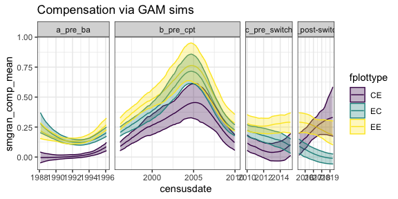
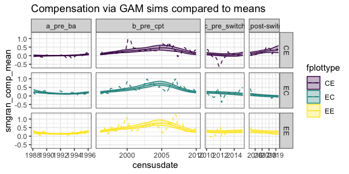

GAMs for ratios
================

For two of the major pieces of this analysis, we are primarily
interested in how certain ratios have changed over time: the ratio of
total energy use on treatment:control plots, and the amount of
compensation happening from non-Dipos on treatment relative to control
plots.

This is complicated somewhat by the experimental setup: we have 3-5 of
each type of plot, and there’s variability between plots within a
treatment.

The naive way to handle this is to take the treatment-level mean for
each time step, compute the ratio, and analyze that. This is what was
done in Ernest and Brown (2001).

    ## Loading in data version 2.49.0

    ## Joining, by = "plot"

    ## Joining, by = "period"

<!-- -->

    ## Joining, by = "period"

<!-- -->

You could then fit a model of the general structure `response ~ oera *
oplottype, cor = corAR1` and investigate contrasts between, for example,
compensation on EEs in c vs b.

However, if possible, it would be nice to incroporate the plot-level
variability into our estimates of these quantities.

Following is me doing this using GAMs.

### GAMs for plot level variability, total e

``` r
plotl <- get_plot_totals() %>%
  mutate(fplottype = as.factor(plot_type),
         fera = as.factor(era))
```

    ## Loading in data version 2.49.0

    ## Joining, by = "plot"

``` r
totale_gam <- gam(total_e ~ fplottype + s(period, by = fplottype) + s(plot, bs = "re"), data = plotl, family = "tw")

plotl_pdat <- plotl %>%
  select(censusdate, period, fera, fplottype, oera) %>%
  distinct()

totale_gam_pred <- plotl_pdat %>%
  add_fitted(totale_gam, exclude = "s(plot)", newdata.guaranteed =T)

ggplot(totale_gam_pred, aes(censusdate, .value, color = fplottype)) +
  geom_line()
```

<!-- -->

``` r
totale_gam_sim <- fitted_samples(totale_gam, n = 100, newdata = plotl_pdat, exclude = "s(plot)", newdata.guaranteed = T, seed = 1977) %>%
  left_join(mutate(plotl_pdat, row = dplyr::row_number()))
```

    ## Joining, by = "row"

``` r
controls_gam_sim <- filter(totale_gam_sim, fplottype == "CC")

ratio_gam_sim <- totale_gam_sim %>%
  filter(fplottype != "CC") %>%
  left_join(rename(select(controls_gam_sim, draw, fitted, period, fera, oera), fitted_c = fitted)) %>%
  mutate(totale_rat = fitted / fitted_c) %>%
  group_by(censusdate, period, fera, oera, fplottype) %>%
  summarize(totale_rat_mean = mean(totale_rat),
         totale_rat_lwr = quantile(totale_rat, .025),
         totale_rat_upr = quantile(totale_rat, .975)) %>%
  ungroup() 
```

    ## Joining, by = c("draw", "period", "fera", "oera")

    ## `summarise()` has grouped output by 'censusdate', 'period', 'fera', 'oera'. You can override using the `.groups` argument.

``` r
ggplot(ratio_gam_sim, aes(censusdate, totale_rat_mean, color  = fplottype, fill = fplottype)) +
  geom_line() +
  geom_ribbon(aes(ymin  = totale_rat_lwr,
                  ymax = totale_rat_upr), alpha = .3) +
  ggtitle("Total energy ratio via GAM sims") +
  scale_color_viridis_d() +
  scale_fill_viridis_d() +
  era_grid
```

<!-- -->

These estimates incorporate among-plot variability in the estimates.
Note that these 95% intervals are not **simultaneous** intervals,
because the calculation for simultaneous intervals comparing factor
levels doesn’t work if there are ratios involved.

Compared to the means, you end up in a very similar place:

<!-- -->

### Compensation

``` r
comp_data <- plotl %>%
  select(period, censusdate, era, oera, plot, plot_type, fplottype, oplottype, fera, dipo_e, smgran_e) %>%
  tidyr::pivot_longer(c("dipo_e", "smgran_e"), names_to = "rod_group", values_to = "energy") %>%
  mutate(rod_group = as.factor(rod_group),
         rod_group_trt = paste0(rod_group, "_", plot_type)) %>%
  mutate(rod_group_trt = as.factor(rod_group_trt)) %>%
  filter(rod_group_trt %in% c("dipo_e_CC", "smgran_e_CC", "smgran_e_EE", "smgran_e_CE", "smgran_e_EC")) 


comp_gam <- gam(energy ~ fplottype + rod_group + s(period, by = fplottype) + s(period, by = rod_group) + s(plot, bs = "re"), data = comp_data, family = "tw")

comp_pdat <- comp_data %>%
  select(censusdate, period, fera, fplottype, oera, rod_group) %>%
  distinct()

comp_gam_pred <- comp_pdat %>%
  add_fitted(comp_gam, exclude = "s(plot)", newdata.guaranteed =T)

ggplot(comp_gam_pred, aes(censusdate, .value, color = fplottype)) +
  geom_line() +
  facet_wrap(vars(rod_group))
```

<!-- -->

``` r
comp_gam_sim <- fitted_samples(comp_gam, n = 100, newdata = comp_pdat, exclude = "s(plot)", newdata.guaranteed = T, seed = 1977) %>%
  left_join(mutate(comp_pdat, row = dplyr::row_number()))
```

    ## Joining, by = "row"

``` r
controls_comp_gam_sim <- filter(comp_gam_sim, fplottype == "CC") %>%
  select(-row) %>%
  tidyr::pivot_wider(names_from = rod_group, values_from = fitted) %>%
  rename(dipo_e_c = dipo_e,
         smgran_e_c = smgran_e) %>%
  select(-fplottype)

smgran_comp_gam_sim <- comp_gam_sim %>%
  filter(fplottype != "CC") %>%
  select(-row) %>%
  tidyr::pivot_wider(names_from = rod_group, values_from = fitted) %>% 
  left_join(controls_comp_gam_sim) %>%
  mutate(smgran_increase = smgran_e - smgran_e_c) %>%
  mutate(smgran_comp = smgran_increase/ dipo_e_c) %>%
  group_by(censusdate, period, fera, oera, fplottype) %>%
  summarize(smgran_comp_mean = mean(smgran_comp),
         smgran_comp_lwr = quantile(smgran_comp, .025),
         smgran_comp_upr = quantile(smgran_comp, .975)) %>%
  ungroup() 
```

    ## Joining, by = c("draw", "censusdate", "period", "fera", "oera")

    ## `summarise()` has grouped output by 'censusdate', 'period', 'fera', 'oera'. You can override using the `.groups` argument.

``` r
ggplot(smgran_comp_gam_sim, aes(censusdate, smgran_comp_mean, color  = fplottype, fill = fplottype)) +
  geom_line() +
  geom_ribbon(aes(ymin  = smgran_comp_lwr,
                  ymax = smgran_comp_upr), alpha = .3) +
  ggtitle("Compensation via GAM sims") +
  scale_color_viridis_d() +
  scale_fill_viridis_d() +
  era_grid
```

<!-- -->

``` r
ggplot(smgran_comp_gam_sim, aes(censusdate, smgran_comp_mean, color  = fplottype, fill = fplottype)) +
  geom_line() +
  geom_ribbon(aes(ymin  = smgran_comp_lwr,
                  ymax = smgran_comp_upr), alpha = .3) +
  ggtitle("Total energy ratio via GAM sims compared to means") +
  scale_color_viridis_d() +
  scale_fill_viridis_d() +
  geom_line(data =compensation, aes(censusdate, smgran_comp_ma, color = fplottype), linetype = 2) +
  facet_grid(rows = vars(fplottype), cols = vars(oera), space = "free_x", scales = "free_x")
```

<!-- -->

Again, you end up in a very similar place to using just the means.

However, note that in both the compensation approaches, there’s the
possibility that the treatment small granivores are not “significantly”
greater than the controls, which casts some doubt on the “significance”
of the compensation effect. Currently my best thought for how to
represent this is to fit `gam(smgran_e ~ fplottype + s(period, by =
fplottype) + s(plot, bs = "re"))`, identify the periods of time when the
different treatment smooths overlap the control smooth, and flag those
as periods when the “significance” of the compensatory effect is
suspect.
