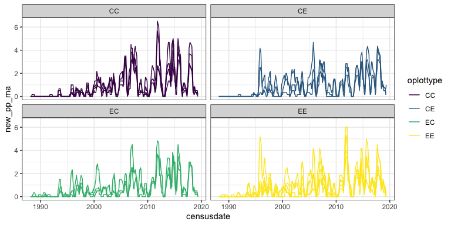
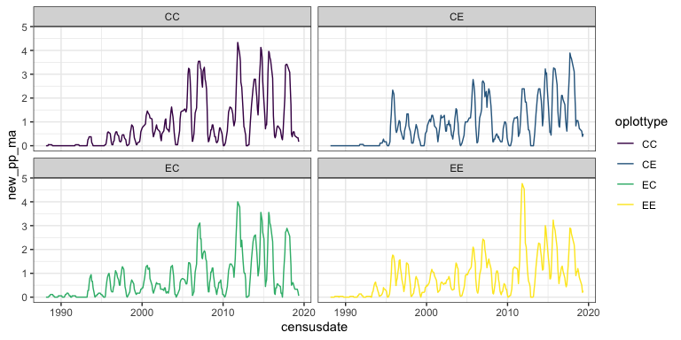

PB
================
Renata Diaz
2021-03-30

``` r
plot_ps <- get_plot_totals(use_pre_switch = F, currency = "abundance") %>%
  add_new_pps()
```

    ## Loading in data version 2.49.0

    ## Joining, by = "plot"

    ## Joining, by = c("period", "censusdate", "plot")

``` r
#treat_ps <- get_treatment_means(use_pre_switch = F, currency = "abundance") 

ggplot(plot_ps, aes(censusdate, new_pp_ma, color = oplottype, group = fplot)) +
  geom_line() +
  facet_wrap(vars(oplottype))
```

<!-- -->

``` r
new_pp_means <- plot_ps %>%
  group_by(censusdate, period, era, oera, plot_type, fplottype, oplottype) %>%
  summarize(new_pp = mean(new_pp)) %>%
  ungroup() %>%
  group_by(plot_type) %>%
  mutate(new_pp_ma = maopts(new_pp)) %>%
  ungroup()
```

    ## `summarise()` has grouped output by 'censusdate', 'period', 'era', 'oera', 'plot_type', 'fplottype'. You can override using the `.groups` argument.

``` r
ggplot(new_pp_means, aes(censusdate, new_pp_ma, color = oplottype)) +
  geom_line() +
  facet_wrap(vars(oplottype))
```

<!-- -->
