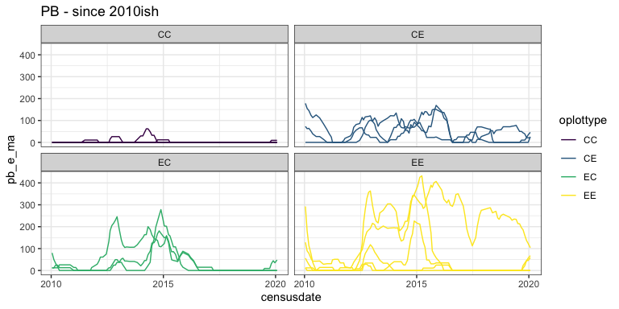
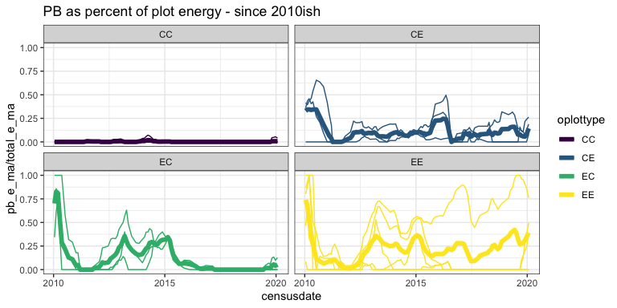
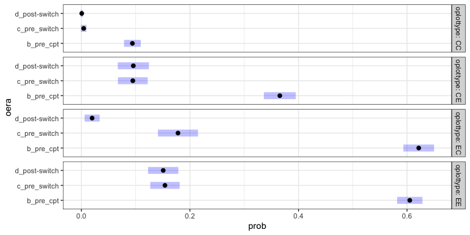

PB
================
Renata Diaz
2021-03-29

  - [models](#models)

``` r
plot_ps <- get_plot_totals(use_pre_switch = F)
```

    ## Loading in data version 2.49.0

    ## Joining, by = "plot"

``` r
treat_ps <- get_treatment_means(use_pre_switch = F) 
```

    ## Loading in data version 2.49.0
    ## Joining, by = "plot"

``` r
ggplot(filter(plot_ps), aes(censusdate, pb_e_ma,group = plot, color = oplottype)) +
  geom_line() +
  facet_wrap(vars(oplottype)) +
  ggtitle("PB - all time")
```

<!-- -->

``` r
ggplot(filter(plot_ps, as.numeric(oera) > 2), aes(censusdate, pb_e_ma,group = plot, color = oplottype)) +
  geom_line() +
  facet_wrap(vars(oplottype)) +
  ggtitle("PB - since 2010ish")
```

<!-- -->

``` r
ggplot(filter(plot_ps), aes(censusdate, pb_e_ma/total_e_ma,group = plot, color = oplottype)) +
  geom_line() +
  facet_wrap(vars(oplottype)) +
  ggtitle("PB as percent of plot energy - all time") +
  geom_line(data = filter(treat_ps), aes(censusdate, pb_e_ma/total_e_ma, color = oplottype), inherit.aes = F, size = 2)
```

<!-- -->

``` r
ggplot(filter(plot_ps, as.numeric(oera) > 2), aes(censusdate, pb_e_ma / total_e_ma,group = plot, color = oplottype)) +
  geom_line() +
  facet_wrap(vars(oplottype)) +
  ggtitle("PB as percent of plot energy - since 2010ish") +
  geom_line(data = filter(treat_ps, as.numeric(oera) > 2), aes(censusdate, pb_e_ma/total_e_ma, color = oplottype), inherit.aes = F, size = 2)
```

<!-- -->

### models

``` r
library(mgcv)
```

    ## Loading required package: nlme

    ## 
    ## Attaching package: 'nlme'

    ## The following object is masked from 'package:dplyr':
    ## 
    ##     collapse

    ## This is mgcv 1.8-33. For overview type 'help("mgcv-package")'.

``` r
plot_ps_pb <- plot_ps %>%
  mutate(pb_prop = pb_e / total_e,
         fplottype = as.factor(plot_type),
         fplot = as.factor(plot)) %>%
  filter(as.numeric(oera) > 1) %>%
  mutate(pb_prop = ifelse(is.nan(pb_prop), 0, pb_prop),
         row = dplyr::row_number())

cc_era4 <- plot_ps_pb %>%
  filter(plot_type=="CC", as.numeric(oera) == 4) %>%
  select(row)

plot_ps_pb <- plot_ps_pb %>%
  filter(!(row %in% cc_era4$row))


#qbin_gam <- gam(pb_prop ~ s(period, by = fplottype, k = 50) + s(fplot, bs = "re"), data = plot_ps_pb, family = quasibinomial())
qbin_gam <- gam(pb_prop ~ s(period, by = fplottype), data = plot_ps_pb, family = quasibinomial())

qbin_fit <- plot_ps_pb %>%
  gratia::add_fitted(qbin_gam, exclude = "s(fplot)") 

cc_era4 <- qbin_fit %>%
  filter(plot_type=="CC", as.numeric(oera) == 4) %>%
  select(row)
qbin_fit <- qbin_fit%>%
  filter(!(row %in% cc_era4$row))

ggplot(qbin_fit, aes(period, .value,color = fplottype)) +
  geom_line() +
  geom_line(data = filter(treat_ps, as.numeric(oera) > 1), aes(period, pb_e_ma/total_e_ma, color = oplottype), inherit.aes = F)
```

<!-- -->

``` r
library(gratia)
library(emmeans)


qbin_confint <- confint(qbin_gam, parm = "s(period)", type = "simultaneous", shift= T, transform = T, newdata = plot_ps_pb) %>%
  right_join(select(plot_ps_pb, period, oera)) %>%
  mutate(row = dplyr::row_number()) 
```

    ## Joining, by = "period"

``` r
cc_era4 <- qbin_confint %>%
  filter(fplottype=="CC", as.numeric(oera) == 4) %>%
  select(row)

qbin_confint <- qbin_confint %>%
  filter(!(row %in% cc_era4$row))

ggplot(qbin_confint, aes(period, est, color = fplottype, fill = fplottype)) +
  geom_line() +
  geom_ribbon(aes(ymin = lower, ymax = upper), alpha = .3) +
  facet_wrap(vars(fplottype))
```

<!-- -->

``` r
qbin_int_gam <- gam(pb_prop ~ oera * oplottype + s(fplot, bs = "re"), family = quasibinomial(), data= plot_ps_pb)

qbin_int_gam_fit <- plot_ps_pb %>%
  add_fitted(qbin_int_gam, exclude = "s(fplot)")

ggplot(qbin_int_gam_fit, aes(censusdate, .value, color = oplottype)) +
  geom_line()
```

<!-- -->

``` r
pairs(emmeans(qbin_int_gam, specs = ~ oera | oplottype))
```

    ## NOTE: A nesting structure was detected in the fitted model:
    ##     fplot %in% oplottype

    ## oplottype = CC:
    ##  contrast                       estimate    SE   df t.ratio p.value
    ##  b_pre_cpt - c_pre_switch        3.20247 0.637 3347  5.024  <.0001 
    ##  b_pre_cpt - (d_post-switch)     3.37295 0.223 3347 15.151  <.0001 
    ##  c_pre_switch - (d_post-switch)  0.17048 0.675 3347  0.252  0.9655 
    ## 
    ## oplottype = CE:
    ##  contrast                       estimate    SE   df t.ratio p.value
    ##  b_pre_cpt - c_pre_switch        1.71124 0.176 3347  9.733  <.0001 
    ##  b_pre_cpt - (d_post-switch)     1.71512 0.200 3347  8.595  <.0001 
    ##  c_pre_switch - (d_post-switch)  0.00387 0.249 3347  0.016  0.9999 
    ## 
    ## oplottype = EC:
    ##  contrast                       estimate    SE   df t.ratio p.value
    ##  b_pre_cpt - c_pre_switch        2.02830 0.144 3347 14.090  <.0001 
    ##  b_pre_cpt - (d_post-switch)     4.67322 0.470 3347  9.934  <.0001 
    ##  c_pre_switch - (d_post-switch)  2.64492 0.484 3347  5.465  <.0001 
    ## 
    ## oplottype = EE:
    ##  contrast                       estimate    SE   df t.ratio p.value
    ##  b_pre_cpt - c_pre_switch        2.12013 0.119 3347 17.791  <.0001 
    ##  b_pre_cpt - (d_post-switch)     2.38691 0.143 3347 16.652  <.0001 
    ##  c_pre_switch - (d_post-switch)  0.26678 0.168 3347  1.588  0.2511 
    ## 
    ## Results are averaged over the levels of: fplot 
    ## Results are given on the log odds ratio (not the response) scale. 
    ## P value adjustment: tukey method for comparing a family of 3 estimates

``` r
regrid(emmeans(qbin_int_gam, specs = ~ oera | oplottype))
```

    ## NOTE: A nesting structure was detected in the fitted model:
    ##     fplot %in% oplottype

    ## oplottype = CC:
    ##  oera             prob       SE   df lower.CL upper.CL
    ##  b_pre_cpt     0.09400 0.007931 3347  0.07845  0.10955
    ##  c_pre_switch  0.00420 0.002648 3347 -0.00099  0.00939
    ##  d_post-switch 0.00354 0.000852 3347  0.00187  0.00522
    ## 
    ## oplottype = CE:
    ##  oera             prob       SE   df lower.CL upper.CL
    ##  b_pre_cpt     0.36473 0.015153 3347  0.33502  0.39444
    ##  c_pre_switch  0.09397 0.014047 3347  0.06643  0.12151
    ##  d_post-switch 0.09364 0.016133 3347  0.06201  0.12527
    ## 
    ## oplottype = EC:
    ##  oera             prob       SE   df lower.CL upper.CL
    ##  b_pre_cpt     0.62168 0.014533 3347  0.59319  0.65018
    ##  c_pre_switch  0.17776 0.018986 3347  0.14053  0.21498
    ##  d_post-switch 0.01512 0.006944 3347  0.00150  0.02873
    ## 
    ## oplottype = EE:
    ##  oera             prob       SE   df lower.CL upper.CL
    ##  b_pre_cpt     0.60441 0.011999 3347  0.58088  0.62793
    ##  c_pre_switch  0.15495 0.013985 3347  0.12753  0.18237
    ##  d_post-switch 0.12314 0.014366 3347  0.09497  0.15130
    ## 
    ## Results are averaged over the levels of: fplot 
    ## Confidence level used: 0.95

``` r
qbin_glm <- glm(pb_prop ~ oera * oplottype, family = quasibinomial(), data= plot_ps_pb)

summary(qbin_glm)
```

    ## 
    ## Call:
    ## glm(formula = pb_prop ~ oera * oplottype, family = quasibinomial(), 
    ##     data = plot_ps_pb)
    ## 
    ## Deviance Residuals: 
    ##      Min        1Q    Median        3Q       Max  
    ## -1.39247  -0.47842  -0.09665   0.40937   2.11078  
    ## 
    ## Coefficients: (1 not defined because of singularities)
    ##                    Estimate Std. Error t value Pr(>|t|)    
    ## (Intercept)         -1.7166     0.2234  -7.686 1.98e-14 ***
    ## oera.L              -1.1384     0.4011  -2.838 0.004562 ** 
    ## oera.Q               1.1224     0.2027   5.537 3.30e-08 ***
    ## oplottype.L          1.0352     0.6553   1.580 0.114267    
    ## oplottype.Q         -0.1291     0.5217  -0.248 0.804528    
    ## oplottype.C          0.4602     0.2070   2.224 0.026224 *  
    ## oera.L:oplottype.L  -2.4433     1.2150  -2.011 0.044403 *  
    ## oera.Q:oplottype.L  -2.0372     0.6226  -3.272 0.001078 ** 
    ## oera.L:oplottype.Q   2.1535     0.9704   2.219 0.026544 *  
    ## oera.Q:oplottype.Q   1.8451     0.4946   3.731 0.000194 ***
    ## oera.L:oplottype.C   0.7877     0.3067   2.568 0.010272 *  
    ## oera.Q:oplottype.C       NA         NA      NA       NA    
    ## ---
    ## Signif. codes:  0 '***' 0.001 '**' 0.01 '*' 0.05 '.' 0.1 ' ' 1
    ## 
    ## (Dispersion parameter for quasibinomial family taken to be 0.4177204)
    ## 
    ##     Null deviance: 2444.7  on 3368  degrees of freedom
    ## Residual deviance: 1530.8  on 3358  degrees of freedom
    ## AIC: NA
    ## 
    ## Number of Fisher Scoring iterations: 7

``` r
ilink <- qbin_glm$family$linkinv

qbin_glm_se <- predict(qbin_glm, type = "link", se.fit = T, newdata = plot_ps_pb) %>%
  as.data.frame() %>%
  mutate(est = ilink(fit),
         lower = ilink(fit - 2*se.fit),
         upper = ilink(fit + 2*se.fit),
         period = plot_ps_pb$period,
         oplottype = plot_ps_pb$oplottype)
```

    ## Warning in predict.lm(object, newdata, se.fit, scale = residual.scale, type = if
    ## (type == : prediction from a rank-deficient fit may be misleading

``` r
ggplot(qbin_glm_se, aes(period, est, color = oplottype, fill = oplottype)) +
  geom_line() +
  geom_ribbon(aes(ymin = lower, ymax= upper), alpha = .3)
```

<!-- -->

``` r
pairs(emmeans(qbin_glm, specs = ~ oera | oplottype))
```

    ## oplottype = CC:
    ##  contrast                       estimate    SE  df z.ratio p.value
    ##  b_pre_cpt - c_pre_switch        3.18741 0.663 Inf  4.806  <.0001 
    ##  b_pre_cpt - (d_post-switch)      nonEst    NA  NA     NA      NA 
    ##  c_pre_switch - (d_post-switch)   nonEst    NA  NA     NA      NA 
    ## 
    ## oplottype = CE:
    ##  contrast                       estimate    SE  df z.ratio p.value
    ##  b_pre_cpt - c_pre_switch        1.60905 0.179 Inf  9.012  <.0001 
    ##  b_pre_cpt - (d_post-switch)     1.61280 0.203 Inf  7.941  <.0001 
    ##  c_pre_switch - (d_post-switch)  0.00375 0.255 Inf  0.015  0.9999 
    ## 
    ## oplottype = EC:
    ##  contrast                       estimate    SE  df z.ratio p.value
    ##  b_pre_cpt - c_pre_switch        2.01320 0.149 Inf 13.482  <.0001 
    ##  b_pre_cpt - (d_post-switch)     4.65269 0.490 Inf  9.496  <.0001 
    ##  c_pre_switch - (d_post-switch)  2.63949 0.504 Inf  5.236  <.0001 
    ## 
    ## oplottype = EE:
    ##  contrast                       estimate    SE  df z.ratio p.value
    ##  b_pre_cpt - c_pre_switch        1.90883 0.116 Inf 16.467  <.0001 
    ##  b_pre_cpt - (d_post-switch)     2.15602 0.141 Inf 15.318  <.0001 
    ##  c_pre_switch - (d_post-switch)  0.24719 0.169 Inf  1.466  0.3076 
    ## 
    ## Results are given on the log odds ratio (not the response) scale. 
    ## P value adjustment: tukey method for comparing a family of 3 estimates

``` r
qbin_glm_se <- qbin_glm_se %>%
  right_join(select(plot_ps_pb, oera, oplottype, period))
```

    ## Joining, by = c("period", "oplottype")

``` r
qbin_glm_se %>%
  select(oera, oplottype, est, lower, upper) %>%
  distinct()
```

<div class="kable-table">

| oera           | oplottype |       est |     lower |     upper |
| :------------- | :-------- | --------: | --------: | --------: |
| b\_pre\_cpt    | CE        | 0.3773377 | 0.3476993 | 0.4079226 |
| b\_pre\_cpt    | EE        | 0.5917202 | 0.5678468 | 0.6151686 |
| b\_pre\_cpt    | CC        | 0.1018690 | 0.0866937 | 0.1193535 |
| b\_pre\_cpt    | EC        | 0.6207243 | 0.5901169 | 0.6504002 |
| c\_pre\_switch | CE        | 0.1081368 | 0.0799395 | 0.1447157 |
| c\_pre\_switch | EE        | 0.1768627 | 0.1483183 | 0.2095489 |
| c\_pre\_switch | CC        | 0.0046602 | 0.0012560 | 0.0171319 |
| c\_pre\_switch | EC        | 0.1793774 | 0.1430338 | 0.2225573 |
| d\_post-switch | CE        | 0.1077759 | 0.0759257 | 0.1508065 |
| d\_post-switch | EE        | 0.1436942 | 0.1141707 | 0.1793068 |
| d\_post-switch | EC        | 0.0153667 | 0.0058725 | 0.0395991 |

</div>

``` r
treat_ps %>%
  group_by(oera, oplottype) %>%
  summarize(mean_pb_prop = mean(pb_e / total_e, na.rm = T)) %>%
  ungroup()
```

    ## `summarise()` has grouped output by 'oera'. You can override using the `.groups` argument.

<div class="kable-table">

| oera           | oplottype | mean\_pb\_prop |
| :------------- | :-------- | -------------: |
| a\_pre\_ba     | CC        |      0.0000000 |
| a\_pre\_ba     | CE        |      0.0004537 |
| a\_pre\_ba     | EC        |      0.0009833 |
| a\_pre\_ba     | EE        |      0.0000000 |
| b\_pre\_cpt    | CC        |      0.1046083 |
| b\_pre\_cpt    | CE        |      0.3667359 |
| b\_pre\_cpt    | EC        |      0.6523698 |
| b\_pre\_cpt    | EE        |      0.6541999 |
| c\_pre\_switch | CC        |      0.0046035 |
| c\_pre\_switch | CE        |      0.1072642 |
| c\_pre\_switch | EC        |      0.2174779 |
| c\_pre\_switch | EE        |      0.2246082 |
| d\_post-switch | CC        |      0.0000000 |
| d\_post-switch | CE        |      0.1273288 |
| d\_post-switch | EC        |      0.0148593 |
| d\_post-switch | EE        |      0.2481597 |

</div>

KKKK, the above code is a mess, but things I think I’m learning…

  - PB has declined sitewide, raw and as a proportion of total energy
    use.
  - It is now totally absent on control plots. (this creates a bunch of
    issues for glms, so I removed the data - all 0s - for CC era 4)
  - There are a lot of modeling options and none of them are perfect.
    Some notes on the considerations:
      - The GAMs fit with a smooth for period and a random effect for
        plot were doing a really bad job; they’d fit control higher than
        any other treatment even though that’s just Wrong. This might be
        fixable by increasing the k for the period smooth, but I haven’t
        gone deep in there because models with high k take a while to
        run and this isn’t exactly what I’m trying to learn right now.
      - I’ve been working with both betar() and quasibinomial() as
        GAM/GLM families. I think they give essentially the same results
        in this application, but haven’t tested extensively.

What I really wanted to know was,

how much energy is PB using *now* on exclosures vs. when it was more
dominant? And that looks like, an estimate now of about 14-18% post-2010
compared to about 60% pre-2010. Compared to, essentially none on control
plots. (Although note, oddly enough, it was more abundant on C –\> E
plots prior to the switch than on C –\> C plots. I see this a bunch and
I think it means we can’t use those plots to get at priority effects.)
