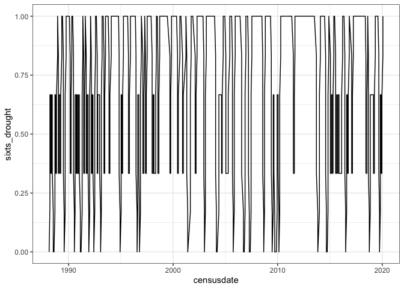
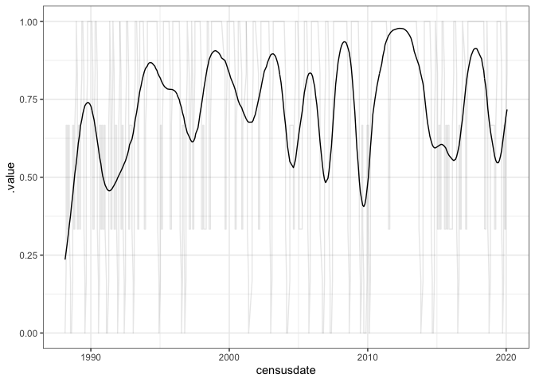
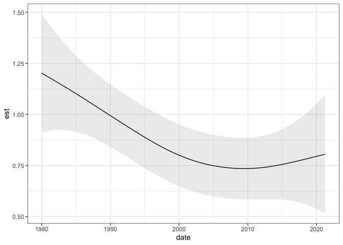
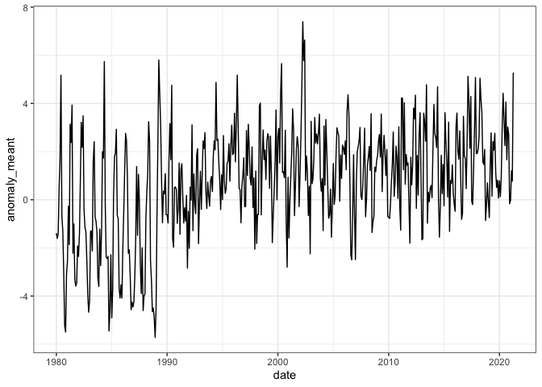
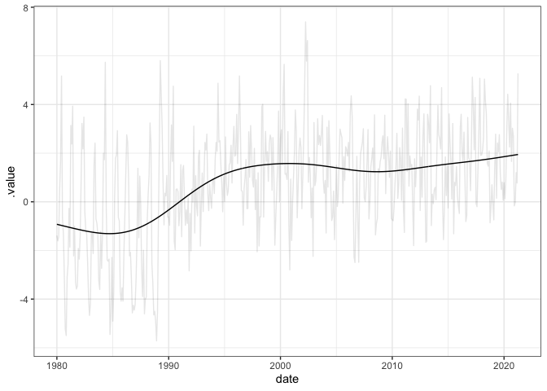

ndvi anomaly
================

``` r
rods <- get_treatment_means() 
```

    ## Loading in data version 2.95.0

    ## Joining, by = "plot"

``` r
rod_ts <- rods %>%
  mutate(year = as.integer(format.Date(censusdate, "%Y")),
         month = as.integer( format.Date(censusdate, "%m")))

weather <- weather(level = "monthly", fill = T)


weather <- weather %>%
    dplyr::mutate(date = format(lubridate::parse_date_time(paste(month, year, sep=" "),
                                                           orders = c("m/Y")), "%m-%Y")) %>%
    dplyr::mutate(date = as.Date(paste("01",date,sep="-"), format="%d-%m-%Y"))  %>%
  mutate(numdate = as.numeric(date))

drought_ma <- rod_ts %>%
  select(censusdate, period, year, month) %>%
  left_join(weather) %>%
  mutate(below_avg = as.numeric(anomaly_ppt < 1)) %>%
  mutate(sixts_drought = maopts(below_avg))
```

    ## Joining, by = c("year", "month")

``` r
ggplot(drought_ma, aes(censusdate, sixts_drought)) +
  geom_line()
```

<!-- -->

``` r
library(gratia)

load_mgcv()

drought_gam <- gam(sixts_drought ~ s(period, k = 30), data = drought_ma, family = quasibinomial)

drought_ma_fit <- drought_ma %>%
  add_fitted(drought_gam)

ggplot(drought_ma_fit, aes(censusdate, .value)) +
  geom_line() +
  geom_line(aes(y = sixts_drought), alpha = .1)
```

<!-- -->

``` r
anomaly_gam <- gam(anomaly_ppt ~ s(numdate, k=100), data = weather, na.action = na.omit)

anomaly_fit <- weather %>%
  add_fitted(anomaly_gam)

anomaly_confint <- confint(anomaly_gam, "s(numdate)", newdata = weather, shift= T, type= "simultaneous")

anomaly_confint <- left_join(anomaly_confint, select(weather, numdate, date))
```

    ## Joining, by = "numdate"

``` r
ggplot(anomaly_confint, aes(date, est)) +
  geom_line() +
  geom_ribbon(aes(ymin = lower, ymax = upper), alpha = .1)
```

<!-- -->

``` r
meantemp <- weather %>%
    dplyr::select(date, numdate, meantemp, anomaly_meant) %>%
    dplyr::mutate(col = ifelse(anomaly_meant >= 0, "red", "blue"),
                  ystart = 0)

ggplot(meantemp, aes(date, anomaly_meant)) +
  geom_line()
```

<!-- -->

``` r
meant_gam <- gam(anomaly_meant ~ s(numdate), data = meantemp)

meant_pred <- meantemp %>%
  add_fitted(meant_gam)

ggplot(meant_pred, aes(date, .value)) +
  geom_line() +
  geom_line(aes(y = anomaly_meant), alpha = .1)
```

<!-- -->
