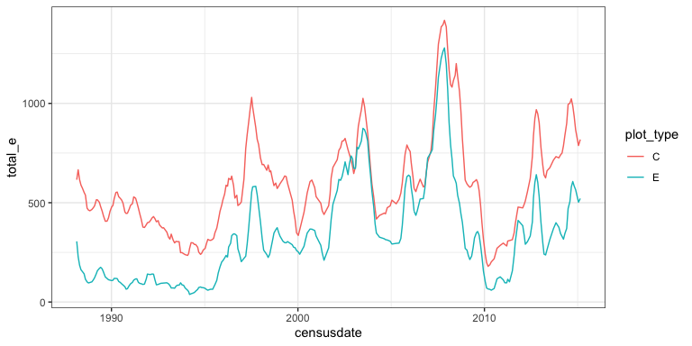
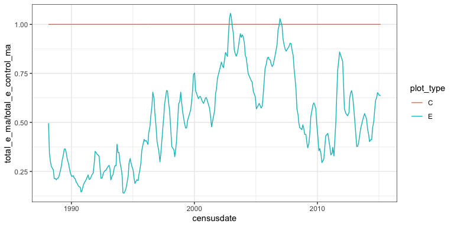
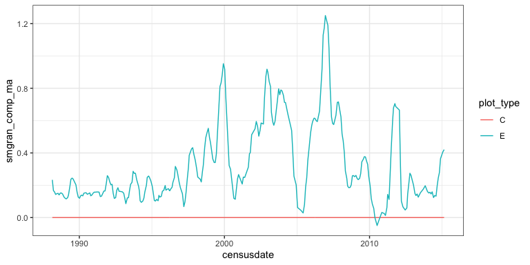
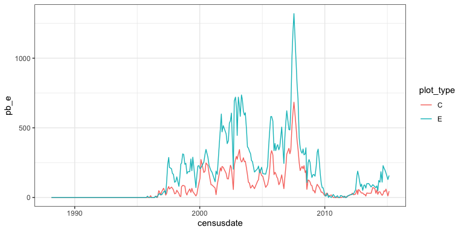

Raw data
================
Renata Diaz
2021-03-25

  - [Total energy use on control and treatment
    plots](#total-energy-use-on-control-and-treatment-plots)
      - [1988-2015](#section)
  - [Energy use on treatment relative to control
    plots](#energy-use-on-treatment-relative-to-control-plots)
      - [1988-2015](#section-1)
  - [Compensation](#compensation)
      - [1988-2015](#section-2)
  - [PB energy use](#pb-energy-use)
      - [1988-2015](#section-3)

# Total energy use on control and treatment plots

## 1988-2015

Allows for 8 plots of each treatment type.

``` r
trt_ps <- get_treatment_means(use_pre_switch = T)
```

    ## Loading in data version 2.49.0

    ## Joining, by = "plot"

``` r
ggplot(trt_ps, aes(censusdate, total_e, color = plot_type)) +
 # geom_line() +
  geom_line(aes(y = total_e_ma))
```

<!-- -->

# Energy use on treatment relative to control plots

## 1988-2015

``` r
trt_ps_c <- add_control_values(trt_ps)
```

    ## Joining, by = c("period", "censusdate", "era")

``` r
ggplot(trt_ps_c, aes(censusdate, total_e_ma / total_e_control_ma, color = plot_type)) +
  geom_line()
```

<!-- -->

# Compensation

## 1988-2015

``` r
trt_ps_c_comp <- trt_ps_c %>%
  mutate(smgran_comp = (smgran_e - smgran_e_control) / (dipo_e_control)) %>%
  group_by(plot_type) %>%
  mutate(smgran_comp_ma = maopts(smgran_comp)) %>%
  ungroup()

ggplot(trt_ps_c_comp, aes(censusdate, smgran_comp_ma, color = plot_type)) +
  geom_line()
```

<!-- -->

# PB energy use

## 1988-2015

``` r
ggplot(trt_ps, aes(censusdate, pb_e, color = plot_type)) +
  geom_line()
```

<!-- -->
