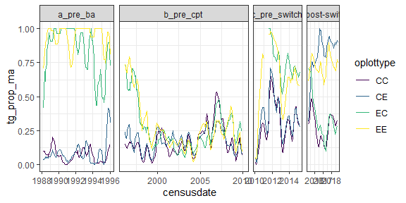
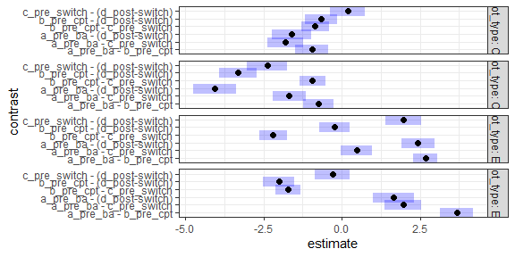
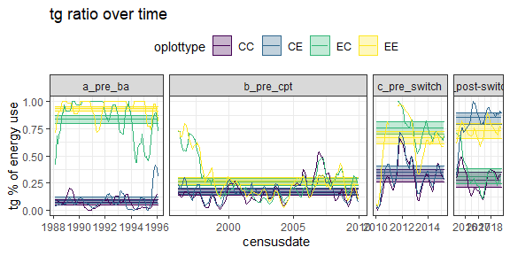
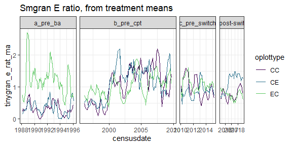
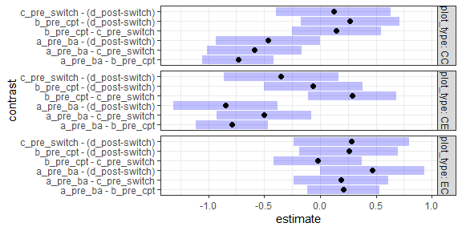
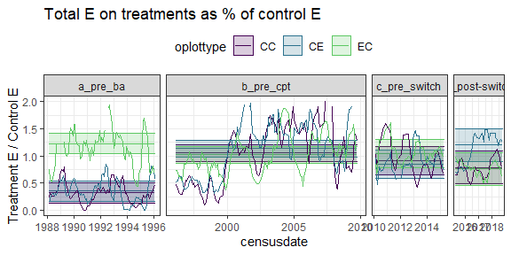
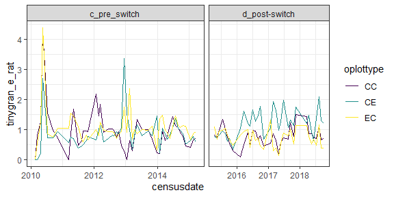
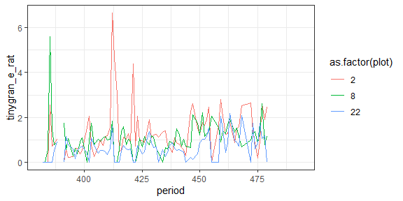

Small granivore energy use
================

tg as a % of treatment use

    ## Loading in data version 2.18.0

    ## Joining, by = "plot"

<!-- --><!-- -->

    ## Joining, by = c("period", "plot_type")

<!-- -->

tg on non-exclosures v EE

    ## Joining, by = "period"

<!-- --><!-- -->

    ## Joining, by = c("era", "plot_type")

<!-- -->
<!-- -->

    ## Loading in data version 2.18.0

    ## Joining, by = "plot"

    ## Joining, by = "period"

    ## Warning: Removed 42 row(s) containing missing values (geom_path).

<!-- -->
