GAM
================

    ## [[1]]
    ## [1] 55179.22
    ## 
    ## [[2]]
    ## [1] 55768.12
    ## 
    ## [[3]]
    ## [1] 55425.49

    ## Joining, by = "oPlot"

<!-- --><!-- -->

    ## Joining, by = c("censusdate", "compare_trt")

    ## Warning: Removed 500 row(s) containing missing values (geom_path).

    ## Warning in max(ids, na.rm = TRUE): no non-missing arguments to max; returning -
    ## Inf

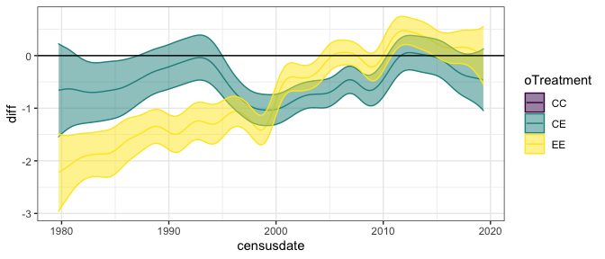<!-- -->

    ## Joining, by = "oPlot"

<!-- -->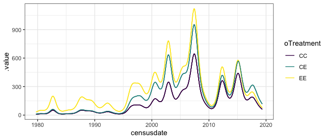<!-- -->

    ## Joining, by = c("censusdate", "compare_trt")

    ## Warning: Removed 500 row(s) containing missing values (geom_path).
    
    ## Warning: no non-missing arguments to max; returning -Inf

<!-- -->

    ## Joining, by = "oPlot"

<!-- -->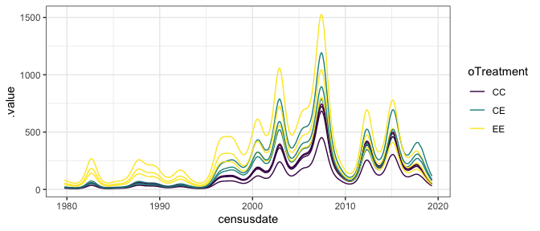<!-- -->

    ## Joining, by = c("censusdate", "compare_trt")

    ## Warning: Removed 500 row(s) containing missing values (geom_path).
    
    ## Warning: no non-missing arguments to max; returning -Inf

<!-- -->

# smgran

    ## [[1]]
    ## [1] 40655.38
    ## 
    ## [[2]]
    ## [1] 41205.04
    ## 
    ## [[3]]
    ## [1] 40851.95

    ## Joining, by = "oPlot"

<!-- -->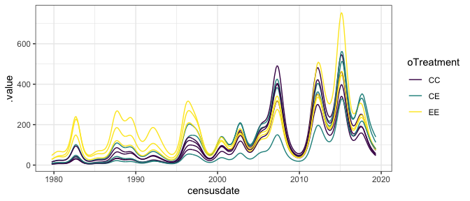<!-- -->

    ## Joining, by = c("censusdate", "compare_trt")

    ## Warning: Removed 500 row(s) containing missing values (geom_path).

    ## Warning in max(ids, na.rm = TRUE): no non-missing arguments to max; returning -
    ## Inf

<!-- -->

    ## Joining, by = "oPlot"

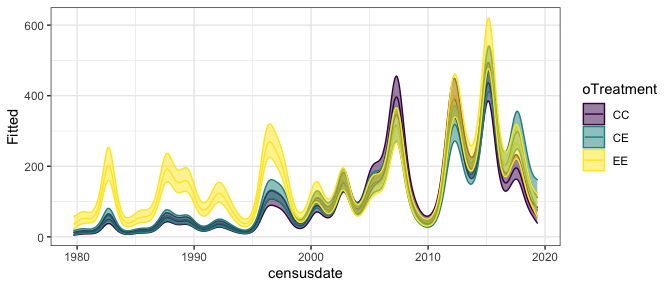<!-- --><!-- -->

    ## Joining, by = c("censusdate", "compare_trt")

    ## Warning: Removed 500 row(s) containing missing values (geom_path).
    
    ## Warning: no non-missing arguments to max; returning -Inf

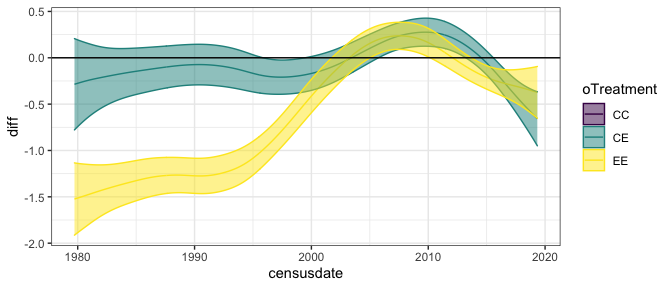<!-- -->

    ## Joining, by = "oPlot"

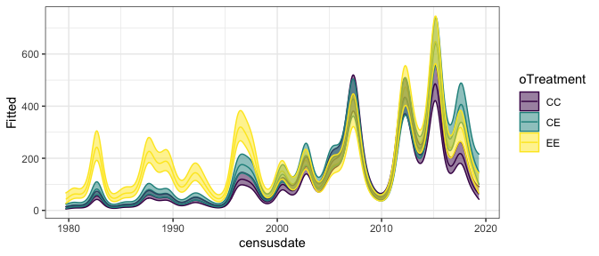<!-- --><!-- -->

    ## Joining, by = c("censusdate", "compare_trt")

    ## Warning: Removed 500 row(s) containing missing values (geom_path).
    
    ## Warning: no non-missing arguments to max; returning -Inf

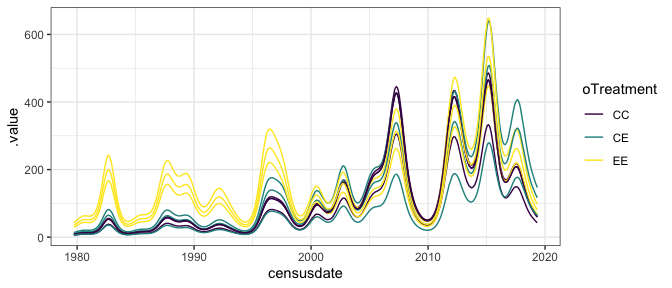<!-- -->

# tinygran

    ## [[1]]
    ## [1] 36791.45
    ## 
    ## [[2]]
    ## [1] 37183.71
    ## 
    ## [[3]]
    ## [1] 36953.15

    ## Joining, by = "oPlot"

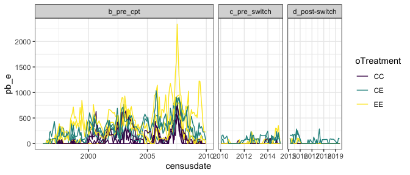<!-- --><!-- -->

    ## Joining, by = c("censusdate", "compare_trt")

    ## Warning: Removed 500 row(s) containing missing values (geom_path).

    ## Warning in max(ids, na.rm = TRUE): no non-missing arguments to max; returning -
    ## Inf

<!-- -->

    ## Joining, by = "oPlot"

<!-- --><!-- -->

    ## Joining, by = c("censusdate", "compare_trt")

    ## Warning: Removed 500 row(s) containing missing values (geom_path).
    
    ## Warning: no non-missing arguments to max; returning -Inf

<!-- -->

    ## Joining, by = "oPlot"

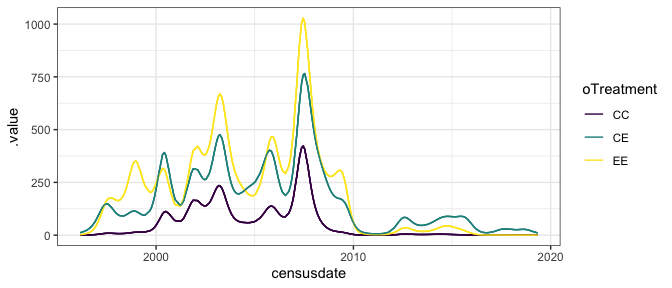<!-- -->

    ## Joining, by = "oPlot"

<!-- --><!-- -->

    ## Joining, by = c("censusdate", "compare_trt")

    ## Warning: Removed 500 row(s) containing missing values (geom_path).
    
    ## Warning: no non-missing arguments to max; returning -Inf

<!-- -->

# pb

<!-- --><!-- -->

    ## [[1]]
    ## [1] 15124.75
    ## 
    ## [[2]]
    ## [1] 15426.73
    ## 
    ## [[3]]
    ## [1] 15204.81

    ## Joining, by = "oPlot"

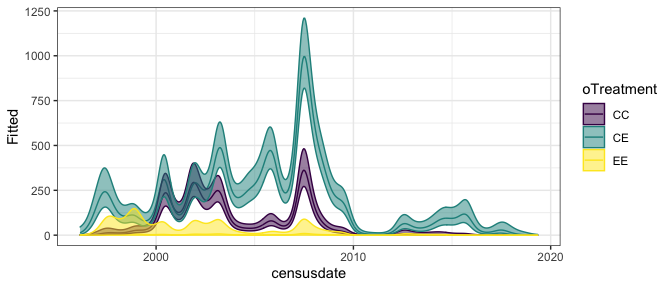<!-- -->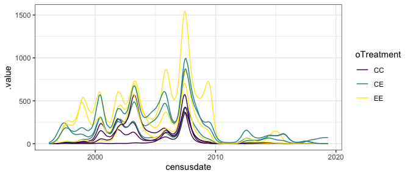<!-- -->

    ## Joining, by = c("censusdate", "compare_trt")

    ## Warning: Removed 500 row(s) containing missing values (geom_path).

    ## Warning in max(ids, na.rm = TRUE): no non-missing arguments to max; returning -
    ## Inf

<!-- -->

    ## Joining, by = "oPlot"

<!-- --><!-- -->

    ## Joining, by = c("censusdate", "compare_trt")

    ## Warning: Removed 500 row(s) containing missing values (geom_path).
    
    ## Warning: no non-missing arguments to max; returning -Inf

<!-- -->

    ## Joining, by = "oPlot"

<!-- -->

    ## Joining, by = "oPlot"

<!-- --><!-- -->

    ## Joining, by = c("censusdate", "compare_trt")

    ## Warning: Removed 500 row(s) containing missing values (geom_path).
    
    ## Warning: no non-missing arguments to max; returning -Inf

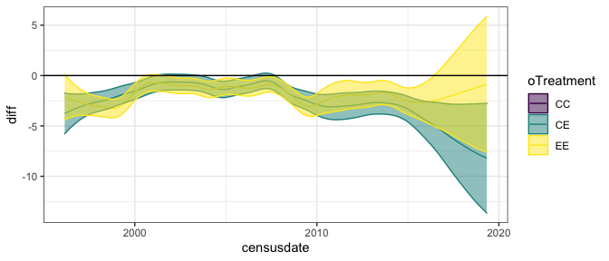<!-- -->
