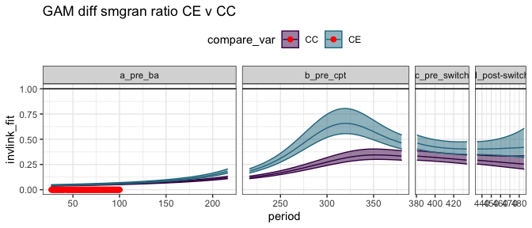
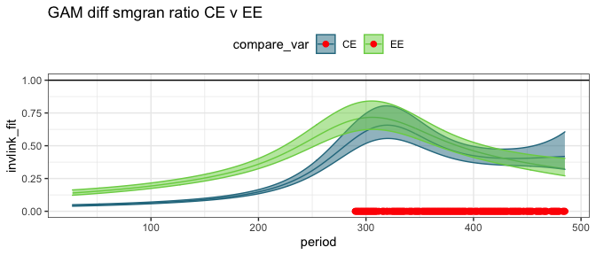
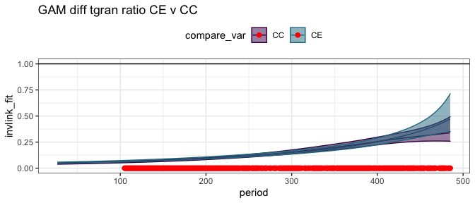
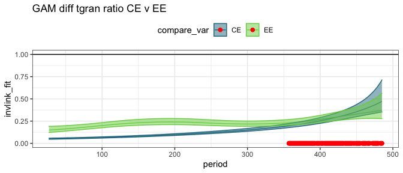
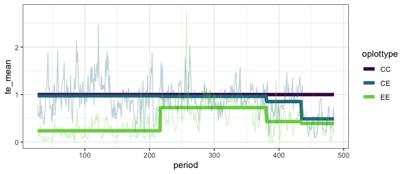

Energy plots
================

    ## Loading required package: nlme

    ## 
    ## Attaching package: 'nlme'

    ## The following object is masked from 'package:dplyr':
    ## 
    ##     collapse

    ## This is mgcv 1.8-33. For overview type 'help("mgcv-package")'.

    ## Loading in data version 2.49.0

    ## `summarise()` regrouping output by 'period', 'censusdate', 'era' (override with `.groups` argument)

    ## `summarise()` regrouping output by 'censusyear', 'plot', 'plot_type' (override with `.groups` argument)

    ## Loading in data version 2.49.0

    ## `summarise()` regrouping output by 'period', 'censusdate', 'era' (override with `.groups` argument)

    ## `summarise()` regrouping output by 'censusyear', 'plot_type', 'era' (override with `.groups` argument)

<!-- --><!-- --><!-- -->

<!-- -->

    ## Joining, by = "period"

<!-- -->

    ## Joining, by = "period"

    ## Scale for 'colour' is already present. Adding another scale for 'colour',
    ## which will replace the existing scale.

    ## Scale for 'fill' is already present. Adding another scale for 'fill', which
    ## will replace the existing scale.

<!-- -->

    ## Joining, by = "period"

    ## Scale for 'colour' is already present. Adding another scale for 'colour',
    ## which will replace the existing scale.

    ## Scale for 'fill' is already present. Adding another scale for 'fill', which
    ## will replace the existing scale.

<!-- -->

<!-- -->

    ## Joining, by = "period"

<!-- -->

    ## Joining, by = "period"

    ## Scale for 'colour' is already present. Adding another scale for 'colour',
    ## which will replace the existing scale.

    ## Scale for 'fill' is already present. Adding another scale for 'fill', which
    ## will replace the existing scale.

<!-- -->

    ## Joining, by = "period"

    ## Scale for 'colour' is already present. Adding another scale for 'colour',
    ## which will replace the existing scale.

    ## Scale for 'fill' is already present. Adding another scale for 'fill', which
    ## will replace the existing scale.

<!-- -->

<!-- -->

    ## Joining, by = "period"

<!-- -->

    ## Joining, by = "period"

    ## Scale for 'colour' is already present. Adding another scale for 'colour',
    ## which will replace the existing scale.

    ## Scale for 'fill' is already present. Adding another scale for 'fill', which
    ## will replace the existing scale.

<!-- -->

    ## Joining, by = "period"

    ## Scale for 'colour' is already present. Adding another scale for 'colour',
    ## which will replace the existing scale.

    ## Scale for 'fill' is already present. Adding another scale for 'fill', which
    ## will replace the existing scale.

<!-- -->

## Ratios

    ## Joining, by = "period"

    ## `summarise()` regrouping output by 'censusyear', 'era' (override with `.groups` argument)

    ## Joining, by = "period"

<!-- -->

    ## Joining, by = "period"

    ## Scale for 'fill' is already present. Adding another scale for 'fill', which
    ## will replace the existing scale.

    ## Scale for 'colour' is already present. Adding another scale for 'colour',
    ## which will replace the existing scale.

<!-- -->

    ## Joining, by = "period"

    ## Scale for 'fill' is already present. Adding another scale for 'fill', which
    ## will replace the existing scale.

    ## Scale for 'colour' is already present. Adding another scale for 'colour',
    ## which will replace the existing scale.

<!-- -->

    ## Joining, by = "period"

<!-- -->

    ## Joining, by = "period"

    ## Scale for 'fill' is already present. Adding another scale for 'fill', which
    ## will replace the existing scale.

    ## Scale for 'colour' is already present. Adding another scale for 'colour',
    ## which will replace the existing scale.

<!-- -->

    ## Joining, by = "period"

    ## Scale for 'fill' is already present. Adding another scale for 'fill', which
    ## will replace the existing scale.

    ## Scale for 'colour' is already present. Adding another scale for 'colour',
    ## which will replace the existing scale.

<!-- -->

    ## Joining, by = "period"

    ## Scale for 'colour' is already present. Adding another scale for 'colour',
    ## which will replace the existing scale.

    ## Scale for 'fill' is already present. Adding another scale for 'fill', which
    ## will replace the existing scale.

<!-- -->

## By era

##### Era means:

    ## # A tibble: 12 x 5
    ##    era           oplottype total_e_mean smgran_e_mean tinygran_e_mean
    ##    <chr>         <fct>            <dbl>         <dbl>           <dbl>
    ##  1 a_pre_ba      CC                484.          28.4            28.4
    ##  2 a_pre_ba      CE                455.          32.5            32.3
    ##  3 a_pre_ba      EE                110.          98.8            98.8
    ##  4 b_pre_cpt     CC                717.         234.            133. 
    ##  5 b_pre_cpt     CE                673.         379.            127. 
    ##  6 b_pre_cpt     EE                532.         485.            152. 
    ##  7 c_pre_switch  CC                687.         205.            194. 
    ##  8 c_pre_switch  CE                603.         275.            167. 
    ##  9 c_pre_switch  EE                341.         308.            200. 
    ## 10 d_post-switch CC                718.         207.            207. 
    ## 11 d_post-switch CE                360.         311.            273. 
    ## 12 d_post-switch EE                308.         281.            275.

### gls on actual vals

##### Total energy raw GLS

    ## Loading required package: emmeans

    ## The 'lsmeans' package is now basically a front end for 'emmeans'.
    ## Users are encouraged to switch the rest of the way.
    ## See help('transition') for more information, including how to
    ## convert old 'lsmeans' objects and scripts to work with 'emmeans'.

    ## era = a_pre_ba:
    ##  contrast estimate    SE  df t.ratio p.value
    ##  CC - CE      37.2  79.0 189 0.471   0.8851 
    ##  CC - EE     372.0  79.0 189 4.710   <.0001 
    ##  CE - EE     334.8  79.0 189 4.239   0.0001 
    ## 
    ## era = b_pre_cpt:
    ##  contrast estimate    SE  df t.ratio p.value
    ##  CC - CE      40.7  85.8 191 0.475   0.8832 
    ##  CC - EE     195.3  85.8 191 2.278   0.0614 
    ##  CE - EE     154.6  85.8 191 1.803   0.1714 
    ## 
    ## era = c_pre_switch:
    ##  contrast estimate    SE  df t.ratio p.value
    ##  CC - CE     146.8 106.5 192 1.378   0.3545 
    ##  CC - EE     331.4 106.5 192 3.110   0.0061 
    ##  CE - EE     184.6 106.5 192 1.732   0.1958 
    ## 
    ## era = d_post-switch:
    ##  contrast estimate    SE  df t.ratio p.value
    ##  CC - CE     254.4 132.9 193 1.915   0.1372 
    ##  CC - EE     414.2 132.9 193 3.117   0.0059 
    ##  CE - EE     159.7 132.9 193 1.202   0.4534 
    ## 
    ## Degrees-of-freedom method: satterthwaite 
    ## P value adjustment: tukey method for comparing a family of 3 estimates

##### Small gran raw GLS

    ## era = a_pre_ba:
    ##  contrast estimate    SE  df t.ratio p.value
    ##  CC - CE     -19.8  65.0 152 -0.304  0.9503 
    ##  CC - EE     -87.5  65.0 152 -1.347  0.3718 
    ##  CE - EE     -67.7  65.0 152 -1.042  0.5514 
    ## 
    ## era = b_pre_cpt:
    ##  contrast estimate    SE  df t.ratio p.value
    ##  CC - CE    -116.9  68.8 153 -1.699  0.2088 
    ##  CC - EE    -199.6  68.8 153 -2.900  0.0119 
    ##  CE - EE     -82.6  68.8 153 -1.201  0.4547 
    ## 
    ## era = c_pre_switch:
    ##  contrast estimate    SE  df t.ratio p.value
    ##  CC - CE     -69.8  84.3 153 -0.829  0.6858 
    ##  CC - EE     -95.4  84.3 153 -1.132  0.4960 
    ##  CE - EE     -25.5  84.3 153 -0.303  0.9506 
    ## 
    ## era = d_post-switch:
    ##  contrast estimate    SE  df t.ratio p.value
    ##  CC - CE    -112.6 105.1 154 -1.071  0.5337 
    ##  CC - EE    -102.1 105.1 154 -0.971  0.5963 
    ##  CE - EE      10.5 105.1 154  0.100  0.9945 
    ## 
    ## Degrees-of-freedom method: satterthwaite 
    ## P value adjustment: tukey method for comparing a family of 3 estimates

##### Tiny gran raw GLS

    ## era = a_pre_ba:
    ##  contrast estimate   SE  df t.ratio p.value
    ##  CC - CE      1.06 35.9 284  0.030  0.9995 
    ##  CC - EE    -63.08 35.9 284 -1.756  0.1866 
    ##  CE - EE    -64.14 35.9 284 -1.785  0.1764 
    ## 
    ## era = b_pre_cpt:
    ##  contrast estimate   SE  df t.ratio p.value
    ##  CC - CE     -4.17 39.8 288 -0.105  0.9940 
    ##  CC - EE    -24.31 39.8 288 -0.611  0.8145 
    ##  CE - EE    -20.14 39.8 288 -0.506  0.8686 
    ## 
    ## era = c_pre_switch:
    ##  contrast estimate   SE  df t.ratio p.value
    ##  CC - CE     21.88 50.2 288  0.436  0.9005 
    ##  CC - EE     -6.57 50.2 288 -0.131  0.9906 
    ##  CE - EE    -28.44 50.2 288 -0.567  0.8377 
    ## 
    ## era = d_post-switch:
    ##  contrast estimate   SE  df t.ratio p.value
    ##  CC - CE    -43.37 62.5 291 -0.694  0.7671 
    ##  CC - EE    -51.57 62.5 291 -0.825  0.6875 
    ##  CE - EE     -8.20 62.5 291 -0.131  0.9905 
    ## 
    ## Degrees-of-freedom method: satterthwaite 
    ## P value adjustment: tukey method for comparing a family of 3 estimates

### gls on ratios

##### Era ratios:

    ## # A tibble: 12 x 5
    ##    era           oplottype te_mean sg_mean tg_mean
    ##    <chr>         <fct>       <dbl>   <dbl>   <dbl>
    ##  1 a_pre_ba      CC          1.     0.0581  0.0581
    ##  2 a_pre_ba      CE          0.974  0.0651  0.0648
    ##  3 a_pre_ba      EE          0.238  0.212   0.212 
    ##  4 b_pre_cpt     CC          1.     0.294   0.174 
    ##  5 b_pre_cpt     CE          0.972  0.531   0.178 
    ##  6 b_pre_cpt     EE          0.753  0.687   0.215 
    ##  7 c_pre_switch  CC          1.     0.262   0.250 
    ##  8 c_pre_switch  CE          0.871  0.374   0.213 
    ##  9 c_pre_switch  EE          0.482  0.417   0.260 
    ## 10 d_post-switch CC          1.     0.260   0.260 
    ## 11 d_post-switch CE          0.489  0.439   0.385 
    ## 12 d_post-switch EE          0.393  0.363   0.357

<!-- -->

##### Total energy ratios GLS

This fit includes CC plots, for which ratio always = 1.

    ## era = a_pre_ba:
    ##  contrast estimate     SE  df t.ratio p.value
    ##  CC - CE    0.0271 0.0433 820  0.626  0.8061 
    ##  CC - EE    0.7604 0.0433 820 17.546  <.0001 
    ##  CE - EE    0.7333 0.0433 818 16.921  <.0001 
    ## 
    ## era = b_pre_cpt:
    ##  contrast estimate     SE  df t.ratio p.value
    ##  CC - CE    0.0314 0.0508 843  0.618  0.8102 
    ##  CC - EE    0.2660 0.0508 841  5.237  <.0001 
    ##  CE - EE    0.2346 0.0508 844  4.619  <.0001 
    ## 
    ## era = c_pre_switch:
    ##  contrast estimate     SE  df t.ratio p.value
    ##  CC - CE    0.1467 0.0664 832  2.208  0.0704 
    ##  CC - EE    0.5166 0.0664 834  7.776  <.0001 
    ##  CE - EE    0.3699 0.0664 834  5.569  <.0001 
    ## 
    ## era = d_post-switch:
    ##  contrast estimate     SE  df t.ratio p.value
    ##  CC - CE    0.5129 0.0836 855  6.132  <.0001 
    ##  CC - EE    0.6261 0.0836 861  7.485  <.0001 
    ##  CE - EE    0.1132 0.0836 858  1.353  0.3663 
    ## 
    ## Degrees-of-freedom method: satterthwaite 
    ## P value adjustment: tukey method for comparing a family of 3 estimates

This fit has CC plots removed.

    ## era = a_pre_ba:
    ##  contrast estimate     SE  df t.ratio p.value
    ##  CE - EE     0.733 0.0531 529 13.816  <.0001 
    ## 
    ## era = b_pre_cpt:
    ##  contrast estimate     SE  df t.ratio p.value
    ##  CE - EE     0.235 0.0622 540  3.771  0.0002 
    ## 
    ## era = c_pre_switch:
    ##  contrast estimate     SE  df t.ratio p.value
    ##  CE - EE     0.370 0.0814 538  4.547  <.0001 
    ## 
    ## era = d_post-switch:
    ##  contrast estimate     SE  df t.ratio p.value
    ##  CE - EE     0.113 0.1024 552  1.105  0.2697 
    ## 
    ## Degrees-of-freedom method: satterthwaite

##### Smgran ratio GLS

    ## era = a_pre_ba:
    ##  contrast estimate     SE  df t.ratio p.value
    ##  CC - CE   -0.0131 0.0433 510 -0.301  0.9512 
    ##  CC - EE   -0.1577 0.0433 509 -3.639  0.0009 
    ##  CE - EE   -0.1447 0.0433 509 -3.337  0.0026 
    ## 
    ## era = b_pre_cpt:
    ##  contrast estimate     SE  df t.ratio p.value
    ##  CC - CE   -0.2309 0.0498 520 -4.636  <.0001 
    ##  CC - EE   -0.3672 0.0498 519 -7.372  <.0001 
    ##  CE - EE   -0.1363 0.0498 521 -2.736  0.0176 
    ## 
    ## era = c_pre_switch:
    ##  contrast estimate     SE  df t.ratio p.value
    ##  CC - CE   -0.1098 0.0645 517 -1.702  0.2053 
    ##  CC - EE   -0.1522 0.0645 518 -2.359  0.0489 
    ##  CE - EE   -0.0424 0.0645 518 -0.657  0.7886 
    ## 
    ## era = d_post-switch:
    ##  contrast estimate     SE  df t.ratio p.value
    ##  CC - CE   -0.1747 0.0804 527 -2.173  0.0768 
    ##  CC - EE   -0.0979 0.0804 530 -1.217  0.4436 
    ##  CE - EE    0.0769 0.0804 529  0.956  0.6050 
    ## 
    ## Degrees-of-freedom method: satterthwaite 
    ## P value adjustment: tukey method for comparing a family of 3 estimates

##### Tiny gran ratio GLS

    ## era = a_pre_ba:
    ##  contrast estimate     SE  df t.ratio p.value
    ##  CC - CE  -0.00326 0.0365 440 -0.090  0.9956 
    ##  CC - EE  -0.14568 0.0365 440 -3.995  0.0002 
    ##  CE - EE  -0.14242 0.0365 439 -3.906  0.0003 
    ## 
    ## era = b_pre_cpt:
    ##  contrast estimate     SE  df t.ratio p.value
    ##  CC - CE  -0.00873 0.0416 448 -0.210  0.9760 
    ##  CC - EE  -0.04459 0.0416 447 -1.073  0.5316 
    ##  CE - EE  -0.03586 0.0416 448 -0.863  0.6642 
    ## 
    ## era = c_pre_switch:
    ##  contrast estimate     SE  df t.ratio p.value
    ##  CC - CE   0.02861 0.0535 446  0.534  0.8544 
    ##  CC - EE  -0.01731 0.0535 447 -0.323  0.9440 
    ##  CE - EE  -0.04593 0.0535 447 -0.858  0.6672 
    ## 
    ## era = d_post-switch:
    ##  contrast estimate     SE  df t.ratio p.value
    ##  CC - CE  -0.10264 0.0666 453 -1.540  0.2731 
    ##  CC - EE  -0.07177 0.0666 456 -1.077  0.5288 
    ##  CE - EE   0.03087 0.0666 454  0.463  0.8885 
    ## 
    ## Degrees-of-freedom method: satterthwaite 
    ## P value adjustment: tukey method for comparing a family of 3 estimates

### glm on ratios

##### Total energy GLM

With controls:

    ## era = a_pre_ba:
    ##  contrast estimate     SE   df t.ratio p.value
    ##  CC - CE    0.0265 0.0394 1260  0.672  0.7797 
    ##  CC - EE    0.7622 0.0290 1260 26.290  <.0001 
    ##  CE - EE    0.7358 0.0283 1260 26.028  <.0001 
    ## 
    ## era = b_pre_cpt:
    ##  contrast estimate     SE   df t.ratio p.value
    ##  CC - CE    0.0277 0.0494 1260  0.562  0.8403 
    ##  CC - EE    0.2465 0.0443 1260  5.562  <.0001 
    ##  CE - EE    0.2188 0.0435 1260  5.024  <.0001 
    ## 
    ## era = c_pre_switch:
    ##  contrast estimate     SE   df t.ratio p.value
    ##  CC - CE    0.1291 0.0598 1260  2.160  0.0786 
    ##  CC - EE    0.5181 0.0500 1260 10.353  <.0001 
    ##  CE - EE    0.3890 0.0449 1260  8.669  <.0001 
    ## 
    ## era = d_post-switch:
    ##  contrast estimate     SE   df t.ratio p.value
    ##  CC - CE    0.5113 0.0674 1260  7.585  <.0001 
    ##  CC - EE    0.6069 0.0651 1260  9.327  <.0001 
    ##  CE - EE    0.0956 0.0380 1260  2.517  0.0320 
    ## 
    ## P value adjustment: tukey method for comparing a family of 3 estimates

Without controls:

    ## era = a_pre_ba:
    ##  contrast estimate     SE  df t.ratio p.value
    ##  CE - EE    0.7358 0.0346 840 21.252  <.0001 
    ## 
    ## era = b_pre_cpt:
    ##  contrast estimate     SE  df t.ratio p.value
    ##  CE - EE    0.2188 0.0533 840  4.102  <.0001 
    ## 
    ## era = c_pre_switch:
    ##  contrast estimate     SE  df t.ratio p.value
    ##  CE - EE    0.3890 0.0550 840  7.078  <.0001 
    ## 
    ## era = d_post-switch:
    ##  contrast estimate     SE  df t.ratio p.value
    ##  CE - EE    0.0956 0.0465 840  2.055  0.0402

##### Small granivore ratio GLM

    ## era = a_pre_ba:
    ##  contrast estimate      SE   df t.ratio p.value
    ##  CC - CE  -0.00697 0.00499 1260  -1.396 0.3430 
    ##  CC - EE  -0.15414 0.01260 1260 -12.236 <.0001 
    ##  CE - EE  -0.14717 0.01271 1260 -11.580 <.0001 
    ## 
    ## era = b_pre_cpt:
    ##  contrast estimate      SE   df t.ratio p.value
    ##  CC - CE  -0.23703 0.04362 1260  -5.435 <.0001 
    ##  CC - EE  -0.39298 0.05369 1260  -7.319 <.0001 
    ##  CE - EE  -0.15595 0.06239 1260  -2.500 0.0336 
    ## 
    ## era = c_pre_switch:
    ##  contrast estimate      SE   df t.ratio p.value
    ##  CC - CE  -0.11191 0.04183 1260  -2.675 0.0207 
    ##  CC - EE  -0.15439 0.04507 1260  -3.426 0.0018 
    ##  CE - EE  -0.04248 0.05126 1260  -0.829 0.6853 
    ## 
    ## era = d_post-switch:
    ##  contrast estimate      SE   df t.ratio p.value
    ##  CC - CE  -0.17822 0.06270 1260  -2.843 0.0126 
    ##  CC - EE  -0.10247 0.05490 1260  -1.867 0.1489 
    ##  CE - EE   0.07575 0.06997 1260   1.083 0.5251 
    ## 
    ## P value adjustment: tukey method for comparing a family of 3 estimates

##### Tiny granivore ratio GLM

    ## era = a_pre_ba:
    ##  contrast estimate      SE   df t.ratio p.value
    ##  CC - CE  -0.00671 0.00553 1260  -1.213 0.4455 
    ##  CC - EE  -0.15414 0.01398 1260 -11.024 <.0001 
    ##  CE - EE  -0.14743 0.01410 1260 -10.456 <.0001 
    ## 
    ## era = b_pre_cpt:
    ##  contrast estimate      SE   df t.ratio p.value
    ##  CC - CE  -0.00340 0.01987 1260  -0.171 0.9840 
    ##  CC - EE  -0.04063 0.02209 1260  -1.839 0.1573 
    ##  CE - EE  -0.03723 0.02226 1260  -1.672 0.2163 
    ## 
    ## era = c_pre_switch:
    ##  contrast estimate      SE   df t.ratio p.value
    ##  CC - CE   0.03640 0.03333 1260   1.092 0.5190 
    ##  CC - EE  -0.00998 0.03656 1260  -0.273 0.9598 
    ##  CE - EE  -0.04638 0.03410 1260  -1.360 0.3623 
    ## 
    ## era = d_post-switch:
    ##  contrast estimate      SE   df t.ratio p.value
    ##  CC - CE  -0.12507 0.06346 1260  -1.971 0.1199 
    ##  CC - EE  -0.09678 0.06030 1260  -1.605 0.2439 
    ##  CE - EE   0.02829 0.07169 1260   0.395 0.9178 
    ## 
    ## P value adjustment: tukey method for comparing a family of 3 estimates
