Energy plots
================

    ## Loading required package: nlme

    ## 
    ## Attaching package: 'nlme'

    ## The following object is masked from 'package:dplyr':
    ## 
    ##     collapse

    ## This is mgcv 1.8-33. For overview type 'help("mgcv-package")'.

    ## Loading in data version 2.49.0

    ## `summarise()` regrouping output by 'period', 'censusdate', 'era' (override with `.groups` argument)

    ## `summarise()` regrouping output by 'censusyear', 'plot', 'plot_type' (override with `.groups` argument)

    ## Loading in data version 2.49.0

    ## `summarise()` regrouping output by 'period', 'censusdate', 'era' (override with `.groups` argument)

    ## `summarise()` regrouping output by 'censusyear', 'plot_type', 'era' (override with `.groups` argument)

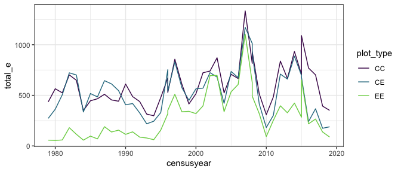<!-- -->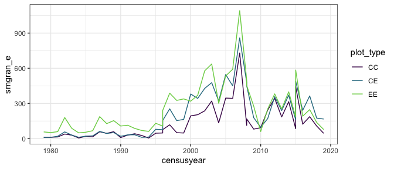<!-- -->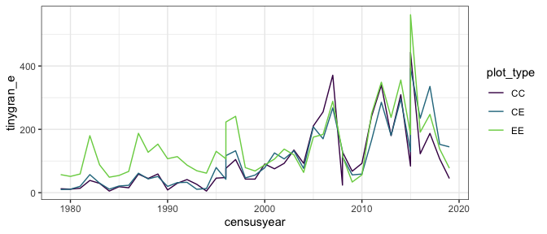<!-- -->

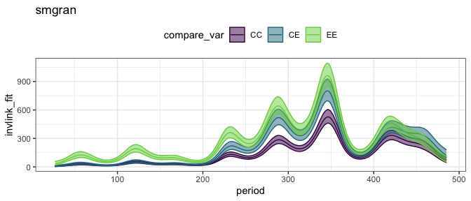<!-- -->

    ## Joining, by = "period"

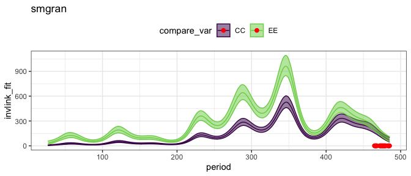<!-- -->

    ## Joining, by = "period"

    ## Scale for 'colour' is already present. Adding another scale for 'colour',
    ## which will replace the existing scale.

    ## Scale for 'fill' is already present. Adding another scale for 'fill', which
    ## will replace the existing scale.

<!-- -->

    ## Joining, by = "period"

    ## Scale for 'colour' is already present. Adding another scale for 'colour',
    ## which will replace the existing scale.

    ## Scale for 'fill' is already present. Adding another scale for 'fill', which
    ## will replace the existing scale.

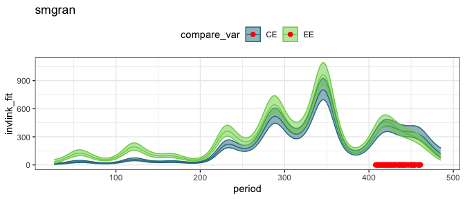<!-- -->

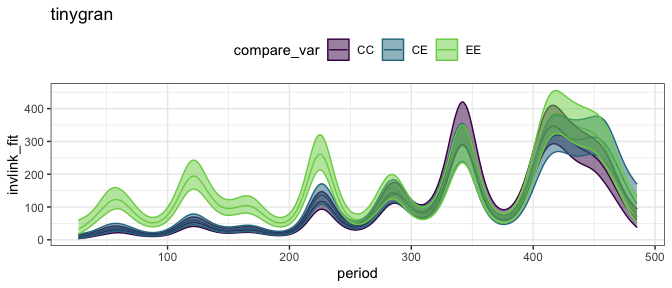<!-- -->

    ## Joining, by = "period"

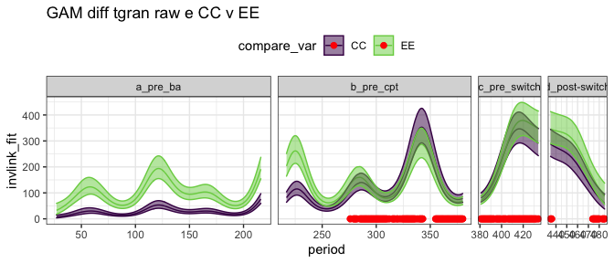<!-- -->

    ## Joining, by = "period"

    ## Scale for 'colour' is already present. Adding another scale for 'colour',
    ## which will replace the existing scale.

    ## Scale for 'fill' is already present. Adding another scale for 'fill', which
    ## will replace the existing scale.

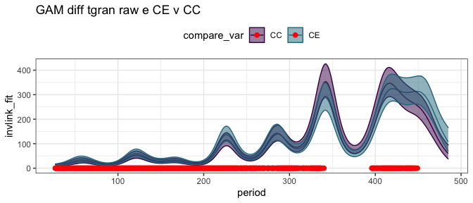<!-- -->

    ## Joining, by = "period"

    ## Scale for 'colour' is already present. Adding another scale for 'colour',
    ## which will replace the existing scale.

    ## Scale for 'fill' is already present. Adding another scale for 'fill', which
    ## will replace the existing scale.

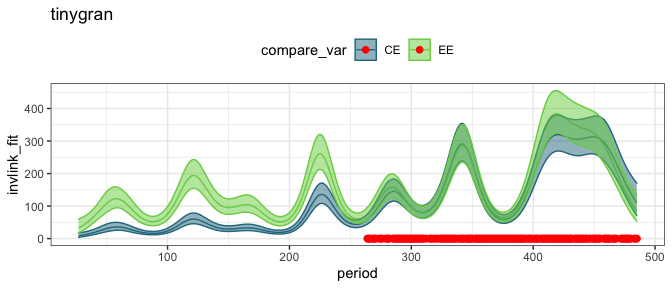<!-- -->

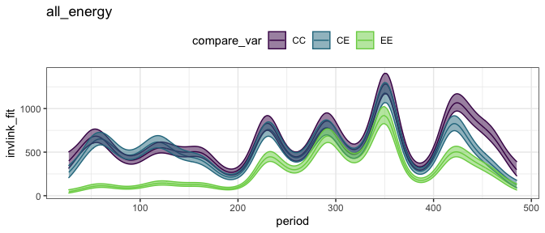<!-- -->

    ## Joining, by = "period"

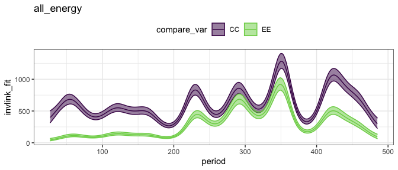<!-- -->

    ## Joining, by = "period"

    ## Scale for 'colour' is already present. Adding another scale for 'colour',
    ## which will replace the existing scale.

    ## Scale for 'fill' is already present. Adding another scale for 'fill', which
    ## will replace the existing scale.

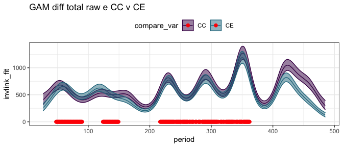<!-- -->

    ## Joining, by = "period"

    ## Scale for 'colour' is already present. Adding another scale for 'colour',
    ## which will replace the existing scale.

    ## Scale for 'fill' is already present. Adding another scale for 'fill', which
    ## will replace the existing scale.

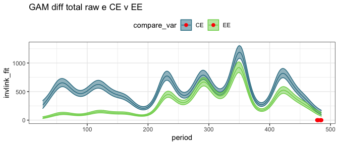<!-- -->

## Ratios

    ## Joining, by = "period"

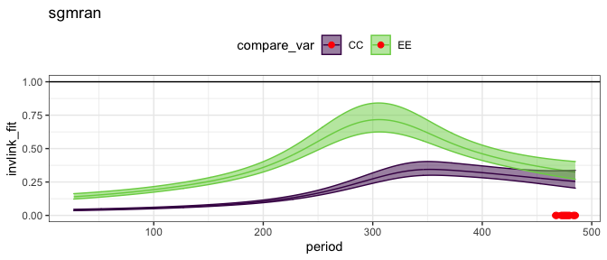<!-- -->

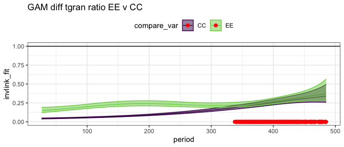<!-- -->

    ## Scale for 'colour' is already present. Adding another scale for 'colour',
    ## which will replace the existing scale.

    ## Scale for 'fill' is already present. Adding another scale for 'fill', which
    ## will replace the existing scale.

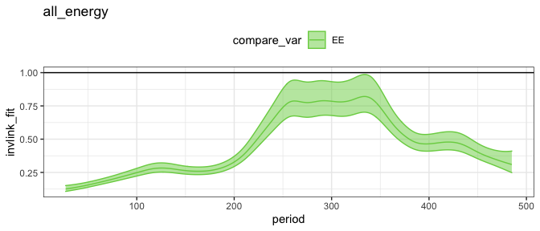<!-- -->

## By era

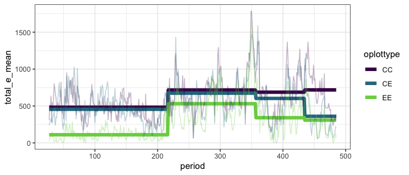<!-- -->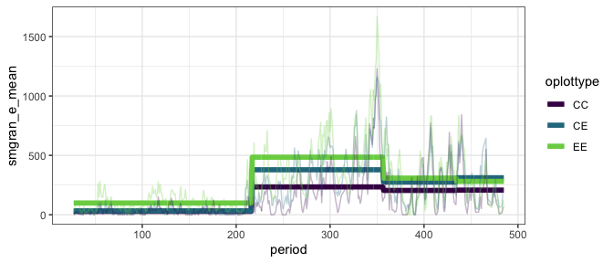<!-- -->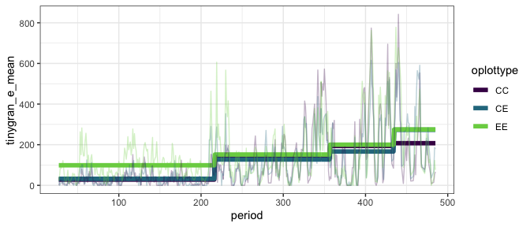<!-- -->

    ## # A tibble: 12 x 5
    ##    era           oplottype total_e_mean smgran_e_mean tinygran_e_mean
    ##    <chr>         <ord>            <dbl>         <dbl>           <dbl>
    ##  1 a_pre_ba      CC                484.          28.4            28.4
    ##  2 a_pre_ba      CE                455.          32.5            32.3
    ##  3 a_pre_ba      EE                110.          98.8            98.8
    ##  4 b_pre_cpt     CC                717.         234.            133. 
    ##  5 b_pre_cpt     CE                673.         379.            127. 
    ##  6 b_pre_cpt     EE                532.         485.            152. 
    ##  7 c_pre_switch  CC                687.         205.            194. 
    ##  8 c_pre_switch  CE                603.         275.            167. 
    ##  9 c_pre_switch  EE                341.         308.            200. 
    ## 10 d_post-switch CC                718.         207.            207. 
    ## 11 d_post-switch CE                360.         311.            273. 
    ## 12 d_post-switch EE                308.         281.            275.

### gls on actual vals

    ## Loading required package: emmeans

    ## The 'lsmeans' package is now basically a front end for 'emmeans'.
    ## Users are encouraged to switch the rest of the way.
    ## See help('transition') for more information, including how to
    ## convert old 'lsmeans' objects and scripts to work with 'emmeans'.

    ## era = a_pre_ba:
    ##  contrast estimate    SE  df t.ratio p.value
    ##  CC - CE     -19.8  65.0 151 -0.304  0.9503 
    ##  CC - EE     -87.5  65.0 151 -1.347  0.3718 
    ##  CE - EE     -67.7  65.0 151 -1.042  0.5514 
    ## 
    ## era = b_pre_cpt:
    ##  contrast estimate    SE  df t.ratio p.value
    ##  CC - CE    -116.9  68.8 153 -1.699  0.2088 
    ##  CC - EE    -199.6  68.8 153 -2.900  0.0119 
    ##  CE - EE     -82.6  68.8 153 -1.201  0.4547 
    ## 
    ## era = c_pre_switch:
    ##  contrast estimate    SE  df t.ratio p.value
    ##  CC - CE     -69.8  84.3 153 -0.829  0.6858 
    ##  CC - EE     -95.4  84.3 153 -1.132  0.4960 
    ##  CE - EE     -25.5  84.3 153 -0.303  0.9506 
    ## 
    ## era = d_post-switch:
    ##  contrast estimate    SE  df t.ratio p.value
    ##  CC - CE    -112.6 105.1 154 -1.071  0.5337 
    ##  CC - EE    -102.1 105.1 154 -0.971  0.5963 
    ##  CE - EE      10.5 105.1 154  0.100  0.9945 
    ## 
    ## Degrees-of-freedom method: satterthwaite 
    ## P value adjustment: tukey method for comparing a family of 3 estimates

    ## era = a_pre_ba:
    ##  contrast estimate   SE  df t.ratio p.value
    ##  CC - CE      1.06 35.9 285  0.030  0.9995 
    ##  CC - EE    -63.08 35.9 285 -1.756  0.1866 
    ##  CE - EE    -64.14 35.9 284 -1.785  0.1764 
    ## 
    ## era = b_pre_cpt:
    ##  contrast estimate   SE  df t.ratio p.value
    ##  CC - CE     -4.17 39.8 288 -0.105  0.9940 
    ##  CC - EE    -24.31 39.8 288 -0.611  0.8145 
    ##  CE - EE    -20.14 39.8 288 -0.506  0.8686 
    ## 
    ## era = c_pre_switch:
    ##  contrast estimate   SE  df t.ratio p.value
    ##  CC - CE     21.88 50.2 288  0.436  0.9005 
    ##  CC - EE     -6.57 50.2 289 -0.131  0.9906 
    ##  CE - EE    -28.44 50.2 288 -0.567  0.8377 
    ## 
    ## era = d_post-switch:
    ##  contrast estimate   SE  df t.ratio p.value
    ##  CC - CE    -43.37 62.5 291 -0.694  0.7671 
    ##  CC - EE    -51.57 62.5 292 -0.825  0.6875 
    ##  CE - EE     -8.20 62.5 291 -0.131  0.9905 
    ## 
    ## Degrees-of-freedom method: satterthwaite 
    ## P value adjustment: tukey method for comparing a family of 3 estimates

### gls on ratios

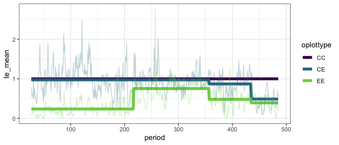<!-- -->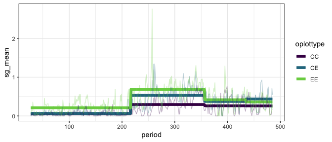<!-- -->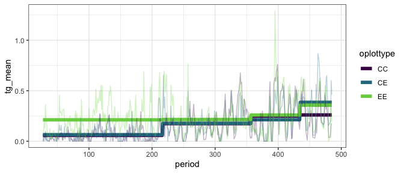<!-- -->

    ## era = a_pre_ba:
    ##  contrast estimate     SE  df t.ratio p.value
    ##  CC - CE   -0.0131 0.0433 510 -0.301  0.9512 
    ##  CC - EE   -0.1577 0.0433 509 -3.639  0.0009 
    ##  CE - EE   -0.1447 0.0433 509 -3.337  0.0026 
    ## 
    ## era = b_pre_cpt:
    ##  contrast estimate     SE  df t.ratio p.value
    ##  CC - CE   -0.2309 0.0498 520 -4.636  <.0001 
    ##  CC - EE   -0.3672 0.0498 519 -7.372  <.0001 
    ##  CE - EE   -0.1363 0.0498 521 -2.736  0.0176 
    ## 
    ## era = c_pre_switch:
    ##  contrast estimate     SE  df t.ratio p.value
    ##  CC - CE   -0.1098 0.0645 517 -1.702  0.2053 
    ##  CC - EE   -0.1522 0.0645 518 -2.359  0.0489 
    ##  CE - EE   -0.0424 0.0645 518 -0.657  0.7886 
    ## 
    ## era = d_post-switch:
    ##  contrast estimate     SE  df t.ratio p.value
    ##  CC - CE   -0.1747 0.0804 527 -2.173  0.0768 
    ##  CC - EE   -0.0979 0.0804 530 -1.217  0.4436 
    ##  CE - EE    0.0769 0.0804 529  0.956  0.6050 
    ## 
    ## Degrees-of-freedom method: satterthwaite 
    ## P value adjustment: tukey method for comparing a family of 3 estimates

    ## era = a_pre_ba:
    ##  contrast estimate     SE  df t.ratio p.value
    ##  CC - CE  -0.00326 0.0365 440 -0.090  0.9956 
    ##  CC - EE  -0.14568 0.0365 440 -3.995  0.0002 
    ##  CE - EE  -0.14242 0.0365 439 -3.906  0.0003 
    ## 
    ## era = b_pre_cpt:
    ##  contrast estimate     SE  df t.ratio p.value
    ##  CC - CE  -0.00873 0.0416 448 -0.210  0.9760 
    ##  CC - EE  -0.04459 0.0416 447 -1.073  0.5316 
    ##  CE - EE  -0.03586 0.0416 448 -0.863  0.6642 
    ## 
    ## era = c_pre_switch:
    ##  contrast estimate     SE  df t.ratio p.value
    ##  CC - CE   0.02861 0.0535 446  0.534  0.8544 
    ##  CC - EE  -0.01731 0.0535 447 -0.323  0.9440 
    ##  CE - EE  -0.04593 0.0535 447 -0.858  0.6672 
    ## 
    ## era = d_post-switch:
    ##  contrast estimate     SE  df t.ratio p.value
    ##  CC - CE  -0.10264 0.0666 453 -1.540  0.2731 
    ##  CC - EE  -0.07177 0.0666 456 -1.077  0.5288 
    ##  CE - EE   0.03087 0.0666 454  0.463  0.8885 
    ## 
    ## Degrees-of-freedom method: satterthwaite 
    ## P value adjustment: tukey method for comparing a family of 3 estimates
