Energy plots
================

    ## Loading required package: nlme

    ## 
    ## Attaching package: 'nlme'

    ## The following object is masked from 'package:dplyr':
    ## 
    ##     collapse

    ## This is mgcv 1.8-33. For overview type 'help("mgcv-package")'.

    ## Loading in data version 2.49.0

    ## `summarise()` regrouping output by 'period', 'censusdate', 'era' (override with `.groups` argument)

    ## `summarise()` regrouping output by 'censusyear', 'plot', 'plot_type' (override with `.groups` argument)

    ## Loading in data version 2.49.0

    ## `summarise()` regrouping output by 'period', 'censusdate', 'era' (override with `.groups` argument)

    ## `summarise()` regrouping output by 'censusyear', 'plot_type', 'era' (override with `.groups` argument)

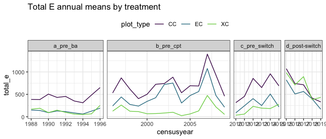<!-- -->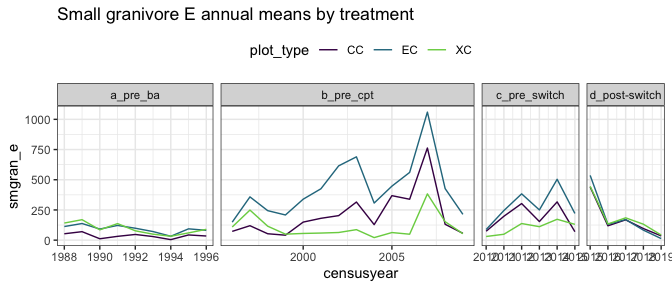<!-- -->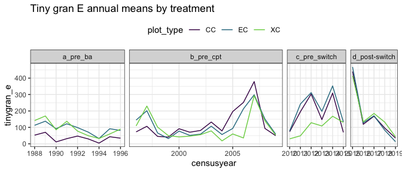<!-- -->

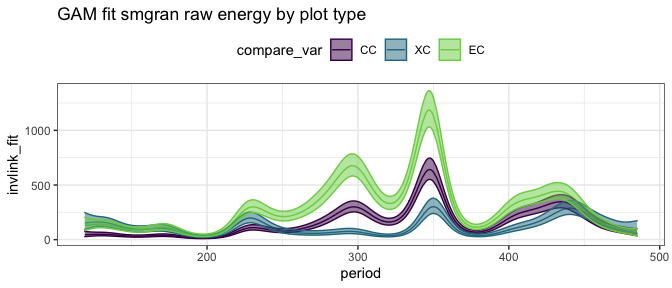<!-- -->

    ## Joining, by = "period"

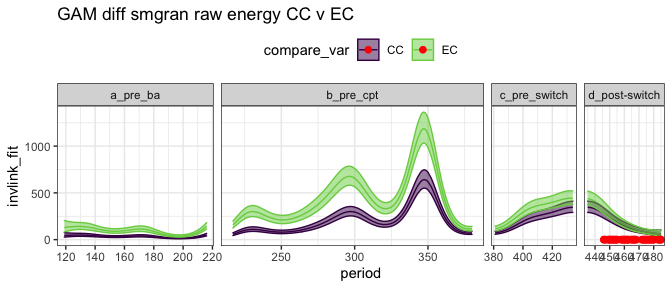<!-- -->

    ## Joining, by = "period"

    ## Scale for 'colour' is already present. Adding another scale for 'colour',
    ## which will replace the existing scale.

    ## Scale for 'fill' is already present. Adding another scale for 'fill', which
    ## will replace the existing scale.

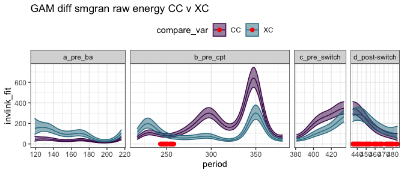<!-- -->

    ## Joining, by = "period"

    ## Scale for 'colour' is already present. Adding another scale for 'colour',
    ## which will replace the existing scale.

    ## Scale for 'fill' is already present. Adding another scale for 'fill', which
    ## will replace the existing scale.

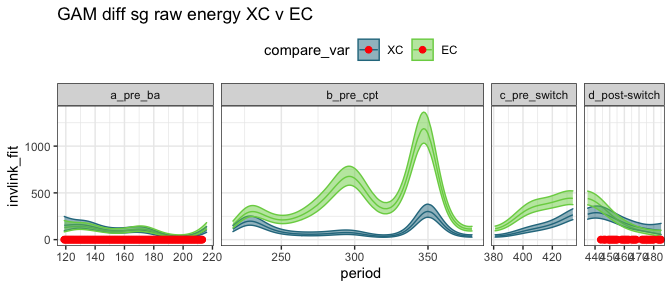<!-- -->

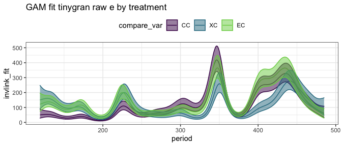<!-- -->

    ## Joining, by = "period"

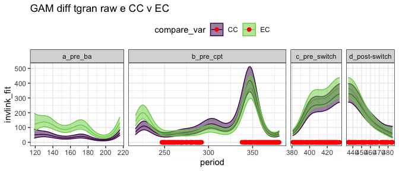<!-- -->

    ## Joining, by = "period"

    ## Scale for 'colour' is already present. Adding another scale for 'colour',
    ## which will replace the existing scale.

    ## Scale for 'fill' is already present. Adding another scale for 'fill', which
    ## will replace the existing scale.

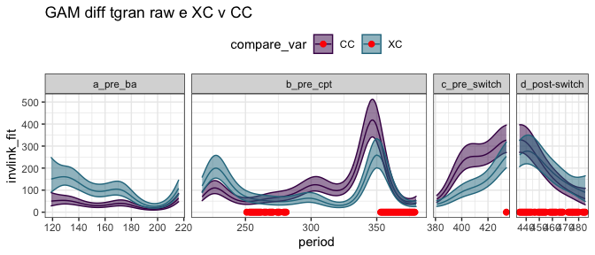<!-- -->

    ## Joining, by = "period"

    ## Scale for 'colour' is already present. Adding another scale for 'colour',
    ## which will replace the existing scale.

    ## Scale for 'fill' is already present. Adding another scale for 'fill', which
    ## will replace the existing scale.

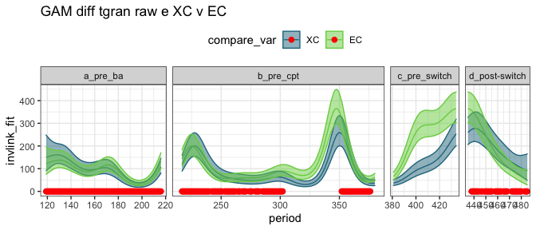<!-- -->

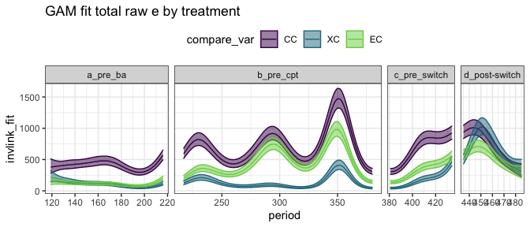<!-- -->

    ## Joining, by = "period"

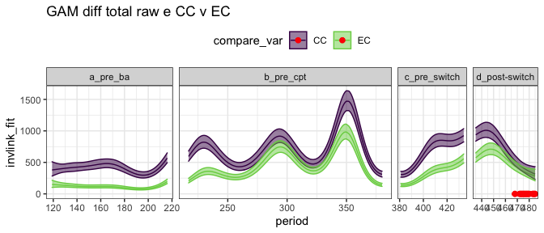<!-- -->

    ## Joining, by = "period"

    ## Scale for 'colour' is already present. Adding another scale for 'colour',
    ## which will replace the existing scale.

    ## Scale for 'fill' is already present. Adding another scale for 'fill', which
    ## will replace the existing scale.

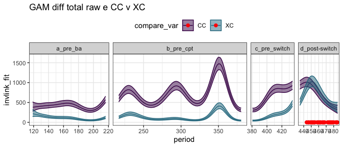<!-- -->

    ## Joining, by = "period"

    ## Scale for 'colour' is already present. Adding another scale for 'colour',
    ## which will replace the existing scale.

    ## Scale for 'fill' is already present. Adding another scale for 'fill', which
    ## will replace the existing scale.

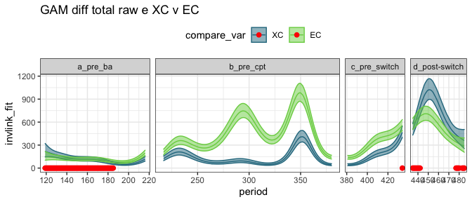<!-- -->

## Ratios

    ## Joining, by = "period"

    ## `summarise()` regrouping output by 'censusyear', 'era' (override with `.groups` argument)

    ## Joining, by = "period"

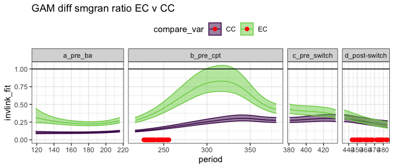<!-- -->

    ## Joining, by = "period"

    ## Scale for 'fill' is already present. Adding another scale for 'fill', which
    ## will replace the existing scale.

    ## Scale for 'colour' is already present. Adding another scale for 'colour',
    ## which will replace the existing scale.

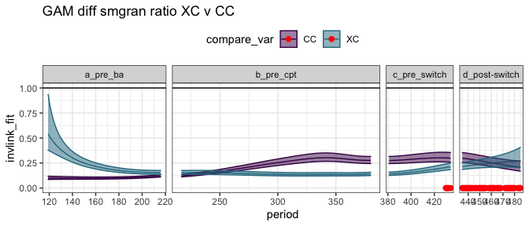<!-- -->

    ## Joining, by = "period"

    ## Scale for 'fill' is already present. Adding another scale for 'fill', which
    ## will replace the existing scale.

    ## Scale for 'colour' is already present. Adding another scale for 'colour',
    ## which will replace the existing scale.

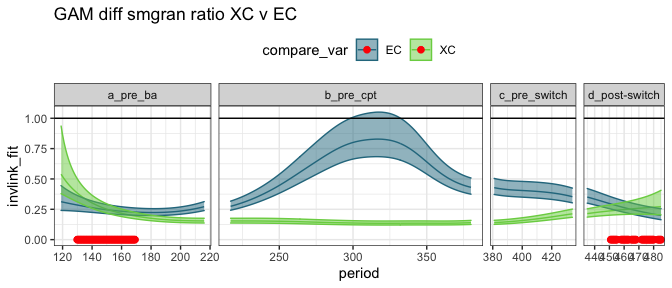<!-- -->

    ## Joining, by = "period"

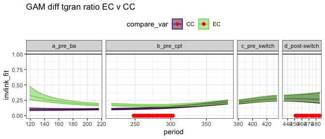<!-- -->

    ## Joining, by = "period"

    ## Scale for 'fill' is already present. Adding another scale for 'fill', which
    ## will replace the existing scale.

    ## Scale for 'colour' is already present. Adding another scale for 'colour',
    ## which will replace the existing scale.

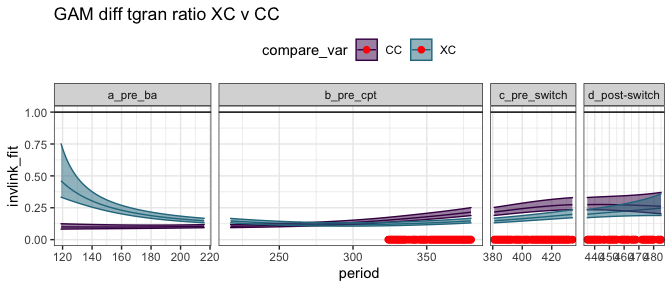<!-- -->

    ## Joining, by = "period"

    ## Scale for 'fill' is already present. Adding another scale for 'fill', which
    ## will replace the existing scale.

    ## Scale for 'colour' is already present. Adding another scale for 'colour',
    ## which will replace the existing scale.

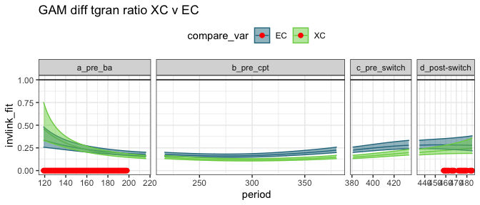<!-- -->

    ## Joining, by = "period"

    ## Scale for 'colour' is already present. Adding another scale for 'colour',
    ## which will replace the existing scale.

    ## Scale for 'fill' is already present. Adding another scale for 'fill', which
    ## will replace the existing scale.

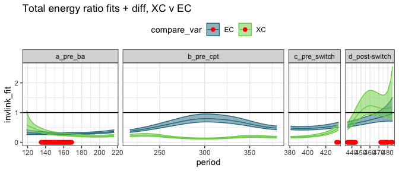<!-- -->

    ## Scale for 'colour' is already present. Adding another scale for 'colour',
    ## which will replace the existing scale.
    ## Scale for 'fill' is already present. Adding another scale for 'fill', which
    ## will replace the existing scale.

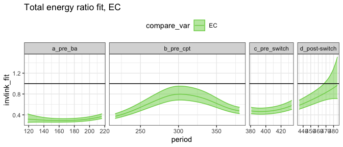<!-- -->

## By era

##### Era means:

    ## # A tibble: 12 x 5
    ##    era           oplottype total_e_mean smgran_e_mean tinygran_e_mean
    ##    <chr>         <fct>            <dbl>         <dbl>           <dbl>
    ##  1 a_pre_ba      CC                418.          35.9            35.9
    ##  2 a_pre_ba      EC                113.          94.6            94.3
    ##  3 a_pre_ba      XC                109.          93.1            93.1
    ##  4 b_pre_cpt     CC                721.         207.            121. 
    ##  5 b_pre_cpt     EC                473.         434.            119. 
    ##  6 b_pre_cpt     XC                141.         111.             97.3
    ##  7 c_pre_switch  CC                672.         217.            213. 
    ##  8 c_pre_switch  EC                313.         308.            245. 
    ##  9 c_pre_switch  XC                149.         106.            102. 
    ## 10 d_post-switch CC                714.         198.            198. 
    ## 11 d_post-switch EC                550.         220.            203. 
    ## 12 d_post-switch XC                729.         215.            207.

### gls on actual vals

##### Total energy raw GLS

    ## Loading required package: emmeans

    ## The 'lsmeans' package is now basically a front end for 'emmeans'.
    ## Users are encouraged to switch the rest of the way.
    ## See help('transition') for more information, including how to
    ## convert old 'lsmeans' objects and scripts to work with 'emmeans'.

    ## era = a_pre_ba:
    ##  contrast estimate    SE  df t.ratio p.value
    ##  CC - XC     335.1 101.9 147  3.287  0.0036 
    ##  CC - EC     296.4 101.9 147  2.908  0.0117 
    ##  XC - EC     -38.7 101.9 147 -0.379  0.9238 
    ## 
    ## era = b_pre_cpt:
    ##  contrast estimate    SE  df t.ratio p.value
    ##  CC - XC     523.5  80.2 148  6.525  <.0001 
    ##  CC - EC     244.0  80.2 148  3.041  0.0078 
    ##  XC - EC    -279.5  80.2 148 -3.484  0.0019 
    ## 
    ## era = c_pre_switch:
    ##  contrast estimate    SE  df t.ratio p.value
    ##  CC - XC     377.8 116.1 150  3.255  0.0040 
    ##  CC - EC     263.0 116.1 150  2.266  0.0638 
    ##  XC - EC    -114.8 116.1 150 -0.989  0.5850 
    ## 
    ## era = d_post-switch:
    ##  contrast estimate    SE  df t.ratio p.value
    ##  CC - XC     224.7 131.4 149  1.709  0.2051 
    ##  CC - EC     261.0 131.4 149  1.986  0.1192 
    ##  XC - EC      36.3 131.4 149  0.277  0.9587 
    ## 
    ## Degrees-of-freedom method: satterthwaite 
    ## P value adjustment: tukey method for comparing a family of 3 estimates

##### Small gran raw GLS

    ## era = a_pre_ba:
    ##  contrast estimate    SE  df t.ratio p.value
    ##  CC - XC     -29.4  88.4 107 -0.333  0.9408 
    ##  CC - EC     -90.0  88.4 107 -1.017  0.5676 
    ##  XC - EC     -60.5  88.4 107 -0.684  0.7730 
    ## 
    ## era = b_pre_cpt:
    ##  contrast estimate    SE  df t.ratio p.value
    ##  CC - XC      74.6  70.5 107  1.057  0.5426 
    ##  CC - EC    -174.2  70.5 107 -2.470  0.0397 
    ##  XC - EC    -248.8  70.5 107 -3.527  0.0018 
    ## 
    ## era = c_pre_switch:
    ##  contrast estimate    SE  df t.ratio p.value
    ##  CC - XC      52.7  96.0 109  0.549  0.8474 
    ##  CC - EC     -87.2  96.0 109 -0.909  0.6360 
    ##  XC - EC    -139.8  96.0 109 -1.457  0.3156 
    ## 
    ## era = d_post-switch:
    ##  contrast estimate    SE  df t.ratio p.value
    ##  CC - XC      64.8 111.5 108  0.581  0.8304 
    ##  CC - EC    -106.9 111.5 108 -0.959  0.6045 
    ##  XC - EC    -171.8 111.5 108 -1.540  0.2764 
    ## 
    ## Degrees-of-freedom method: satterthwaite 
    ## P value adjustment: tukey method for comparing a family of 3 estimates

##### Tiny gran raw GLS

    ## era = a_pre_ba:
    ##  contrast estimate   SE  df t.ratio p.value
    ##  CC - XC    -51.79 50.0 192 -1.035  0.5558 
    ##  CC - EC    -44.75 50.0 192 -0.894  0.6446 
    ##  XC - EC      7.04 50.0 192  0.141  0.9892 
    ## 
    ## era = b_pre_cpt:
    ##  contrast estimate   SE  df t.ratio p.value
    ##  CC - XC     28.54 39.2 193  0.727  0.7475 
    ##  CC - EC     -4.92 39.2 193 -0.125  0.9914 
    ##  XC - EC    -33.46 39.2 193 -0.853  0.6705 
    ## 
    ## era = c_pre_switch:
    ##  contrast estimate   SE  df t.ratio p.value
    ##  CC - XC     56.87 58.5 195  0.973  0.5951 
    ##  CC - EC    -19.62 58.5 195 -0.336  0.9398 
    ##  XC - EC    -76.49 58.5 195 -1.308  0.3924 
    ## 
    ## era = d_post-switch:
    ##  contrast estimate   SE  df t.ratio p.value
    ##  CC - XC     35.59 65.2 195  0.546  0.8488 
    ##  CC - EC    -15.14 65.2 195 -0.232  0.9708 
    ##  XC - EC    -50.73 65.2 195 -0.778  0.7171 
    ## 
    ## Degrees-of-freedom method: satterthwaite 
    ## P value adjustment: tukey method for comparing a family of 3 estimates

### gls on ratios

##### Era ratios:

    ## # A tibble: 12 x 5
    ##    era           oplottype te_mean sg_mean tg_mean
    ##    <chr>         <fct>       <dbl>   <dbl>   <dbl>
    ##  1 a_pre_ba      CC          1.     0.0841  0.0841
    ##  2 a_pre_ba      EC          0.283  0.235   0.234 
    ##  3 a_pre_ba      XC          0.274  0.233   0.233 
    ##  4 b_pre_cpt     CC          1.     0.251   0.153 
    ##  5 b_pre_cpt     EC          0.643  0.591   0.158 
    ##  6 b_pre_cpt     XC          0.185  0.145   0.129 
    ##  7 c_pre_switch  CC          1.     0.282   0.277 
    ##  8 c_pre_switch  EC          0.434  0.426   0.346 
    ##  9 c_pre_switch  XC          0.211  0.141   0.137 
    ## 10 d_post-switch CC          1.     0.244   0.244 
    ## 11 d_post-switch EC          0.794  0.260   0.244 
    ## 12 d_post-switch XC          1.07   0.284   0.277

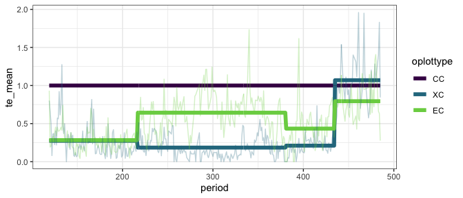<!-- -->

##### Total energy ratios GLS

This fit includes CC plots, for which ratio always = 1.

    ## era = a_pre_ba:
    ##  contrast estimate     SE  df t.ratio p.value
    ##  CC - EC    0.6998 0.0492 566 14.219  <.0001 
    ##  CC - XC    0.7170 0.0492 568 14.568  <.0001 
    ##  EC - XC    0.0172 0.0492 567  0.349  0.9349 
    ## 
    ## era = b_pre_cpt:
    ##  contrast estimate     SE  df t.ratio p.value
    ##  CC - EC    0.3644 0.0386 578  9.437  <.0001 
    ##  CC - XC    0.8183 0.0386 580 21.191  <.0001 
    ##  EC - XC    0.4539 0.0386 579 11.754  <.0001 
    ## 
    ## era = c_pre_switch:
    ##  contrast estimate     SE  df t.ratio p.value
    ##  CC - EC    0.5320 0.0646 582  8.233  <.0001 
    ##  CC - XC    0.7473 0.0646 584 11.564  <.0001 
    ##  EC - XC    0.2152 0.0646 584  3.331  0.0026 
    ## 
    ## era = d_post-switch:
    ##  contrast estimate     SE  df t.ratio p.value
    ##  CC - EC    0.2258 0.0685 591  3.296  0.0030 
    ##  CC - XC   -0.0133 0.0685 596 -0.194  0.9795 
    ##  EC - XC   -0.2391 0.0685 593 -3.490  0.0015 
    ## 
    ## Degrees-of-freedom method: satterthwaite 
    ## P value adjustment: tukey method for comparing a family of 3 estimates

This fit has CC plots removed.

    ## era = a_pre_ba:
    ##  contrast estimate     SE  df t.ratio p.value
    ##  EC - XC    0.0172 0.0603 366  0.285  0.7756 
    ## 
    ## era = b_pre_cpt:
    ##  contrast estimate     SE  df t.ratio p.value
    ##  EC - XC    0.4539 0.0473 372  9.597  <.0001 
    ## 
    ## era = c_pre_switch:
    ##  contrast estimate     SE  df t.ratio p.value
    ##  EC - XC    0.2152 0.0791 375  2.719  0.0068 
    ## 
    ## era = d_post-switch:
    ##  contrast estimate     SE  df t.ratio p.value
    ##  EC - XC   -0.2391 0.0839 381 -2.849  0.0046 
    ## 
    ## Degrees-of-freedom method: satterthwaite

    ## fplottype = EC:
    ##  contrast                       estimate     SE  df t.ratio p.value
    ##  a_pre_ba - b_pre_cpt            -0.3354 0.0536 153  -6.263 <.0001 
    ##  a_pre_ba - c_pre_switch         -0.1678 0.0703 158  -2.386 0.0840 
    ##  a_pre_ba - (d_post-switch)      -0.4740 0.0731 153  -6.487 <.0001 
    ##  b_pre_cpt - c_pre_switch         0.1676 0.0643 159   2.607 0.0487 
    ##  b_pre_cpt - (d_post-switch)     -0.1386 0.0681 151  -2.036 0.1795 
    ##  c_pre_switch - (d_post-switch)  -0.3062 0.0793 162  -3.861 0.0009 
    ## 
    ## fplottype = XC:
    ##  contrast                       estimate     SE  df t.ratio p.value
    ##  a_pre_ba - b_pre_cpt             0.1013 0.0536 153   1.891 0.2360 
    ##  a_pre_ba - c_pre_switch          0.0303 0.0703 158   0.431 0.9731 
    ##  a_pre_ba - (d_post-switch)      -0.7303 0.0731 152  -9.995 <.0001 
    ##  b_pre_cpt - c_pre_switch        -0.0710 0.0643 159  -1.104 0.6874 
    ##  b_pre_cpt - (d_post-switch)     -0.8316 0.0681 150 -12.217 <.0001 
    ##  c_pre_switch - (d_post-switch)  -0.7606 0.0793 161  -9.590 <.0001 
    ## 
    ## Degrees-of-freedom method: satterthwaite 
    ## P value adjustment: tukey method for comparing a family of 4 estimates

##### Smgran ratio GLS

    ## era = a_pre_ba:
    ##  contrast  estimate     SE  df t.ratio p.value
    ##  CC - EC  -0.161326 0.0629 338 -2.563  0.0290 
    ##  CC - XC  -0.137377 0.0629 339 -2.183  0.0756 
    ##  EC - XC   0.023949 0.0629 338  0.380  0.9233 
    ## 
    ## era = b_pre_cpt:
    ##  contrast  estimate     SE  df t.ratio p.value
    ##  CC - EC  -0.322585 0.0492 341 -6.559  <.0001 
    ##  CC - XC   0.107352 0.0492 342  2.183  0.0756 
    ##  EC - XC   0.429937 0.0492 342  8.741  <.0001 
    ## 
    ## era = c_pre_switch:
    ##  contrast  estimate     SE  df t.ratio p.value
    ##  CC - EC  -0.155510 0.0788 346 -1.974  0.1203 
    ##  CC - XC   0.111472 0.0788 346  1.415  0.3343 
    ##  EC - XC   0.266982 0.0788 346  3.389  0.0023 
    ## 
    ## era = d_post-switch:
    ##  contrast  estimate     SE  df t.ratio p.value
    ##  CC - EC  -0.039262 0.0847 347 -0.463  0.8885 
    ##  CC - XC  -0.000556 0.0847 349 -0.007  1.0000 
    ##  EC - XC   0.038706 0.0847 348  0.457  0.8914 
    ## 
    ## Degrees-of-freedom method: satterthwaite 
    ## P value adjustment: tukey method for comparing a family of 3 estimates

##### Tiny gran ratio GLS

    ## era = a_pre_ba:
    ##  contrast estimate     SE  df t.ratio p.value
    ##  CC - EC  -0.14004 0.0470 400 -2.977  0.0087 
    ##  CC - XC  -0.14518 0.0470 400 -3.086  0.0061 
    ##  EC - XC  -0.00514 0.0470 400 -0.109  0.9934 
    ## 
    ## era = b_pre_cpt:
    ##  contrast estimate     SE  df t.ratio p.value
    ##  CC - EC  -0.00844 0.0368 405 -0.229  0.9714 
    ##  CC - XC   0.03204 0.0368 406  0.871  0.6589 
    ##  EC - XC   0.04048 0.0368 405  1.100  0.5144 
    ## 
    ## era = c_pre_switch:
    ##  contrast estimate     SE  df t.ratio p.value
    ##  CC - EC  -0.06526 0.0600 409 -1.088  0.5223 
    ##  CC - XC   0.11150 0.0600 410  1.859  0.1522 
    ##  EC - XC   0.17676 0.0600 410  2.946  0.0095 
    ## 
    ## era = d_post-switch:
    ##  contrast estimate     SE  df t.ratio p.value
    ##  CC - EC  -0.00899 0.0640 412 -0.140  0.9892 
    ##  CC - XC  -0.00483 0.0640 415 -0.075  0.9969 
    ##  EC - XC   0.00416 0.0640 414  0.065  0.9977 
    ## 
    ## Degrees-of-freedom method: satterthwaite 
    ## P value adjustment: tukey method for comparing a family of 3 estimates

### glm on ratios

##### Total energy GLM

With controls:

    ## era = a_pre_ba:
    ##  contrast estimate     SE  df t.ratio p.value
    ##  CC - EC   0.71736 0.0512 987 14.017  <.0001 
    ##  CC - XC   0.72579 0.0511 987 14.212  <.0001 
    ##  EC - XC   0.00843 0.0194 987  0.435  0.9011 
    ## 
    ## era = b_pre_cpt:
    ##  contrast estimate     SE  df t.ratio p.value
    ##  CC - EC   0.35660 0.0483 987  7.381  <.0001 
    ##  CC - XC   0.81503 0.0413 987 19.726  <.0001 
    ##  EC - XC   0.45843 0.0272 987 16.854  <.0001 
    ## 
    ## era = c_pre_switch:
    ##  contrast estimate     SE  df t.ratio p.value
    ##  CC - EC   0.56572 0.0752 987  7.526  <.0001 
    ##  CC - XC   0.78945 0.0705 987 11.204  <.0001 
    ##  EC - XC   0.22373 0.0333 987  6.723  <.0001 
    ## 
    ## era = d_post-switch:
    ##  contrast estimate     SE  df t.ratio p.value
    ##  CC - EC   0.20601 0.0972 987  2.119  0.0865 
    ##  CC - XC  -0.06968 0.1115 987 -0.625  0.8064 
    ##  EC - XC  -0.27569 0.1014 987 -2.718  0.0183 
    ## 
    ## P value adjustment: tukey method for comparing a family of 3 estimates

Without controls:

    ## era = a_pre_ba:
    ##  contrast estimate     SE  df t.ratio p.value
    ##  EC - XC   0.00843 0.0238 658  0.355  0.7228 
    ## 
    ## era = b_pre_cpt:
    ##  contrast estimate     SE  df t.ratio p.value
    ##  EC - XC   0.45843 0.0333 658 13.761  <.0001 
    ## 
    ## era = c_pre_switch:
    ##  contrast estimate     SE  df t.ratio p.value
    ##  EC - XC   0.22373 0.0408 658  5.490  <.0001 
    ## 
    ## era = d_post-switch:
    ##  contrast estimate     SE  df t.ratio p.value
    ##  EC - XC  -0.27569 0.1242 658 -2.219  0.0268

##### Small granivore ratio GLM

    ## era = a_pre_ba:
    ##  contrast estimate     SE  df t.ratio p.value
    ##  CC - EC  -0.15042 0.0182 987 -8.285  <.0001 
    ##  CC - XC  -0.14930 0.0181 987 -8.259  <.0001 
    ##  EC - XC   0.00112 0.0241 987  0.046  0.9988 
    ## 
    ## era = b_pre_cpt:
    ##  contrast estimate     SE  df t.ratio p.value
    ##  CC - EC  -0.33981 0.0386 987 -8.810  <.0001 
    ##  CC - XC   0.10546 0.0174 987  6.052  <.0001 
    ##  EC - XC   0.44526 0.0366 987 12.179  <.0001 
    ## 
    ## era = c_pre_switch:
    ##  contrast estimate     SE  df t.ratio p.value
    ##  CC - EC  -0.14379 0.0521 987 -2.759  0.0162 
    ##  CC - XC   0.14081 0.0322 987  4.376  <.0001 
    ##  EC - XC   0.28461 0.0458 987  6.218  <.0001 
    ## 
    ## era = d_post-switch:
    ##  contrast estimate     SE  df t.ratio p.value
    ##  CC - EC  -0.01585 0.0402 987 -0.394  0.9179 
    ##  CC - XC  -0.04005 0.0422 987 -0.949  0.6096 
    ##  EC - XC  -0.02420 0.0434 987 -0.558  0.8426 
    ## 
    ## P value adjustment: tukey method for comparing a family of 3 estimates

##### Tiny granivore ratio GLM

    ## era = a_pre_ba:
    ##  contrast  estimate     SE  df t.ratio p.value
    ##  CC - EC  -0.150048 0.0196 987 -7.638  <.0001 
    ##  CC - XC  -0.149300 0.0196 987 -7.621  <.0001 
    ##  EC - XC   0.000747 0.0261 987  0.029  0.9995 
    ## 
    ## era = b_pre_cpt:
    ##  contrast  estimate     SE  df t.ratio p.value
    ##  CC - EC  -0.004722 0.0143 987 -0.330  0.9418 
    ##  CC - XC   0.023749 0.0130 987  1.820  0.1634 
    ##  EC - XC   0.028471 0.0133 987  2.143  0.0818 
    ## 
    ## era = c_pre_switch:
    ##  contrast  estimate     SE  df t.ratio p.value
    ##  CC - EC  -0.069124 0.0490 987 -1.412  0.3351 
    ##  CC - XC   0.139806 0.0341 987  4.097  0.0001 
    ##  EC - XC   0.208930 0.0411 987  5.082  <.0001 
    ## 
    ## era = d_post-switch:
    ##  contrast  estimate     SE  df t.ratio p.value
    ##  CC - EC   0.000703 0.0421 987  0.017  0.9998 
    ##  CC - XC  -0.032558 0.0451 987 -0.723  0.7502 
    ##  EC - XC  -0.033261 0.0450 987 -0.739  0.7403 
    ## 
    ## P value adjustment: tukey method for comparing a family of 3 estimates
