Energy plots
================

variables…

  - Dipo energy on a control plot (amount of energy left available given
    Dipo removal)
  - tinygran energy on a control plot (baseline tinygran energy if no
    compensation happens)
  - Additional tinygran energy on a treatment plot (amount of energy
    attributable to compensation)
  - tinygran\_gain / dipo\_control (approximates amount of POTENTIAL
    compensation ACHIEVED, but can be negative or \> 1) —\> this is what
    we want to estimate.

<!-- end list -->

    ## Loading in data version 2.49.0

    ## Joining, by = "plot"

    ## `summarise()` has grouped output by 'period', 'censusdate', 'era'. You can override using the `.groups` argument.

    ## Joining, by = "row"

<!-- -->

    ## Joining, by = "row"

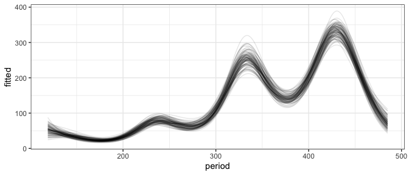<!-- -->

    ## Joining, by = "row"

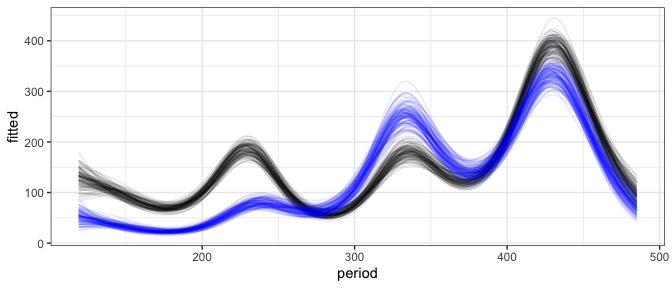<!-- -->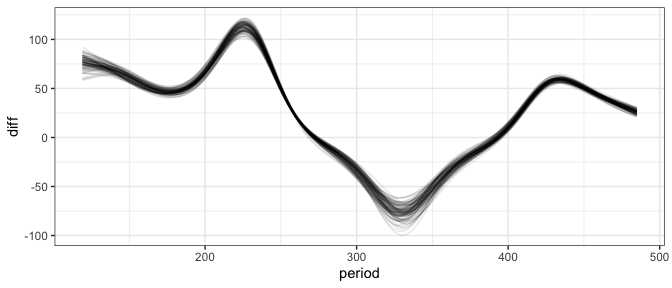<!-- -->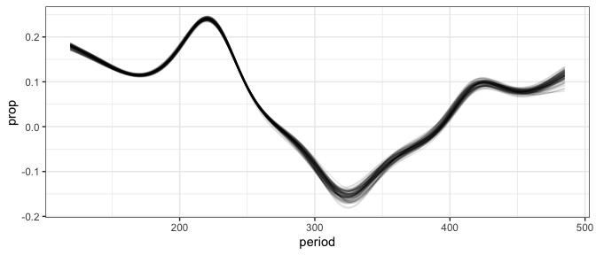<!-- -->

    ## Joining, by = "period"

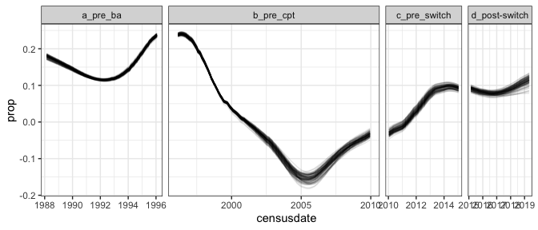<!-- -->

    ## Joining, by = "row"

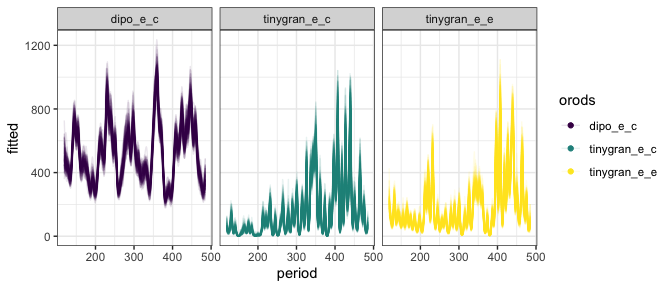<!-- -->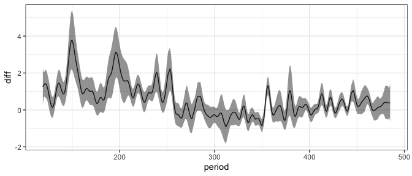<!-- -->

<!-- -->

    ## Joining, by = "period"

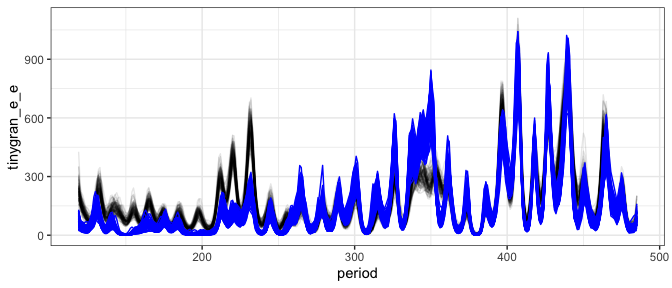<!-- -->

    ## mapping: x = ~period, y = 0, colour = ~diff_over_zero 
    ## geom_point: na.rm = FALSE
    ## stat_identity: na.rm = FALSE
    ## position_identity

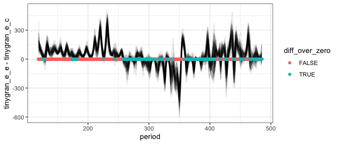<!-- -->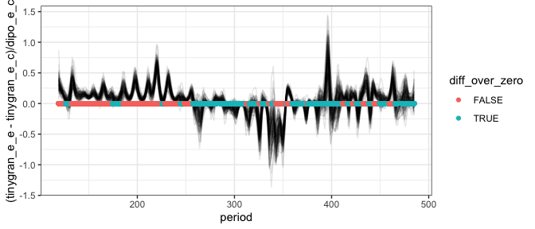<!-- -->

    ## Joining, by = "row"

    ## `summarise()` has grouped output by 'row', 'period', 'orods'. You can override using the `.groups` argument.

    ## Joining, by = "period"
    ## Joining, by = "period"

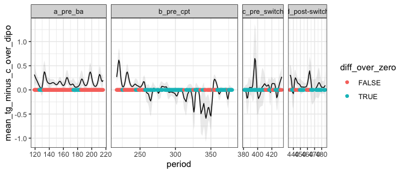<!-- -->

    ## # A tibble: 4 x 3
    ##   era           mean_mean_tg_minus_c_over_dipo sd_mean_tg_minus_c_over_dipo
    ## * <chr>                                  <dbl>                        <dbl>
    ## 1 a_pre_ba                              0.160                        0.0805
    ## 2 b_pre_cpt                            -0.0142                       0.205 
    ## 3 c_pre_switch                          0.0667                       0.167 
    ## 4 d_post-switch                         0.116                        0.102

    ##  contrast                       estimate     SE  df z.ratio p.value
    ##  a_pre_ba - b_pre_cpt             0.1740 0.0209 Inf  8.307  <.0001 
    ##  a_pre_ba - c_pre_switch          0.0931 0.0278 Inf  3.350  0.0045 
    ##  a_pre_ba - (d_post-switch)       0.0440 0.0298 Inf  1.479  0.4505 
    ##  b_pre_cpt - c_pre_switch        -0.0809 0.0263 Inf -3.080  0.0111 
    ##  b_pre_cpt - (d_post-switch)     -0.1300 0.0283 Inf -4.592  <.0001 
    ##  c_pre_switch - (d_post-switch)  -0.0492 0.0337 Inf -1.458  0.4629 
    ## 
    ## P value adjustment: tukey method for comparing a family of 4 estimates

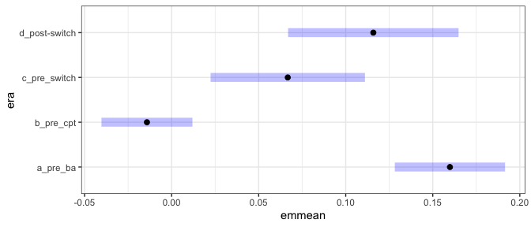<!-- -->
