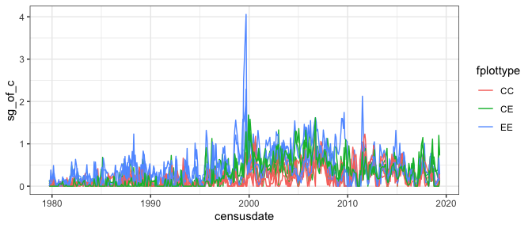
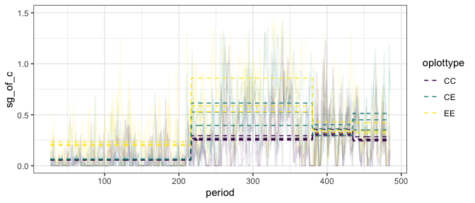
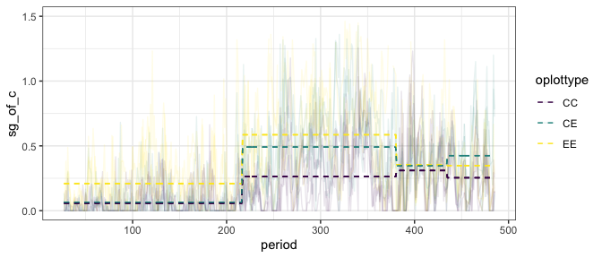

Energy plots
================

``` r
use_christensen_plots <- F

library(mgcv)
```

    ## Loading required package: nlme

    ## 
    ## Attaching package: 'nlme'

    ## The following object is masked from 'package:dplyr':
    ## 
    ##     collapse

    ## This is mgcv 1.8-33. For overview type 'help("mgcv-package")'.

``` r
source(here::here("lore", "1994_longterm", "gams_fxns_generalized.R"))

plot_totals <- get_rodent_data(use_christensen_plots = use_christensen_plots, return_plot = T) %>%
   mutate(tinygran_e = smgran_e - pb_e) %>%
  mutate(oplottype = ordered(plot_type))
```

    ## Loading in data version 2.49.0

    ## `summarise()` regrouping output by 'period', 'censusdate', 'era' (override with `.groups` argument)

``` r
plot_annuals <- plot_totals %>%
  mutate(censusdate = as.Date(censusdate)) %>%
  mutate(censusyear = as.integer(format.Date(censusdate, "%Y"))) %>%
  group_by(censusyear, plot, plot_type, era) %>%
  summarize(annual_total_e = mean(total_e),
            annual_smgran_e = mean(smgran_e),
            annual_tinygran_e = mean(tinygran_e),
            nsamples = length(unique(period)),
            nrows = dplyr::n()) %>%
  ungroup()
```

    ## `summarise()` regrouping output by 'censusyear', 'plot', 'plot_type' (override with `.groups` argument)

``` r
treatment_means <- get_rodent_data(use_christensen_plots, F, F) %>%
  mutate(tinygran_e = smgran_e - pb_e) %>%
  mutate(oplottype = as.factor(plot_type))
```

    ## Loading in data version 2.49.0
    ## `summarise()` regrouping output by 'period', 'censusdate', 'era' (override with `.groups` argument)

``` r
# treatment_ratios <- get_total_energy_ratios(treatment_means)
```

## Ratios

``` r
treatment_ratios <- get_total_energy_ratios(treatment_means) 
```

    ## Joining, by = "period"

``` r
control_means <- filter(treatment_ratios, plot_type == "CC") %>%
  select(period, censusdate, total_e_c)

plot_ratio_totals <- plot_totals %>%
  left_join(control_means) %>%
  mutate(total_e_of_c = total_e / total_e_c,
    sg_of_c = smgran_e / total_e_c,
         tg_of_c = tinygran_e / total_e_c) %>%
  mutate(total_e_of_c = 0.0000000001 + total_e_of_c,
         sg_of_c = 0.0000000001 + sg_of_c,
         tg_of_c = 0.0000000001 + tg_of_c) %>%
  mutate(fplottype = factor(plot_type))
```

    ## Joining, by = c("period", "censusdate")

``` r
ggplot(plot_ratio_totals, aes(censusdate, sg_of_c, color = fplottype, group = plot)) +
  geom_line()
```

<!-- -->

``` r
library(lme4)
```

    ## Loading required package: Matrix

    ## 
    ## Attaching package: 'lme4'

    ## The following object is masked from 'package:nlme':
    ## 
    ##     lmList

``` r
library(emmeans)


sg_glm <- glm(sg_of_c ~ oplottype * era, data = plot_ratio_totals, family = Gamma)

pairs(emmeans(sg_glm, ~ oplottype |era))
```

    ## Note: Use 'contrast(regrid(object), ...)' to obtain contrasts of back-transformed estimates

    ## era = a_pre_ba:
    ##  contrast estimate    SE  df z.ratio p.value
    ##  CC - CE     1.845 1.064 Inf  1.733  0.1927 
    ##  CC - EE    12.504 0.777 Inf 16.084  <.0001 
    ##  CE - EE    10.659 0.799 Inf 13.339  <.0001 
    ## 
    ## era = b_pre_cpt:
    ##  contrast estimate    SE  df z.ratio p.value
    ##  CC - CE     1.764 0.214 Inf  8.226  <.0001 
    ##  CC - EE     2.198 0.203 Inf 10.841  <.0001 
    ##  CE - EE     0.434 0.141 Inf  3.078  0.0059 
    ## 
    ## era = c_pre_switch:
    ##  contrast estimate    SE  df z.ratio p.value
    ##  CC - CE     0.306 0.379 Inf  0.808  0.6979 
    ##  CC - EE     0.428 0.370 Inf  1.157  0.4790 
    ##  CE - EE     0.122 0.378 Inf  0.323  0.9440 
    ## 
    ## era = d_post-switch:
    ##  contrast estimate    SE  df z.ratio p.value
    ##  CC - CE     1.561 0.430 Inf  3.625  0.0008 
    ##  CC - EE     1.085 0.461 Inf  2.352  0.0489 
    ##  CE - EE    -0.476 0.382 Inf -1.247  0.4258 
    ## 
    ## Note: contrasts are still on the inverse scale 
    ## P value adjustment: tukey method for comparing a family of 3 estimates

``` r
sg_glm2 <- glm(sg_of_c ~ oplottype * era + plot, data = plot_ratio_totals, family = Gamma)

pairs(emmeans(sg_glm2, ~ oplottype |era))
```

    ## Note: Use 'contrast(regrid(object), ...)' to obtain contrasts of back-transformed estimates

    ## era = a_pre_ba:
    ##  contrast estimate    SE  df z.ratio p.value
    ##  CC - CE     1.801 1.058 Inf  1.703  0.2042 
    ##  CC - EE    12.523 0.772 Inf 16.213  <.0001 
    ##  CE - EE    10.722 0.794 Inf 13.506  <.0001 
    ## 
    ## era = b_pre_cpt:
    ##  contrast estimate    SE  df z.ratio p.value
    ##  CC - CE     1.673 0.213 Inf  7.846  <.0001 
    ##  CC - EE     2.182 0.201 Inf 10.869  <.0001 
    ##  CE - EE     0.509 0.138 Inf  3.687  0.0007 
    ## 
    ## era = c_pre_switch:
    ##  contrast estimate    SE  df z.ratio p.value
    ##  CC - CE     0.236 0.375 Inf  0.631  0.8029 
    ##  CC - EE     0.445 0.366 Inf  1.215  0.4441 
    ##  CE - EE     0.208 0.373 Inf  0.558  0.8421 
    ## 
    ## era = d_post-switch:
    ##  contrast estimate    SE  df z.ratio p.value
    ##  CC - CE     1.478 0.426 Inf  3.467  0.0015 
    ##  CC - EE     1.099 0.457 Inf  2.407  0.0425 
    ##  CE - EE    -0.379 0.377 Inf -1.006  0.5733 
    ## 
    ## Note: contrasts are still on the inverse scale 
    ## P value adjustment: tukey method for comparing a family of 3 estimates

``` r
sg_glmer <- glmer(sg_of_c ~ oplottype * era + (period | plot), data = plot_ratio_totals, family = Gamma)
```

    ## boundary (singular) fit: see ?isSingular

``` r
summary(sg_glmer)
```

    ## Warning in vcov.merMod(object, use.hessian = use.hessian): variance-covariance matrix computed from finite-difference Hessian is
    ## not positive definite or contains NA values: falling back to var-cov estimated from RX

    ## Warning in vcov.merMod(object, correlation = correlation, sigm = sig): variance-covariance matrix computed from finite-difference Hessian is
    ## not positive definite or contains NA values: falling back to var-cov estimated from RX

    ## Generalized linear mixed model fit by maximum likelihood (Laplace
    ##   Approximation) [glmerMod]
    ##  Family: Gamma  ( inverse )
    ## Formula: sg_of_c ~ oplottype * era + (period | plot)
    ##    Data: plot_ratio_totals
    ## 
    ##      AIC      BIC   logLik deviance df.resid 
    ## -35232.0 -35130.4  17632.0 -35264.0     4224 
    ## 
    ## Scaled residuals: 
    ##     Min      1Q  Median      3Q     Max 
    ## -0.8554 -0.8554 -0.1710  0.4126 12.3432 
    ## 
    ## Random effects:
    ##  Groups   Name        Variance  Std.Dev. Corr 
    ##  plot     (Intercept) 5.503e+00 2.345886      
    ##           period      2.077e-05 0.004557 -1.00
    ##  Residual             1.367e+00 1.169111      
    ## Number of obs: 4240, groups:  plot, 10
    ## 
    ## Fixed effects:
    ##                              Estimate Std. Error t value Pr(>|z|)    
    ## (Intercept)                   11.9513     0.5185  23.051  < 2e-16 ***
    ## oplottype.L                   -8.5211     0.8339 -10.219  < 2e-16 ***
    ## oplottype.Q                   -4.0833     0.9579  -4.263 2.02e-05 ***
    ## erab_pre_cpt                  -9.6181     0.4033 -23.846  < 2e-16 ***
    ## erac_pre_switch               -9.1162     0.4756 -19.169  < 2e-16 ***
    ## erad_post-switch              -8.9735     0.5129 -17.497  < 2e-16 ***
    ## oplottype.L:erab_pre_cpt       6.8369     0.6177  11.069  < 2e-16 ***
    ## oplottype.Q:erab_pre_cpt       4.6561     0.7711   6.038 1.56e-09 ***
    ## oplottype.L:erac_pre_switch    8.0161     0.7542  10.628  < 2e-16 ***
    ## oplottype.Q:erac_pre_switch    4.2664     0.8878   4.806 1.54e-06 ***
    ## oplottype.L:erad_post-switch   7.7873     0.8340   9.338  < 2e-16 ***
    ## oplottype.Q:erad_post-switch   4.9492     0.9395   5.268 1.38e-07 ***
    ## ---
    ## Signif. codes:  0 '***' 0.001 '**' 0.01 '*' 0.05 '.' 0.1 ' ' 1
    ## 
    ## Correlation of Fixed Effects:
    ##                (Intr) oplt.L oplt.Q erb_p_ erc_p_ erd_p- oplttyp.L:rb__
    ## oplottype.L    -0.403                                                  
    ## oplottype.Q    -0.183 -0.267                                           
    ## erab_pr_cpt    -0.915  0.406  0.233                                    
    ## erc_pr_swtc    -0.934  0.393  0.198  0.907                             
    ## erd_pst-swt    -0.936  0.385  0.184  0.881  0.885                      
    ## oplttyp.L:rb__  0.426 -0.900  0.283 -0.507 -0.437 -0.418               
    ## oplttyp.Q:rb__  0.225  0.260 -0.926 -0.280 -0.244 -0.227 -0.325        
    ## oplttyp.L:rc__  0.398 -0.924  0.264 -0.422 -0.403 -0.385  0.886        
    ## oplttyp.Q:rc__  0.196  0.258 -0.942 -0.250 -0.212 -0.197 -0.287        
    ## opltty.L:_-     0.381 -0.914  0.252 -0.393 -0.375 -0.385  0.849        
    ## opltty.Q:_-     0.185  0.257 -0.952 -0.236 -0.201 -0.159 -0.279        
    ##                oplttyp.Q:rb__ oplttyp.L:rc__ oplttyp.Q:rc__ o.L:_-
    ## oplottype.L                                                       
    ## oplottype.Q                                                       
    ## erab_pr_cpt                                                       
    ## erc_pr_swtc                                                       
    ## erd_pst-swt                                                       
    ## oplttyp.L:rb__                                                    
    ## oplttyp.Q:rb__                                                    
    ## oplttyp.L:rc__ -0.270                                             
    ## oplttyp.Q:rc__  0.923         -0.265                              
    ## opltty.L:_-    -0.252          0.855         -0.246               
    ## opltty.Q:_-     0.906         -0.257          0.908         -0.257
    ## optimizer (Nelder_Mead) convergence code: 0 (OK)
    ## boundary (singular) fit: see ?isSingular

``` r
sg_emmeans <- emmeans(sg_glm, specs = ~ oplottype | era)

pairs(sg_emmeans)
```

    ## Note: Use 'contrast(regrid(object), ...)' to obtain contrasts of back-transformed estimates

    ## era = a_pre_ba:
    ##  contrast estimate    SE  df z.ratio p.value
    ##  CC - CE     1.845 1.064 Inf  1.733  0.1927 
    ##  CC - EE    12.504 0.777 Inf 16.084  <.0001 
    ##  CE - EE    10.659 0.799 Inf 13.339  <.0001 
    ## 
    ## era = b_pre_cpt:
    ##  contrast estimate    SE  df z.ratio p.value
    ##  CC - CE     1.764 0.214 Inf  8.226  <.0001 
    ##  CC - EE     2.198 0.203 Inf 10.841  <.0001 
    ##  CE - EE     0.434 0.141 Inf  3.078  0.0059 
    ## 
    ## era = c_pre_switch:
    ##  contrast estimate    SE  df z.ratio p.value
    ##  CC - CE     0.306 0.379 Inf  0.808  0.6979 
    ##  CC - EE     0.428 0.370 Inf  1.157  0.4790 
    ##  CE - EE     0.122 0.378 Inf  0.323  0.9440 
    ## 
    ## era = d_post-switch:
    ##  contrast estimate    SE  df z.ratio p.value
    ##  CC - CE     1.561 0.430 Inf  3.625  0.0008 
    ##  CC - EE     1.085 0.461 Inf  2.352  0.0489 
    ##  CE - EE    -0.476 0.382 Inf -1.247  0.4258 
    ## 
    ## Note: contrasts are still on the inverse scale 
    ## P value adjustment: tukey method for comparing a family of 3 estimates

``` r
sg_glmer2 <- glmer(sg_of_c ~ oplottype * era + (1 | plot) + (period | plot), data = plot_ratio_totals, family = Gamma)
```

    ## boundary (singular) fit: see ?isSingular

``` r
summary(sg_glmer2)
```

    ## Generalized linear mixed model fit by maximum likelihood (Laplace
    ##   Approximation) [glmerMod]
    ##  Family: Gamma  ( inverse )
    ## Formula: sg_of_c ~ oplottype * era + (1 | plot) + (period | plot)
    ##    Data: plot_ratio_totals
    ## 
    ##      AIC      BIC   logLik deviance df.resid 
    ##   -35230   -35122    17632   -35264     4223 
    ## 
    ## Scaled residuals: 
    ##     Min      1Q  Median      3Q     Max 
    ## -0.8428 -0.8428 -0.1829  0.3966 11.8566 
    ## 
    ## Random effects:
    ##  Groups   Name        Variance  Std.Dev. Corr 
    ##  plot     (Intercept) 4.036e-04 0.020091      
    ##  plot.1   (Intercept) 1.656e+00 1.286746      
    ##           period      2.702e-06 0.001644 -1.00
    ##  Residual             1.408e+00 1.186483      
    ## Number of obs: 4240, groups:  plot, 10
    ## 
    ## Fixed effects:
    ##                              Estimate Std. Error t value Pr(>|z|)    
    ## (Intercept)                   12.6873     0.8852  14.333  < 2e-16 ***
    ## oplottype.L                   -9.1644     1.3707  -6.686 2.30e-11 ***
    ## oplottype.Q                   -3.6667     1.4942  -2.454  0.01413 *  
    ## erab_pre_cpt                 -10.1936     0.8137 -12.528  < 2e-16 ***
    ## erac_pre_switch               -9.7495     0.8657 -11.262  < 2e-16 ***
    ## erad_post-switch              -9.6893     0.8843 -10.957  < 2e-16 ***
    ## oplottype.L:erab_pre_cpt       7.6145     1.2255   6.213 5.19e-10 ***
    ## oplottype.Q:erab_pre_cpt       4.2538     1.4662   2.901  0.00372 ** 
    ## oplottype.L:erac_pre_switch    8.8195     1.3353   6.605 3.98e-11 ***
    ## oplottype.Q:erac_pre_switch    3.7591     1.5624   2.406  0.01613 *  
    ## oplottype.L:erad_post-switch   8.3117     1.4250   5.833 5.45e-09 ***
    ## oplottype.Q:erad_post-switch   4.5561     1.5617   2.917  0.00353 ** 
    ## ---
    ## Signif. codes:  0 '***' 0.001 '**' 0.01 '*' 0.05 '.' 0.1 ' ' 1
    ## 
    ## Correlation of Fixed Effects:
    ##                (Intr) oplt.L oplt.Q erb_p_ erc_p_ erd_p- oplttyp.L:rb__
    ## oplottype.L    -0.266                                                  
    ## oplottype.Q    -0.294 -0.301                                           
    ## erab_pr_cpt    -0.918  0.449  0.282                                    
    ## erc_pr_swtc    -0.842  0.457  0.257  0.893                             
    ## erd_pst-swt    -0.825  0.446  0.251  0.872  0.827                      
    ## oplttyp.L:rb__  0.461 -0.892  0.316 -0.577 -0.524 -0.511               
    ## oplttyp.Q:rb__  0.297  0.330 -0.959 -0.279 -0.260 -0.253 -0.349        
    ## oplttyp.L:rc__  0.387 -0.862  0.293 -0.490 -0.478 -0.465  0.866        
    ## oplttyp.Q:rc__  0.276  0.302 -0.911 -0.268 -0.249 -0.236 -0.306        
    ## opltty.L:_-     0.341 -0.836  0.281 -0.453 -0.444 -0.474  0.820        
    ## opltty.Q:_-     0.276  0.292 -0.913 -0.270 -0.245 -0.190 -0.300        
    ##                oplttyp.Q:rb__ oplttyp.L:rc__ oplttyp.Q:rc__ o.L:_-
    ## oplottype.L                                                       
    ## oplottype.Q                                                       
    ## erab_pr_cpt                                                       
    ## erc_pr_swtc                                                       
    ## erd_pst-swt                                                       
    ## oplttyp.L:rb__                                                    
    ## oplttyp.Q:rb__                                                    
    ## oplttyp.L:rc__ -0.309                                             
    ## oplttyp.Q:rc__  0.906         -0.287                              
    ## opltty.L:_-    -0.298          0.773         -0.276               
    ## opltty.Q:_-     0.904         -0.280          0.851         -0.297
    ## optimizer (Nelder_Mead) convergence code: 0 (OK)
    ## boundary (singular) fit: see ?isSingular

``` r
library(emmeans)

sg_emmeans2 <- emmeans(sg_glmer2, specs = ~ oplottype | era)

pairs(sg_emmeans2)
```

    ## Note: Use 'contrast(regrid(object), ...)' to obtain contrasts of back-transformed estimates

    ## era = a_pre_ba:
    ##  contrast estimate    SE  df z.ratio p.value
    ##  CC - CE     1.989 2.314 Inf  0.860  0.6657 
    ##  CC - EE    12.960 1.939 Inf  6.686  <.0001 
    ##  CE - EE    10.971 1.795 Inf  6.112  <.0001 
    ## 
    ## era = b_pre_cpt:
    ##  contrast estimate    SE  df z.ratio p.value
    ##  CC - CE     1.815 0.682 Inf  2.662  0.0212 
    ##  CC - EE     2.192 0.878 Inf  2.497  0.0335 
    ##  CE - EE     0.377 0.678 Inf  0.556  0.8434 
    ## 
    ## era = c_pre_switch:
    ##  contrast estimate    SE  df z.ratio p.value
    ##  CC - CE     0.357 0.924 Inf  0.386  0.9211 
    ##  CC - EE     0.488 1.006 Inf  0.485  0.8785 
    ##  CE - EE     0.131 0.954 Inf  0.137  0.9897 
    ## 
    ## era = d_post-switch:
    ##  contrast estimate    SE  df z.ratio p.value
    ##  CC - CE     1.692 1.014 Inf  1.669  0.2170 
    ##  CC - EE     1.206 1.134 Inf  1.064  0.5366 
    ##  CE - EE    -0.486 0.916 Inf -0.531  0.8563 
    ## 
    ## Note: contrasts are still on the inverse scale 
    ## P value adjustment: tukey method for comparing a family of 3 estimates

``` r
sg_glmer3 <- glmer(sg_of_c ~ oplottype * era + (1 | plot) , data = plot_ratio_totals, family = Gamma)
```

    ## Warning in checkConv(attr(opt, "derivs"), opt$par, ctrl = control$checkConv, :
    ## Model failed to converge with max|grad| = 0.00418555 (tol = 0.002, component 1)

``` r
summary(sg_glmer3)
```

    ## Generalized linear mixed model fit by maximum likelihood (Laplace
    ##   Approximation) [glmerMod]
    ##  Family: Gamma  ( inverse )
    ## Formula: sg_of_c ~ oplottype * era + (1 | plot)
    ##    Data: plot_ratio_totals
    ## 
    ##      AIC      BIC   logLik deviance df.resid 
    ## -35235.6 -35146.7  17631.8 -35263.6     4226 
    ## 
    ## Scaled residuals: 
    ##     Min      1Q  Median      3Q     Max 
    ## -0.8555 -0.8555 -0.1920  0.3781 11.5195 
    ## 
    ## Random effects:
    ##  Groups   Name        Variance Std.Dev.
    ##  plot     (Intercept) 0.441    0.6641  
    ##  Residual             1.366    1.1689  
    ## Number of obs: 4240, groups:  plot, 10
    ## 
    ## Fixed effects:
    ##                              Estimate Std. Error t value Pr(>|z|)    
    ## (Intercept)                   12.5128     0.9136  13.697  < 2e-16 ***
    ## oplottype.L                   -8.8843     1.5018  -5.916 3.30e-09 ***
    ## oplottype.Q                   -3.5218     1.9383  -1.817   0.0692 .  
    ## erab_pre_cpt                  -9.9924     0.9228 -10.828  < 2e-16 ***
    ## erac_pre_switch               -9.5343     0.9664  -9.865  < 2e-16 ***
    ## erad_post-switch              -9.4571     0.9825  -9.625  < 2e-16 ***
    ## oplottype.L:erab_pre_cpt       7.3947     1.5265   4.844 1.27e-06 ***
    ## oplottype.Q:erab_pre_cpt       4.1115     1.9428   2.116   0.0343 *  
    ## oplottype.L:erac_pre_switch    8.5968     1.6003   5.372 7.78e-08 ***
    ## oplottype.Q:erac_pre_switch    3.6388     2.0460   1.778   0.0753 .  
    ## oplottype.L:erad_post-switch   8.1311     1.6778   4.846 1.26e-06 ***
    ## oplottype.Q:erad_post-switch   4.3821     2.0082   2.182   0.0291 *  
    ## ---
    ## Signif. codes:  0 '***' 0.001 '**' 0.01 '*' 0.05 '.' 0.1 ' ' 1
    ## 
    ## Correlation of Fixed Effects:
    ##                (Intr) oplt.L oplt.Q erb_p_ erc_p_ erd_p- oplttyp.L:rb__
    ## oplottype.L    -0.566                                                  
    ## oplottype.Q    -0.269 -0.441                                           
    ## erab_pr_cpt    -0.970  0.577  0.261                                    
    ## erc_pr_swtc    -0.927  0.549  0.251  0.924                             
    ## erd_pst-swt    -0.911  0.543  0.242  0.908  0.867                      
    ## oplttyp.L:rb__  0.572 -0.966  0.444 -0.592 -0.543 -0.537               
    ## oplttyp.Q:rb__  0.264  0.449 -0.981 -0.253 -0.250 -0.241 -0.458        
    ## oplttyp.L:rc__  0.547 -0.923  0.422 -0.547 -0.522 -0.515  0.915        
    ## oplttyp.Q:rc__  0.255  0.433 -0.949 -0.251 -0.245 -0.232 -0.430        
    ## opltty.L:_-     0.528 -0.894  0.411 -0.528 -0.502 -0.526  0.886        
    ## opltty.Q:_-     0.253  0.434 -0.947 -0.249 -0.240 -0.199 -0.430        
    ##                oplttyp.Q:rb__ oplttyp.L:rc__ oplttyp.Q:rc__ o.L:_-
    ## oplottype.L                                                       
    ## oplottype.Q                                                       
    ## erab_pr_cpt                                                       
    ## erc_pr_swtc                                                       
    ## erd_pst-swt                                                       
    ## oplttyp.L:rb__                                                    
    ## oplttyp.Q:rb__                                                    
    ## oplttyp.L:rc__ -0.423                                             
    ## oplttyp.Q:rc__  0.949         -0.410                              
    ## opltty.L:_-    -0.412          0.846         -0.398               
    ## opltty.Q:_-     0.947         -0.409          0.915         -0.415
    ## optimizer (Nelder_Mead) convergence code: 0 (OK)
    ## Model failed to converge with max|grad| = 0.00418555 (tol = 0.002, component 1)

``` r
library(emmeans)

sg_emmeans3 <- emmeans(sg_glmer3, specs = ~ oplottype | era)

pairs(sg_emmeans3)
```

    ## Note: Use 'contrast(regrid(object), ...)' to obtain contrasts of back-transformed estimates

    ## era = a_pre_ba:
    ##  contrast estimate    SE  df z.ratio p.value
    ##  CC - CE     1.969 2.998 Inf  0.657  0.7885 
    ##  CC - EE    12.564 2.124 Inf  5.916  <.0001 
    ##  CE - EE    10.595 2.131 Inf  4.973  <.0001 
    ## 
    ## era = b_pre_cpt:
    ##  contrast estimate    SE  df z.ratio p.value
    ##  CC - CE     1.776 0.566 Inf  3.139  0.0048 
    ##  CC - EE     2.107 0.556 Inf  3.786  0.0004 
    ##  CE - EE     0.331 0.515 Inf  0.643  0.7964 
    ## 
    ## era = c_pre_switch:
    ##  contrast estimate    SE  df z.ratio p.value
    ##  CC - CE     0.347 0.888 Inf  0.390  0.9194 
    ##  CC - EE     0.407 0.871 Inf  0.467  0.8867 
    ##  CE - EE     0.060 0.919 Inf  0.065  0.9977 
    ## 
    ## era = d_post-switch:
    ##  contrast estimate    SE  df z.ratio p.value
    ##  CC - CE     1.586 0.991 Inf  1.601  0.2450 
    ##  CC - EE     1.065 1.065 Inf  1.000  0.5769 
    ##  CE - EE    -0.521 0.920 Inf -0.566  0.8380 
    ## 
    ## Note: contrasts are still on the inverse scale 
    ## P value adjustment: tukey method for comparing a family of 3 estimates

``` r
sg_pred <- plot_ratio_totals %>%
  select(period, oplottype, era, plot, sg_of_c) %>%
  mutate(glm_pred = predict(sg_glm, type = "response"),
         glm2_pred = predict(sg_glm2, type = "response"),
         glmer1_pred = predict(sg_glmer, type = "response", re.form=NA),
         glmer2_pred = predict(sg_glmer2, type = "response", re.form=NA),
         glmer3_pred = predict(sg_glmer3, type = "response", re.form=NA))

ggplot(sg_pred, aes(period, sg_of_c, group = plot, color = oplottype)) +
  geom_line(alpha = .1) +
  geom_line(aes(y = glm_pred), linetype = 2) +
  ylim(0, 1.5)
```

<!-- -->

``` r
ggplot(sg_pred, aes(period, sg_of_c, group = plot, color = oplottype)) +
  geom_line(alpha = .1) +
  geom_line(aes(y = glm2_pred), linetype = 2) +
  ylim(0, 1.5)
```

<!-- -->

``` r
ggplot(sg_pred, aes(period, sg_of_c, group = plot, color = oplottype)) +
  geom_line(alpha = .1) +
  geom_line(aes(y = glmer1_pred), linetype = 2) +
  ylim(0, 1.5)
```

<!-- -->

``` r
ggplot(sg_pred, aes(period, sg_of_c, group = plot, color = oplottype)) +
  geom_line(alpha = .1) +
  geom_line(aes(y = glmer2_pred), linetype = 2) +
  ylim(0, 1.5)
```

<!-- -->

``` r
ggplot(sg_pred, aes(period, sg_of_c, group = plot, color = oplottype)) +
  geom_line(alpha = .1) +
  geom_line(aes(y = glmer3_pred), linetype = 2) +
  ylim(0, 1.5)
```

<!-- -->
