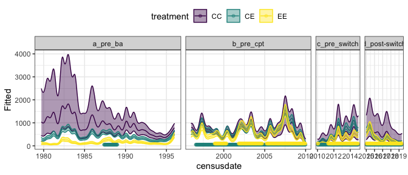
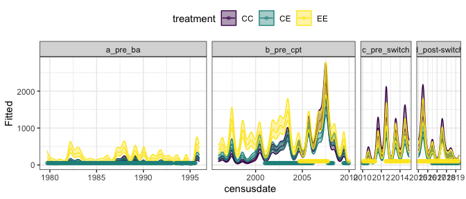
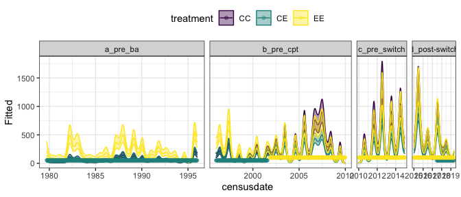

GAM
================

    ## Loading in data version 2.49.0

    ## `summarise()` regrouping output by 'period', 'censusdate', 'era' (override with `.groups` argument)

Following Christensen pretty closely.

# Total energy

  - Fit GAM
      - `total_e ~ plot + treatment + s(period, k = 100) + s(period, by
        = treatment, k = 100) + s(period, by = plot, k = 50), family =
        "tw", method = "REML", select = TRUE, control =
        gam.control(nthreads = 4))` takes a long time so dev with low k.

<!-- end list -->

    ## Joining, by = "censusdate"

<!-- -->

# Small granivores

    ## Joining, by = "censusdate"

<!-- -->

# Tiny granivores

    ## Joining, by = "censusdate"

<!-- -->
