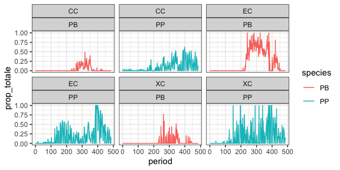
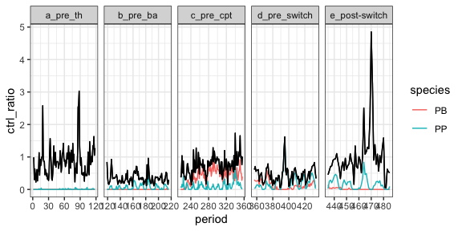
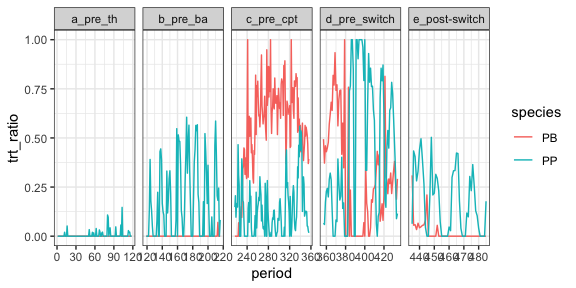
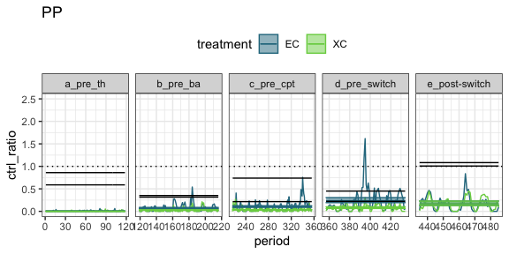
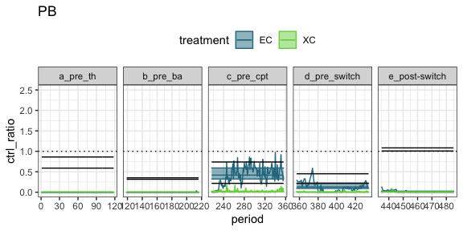

pp, pb
================

# Data

    ## `summarise()` regrouping output by 'censusdate', 'period' (override with `.groups` argument)

    ## `summarise()` ungrouping output (override with `.groups` argument)

    ## `summarise()` regrouping output by 'censusdate', 'period', 'treatment' (override with `.groups` argument)

    ## Joining, by = "period"

    ## Joining, by = "treatment"

    ## Joining, by = c("period", "species", "treatment", "censusdate")

    ## Joining, by = c("period", "treatment", "censusdate")

<!-- -->

This is a mess. Trying to get ratio of (totale of PP on exclosure) to
(totale on control) for PP, PB and exclosure, removal, and ratio of
(totale on exclosure to totale on control). Then the ratio of species
compensation to total compensation. Not sure. Trying to partition
species contributions.

    ## Joining, by = c("period", "censusdate")

    ## Joining, by = "period"

<!-- --><!-- -->

    ## Loading required package: emmeans

    ## The 'lsmeans' package is now basically a front end for 'emmeans'.
    ## Users are encouraged to switch the rest of the way.
    ## See help('transition') for more information, including how to
    ## convert old 'lsmeans' objects and scripts to work with 'emmeans'.

    ## Note: Use 'contrast(regrid(object), ...)' to obtain contrasts of back-transformed estimates

<!-- -->

    ## Note: Use 'contrast(regrid(object), ...)' to obtain contrasts of back-transformed estimates

<!-- -->

I think this means there was a decline in PB, **offset somewhat by PP in
a way that did not occur in b.**, but **not sufficient to offset the
loss of PB**.
