Energy plots
================

    ## Warning: package 'mgcv' was built under R version 4.0.3

    ## Loading required package: nlme

    ## 
    ## Attaching package: 'nlme'

    ## The following object is masked from 'package:dplyr':
    ## 
    ##     collapse

    ## This is mgcv 1.8-33. For overview type 'help("mgcv-package")'.

    ## Loading in data version 2.18.0

    ## `summarise()` regrouping output by 'period', 'censusdate', 'era' (override with `.groups` argument)

    ## `summarise()` regrouping output by 'censusyear', 'plot', 'plot_type' (override with `.groups` argument)

    ## Loading in data version 2.18.0

    ## `summarise()` regrouping output by 'period', 'censusdate', 'era' (override with `.groups` argument)

## Ratios

    ## Joining, by = "period"

    ## Joining, by = c("period", "censusdate")

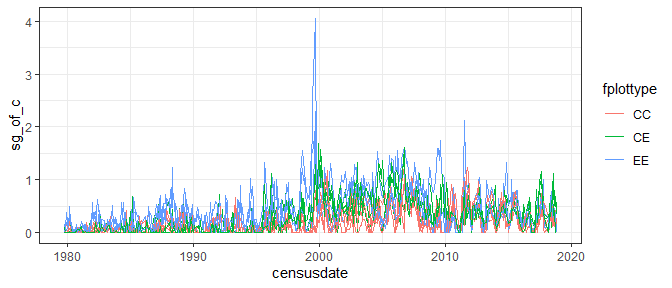<!-- -->

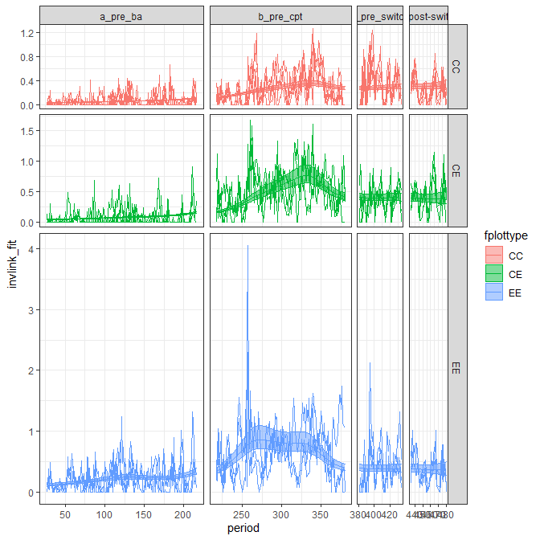<!-- -->

    ## Joining, by = "period"

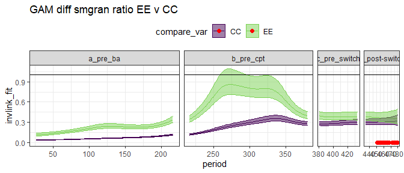<!-- -->

    ## Joining, by = "period"

    ## Scale for 'fill' is already present. Adding another scale for 'fill', which
    ## will replace the existing scale.

    ## Scale for 'colour' is already present. Adding another scale for 'colour',
    ## which will replace the existing scale.

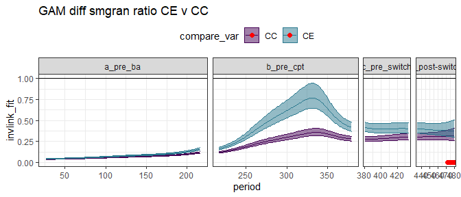<!-- -->

    ## Joining, by = "period"

    ## Scale for 'fill' is already present. Adding another scale for 'fill', which
    ## will replace the existing scale.

    ## Scale for 'colour' is already present. Adding another scale for 'colour',
    ## which will replace the existing scale.

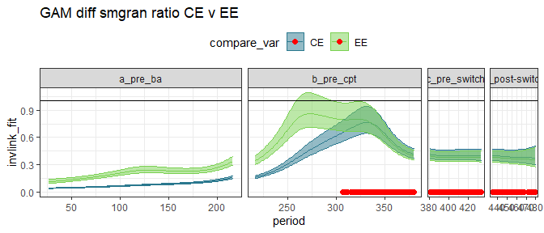<!-- -->

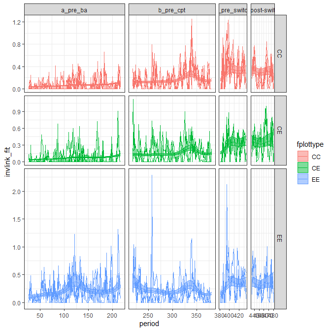<!-- -->

    ## Joining, by = "period"

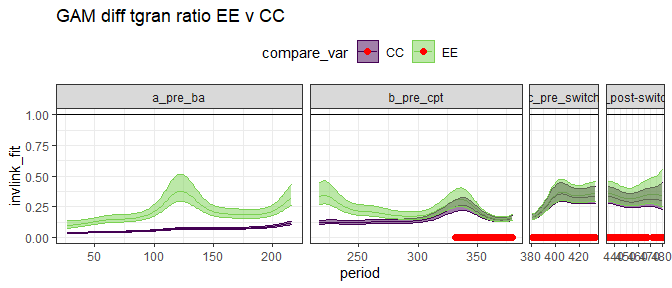<!-- -->

    ## Joining, by = "period"

    ## Scale for 'fill' is already present. Adding another scale for 'fill', which
    ## will replace the existing scale.

    ## Scale for 'colour' is already present. Adding another scale for 'colour',
    ## which will replace the existing scale.

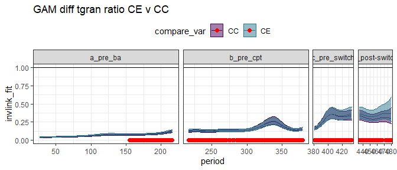<!-- -->

    ## Joining, by = "period"

    ## Scale for 'fill' is already present. Adding another scale for 'fill', which
    ## will replace the existing scale.

    ## Scale for 'colour' is already present. Adding another scale for 'colour',
    ## which will replace the existing scale.

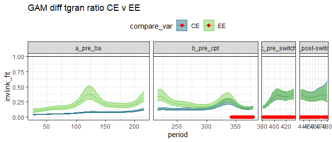<!-- -->

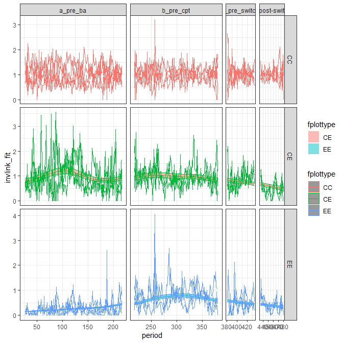<!-- -->

    ## Joining, by = "period"

    ## Scale for 'colour' is already present. Adding another scale for 'colour',
    ## which will replace the existing scale.

    ## Scale for 'fill' is already present. Adding another scale for 'fill', which
    ## will replace the existing scale.

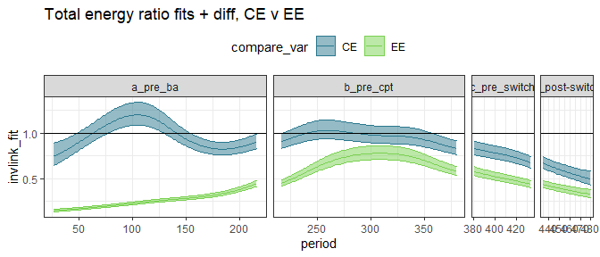<!-- -->

    ## Scale for 'colour' is already present. Adding another scale for 'colour',
    ## which will replace the existing scale.
    ## Scale for 'fill' is already present. Adding another scale for 'fill', which
    ## will replace the existing scale.

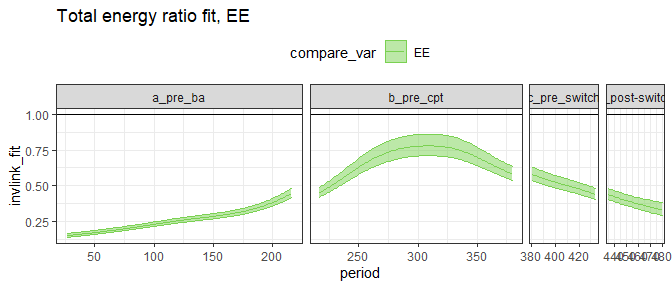<!-- -->

## By era

##### Era means:

    ## # A tibble: 12 x 5
    ##    era           oplottype total_e_mean smgran_e_mean tinygran_e_mean
    ##    <chr>         <fct>            <dbl>         <dbl>           <dbl>
    ##  1 a_pre_ba      CC                484.          28.4            28.4
    ##  2 a_pre_ba      CE                455.          32.5            32.3
    ##  3 a_pre_ba      EE                110.          98.8            98.8
    ##  4 b_pre_cpt     CC                718.         216.            128. 
    ##  5 b_pre_cpt     CE                672.         368.            120. 
    ##  6 b_pre_cpt     EE                511.         465.            139. 
    ##  7 c_pre_switch  CC                670.         243.            240. 
    ##  8 c_pre_switch  CE                573.         256.            206. 
    ##  9 c_pre_switch  EE                310.         281.            260. 
    ## 10 d_post-switch CC                747.         220.            220. 
    ## 11 d_post-switch CE                374.         323.            283. 
    ## 12 d_post-switch EE                326.         297.            291.

<!-- ### gls on ratios -->

<!-- ##### Era ratios: -->

<!-- ```{r} -->

<!-- era_ratios <- treatment_ratios
<!--   group_by(era, oplottype) %>% -->

<!--   mutate(te_mean = mean(total_e_of_c), -->

<!--          sg_mean = mean(sg_of_c), -->

<!--          tg_mean = mean(tg_of_c)) %>% -->

<!--   ungroup() -->

<!-- select(era_ratios, era, oplottype, te_mean, sg_mean, tg_mean) %>% -->

<!--   distinct() -->

<!-- ggplot(era_ratios, aes(period, te_mean, color = oplottype)) + -->

<!--   geom_line(size = 2) + -->

<!--   geom_line(aes(period, total_e_of_c), alpha = .3) + -->

<!--   scale_color_viridis_d(end = .8) -->

<!-- # ggplot(era_ratios, aes(period, sg_mean, color = oplottype)) + -->

<!-- #   geom_line(size = 2) + -->

<!-- #   geom_line(aes(period, sg_of_c), alpha = .3) + -->

<!-- #   scale_color_viridis_d(end = .8) -->

<!-- #  -->

<!-- #  -->

<!-- #  -->

<!-- # ggplot(era_ratios, aes(period, tg_mean, color = oplottype)) + -->

<!-- #   geom_line(size = 2) + -->

<!-- #   geom_line(aes(period, tg_of_c), alpha = .3) + -->

<!-- #   scale_color_viridis_d(end = .8) -->

<!-- #  -->

<!-- treatment_ratios_no_c <- filter(treatment_ratios, fplottype != "CC") %>% -->

<!--   mutate(fplottype = as.factor(plot_type)) -->

<!-- ``` -->

<!-- ##### Total energy ratios GLS -->

<!-- This fit includes CC plots, for which ratio always = 1.  -->

<!-- ```{r} -->

<!-- ter_gls <- gls(total_e_of_c ~ era * fplottype, data = treatment_ratios, correlation = corAR1(form = ~period|fplottype)) -->

<!-- summary(pairs(lsmeans(ter_gls, specs = ~fplottype | era))) -->

<!-- ``` -->

<!-- This fit has CC plots removed. -->

<!-- ```{r} -->

<!-- ter_gls <- gls(total_e_of_c ~ era * fplottype, data = treatment_ratios_no_c, correlation = corAR1(form = ~period|fplottype)) -->

<!-- summary(pairs(lsmeans(ter_gls, specs = ~fplottype | era))) -->

<!-- summary(pairs(lsmeans(ter_gls, specs = ~era | fplottype))) -->

<!-- ``` -->

<!-- ##### Smgran ratio GLS -->

<!-- ```{r} -->

<!-- sgr_gls <- gls(sg_of_c ~ era * fplottype, data = treatment_ratios, correlation = corAR1(form = ~period|fplottype)) -->

<!-- summary(pairs(lsmeans(sgr_gls, specs = ~fplottype | era))) -->

<!-- ``` -->

<!-- ##### Tiny gran ratio GLS -->

<!-- ```{r} -->

<!-- tgr_gls <- gls(tg_of_c ~ era * fplottype, data = treatment_ratios, correlation = corAR1(form = ~period|fplottype)) -->

<!-- summary(pairs(lsmeans(tgr_gls, specs = ~fplottype | era))) -->

<!-- ``` -->

<!-- ### glm on ratios -->

<!-- ##### Total energy GLM -->

<!-- With  controls: -->

<!-- ```{r} -->

<!-- ter_glm <- gam(total_e_of_c ~ era * fplottype, data = treatment_ratios, family = "Gamma") -->

<!-- summary(pairs(regrid(lsmeans(ter_glm, specs = ~fplottype | era)))) -->

<!-- ``` -->

<!-- Without controls: -->

<!-- ```{r} -->

<!-- ter_glm <- gam(total_e_of_c ~ era * fplottype, data = treatment_ratios_no_c, family = "Gamma") -->

<!-- summary(pairs(regrid(lsmeans(ter_glm, specs = ~fplottype | era)))) -->

<!-- ``` -->

<!-- ##### Small granivore ratio GLM -->

<!-- ```{r} -->

<!-- sgr_glm <- gam(sg_of_c ~ era * fplottype, data = treatment_ratios, family = "Gamma") -->

<!-- #summary(pairs(lsmeans(sgr_glm, specs = ~fplottype | era))) -->

<!-- summary(pairs(regrid(lsmeans(sgr_glm, specs = ~fplottype | era)))) -->

<!-- ``` -->

<!-- ##### Tiny granivore ratio GLM -->

<!-- ```{r} -->

<!-- tgr_glm <- gam(tg_of_c ~ era * fplottype, data = treatment_ratios, family = "Gamma") -->

<!-- summary(pairs(regrid(lsmeans(tgr_glm, specs = ~fplottype | era)))) -->

<!-- ``` -->
