Energy plots
================

variables…

  - Dipo energy on a control plot (amount of energy left available given
    Dipo removal)
  - tinygran energy on a control plot (baseline tinygran energy if no
    compensation happens)
  - Additional tinygran energy on a treatment plot (amount of energy
    attributable to compensation)
  - tinygran\_gain / dipo\_control (approximates amount of POTENTIAL
    compensation ACHIEVED, but can be negative or \> 1) —\> this is what
    we want to estimate.

<!-- end list -->

    ## Loading in data version 2.49.0

    ## `summarise()` has grouped output by 'period', 'censusdate', 'era'. You can override using the `.groups` argument.

    ## Joining, by = "row"

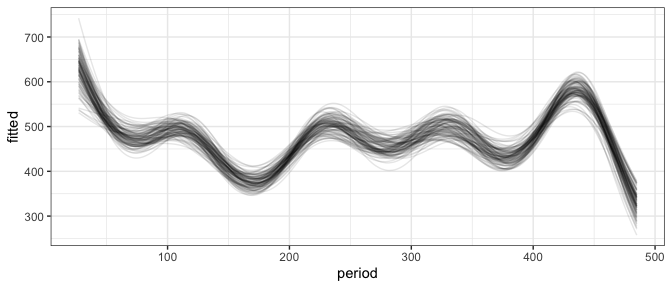<!-- -->

    ## Joining, by = "row"

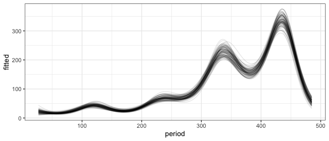<!-- -->

    ## Joining, by = "row"

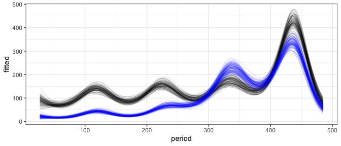<!-- -->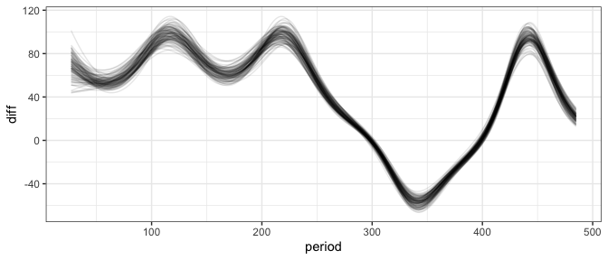<!-- -->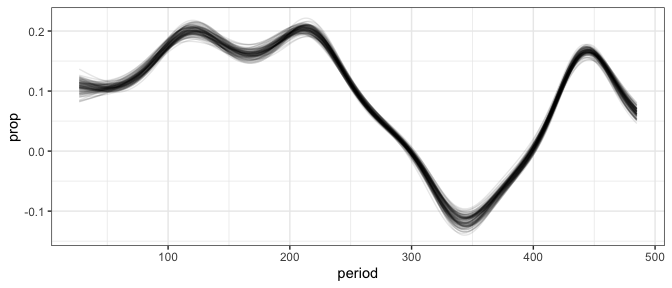<!-- -->

    ## Joining, by = "period"

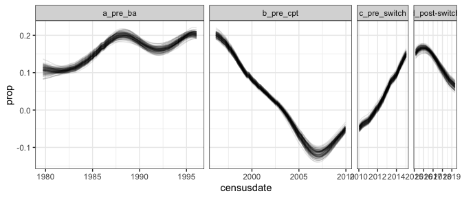<!-- -->

    ## Joining, by = "row"

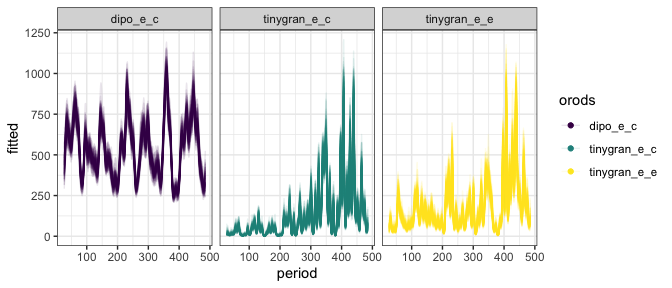<!-- --><!-- -->

<!-- -->

    ## Joining, by = "period"

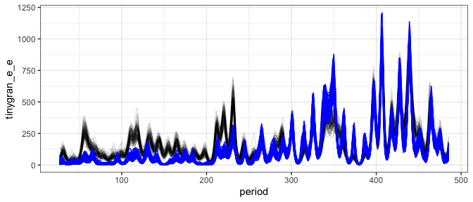<!-- -->

    ## mapping: x = ~period, y = 0, colour = ~diff_over_zero 
    ## geom_point: na.rm = FALSE
    ## stat_identity: na.rm = FALSE
    ## position_identity

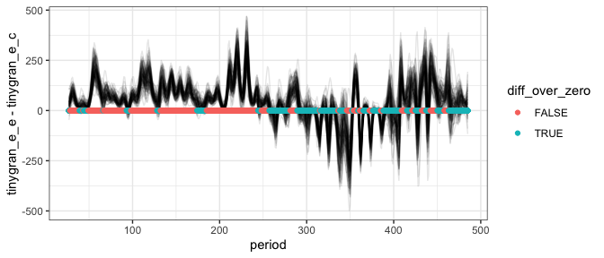<!-- -->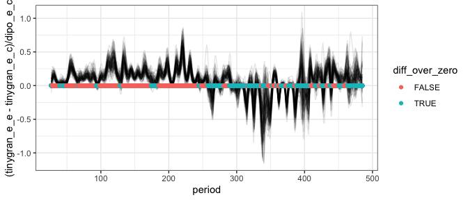<!-- -->

    ## Joining, by = "row"

    ## `summarise()` has grouped output by 'row', 'period', 'orods'. You can override using the `.groups` argument.

    ## Joining, by = "period"
    ## Joining, by = "period"

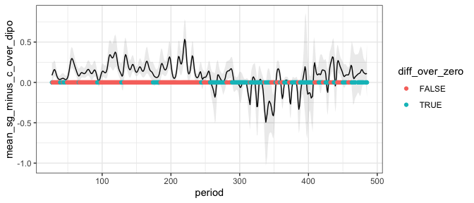<!-- -->
