GAM
================

<!-- ```{r} -->

<!-- load(here::here("te_gams.RData")) -->

<!-- te_AICs <- lapply(list(te.gam, te.gam.noplot, te.gam.randomplot), FUN = AIC)  -->

<!-- te_AICs -->

<!-- exVars.d <- c('oPlot', paste0('s(numericdate):oPlot', unique(plot_totals$oPlot)), -->

<!--               names(coefficients(te.gam)[ which(grepl("oPlot", names(coefficients(te.gam))))])) -->

<!-- te_pred <- predict_treat_effect3(plot_totals, 500, te.gam, exVars = exVars.d) -->

<!-- ggplot(te_pred, aes(censusdate, Fitted, color = oTreatment, fill = oTreatment)) + -->

<!--   geom_line() + -->

<!--   geom_ribbon(aes(ymin= Lower, ymax = Upper), alpha= .5) -->

<!-- te_fitted <- gratia::add_fitted(plot_totals, te.gam)  -->

<!-- ggplot(te_fitted, aes(censusdate, .value, color = oTreatment, group = oPlot)) + -->

<!--   geom_line() -->

<!-- get_smooth_diffs <- function(MODEL, dat) { -->

<!--   cc_ce <- osmooth_diff(MODEL, dat, "numericdate", "CC", "CE", "oTreatment") -->

<!--   cc_ee <- osmooth_diff(MODEL, dat, "numericdate", "CC", "EE", "oTreatment") -->

<!--   diffs <- bind_rows(cc_ce, cc_ee) %>% -->

<!--     mutate(diff_overlaps_zero = (upper * lower) < 0) %>% -->

<!--     mutate(compare_trt = substr(pair, 4, 5)) -->

<!--   dat <- dat %>% -->

<!--     mutate(compare_trt = as.character(oTreatment)) %>% -->

<!--     left_join(diffs) -->

<!--   return(dat) -->

<!--   } -->

<!-- te_diffs <- get_smooth_diffs(te.gam, te_pred) -->

<!-- ggplot(te_diffs, aes(censusdate, color = oTreatment, fill = oTreatment, y = diff)) + -->

<!--   geom_line() + -->

<!--   geom_ribbon(aes(ymin = lower, ymax = upper), alpha = .5) + -->

<!--   geom_hline(yintercept = 0) -->

<!-- te.noplot.pred <- predict_treat_effect3(plot_totals, 500, te.gam.noplot, exVars = exVars.d) -->

<!-- ggplot(te.noplot.pred, aes(censusdate, Fitted, group = oPlot,color = oTreatment, fill = oTreatment)) + -->

<!--   geom_line() + -->

<!--   geom_ribbon(aes(ymin= Lower, ymax = Upper), alpha= .5) -->

<!-- te_fitted <- gratia::add_fitted(plot_totals, te.gam.noplot)  -->

<!-- ggplot(te_fitted, aes(censusdate, .value, color = oTreatment, group = oPlot)) + -->

<!--   geom_line() -->

<!-- te_diffs <- get_smooth_diffs(te.gam.noplot, te.noplot.pred) -->

<!-- ggplot(te_diffs, aes(censusdate, color = oTreatment, fill = oTreatment, y = diff)) + -->

<!--   geom_line() + -->

<!--   geom_ribbon(aes(ymin = lower, ymax = upper), alpha = .5) + -->

<!--   geom_hline(yintercept = 0) -->

<!-- te.randomplot.pred <- predict_treat_effect3(plot_totals, 500, te.gam.randomplot, exVars = exVars.d) -->

<!-- ggplot(te.randomplot.pred, aes(censusdate, Fitted, group = oPlot,color = oTreatment, fill = oTreatment)) + -->

<!--   geom_line() + -->

<!--   geom_ribbon(aes(ymin= Lower, ymax = Upper), alpha= .5) -->

<!-- te_fitted <- gratia::add_fitted(plot_totals, te.gam.randomplot)  -->

<!-- ggplot(te_fitted, aes(numericdate, .value, color = oTreatment, group = oPlot)) + -->

<!--   geom_line() -->

<!-- te_diffs <- get_smooth_diffs(te.gam.randomplot, te.randomplot.pred) -->

<!-- ggplot(te_diffs, aes(censusdate, color = oTreatment, fill = oTreatment, y = diff)) + -->

<!--   geom_line() + -->

<!--   geom_ribbon(aes(ymin = lower, ymax = upper), alpha = .5) + -->

<!--   geom_hline(yintercept = 0) -->

<!-- ``` -->

# smgran

    ## [[1]]
    ## [1] 40655.38
    ## 
    ## [[2]]
    ## [1] 41205.04
    ## 
    ## [[3]]
    ## [1] 40851.95

    ## Joining, by = "oPlot"

<!-- --><!-- -->

    ## Joining, by = c("censusdate", "compare_trt")

    ## Warning: Removed 500 row(s) containing missing values (geom_path).

    ## Warning in max(ids, na.rm = TRUE): no non-missing arguments to max; returning -
    ## Inf

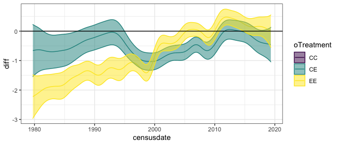<!-- -->

    ## Joining, by = "oPlot"

<!-- -->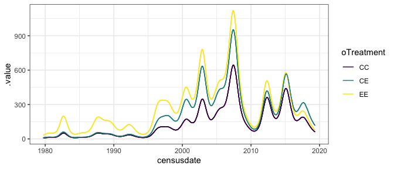<!-- -->

    ## Joining, by = c("censusdate", "compare_trt")

    ## Warning: Removed 500 row(s) containing missing values (geom_path).
    
    ## Warning: no non-missing arguments to max; returning -Inf

<!-- -->

    ## Joining, by = "oPlot"

<!-- -->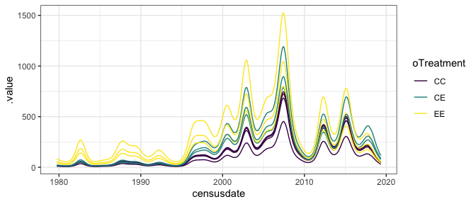<!-- -->

    ## Joining, by = c("censusdate", "compare_trt")

    ## Warning: Removed 500 row(s) containing missing values (geom_path).
    
    ## Warning: no non-missing arguments to max; returning -Inf

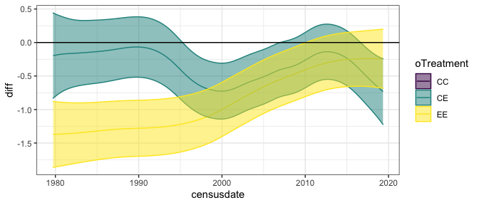<!-- -->

# tinygran

    ## [[1]]
    ## [1] 36791.45
    ## 
    ## [[2]]
    ## [1] 37183.71
    ## 
    ## [[3]]
    ## [1] 36953.15

    ## Joining, by = "oPlot"

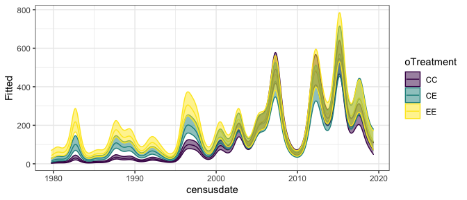<!-- --><!-- -->

    ## Joining, by = c("censusdate", "compare_trt")

    ## Warning: Removed 500 row(s) containing missing values (geom_path).

    ## Warning in max(ids, na.rm = TRUE): no non-missing arguments to max; returning -
    ## Inf

<!-- -->

    ## Joining, by = "oPlot"

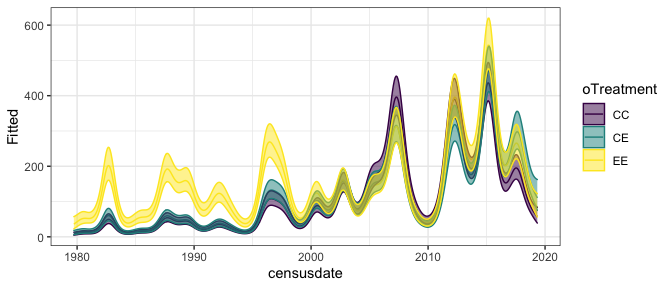<!-- -->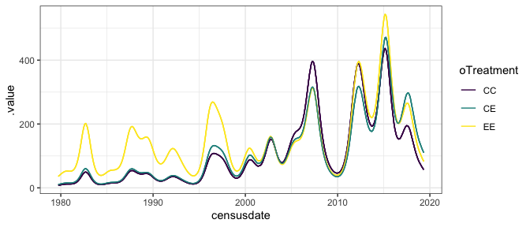<!-- -->

    ## Joining, by = c("censusdate", "compare_trt")

    ## Warning: Removed 500 row(s) containing missing values (geom_path).
    
    ## Warning: no non-missing arguments to max; returning -Inf

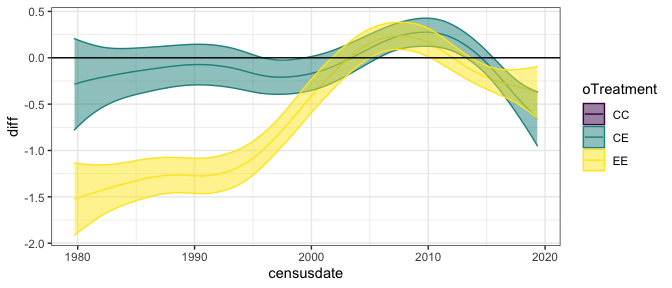<!-- -->

    ## Joining, by = "oPlot"

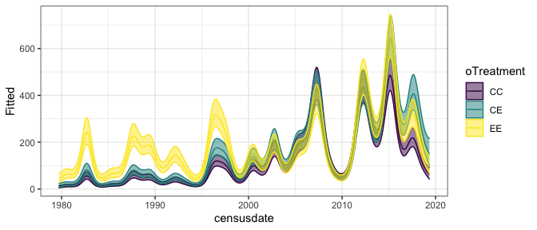<!-- -->

    ## Joining, by = "oPlot"

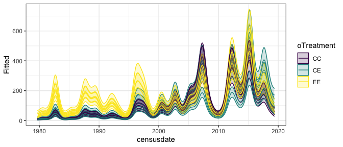<!-- --><!-- -->

    ## Joining, by = c("censusdate", "compare_trt")

    ## Warning: Removed 500 row(s) containing missing values (geom_path).
    
    ## Warning: no non-missing arguments to max; returning -Inf

<!-- -->

# pb

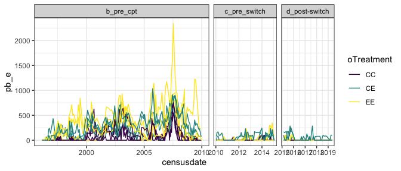<!-- -->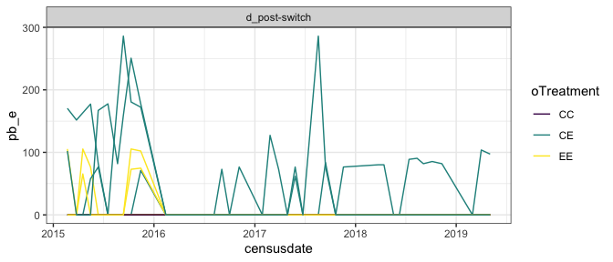<!-- -->

    ## [[1]]
    ## [1] 15124.75
    ## 
    ## [[2]]
    ## [1] 15426.73
    ## 
    ## [[3]]
    ## [1] 15204.81

    ## Joining, by = "oPlot"

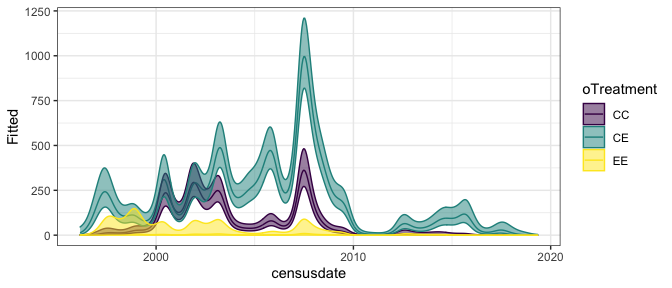<!-- -->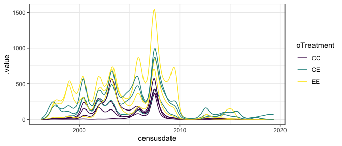<!-- -->

    ## Joining, by = c("censusdate", "compare_trt")

    ## Warning: Removed 500 row(s) containing missing values (geom_path).

    ## Warning in max(ids, na.rm = TRUE): no non-missing arguments to max; returning -
    ## Inf

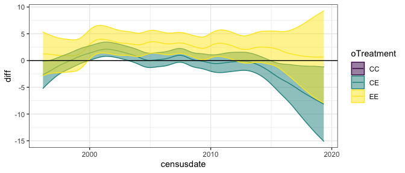<!-- -->

    ## Joining, by = "oPlot"

<!-- -->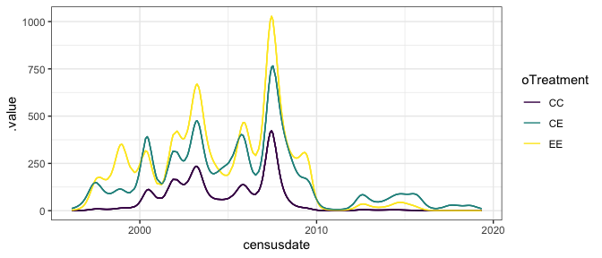<!-- -->

    ## Joining, by = c("censusdate", "compare_trt")

    ## Warning: Removed 500 row(s) containing missing values (geom_path).
    
    ## Warning: no non-missing arguments to max; returning -Inf

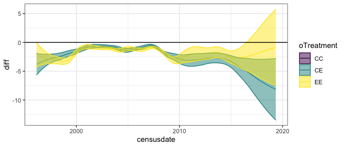<!-- -->

    ## Joining, by = "oPlot"

<!-- -->

    ## Joining, by = "oPlot"

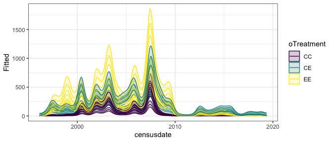<!-- --><!-- -->

    ## Joining, by = c("censusdate", "compare_trt")

    ## Warning: Removed 500 row(s) containing missing values (geom_path).
    
    ## Warning: no non-missing arguments to max; returning -Inf

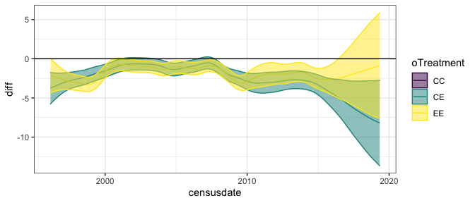<!-- -->
