GAM
================

### Small gran

    ## Joining, by = c("oPlot", "oTreatment")

    ## Joining, by = c("censusdate", "compare_trt")
    ## Joining, by = c("censusdate", "compare_trt")
    ## Joining, by = c("censusdate", "compare_trt")
    ## Joining, by = c("censusdate", "compare_trt")

    ## Joining, by = c("oPlot", "oTreatment")
    ## Joining, by = c("oPlot", "oTreatment")
    ## Joining, by = c("oPlot", "oTreatment")
    ## Joining, by = c("oPlot", "oTreatment")

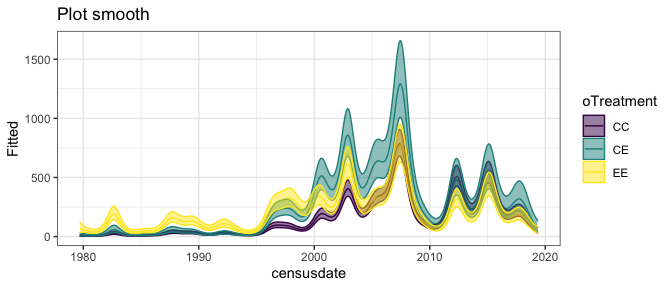<!-- -->

    ## Warning: Removed 500 row(s) containing missing values (geom_path).

    ## Warning in max(ids, na.rm = TRUE): no non-missing arguments to max; returning -
    ## Inf

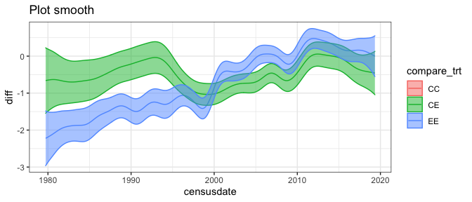<!-- -->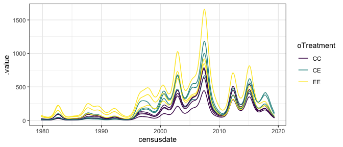<!-- -->

The predictions here are misleading. Absent the plot-level smoothers,
you end up with Ce exceeding EE ca. 2008 (for example). I believe this
is because this model is able to use the plot smooths to correct for
these weird offsets and get back to accurate fitted values. However, I
worry this also makes the **difference** smooths also potentially
suspect. For example, for comparing EE to the control, we cross 0 from
2005-2010. The **fitted values** are different, but the treatment effect
smooths are crossing.

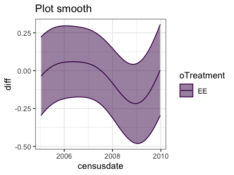<!-- -->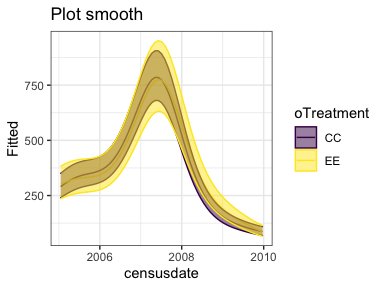<!-- -->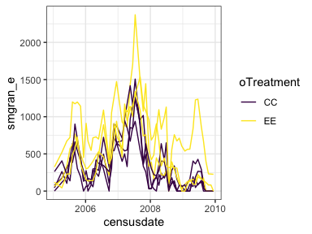<!-- -->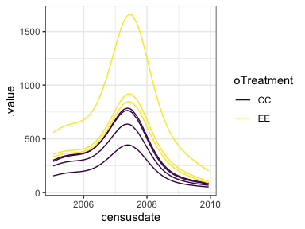<!-- -->

More so, for this same time period, CE and CC ostensibly DO NOT OVERLAP.
However the **fitted values** with plot do, and so do the real data.
More than EE and CC do\!

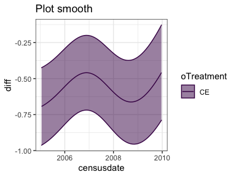<!-- -->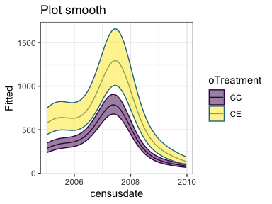<!-- -->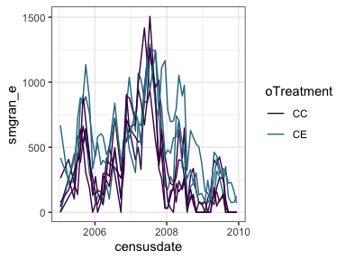<!-- -->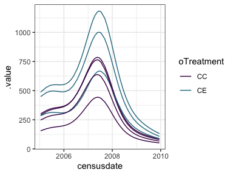<!-- -->

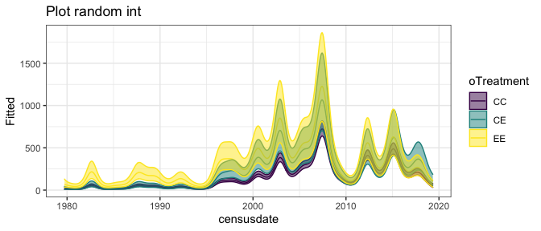<!-- -->

    ## Warning: Removed 500 row(s) containing missing values (geom_path).

    ## Warning in max(ids, na.rm = TRUE): no non-missing arguments to max; returning -
    ## Inf

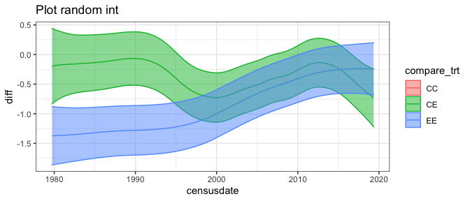<!-- --><!-- -->

This is a random-intercept plot model, and it does not have the same
weird behaviors.

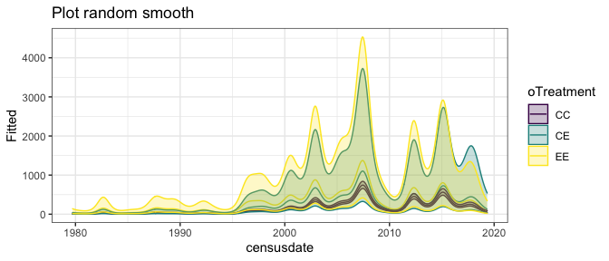<!-- -->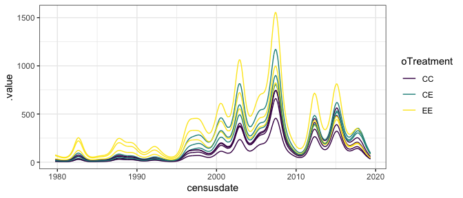<!-- -->

    ## Warning: Removed 500 row(s) containing missing values (geom_path).

    ## Warning in max(ids, na.rm = TRUE): no non-missing arguments to max; returning -
    ## Inf

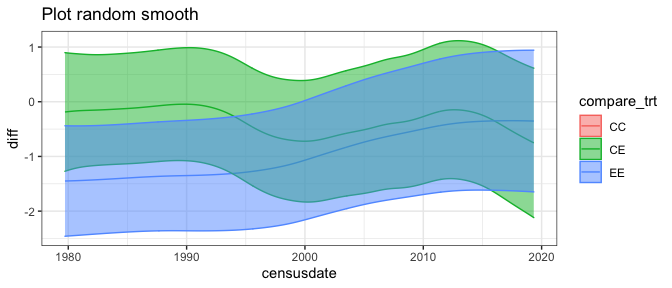<!-- -->

Again, I’m not sure about this because it sure **looks** like the plot
is being used to refine a very **vague** prediction. But at least it’s
not getting things dramatically wrong, like the rank order. (It really
stands out having CE \>\> EE, as in the one with plot as a smooth)

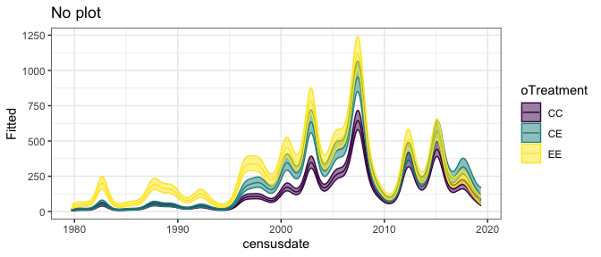<!-- -->

    ## Warning: Removed 500 row(s) containing missing values (geom_path).

    ## Warning in max(ids, na.rm = TRUE): no non-missing arguments to max; returning -
    ## Inf

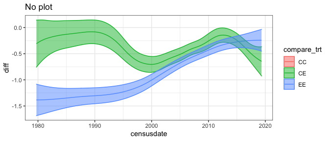<!-- -->

Not including plot at all is pretty anti-conservative w.r.t. finding
differences \>0.

    ## Warning: Removed 500 row(s) containing missing values (geom_path).

    ## Warning in max(ids, na.rm = TRUE): no non-missing arguments to max; returning -
    ## Inf

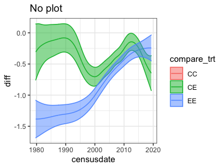<!-- -->

    ## Warning: Removed 500 row(s) containing missing values (geom_path).
    
    ## Warning: no non-missing arguments to max; returning -Inf

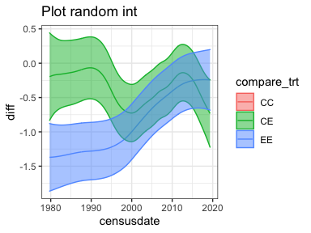<!-- -->

Having the random plot effect, compared to no plot effect, gives a
similar story but quite different CIs.

  - EE exceeds CC by quite a bit in the 1980s-1990s, declining to zero
    or near zero by the 2010s. With no plot, the smooths never actually
    cross; with plot, they cross about 2010.
  - CE tracks CC more closely at first, but from 1995-around 2010 and
    from 2015 onwards, CE also exceeds CC.

### Total E

    ## Joining, by = c("oPlot", "oTreatment")

    ## Joining, by = c("censusdate", "compare_trt")
    ## Joining, by = c("censusdate", "compare_trt")
    ## Joining, by = c("censusdate", "compare_trt")
    ## Joining, by = c("censusdate", "compare_trt")

    ## Joining, by = c("oPlot", "oTreatment")
    ## Joining, by = c("oPlot", "oTreatment")
    ## Joining, by = c("oPlot", "oTreatment")
    ## Joining, by = c("oPlot", "oTreatment")

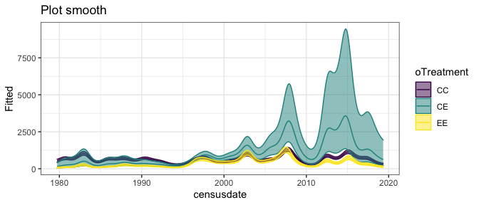<!-- -->

    ## Warning: Removed 500 row(s) containing missing values (geom_path).

    ## Warning in max(ids, na.rm = TRUE): no non-missing arguments to max; returning -
    ## Inf

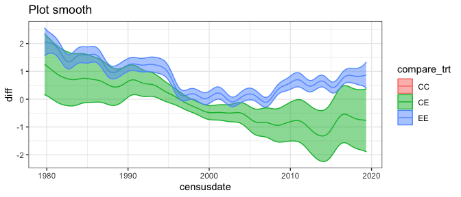<!-- -->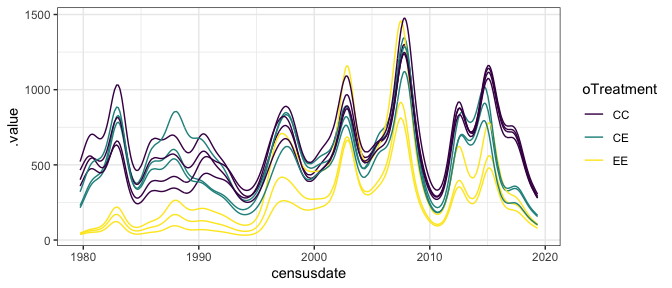<!-- -->

Whoa, here it is again. The **actual** fits for CE don’t wildly exceed
CC and EE at any point, but absent the plot smooths they do.

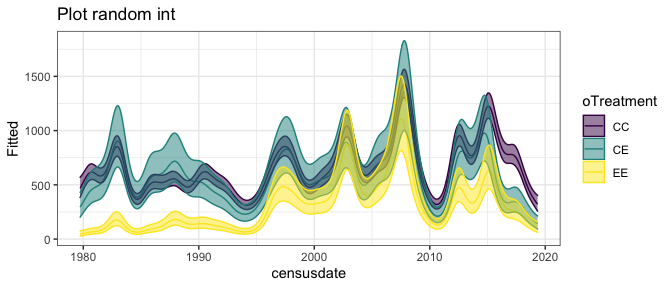<!-- -->

    ## Warning: Removed 500 row(s) containing missing values (geom_path).

    ## Warning in max(ids, na.rm = TRUE): no non-missing arguments to max; returning -
    ## Inf

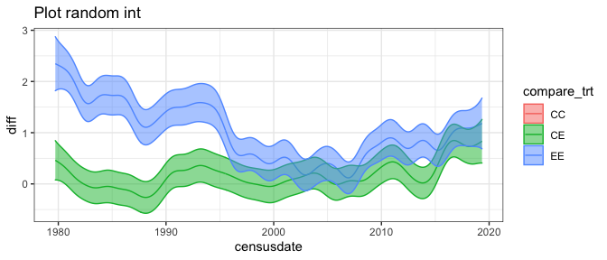<!-- --><!-- -->

<!-- -->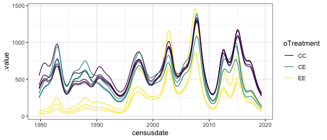<!-- -->

    ## Warning: Removed 500 row(s) containing missing values (geom_path).

    ## Warning in max(ids, na.rm = TRUE): no non-missing arguments to max; returning -
    ## Inf

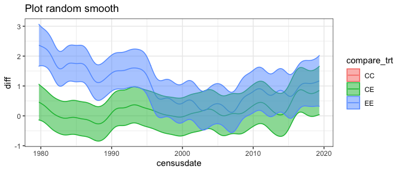<!-- -->

Again, the random smooths are weird…

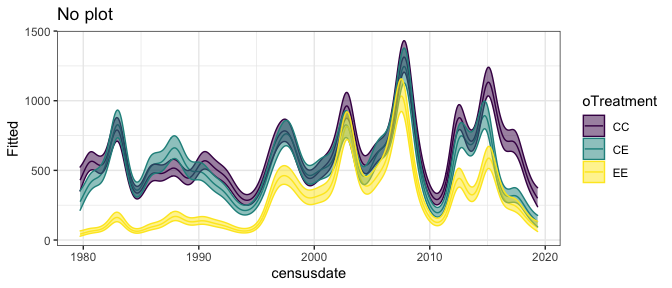<!-- -->

    ## Warning: Removed 500 row(s) containing missing values (geom_path).

    ## Warning in max(ids, na.rm = TRUE): no non-missing arguments to max; returning -
    ## Inf

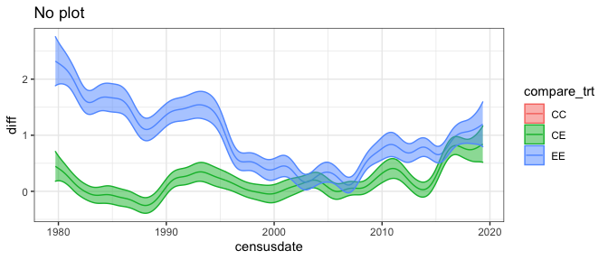<!-- -->

No plot is anticonservative.

    ## Warning: Removed 500 row(s) containing missing values (geom_path).

    ## Warning in max(ids, na.rm = TRUE): no non-missing arguments to max; returning -
    ## Inf

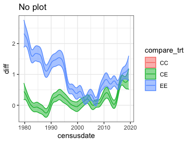<!-- -->

    ## Warning: Removed 500 row(s) containing missing values (geom_path).
    
    ## Warning: no non-missing arguments to max; returning -Inf

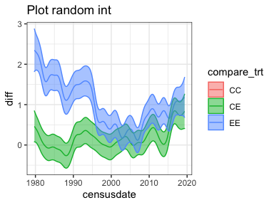<!-- -->

Again, having no plot vs. having the random plot effect tells a similar
trend but with narrower/broader CIs.

  - EE is well below the controls except for brief moments in the 2000s.
  - CE is closer to the controls until 2015, when it jumps down to meet
    or nearly meet EE.

### Tinygran E

    ## Joining, by = c("oPlot", "oTreatment")

    ## Joining, by = c("censusdate", "compare_trt")
    ## Joining, by = c("censusdate", "compare_trt")
    ## Joining, by = c("censusdate", "compare_trt")
    ## Joining, by = c("censusdate", "compare_trt")

    ## Joining, by = c("oPlot", "oTreatment")
    ## Joining, by = c("oPlot", "oTreatment")
    ## Joining, by = c("oPlot", "oTreatment")
    ## Joining, by = c("oPlot", "oTreatment")

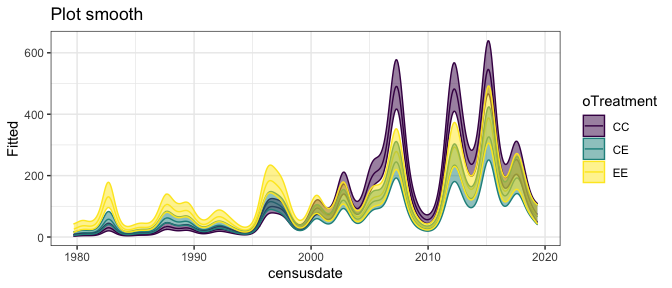<!-- -->

    ## Warning: Removed 500 row(s) containing missing values (geom_path).

    ## Warning in max(ids, na.rm = TRUE): no non-missing arguments to max; returning -
    ## Inf

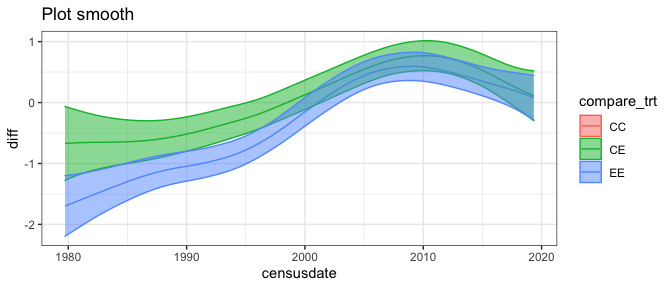<!-- -->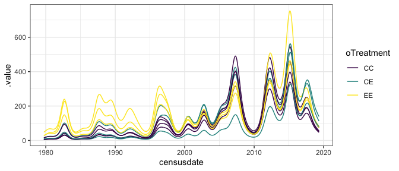<!-- -->

I am absolutely not convinced that what we shoudl take from these data
is that EE is **below** controls from 2007-2017\!

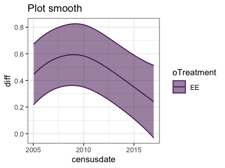<!-- -->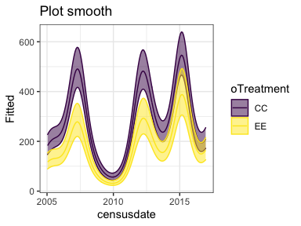<!-- -->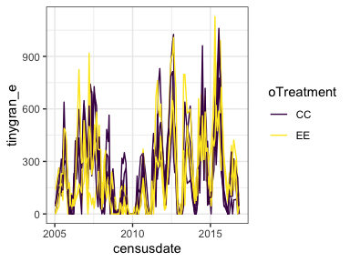<!-- -->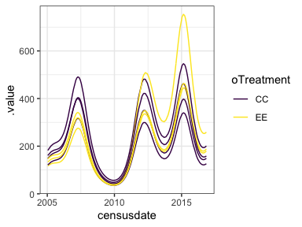<!-- -->

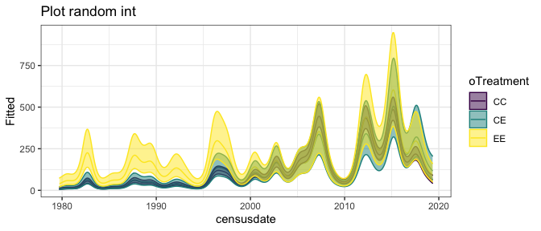<!-- -->

    ## Warning: Removed 500 row(s) containing missing values (geom_path).

    ## Warning in max(ids, na.rm = TRUE): no non-missing arguments to max; returning -
    ## Inf

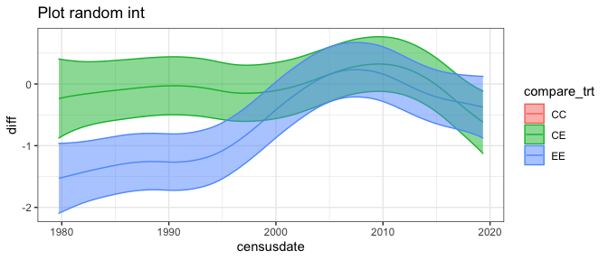<!-- --><!-- -->

I have no…objections here.

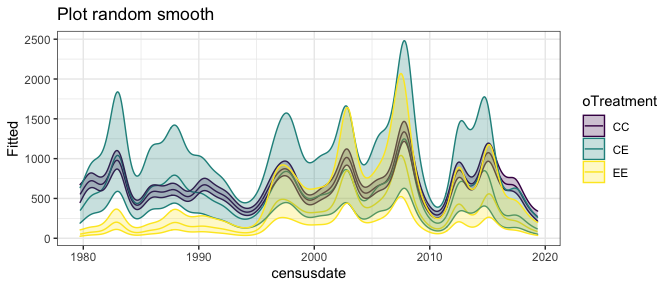<!-- --><!-- -->

    ## Warning: Removed 500 row(s) containing missing values (geom_path).

    ## Warning in max(ids, na.rm = TRUE): no non-missing arguments to max; returning -
    ## Inf

<!-- -->

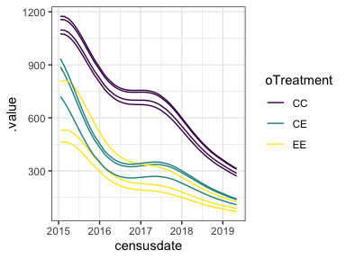<!-- -->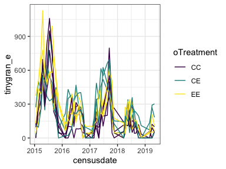<!-- -->

These fits confuse me. The fitted values have CC strongly above CE and
EE for this time period, but they’re…not.

THIS IS BECAUSE THIS MODEL IS FIT WITH TOTAL E NOT TG E.

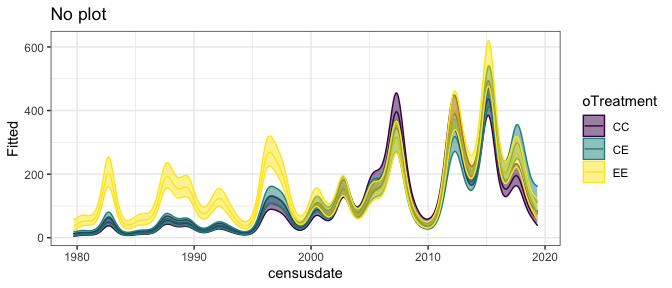<!-- -->

    ## Warning: Removed 500 row(s) containing missing values (geom_path).

    ## Warning in max(ids, na.rm = TRUE): no non-missing arguments to max; returning -
    ## Inf

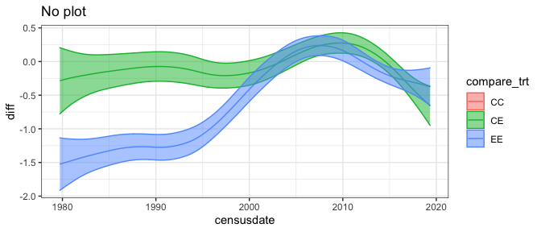<!-- -->

    ## Warning: Removed 500 row(s) containing missing values (geom_path).

    ## Warning in max(ids, na.rm = TRUE): no non-missing arguments to max; returning -
    ## Inf

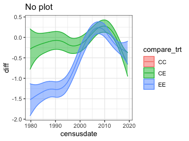<!-- -->

    ## Warning: Removed 500 row(s) containing missing values (geom_path).
    
    ## Warning: no non-missing arguments to max; returning -Inf

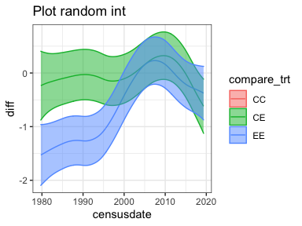<!-- -->

These differ a bit.

  - EE way exceeds controls at the beginning, then **under** controls
    2005-2010, then **over** again pretty quickly. With the random int
    the under/overs are not sig.
  - CE tracks controls until either 2005-2010, when it too under
    performs, and then begins to exceed controls after 2015.
