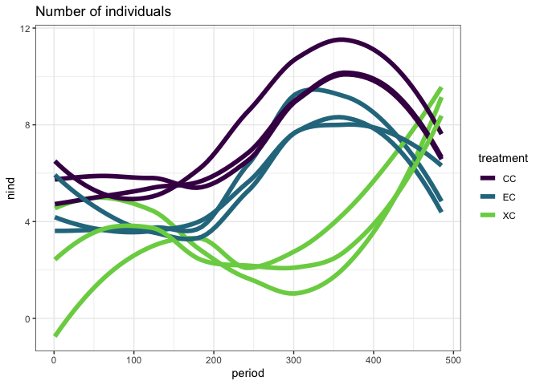
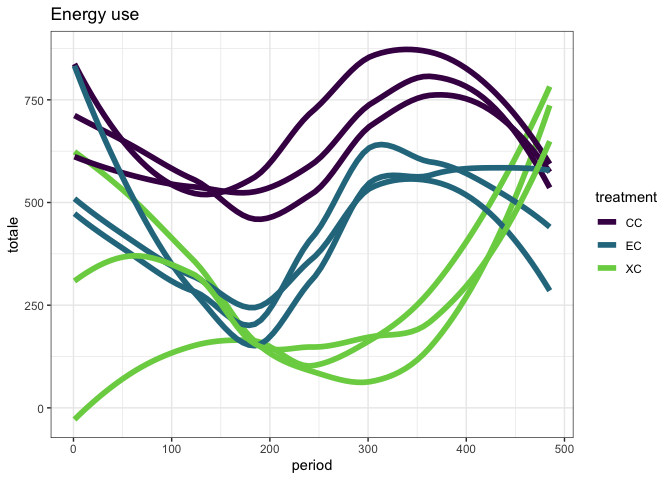
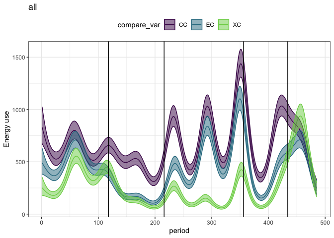
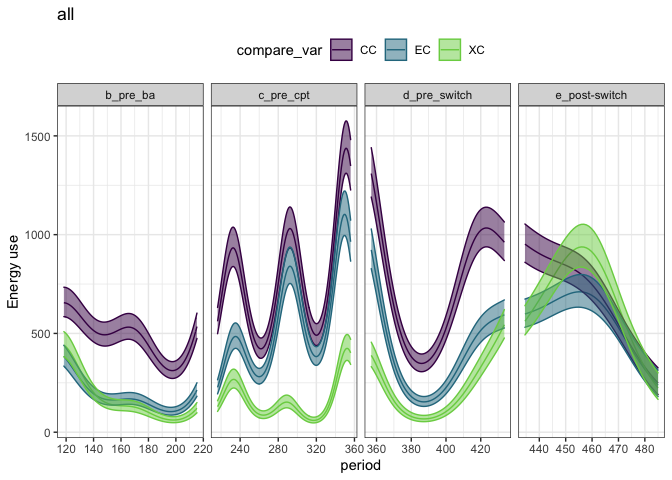
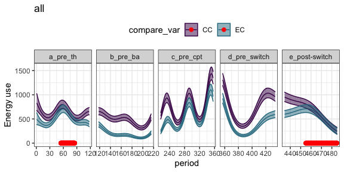
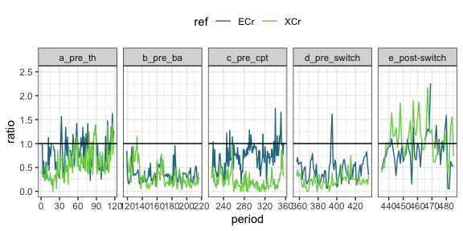
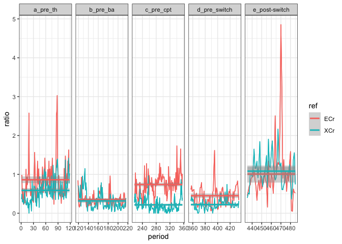
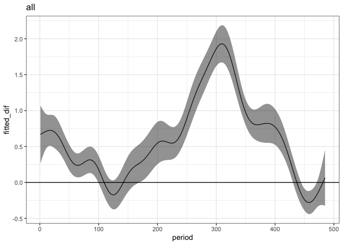
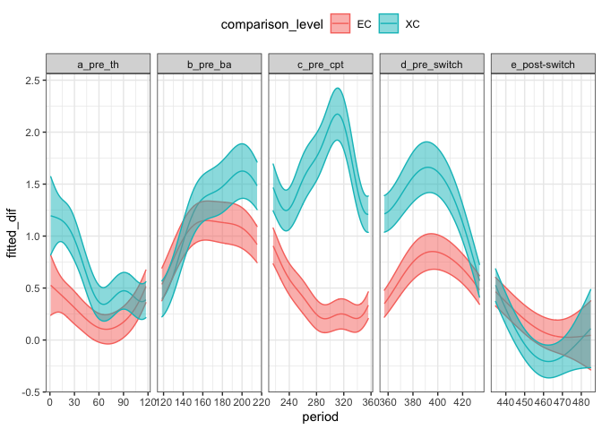

Scaffolding analysis with plot switch data
================

# Data

This document uses the data from the plots studied in Christensen et al
2019 ProcB. We will use some of the same control plots for the actual
analysis, but both sets of treatment plots will be different. (Ch uses
exclosures that get turned into controls and removals that get turned
into controls. We will look at long term exclosures and controls that
get turned into exclosures).

This gives us space to do some analytical development without wondering
if we’re seeing the actual effects. We have the same basic structures we
will have in the actual data:

  - Three treatment types - controls and two flavors of manipulation
  - Changes to the manipulations occurring in 2015
  - Probably similar sitewide dynamics in terms of fluctuations in
    sitewide abundance, major environmental events, etc.
  - Probably similar idiosyncracies in the data, e.g. variability
    between plots; autocorrelation; etc.

<!-- end list -->

    ## `summarise()` regrouping output by 'period', 'treatment', 'type' (override with `.groups` argument)

    ## Joining, by = "plot"

    ## Joining, by = c("period", "plot", "type", "treatment")

    ## `summarise()` regrouping output by 'period', 'treatment', 'plot' (override with `.groups` argument)

    ## Joining, by = "period"

    ## Joining, by = "plot"

    ## Joining, by = c("period", "plot", "censusdate", "treatment")

Here is the raw data (plotted as annual means per plot for
visualization):

    ## `summarise()` regrouping output by 'censusyear', 'treatment' (override with `.groups` argument)

<!-- --><!-- -->
We will be working a lot with a GAM.

We fit a GAM to `energy ~ treatment + s(period) + s(period, by =
treatment)` with a Tweedie link. We include all treatments and all time
in this GAM, because we’ll use it repeatedly. Treatment is ordered.

    ## Loading required package: nlme

    ## 
    ## Attaching package: 'nlme'

    ## The following object is masked from 'package:dplyr':
    ## 
    ##     collapse

    ## This is mgcv 1.8-33. For overview type 'help("mgcv-package")'.

Here is the fitted values from that GAM:

<!-- -->

# 1\. Does the energetic compensation persist over time?

## GAM

For this uestion, we are interested in comparing CC to EC (for the sake
of argument). In this context the GAM is useful for visualization, but,
because the initial compensation effect wasn’t 100%, we’re not surprised
that the difference in the smooths \!= 0 for large sections.

    ## Joining, by = "period"

<!-- -->

    ## Joining, by = "period"

    ## Scale for 'colour' is already present. Adding another scale for 'colour',
    ## which will replace the existing scale.

    ## Scale for 'fill' is already present. Adding another scale for 'fill', which
    ## will replace the existing scale.

<!-- --> The smooths
do indeed diverge prior to Bailey’s establishment, get close and even
overlap temporarily for the Thibault/Ernest papers era. Here, they
diverge following, to a somewhat lesser but still appreciable degree\!
They converge following the switch, which is expected because the switch
is ex -\> control; this is documented in Ch.

Possible behaviors we could see in the actual data: diverging and
continuing to diverge post-treatment (we don’t expect the treatment to
change longterm exclosures that…stay exclosures); moving back to
convergence at some point.

## Comparing eras

We would like a more uantitative estimate of how the difference in
energy use between controls and exclosures has changed over time.
Because control and exclosure plots obviously covary over time to some
degree, and we are interested in how they **compare** rather than the
overall variation, we express this difference as the ratio of the mean
total energy on the exclosure plots over the mean total energy on the
control plots.

    ## `summarise()` regrouping output by 'period', 'treatment', 'type', 'era', 'oera' (override with `.groups` argument)

<!-- -->

RMD is currently testing this with a GAM with a Gamma link, fit as
`gam(ratio ~ era * treatment)`. That is, are the means different per
treatment and era. This does not address temporal autocorrelation. Nor
does it capture possible plot-level variation. There may be a way to get
the autocorrelation via lme. This part is EXTREMELY IN DEVELOPMENT. It
might be preferable to fit `lme(totalenergy ~ era * treatment, random =
plot)` and then try to extract how the treatment effect varies given
era; however contrasts can be tricky in lme.

    ## Loading required package: emmeans

    ## The 'lsmeans' package is now basically a front end for 'emmeans'.
    ## Users are encouraged to switch the rest of the way.
    ## See help('transition') for more information, including how to
    ## convert old 'lsmeans' objects and scripts to work with 'emmeans'.

    ## Note: Use 'contrast(regrid(object), ...)' to obtain contrasts of back-transformed estimates

<!-- -->

    ## ref = ECr:
    ##  contrast                       estimate    SE  df z.ratio p.value
    ##  b_pre_ba - c_pre_cpt              1.494 0.182 Inf  8.196  <.0001 
    ##  c_pre_cpt - d_pre_switch         -0.865 0.163 Inf -5.322  <.0001 
    ##  c_pre_cpt - (e_post-switch)       0.362 0.106 Inf  3.417  0.0057 
    ##  d_pre_switch - (e_post-switch)    1.227 0.169 Inf  7.260  <.0001 
    ## 
    ## Note: contrasts are still on the inverse scale 
    ## P value adjustment: tukey method for comparing a family of 5 estimates

    ## ref = ECr:
    ##  contrast                       estimate     SE  df z.ratio p.value
    ##  b_pre_ba - c_pre_cpt             -0.387 0.0422 Inf -9.166  <.0001 
    ##  c_pre_cpt - d_pre_switch          0.288 0.0474 Inf  6.065  <.0001 
    ##  c_pre_cpt - (e_post-switch)      -0.269 0.0908 Inf -2.966  0.0251 
    ##  d_pre_switch - (e_post-switch)   -0.557 0.0883 Inf -6.309  <.0001 
    ## 
    ## P value adjustment: tukey method for comparing a family of 5 estimates

    ## # A tibble: 5 x 5
    ##   era           ref   invlinkfit invlinklower invlinkupper
    ##   <fct>         <fct>      <dbl>        <dbl>        <dbl>
    ## 1 a_pre_th      ECr        0.861        0.910        0.816
    ## 2 b_pre_ba      ECr        0.351        0.373        0.331
    ## 3 c_pre_cpt     ECr        0.738        0.777        0.703
    ## 4 d_pre_switch  ECr        0.451        0.483        0.422
    ## 5 e_post-switch ECr        1.01         1.10         0.931

# 2\. Does the energetic compensation happen consistent in the new exclosures?

## GAM

Here the uestion is whether the third treatment group - for now, XC -
converges to match the second treatment group - EC - following the
switch.

    ## Joining, by = "period"

    ## Scale for 'colour' is already present. Adding another scale for 'colour',
    ## which will replace the existing scale.

    ## Scale for 'fill' is already present. Adding another scale for 'fill', which
    ## will replace the existing scale.

<!-- -->

<!-- We may also be able to look at how the difference between the two treatments and the reference level compare: -->

<!-- ```{r} -->

<!-- cc_xc <- get_exclosure_diff(e.mod, e.pdat, reference_level = 1, comparison_level = 3, comparison_variable = "otreatment") %>% -->

<!--   mutate(comparison_level = "XC") -->

<!-- cc_ec <- cc_ec %>% -->

<!--   mutate(comparison_level = "EC") -->

<!-- both_diffs <- bind_rows(cc_xc, cc_ec)  %>% -->

<!--   mutate(era = NA) %>% -->

<!--   mutate(era = ifelse( -->

<!--     period <= 118, "a_pre_th", -->

<!--     ifelse(period <= 216, "b_pre_ba", -->

<!--            ifelse(period <= 356, "c_pre_cpt", -->

<!--                   ifelse(period <= 434, "d_pre_switch", "e_post-switch"))))) %>% -->

<!--   mutate(oera = as.ordered(era)) -->

<!-- ggplot(both_diffs, aes(period, fitted_dif, color = comparison_level, fill = comparison_level)) + -->

<!--   geom_line() + -->

<!--   geom_ribbon(aes(ymin = lower, ymax = upper), alpha = .5) + -->

<!--   facet_wrap(vars(era), scale = "free_x", nrow = 1)+ theme_bw() + theme(legend.position = "top") -->

<!-- ``` -->

This looks to me like the *offset* between the control and the treatment
plots is uite different for a while - e.g. the difference between the
control and XC is really high for c\_pre\_cpt, but low for the
difference between the control and EC - but the offsets for the
different treatment types becomes similar after the switch. (Which,
again, we expect since they converge; see Ch.)

## Comparing the ratios

<!-- -->

    ## Note: Use 'contrast(regrid(object), ...)' to obtain contrasts of back-transformed estimates

    ## era = a_pre_th:
    ##  contrast  estimate    SE  df z.ratio p.value
    ##  ECr - XCr  -0.5363 0.111 Inf  -4.811 <.0001 
    ## 
    ## era = b_pre_ba:
    ##  contrast  estimate    SE  df z.ratio p.value
    ##  ECr - XCr  -0.3146 0.253 Inf  -1.243 0.2137 
    ## 
    ## era = c_pre_cpt:
    ##  contrast  estimate    SE  df z.ratio p.value
    ##  ECr - XCr  -3.2705 0.240 Inf -13.644 <.0001 
    ## 
    ## era = d_pre_switch:
    ##  contrast  estimate    SE  df z.ratio p.value
    ##  ECr - XCr  -2.2963 0.335 Inf  -6.849 <.0001 
    ## 
    ## era = e_post-switch:
    ##  contrast  estimate    SE  df z.ratio p.value
    ##  ECr - XCr   0.0694 0.112 Inf   0.622 0.5342 
    ## 
    ## Note: contrasts are still on the inverse scale

    ## era = a_pre_th:
    ##  contrast  estimate     SE  df z.ratio p.value
    ##  ECr - XCr   0.2717 0.0565 Inf  4.811  <.0001 
    ## 
    ## era = b_pre_ba:
    ##  contrast  estimate     SE  df z.ratio p.value
    ##  ECr - XCr   0.0349 0.0281 Inf  1.243  0.2137 
    ## 
    ## era = c_pre_cpt:
    ##  contrast  estimate     SE  df z.ratio p.value
    ##  ECr - XCr   0.5219 0.0383 Inf 13.644  <.0001 
    ## 
    ## era = d_pre_switch:
    ##  contrast  estimate     SE  df z.ratio p.value
    ##  ECr - XCr   0.2291 0.0334 Inf  6.849  <.0001 
    ## 
    ## era = e_post-switch:
    ##  contrast  estimate     SE  df z.ratio p.value
    ##  ECr - XCr  -0.0758 0.1219 Inf -0.622  0.5342

    ## # A tibble: 10 x 5
    ##    era           ref   invlinkfit invlinklower invlinkupper
    ##    <fct>         <fct>      <dbl>        <dbl>        <dbl>
    ##  1 a_pre_th      ECr        0.861        0.910        0.816
    ##  2 a_pre_th      XCr        0.589        0.623        0.559
    ##  3 b_pre_ba      ECr        0.351        0.373        0.331
    ##  4 b_pre_ba      XCr        0.316        0.336        0.298
    ##  5 c_pre_cpt     ECr        0.738        0.777        0.703
    ##  6 c_pre_cpt     XCr        0.216        0.228        0.206
    ##  7 d_pre_switch  ECr        0.451        0.483        0.422
    ##  8 d_pre_switch  XCr        0.221        0.237        0.208
    ##  9 e_post-switch ECr        1.01         1.10         0.931
    ## 10 e_post-switch XCr        1.08         1.18         1.00

Here they converge (we expect them to).

# 3\. Do we see differences in the plant community between old and new exclosures before the switch?

This is context for, if we’re not seeing the same response in the new
exclosures, a possible plant-mediated effect.

pCCA separately on winter and summer, suare root transformed. This is
how both Supp (2012) and Ch (2019) did this.

We may also be able to test for changes in seed **size** using data
following Valone.
