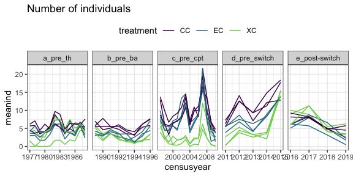
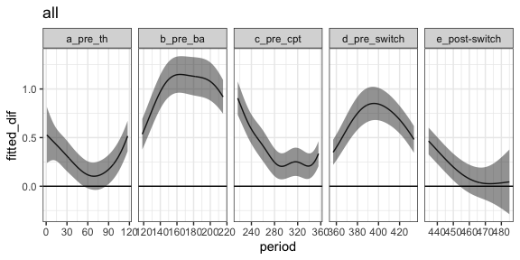
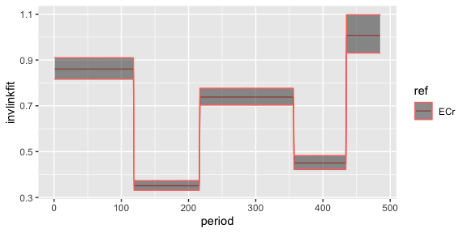
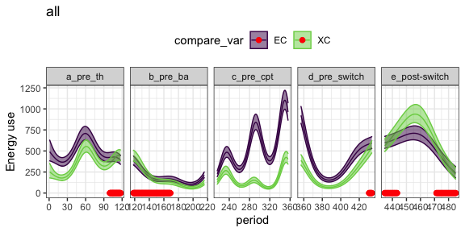
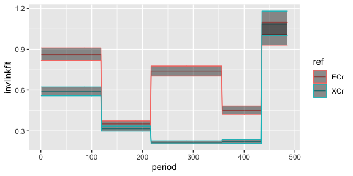

Scaffolding analysis with plot switch data
================

# Data

This document uses the data from the plots studied in Christensen et al
2019 ProcB. We will use some of the same control plots for the actual
analysis, but both sets of treatment plots will be different. (Ch uses
exclosures that get turned into controls and removals that get turned
into controls. We will look at long term exclosures and controls that
get turned into exclosures).

This gives us space to do some analytical development without wondering
if we’re seeing the actual effects. We have the same basic structures we
will have in the actual data:

  - Three treatment types - controls and two flavors of manipulation
  - Changes to the manipulations occurring in 2015
  - Probably similar sitewide dynamics in terms of fluctuations in
    sitewide abundance, major environmental events, etc.
  - Probably similar idiosyncracies in the data, e.g. variability
    between plots; autocorrelation; etc.

<!-- end list -->

    ## `summarise()` regrouping output by 'period', 'treatment', 'type' (override with `.groups` argument)

    ## Joining, by = "plot"

    ## Joining, by = c("period", "plot", "type", "treatment")

    ## `summarise()` regrouping output by 'period', 'treatment' (override with `.groups` argument)

    ## Joining, by = "plot"

    ## Joining, by = c("period", "plot", "treatment")

Here is the raw data, crudely smoothed for visualization:

    ## `geom_smooth()` using method = 'loess' and formula 'y ~ x'

<!-- -->

    ## `geom_smooth()` using method = 'loess' and formula 'y ~ x'

<!-- -->

# 1\. Does the energetic compensation persist over time?

## GAM

We fit a GAM to `energy ~ treatment + s(period) + s(period, by =
treatment)` with a Tweedie link. We include all treatments and all time
in this GAM, because we’ll use it repeatedly. Treatment is ordered.

    ## Loading required package: nlme

    ## 
    ## Attaching package: 'nlme'

    ## The following object is masked from 'package:dplyr':
    ## 
    ##     collapse

    ## This is mgcv 1.8-33. For overview type 'help("mgcv-package")'.

Here is the fitted values from that GAM:

<!-- -->

In specific “eras”:

<!-- --> For this
uestion, we are interested in comparing CC to EC (for the sake of
argument).

The GAM is useful for 1) visualization and 2) computing the difference
between the smooths and seeing if it overlaps zero, i.e. they are
essentially the same.

    ## Joining, by = "period"

<!-- -->

    ## Joining, by = "period"

<!-- --> The smooths
do indeed diverge prior to Bailey’s establishment, get close and even
overlap temporarily for the Thibault/Ernest papers era. Here, they
diverge following, to a somewhat lesser but still appreciable degree\!
They converge following the switch, which is expected because the switch
is ex -\> control; this is documented in Ch.

Possible behaviors we could see in the actual data: diverging and
continuing to diverge post-treatment (we don’t expect the treatment to
change longterm exclosures that…stay exclosures); moving back to
convergence at some point.

#### Details RMD is still working on

  - Plot effect - tends to make the GAM behave really poory
  - Ordered v. unordered factor

## Comparing eras

    ## `summarise()` regrouping output by 'period', 'treatment', 'type', 'era', 'oera' (override with `.groups` argument)

<!-- -->

    ## 
    ## Call:
    ## glm(formula = ratio ~ era * ref, family = Gamma, data = energy_ratio)
    ## 
    ## Deviance Residuals: 
    ##     Min       1Q   Median       3Q      Max  
    ## -5.4016  -0.4583  -0.0796   0.2267   2.1193  
    ## 
    ## Coefficients:
    ##                         Estimate Std. Error t value Pr(>|t|)    
    ## (Intercept)              1.16206    0.06295  18.460  < 2e-16 ***
    ## erab_pre_ba              1.68625    0.18064   9.335  < 2e-16 ***
    ## erac_pre_cpt             0.19272    0.09221   2.090 0.036877 *  
    ## erad_pre_switch          1.05766    0.16074   6.580 7.72e-11 ***
    ## erae_post-switch        -0.16937    0.10322  -1.641 0.101138    
    ## refXCr                   0.53630    0.11148   4.811 1.74e-06 ***
    ## erab_pre_ba:refXCr      -0.22170    0.27648  -0.802 0.422834    
    ## erac_pre_cpt:refXCr      2.73424    0.26435  10.343  < 2e-16 ***
    ## erad_pre_switch:refXCr   1.75996    0.35333   4.981 7.49e-07 ***
    ## erae_post-switch:refXCr -0.60573    0.15782  -3.838 0.000132 ***
    ## ---
    ## Signif. codes:  0 '***' 0.001 '**' 0.01 '*' 0.05 '.' 0.1 ' ' 1
    ## 
    ## (Dispersion parameter for Gamma family taken to be 0.3462756)
    ## 
    ##     Null deviance: 1009.10  on 969  degrees of freedom
    ## Residual deviance:  729.33  on 960  degrees of freedom
    ## AIC: 432.5
    ## 
    ## Number of Fisher Scoring iterations: 6

<!-- -->

RMD is working on a way to test the differences between eras. Kelt used
repeated measures ANOVA; Thibault use t-tests. In both cases they are
asking whether control = exclosure, and the answer is always no. It is
not appropriate to compare across time in terms of **total** energy, but
it does seem appropriate to compare across times in terms of the
**ratio** of energy. RMD is therefore interested in a model that will
either 1) estimate the ratio in each time period and allow us to compare
the ratio estimates across time periods or 2) estimate the actual energy
values according to treatment and time period, and allow us to compare
the difference between the estimates across time periods. I think 1) can
be accomplished via a (generalized) linear model. We may be able to
incorporate a temporal autocorrelation structure if we do a glmm.

# 2\. Does the energetic compensation happen consistent in the new exclosures?

## GAM

Here the uestion is whether the third treatment group - for now, XC -
converges to match the second treatment group - EC - following the
switch.

<!-- -->

    ## Joining, by = "period"

<!-- -->

We may also be able to look at how the difference between the two
treatments and the reference level compare:

<!-- --> This looks
to me like the *offset* between the control and the treatment plots is
uite different for a while - e.g. the difference between the control and
XC is really high for c\_pre\_cpt, but low for the difference between
the control and EC - but the offsets for the different treatment types
becomes similar after the switch. (Which, again, we expect since they
converge; see Ch.)

## Comparing the ratios

<!-- -->

Here they converge (we expect them to). If they don’t…why?

# 3\. Do we see differences in the plant community between old and new exclosures before the switch?

This is context for, if we’re not seeing the same response in the new
exclosures, a possible plant-mediated effect.

pCCA separately on winter and summer, suare root transformed. This is
how both Supp (2012) and Ch (2019) did this.
